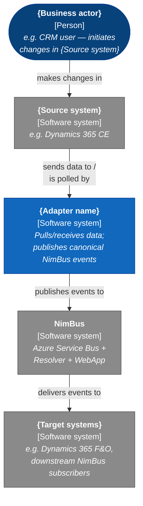
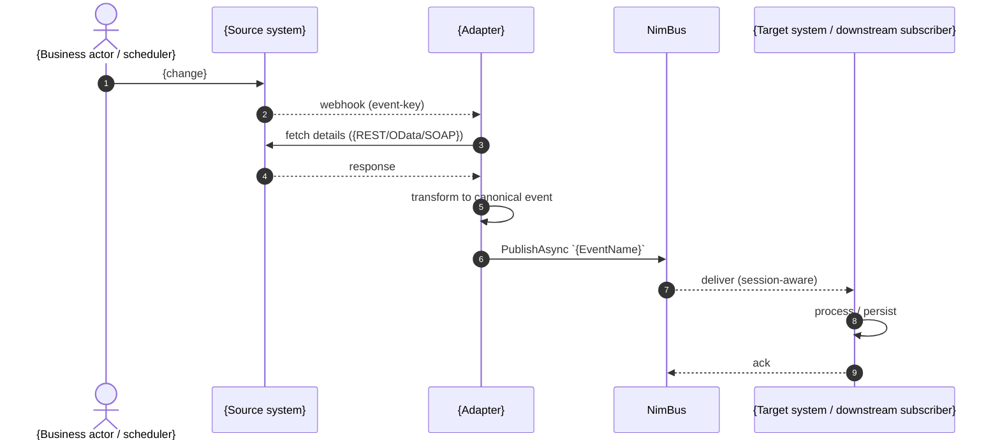

# Technical Design Document — {Adapter Name}

<!--
  Legend:
    [AUTO]  — derived from source code; safe to regenerate.
    [HUMAN] — owned by business / NFR / security; see Appendix B.
    [MIXED] — AI-drafted, human must review.
-->

| | |
|---|---|
| **Document type** | TDD (Technical Design Document) |
| **Adapter** | {Adapter name} (`{primary assembly / project name}`) |
| **Status** | Draft / In review / Approved |
| **Version** | 0.1 |
| **Owner** | {Team / tech lead} |
| **Source repository** | `{repo URL or path}` |
| **Deployment unit(s)** | `{adapter-{env}}`, `{adapter-api-{env}}`, ... |
| **Runtime** | {.NET 10 worker / .NET 10 Azure Functions / ASP.NET Core / Logic App / ...} |
| **NimBus version** | `{NimBus.SDK package version}` |
| **Last reviewed** | YYYY-MM-DD |
| **Next review** | YYYY-MM-DD |

> **Scope of this document.** Technical implementation of the {Adapter name} for developers and operations. Covers every integration the adapter handles (inbound and outbound) over NimBus. Contains no business rationale, no domain definitions, and no overall system landscapes — those live in higher-level design documents referenced in §12.

---

## 1. Adapter purpose, scope, responsibilities

### 1.1 Purpose  <!-- [MIXED] — one-sentence translation objective, verified by human -->

{One sentence: what the adapter translates between. Example: "Translate between {Source system} and the NimBus message bus. Pull {entity} changes from {source}, transform to canonical NimBus events, and publish them on the `{Endpoint}` topic."}

### 1.2 Scope  <!-- [MIXED] -->

| In scope | Out of scope |
|---|---|
| {e.g. Event publication on `{EndpointName}`} | {e.g. Downstream routing / consumer-side business rules} |
| {e.g. Field mapping between source system and NimBus events} | {e.g. NimBus platform itself (Resolver / WebApp / Cosmos store)} |
| {e.g. Transient-fault retry on source API calls} | {e.g. Source-system UI} |

### 1.3 Responsibilities  <!-- [AUTO] — derived from handler/publisher code -->

1. {Subscribe to / publish on} the events declared in `{ContractsProject}/Endpoints/{Adapter}Endpoint.cs`.
2. {Call source/target APIs and transform responses to the canonical event model.}
3. {Handle echo-loop prevention for bidirectional flows — see §4.2.}
4. {Apply retry policy on known transient faults — see §4.3.}
5. {Surface terminal failures to NimBus Resolver for operator handling.}

### 1.4 Versioning  <!-- [MIXED] -->

SemVer on the container image / package tag. The NimBus event contract (`Produces<>` / `Consumes<>` in `{Adapter}Endpoint.cs`) is the public surface; breaking it requires a coordinated producer/consumer release. New handlers and additive event fields are MINOR. Schema-breaking changes (renamed property, type change, removed `[SessionKey]`, removed event) are MAJOR.

### 1.5 Architecture at a glance  <!-- [MIXED] — auto cells from code; criticality / owner are HUMAN -->

{One paragraph: how the adapter is shaped (which surfaces — webhook receiver, scheduled poll, plugin push, NimBus subscriber), how it authenticates, how echo-loop is prevented (if bidirectional). This is the doc's fast-read entry point; everything that follows is the deep-dive.}

The matrix below indexes every integration. `Source` and `Target` describe where data originates and lands; `Handler / route` is the navigable entry into §5/§6 for the deep-dive; `Ordering key` is the `[SessionKey]` value (or `GetSessionId()` override) that NimBus uses for per-entity in-order delivery on inbound paths. `Criticality` and `Operational owner` are not derivable from code — see Appendix B.

| Direction | Source | Target | Event family | Handler / route | Ordering key | Criticality | Owner |
|---|---|---|---|---|---|---|---|
| {NimBus → {target} / {source} → NimBus / {source} ↔ {target}} | {Source system} | {Target system} | `{Event1}`, `{Event2}` | [`{Handler / route}`](#5-worked-integration--{slug}) | `{SessionKey field}` or `n/a` | {TBD} | {TBD} |

> Criticality + owner are open questions — see Appendix B.

---

## 2. Technical architecture

### 2.1 System context (C4 Level 1)  <!-- [MIXED] — verify with architecture owner -->

<!--
  C4 Level 1 rendered with Mermaid `graph` so it reads correctly on both
  light and dark backgrounds (GitHub, ADO Wiki, VS Code preview). Node-label
  annotations `[Person]` / `[Software system]` preserve the
  C4 vocabulary. Keep this convention in every diagram.
-->



### 2.2 Container diagram (C4 Level 2)  <!-- [AUTO] — derived from deployment + DI composition -->

```mermaid
graph TB
    source["<b>{Source system}</b><br/>[Software system]"]
    nimbus["<b>NimBus</b><br/>[Software system]<br/><i>Service Bus topic<br/>{EndpointName}</i>"]

    subgraph adapterSys["{Adapter name}"]
        api["<b>{Adapter}.Api</b><br/>[Container: ASP.NET Core Web API]<br/><i>Receives webhooks /<br/>HTTP triggers</i>"]
        worker["<b>{Adapter}</b><br/>[Container: .NET worker]<br/><i>Subscribes via NimBus,<br/>handles events,<br/>publishes responses</i>"]
        outbox[("<b>Outbox DB</b><br/>[Container: SQL Server]<br/><i>Transactional outbox<br/>(NimBus.Outbox.SqlServer)</i>")]
        kv[("<b>Key Vault</b><br/>[Container: Azure Key Vault]<br/><i>Secrets and<br/>connection strings</i>")]
    end

    source -->|webhook / push<br/>HTTPS| api
    worker -->|polls / pulls<br/>{REST / OData / SOAP}| source
    api -->|writes outbox row<br/>same DB transaction| outbox
    worker -->|dispatches outbox<br/>Service Bus| nimbus
    nimbus -->|delivers events<br/>session-aware| worker
    worker -->|reads secrets<br/>Managed Identity| kv

    classDef container fill:#1168bd,stroke:#0b3d91,color:#ffffff
    classDef store     fill:#1168bd,stroke:#0b3d91,color:#ffffff
    classDef external  fill:#8a8a8a,stroke:#545454,color:#ffffff
    classDef boundary  fill:none,stroke:#1168bd,stroke-dasharray:4 4,color:#1168bd

    class api,worker container
    class outbox,kv store
    class source,nimbus external
    class adapterSys boundary
```

### 2.3 Azure resources  <!-- [AUTO] — from IaC (Bicep / Terraform / azure.yaml) and/or Aspire AppHost -->

Resource names shown for `dev`; substitute `test`, `uat`, `prod`.

| Resource | Name pattern | Purpose |
|---|---|---|
| Resource group | `{adapter}-{env}-rg` | Container for all adapter resources |
| Container App Environment | `{shared}-{env}-cae` | Shared Container App Environment |
| Container App (worker) | `{adapter}-{env}` | NimBus subscriber + outbox dispatcher |
| Container App (API) | `{adapter}-api-{env}` | Webhook / HTTP surface (if applicable) |
| Functions app | `{adapter}-func-{env}` | Azure Functions worker (if applicable) |
| SQL Server / DB | `{adapter}-{env}-sql` / `{adapter}` | Transactional outbox (NimBus.Outbox.SqlServer) |
| Key Vault | `{adapter}{env}kv` | Secrets |
| Managed Identity | `{adapter}-{env}-mi` | Identity for Service Bus / Key Vault / source API |
| Service Bus (NimBus, shared) | `{nimbus-namespace}-{env}` | Topic `{EndpointName}` (declared by NimBus provisioner) |
| Cosmos DB (NimBus, shared) | `{nimbus-cosmos}-{env}` | Per-endpoint container for Resolver state (ADR-008) |
| Application Insights | `{adapter}-{env}-ai` | Telemetry |

> NimBus topology (Service Bus topic + subscription, Cosmos container) is provisioned by the NimBus provisioner / `NimBus.Management.ServiceBus` from the `Endpoint` declaration. The adapter itself does not own the topic, but the topic name equals the endpoint class name.

### 2.4 Endpoints and authorisation  <!-- [AUTO] — from routing + middleware configuration -->

**Inbound (adapter exposes):**

| Endpoint | Path | Auth | Caller |
|---|---|---|---|
| {Source webhook receiver} | `https://{adapter}-api-{env}.{region}.azurecontainerapps.io/{path}` | OAuth2 client credentials / Managed Identity / shared secret | {Caller} |
| NimBus subscription | n/a (Service Bus session-aware receiver via `AddNimBusReceiver`) | Managed Identity | NimBus topic `{EndpointName}` |

**Outbound (adapter calls):**

| Target | URL pattern | Auth |
|---|---|---|
| {Source system API} | `https://{host}/{path}` | {OAuth2 / Basic / Managed Identity / API key} |
| Service Bus (NimBus) | `sb://{nimbus-namespace}-{env}.servicebus.windows.net` | Managed Identity, role `Azure Service Bus Data Sender/Receiver` |
| Key Vault | `https://{adapter}{env}kv.vault.azure.net` | Managed Identity, role `Key Vault Secrets User` |
| SQL outbox | `Server={adapter}-{env}-sql; Database={adapter};` | Managed Identity (recommended) |

### 2.5 Security  <!-- [MIXED] — review mandatory -->

| Control | Implementation |
|---|---|
| Adapter → source system auth | {e.g. OAuth2 client credentials from Key Vault; certificate thumbprint-pinned} |
| Adapter → Service Bus auth | Managed Identity with `Azure Service Bus Data Sender/Receiver` role |
| Adapter → Key Vault | Managed Identity with `Key Vault Secrets User` role |
| Adapter → SQL outbox | {Managed Identity / SQL auth via Key Vault secret} |
| Inbound webhook auth | {OAuth2 / shared secret validated by middleware / HMAC signature} |
| Secrets | No secrets in code. All via Key Vault, injected as env vars at container start (or via Aspire `WithReference` locally) |
| PII in logs | {List any scrubbing rules; confirm logs do not leak GDPR-protected fields} |
| TLS | TLS 1.2+ enforced; HTTP redirected to HTTPS |

### 2.6 Configuration  <!-- [AUTO] — from appsettings + environment variable bindings -->

| Source | Content |
|---|---|
| Environment variables | `ASPNETCORE_ENVIRONMENT` / `DOTNET_ENVIRONMENT` (`Development` / `Staging` / `Production`) |
| Aspire service discovery (local) | `services:{name}:https:0` keys for source/target APIs |
| Connection strings | `ConnectionStrings:{adapter}` (outbox), Service Bus connection (Managed Identity in deployed envs) |
| Key Vault (via Managed Identity) | {Source API URL, client id/secret, webhook shared secret} |
| `appsettings.json` | Log levels, timeouts, polling intervals, retry parameters |

---

## 3. Events and triggers

**Source of truth:** `{ContractsProject}/Endpoints/{Adapter}Endpoint.cs`.

The endpoint class extends `NimBus.Core.Endpoints.Endpoint` and declares the contract via `Produces<TEvent>()` / `Consumes<TEvent>()`. The class name is the topic name (NimBus uses `Id => GetType().Name`).

See [`events.md`](./events.md) for field-level event schemas and full mapping tables. This section is the index.

### 3.1 Consumed events (NimBus → adapter)  <!-- [AUTO] — from endpoint contract + handler registration -->

| Event | Handler (`IEventHandler<T>`) | Direction / outcome | Notes |
|---|---|---|---|
| `{EventA}` | `{HandlerClass}` | Writes to `{target entity}` | {} |
| `{EventB}` | `{HandlerClass}` | {} | {} |

### 3.2 Published events (adapter → NimBus)  <!-- [AUTO] — from publisher invocations -->

| Event | Trigger | Published via |
|---|---|---|
| `{EventX}` | {Source-system webhook / scheduled delta poll / plugin} | `IPublisherClient.PublishAsync` on `{EndpointName}` |
| `{EventY}` | {} | `IPublisherClient.PublishAsync` on `{EndpointName}` |

### 3.3 Triggers  <!-- [HUMAN] — when is the adapter activated? (batch? realtime?) -->

| Trigger | Type | Frequency / schedule | Notes |
|---|---|---|---|
| {e.g. {Source} webhook on Create/Update} | Real-time push | On event | Low volume, high priority |
| {e.g. Delta extraction for {entity} changes} | Scheduled (batch) | Every 15 minutes | Cron `*/15 * * * *`; configurable in `appsettings.json` |
| {e.g. Overnight full refresh} | Scheduled (batch) | Daily 02:00 UTC | Regenerates reference data cache |
| {e.g. NimBus subscription drain} | Event-driven | Continuous | Session-aware receiver; concurrency `{N}`; prefetch `{N}` |

> **Human authorship note.** The business context for *when* the adapter runs (real-time vs batch), *why* a given cadence was chosen, and the operational consequences of missing a run live here — they are not derivable from source code. Keep this table current; it is the primary input to the NFR review (§7).

---

## 4. Common implementation patterns

Documented once here; integration sections (§5, §6) reference these by number.

### 4.1 Handler skeleton  <!-- [AUTO] — paste canonical handler from the repo -->

```csharp
// Replace with the canonical handler from this repo.
// The example below mirrors samples/CrmErpDemo/Crm.Adapter/Handlers/CustomerCreatedHandler.cs.
public sealed class ExampleHandler(
    IExampleApiClient client,
    ILogger<ExampleHandler> logger)
    : IEventHandler<ExampleEvent>
{
    public async Task Handle(
        ExampleEvent message,
        IEventHandlerContext context,
        CancellationToken cancellationToken = default)
    {
        if (message.Origin == ExampleOrigin.Self)
        {
            // round-trip ack: link the local record to the canonical id (see §4.2)
            await client.LinkAsync(message.LocalId, message.CanonicalId, cancellationToken);
            return;
        }

        var existing = await client.GetAsync(message.CanonicalId, cancellationToken);
        if (existing is not null && IsUnchanged(existing, message))
            return; // see §4.2

        await client.UpsertAsync(message, cancellationToken);
    }
}
```

### 4.2 Echo-loop prevention  <!-- [AUTO] — confirm pattern; [HUMAN] — confirm intent -->

{Describe the adapter's approach for bidirectional flows. Two patterns are common in NimBus adapters:

- **Origin discriminator on the event.** An enum field (e.g. `Origin = Crm | Erp`) on the published event tells the receiving handler "I sent this — do not echo back". `samples/CrmErpDemo` uses this approach (`CustomerCreated.Origin`).
- **Field-level diff.** Every modify handler compares the incoming event's mapped state to the current target state before writing. If nothing material has changed, the write is suppressed. Reference implementation: `{HandlerFile}:IsUnchanged`.

These can be combined.}

### 4.3 Transient-fault retry  <!-- [AUTO] — from NimBus retry policy configuration; [HUMAN] — confirm budgets -->

NimBus retry is configured per event via `IRetryPolicyProvider`. Wire-up location: `Program.cs` inside `AddNimBusSubscriber("{EndpointName}", sub => sub.RetryPolicies(...))` (or via a registered `IRetryPolicyProvider` singleton).

Known transient faults that are retried:

- {e.g. `HttpRequestException` with status 429, 502, 503, 504}
- {e.g. SQL deadlock / timeout (error 1205, -2)}
- {Connection-level transients}

Retries: {N} attempts, exponential backoff (base {X} s) with jitter. Applied to {handlers / specific event types}.

After NimBus exhausts retries, the message is marked terminal and surfaces in the NimBus Resolver / WebApp for operator handling (replay / skip).

### 4.4 Missing-reference-data policy  <!-- [AUTO] — pattern; [HUMAN] — rationale -->

Pick the stance per handler and document it. Both are valid; mixing is fine.

| Stance | Used by | Behaviour | Rationale |
|---|---|---|---|
| **Throw** | `{HandlerA}`, `{HandlerB}` | Throws (e.g. `InvalidDataException`) → NimBus marks the message as failed; operator replays from the WebApp after the prerequisite arrives. | {Core entity — missing prerequisite is a data-integrity signal} |
| **Silent-skip** | `{HandlerC}` | Log + return; message resolved successfully. | {Reference data that will arrive eventually; retry will not help} |

For "Throw" handlers that must short-circuit retry (validation failures), classify them as permanent via `IPermanentFailureClassifier` so they bypass the retry loop and route straight to the Resolver as `Failed`.

### 4.5 Mapping layer  <!-- [AUTO] -->

`Map{Entity}ToEvent(source, refs)` / `Map{Entity}ToTarget(event, refs)` per integration. Strongly typed. No side effects. No `dynamic` in mapping signatures. Field tables live in [`events.md`](./events.md) §3.

### 4.6 Repository / client query discipline  <!-- [AUTO] -->

{Describe the query rules, e.g. "All Dataverse reads use `.Select()` projection." / "All OData calls use `$select` to limit payload." / "Pagination uses continuation tokens; no `$skip` beyond 10 000."}

### 4.7 Pipeline behaviours  <!-- [AUTO] -->

NimBus pipeline behaviours registered via `services.AddNimBus(n => n.AddPipelineBehavior<...>())`, in order:

1. `LoggingMiddleware`
2. `MetricsMiddleware`
3. `ValidationMiddleware`
4. {custom behaviours}

Order matters — behaviours run in registration order on the inbound side and in reverse on the outbound side.

### 4.8 Logging context  <!-- [AUTO] -->

All log records enriched with: `MessageId`, `SessionId`, `EventType`, `HandlerName`, `CorrelationId`. NimBus uses `Microsoft.Extensions.Logging` (per ADR-006) — no custom logging abstraction.

---

## 5. Worked integration — {Primary Integration}

This is the canonical worked example; §6 integrations document only the deltas from this one.

### 5.1 Functional description  <!-- [HUMAN] -->

{Plain-English description of the integration: what business event triggers it, what ends up in the target system, what the success/failure criterion is. Do not restate the mapping — that is `events.md` §3.}

### 5.2 Sequence diagram  <!-- [MIXED] — AI drafts from handler code; human confirms external system interactions -->



### 5.3 Non-functional requirements  <!-- [HUMAN] -->

| Property | Requirement |
|---|---|
| Frequency | {e.g. Create/Update: real-time; bulk changes: batch every 15 min} |
| Message format | JSON event on Service Bus (Newtonsoft.Json) |
| Security | {Access restriction, encryption in transit/at rest} |
| Error handling | Retry per §4.3; terminal failures surface in NimBus Resolver / WebApp |
| Data volume | {Per message / per day} |
| Data per year | {Estimate} |
| Business criticality | {Low / Medium / High / Critical} |
| Impact assessment | {What fails if this integration is down for N hours?} |
| Performance target | p95 end-to-end < {N} s |
| Data classification | {GDPR / Confidential / Internal / Public} |
| Logging retention | {e.g. Messages: 90 days in Cosmos via Resolver; traces: 30 days in App Insights} |

### 5.4 Data entities  <!-- [MIXED] — AI drafts from source/target schemas; human adds business meaning -->

High-level view of the entities involved. For field-level mappings and event schemas, see [`events.md`](./events.md).

**Source-side entities:**

- {EntityA} — {one-line description}
- {EntityB} — {one-line description}

**NimBus event class hierarchy:**

```mermaid
classDiagram
    class Event {
        <<NimBus.Core.Events.Event>>
        +GetSessionId(): string
        +Validate(): void
    }
    class {BaseEvent} {
        +{Field1}: {Type}
        +{Field2}: {Type}
    }
    Event <|-- {BaseEvent}
    {BaseEvent} <|-- {CreatedEvent}
    {BaseEvent} <|-- {UpdatedEvent}
    {BaseEvent} <|-- {DeletedEvent}
```

See [`events.md#{event-anchor}`](./events.md) for field descriptions and mappings.

### 5.5 Error scenarios  <!-- [MIXED] — AI lists code-reachable branches; human adds operational playbook -->

| Scenario | Detection | Behaviour | Operator action |
|---|---|---|---|
| {Transient source-API fault} | {Exception type + status code match} | Retry per §4.3 | None if succeeds; else surfaces in NimBus Resolver |
| {Missing reference data} | {Null resolution in handler} | Throw / Silent-skip (§4.4) | {Replay from WebApp after prerequisite arrives / none} |
| {Auth token expired} | {401 from source API} | Refresh token; retry | None |
| {Schema mismatch} | {Deserialization failure} | NimBus marks `Invalid`; routed to Resolver | Fix producer; replay |
| {Echo loop} | {`Origin` flag / `IsUnchanged`} | Suppress publish | None |

---

## 6. Other integrations

Each integration below follows the patterns in §4 and the structure of §5. Document only the deltas.

### 6.1 {Integration Name}

- **Trigger.** {Webhook / schedule / plugin / NimBus subscription}.
- **Events.** `{Event1}`, `{Event2}` — see [`events.md`](./events.md).
- **Direction.** {Inbound / Outbound / Bidirectional}.
- **Echo-loop.** {Applicable / N/A}.
- **Missing-reference policy.** {Throw / Silent-skip} (§4.4).
- **Deltas from §5.** {What's different: different auth, different retry budget, different sequence, ...}

### 6.2 {Integration Name}

{repeat the block above}

<!-- Add one subsection per integration. Keep them short; reuse §4 by reference. -->

---

## 7. Non-functional requirements (adapter-level)  <!-- [HUMAN] with AI assistance -->

These are the targets for the adapter as a whole. Per-integration overrides live in §5.3 / §6.x.

| Dimension | Target | Source / evidence |
|---|---|---|
| Availability | {99.5% per quarter} | {SLA document} |
| Throughput — steady state | {≤ N msg/s per handler} | {App Insights, {period}} |
| Throughput — burst | {N msg/s for ≤ N s} | {Observed during batch window} |
| Latency — inbound | p95 < {N} s end-to-end | {App Insights} |
| Latency — outbound | p95 < {N} s (source change → NimBus publish) | |
| Source API quota | < {N}% of daily quota | {Source system admin portal} |
| Retry budget | {N} attempts per transient fault | §4.3 |
| Cold-start | < {N} s | |

> **Known bottlenecks.** {List in bullet form; reference backlog items by title.}

---

## 8. Architectural risks  <!-- [AUTO from review] -->

Design-level risks that affect how the adapter behaves under load, drift, or operational stress. The full defect list (priorities, file:line, suggested fixes) lives in [`{Adapter}-review.md`](./{Adapter}-review.md) (or the linked review folder).

- {Risk 1: one sentence — link to §X.}
- {Risk 2: one sentence.}
- {Risk 3: one sentence.}

Keep this list to ≤5 bullets. File-level defects do not belong here; they belong in the review doc.

---

## 9. Logging and monitoring  <!-- [MIXED] -->

### 9.1 Logging

- **Framework.** `Microsoft.Extensions.Logging` (per NimBus ADR-006) + OpenTelemetry.
- **Enrichment.** `MessageId`, `SessionId`, `EventType`, `HandlerName`, `CorrelationId`.
- **Levels.** Information (successful handles); Warning (echo-loop suppression, silent-skip); Error (thrown exceptions with `EventType` and `MessageId`); Debug (repository traces, off in prod).
- **Sinks.** Application Insights + Container App / Functions stdout.

### 9.2 Metrics

| Metric | Source | Alert threshold |
|---|---|---|
| Handler duration p95 | App Insights custom metric | > {N} s sustained {N} min |
| Transient retry count | NimBus retry counter | > {N}% sustained {N} min |
| Unresolved message count | NimBus Resolver | > 0 for > {N} min |
| Service Bus dead-letter count | Azure Monitor | > 0 |
| Outbox pending count | `NimBus.Outbox.SqlServer` (queryable) | > {N} sustained {N} min |
| Container replica count | Container App / Functions | Flag if = 1 while SB backlog > {N} |

### 9.3 Dashboards

- **{Adapter} Health** — App Insights workbook: handle rate, p95 latency, error rate, retry rate.
- **NimBus WebApp** — operator UI: message browser, replay, skip, resolve.

---

## 10. Test basis  <!-- [MIXED] -->

| Level | Framework | Scope | Location |
|---|---|---|---|
| Unit | {MSTest / xUnit / NUnit} + {NSubstitute / spy} | Per-handler logic: mapping, echo-loop, error paths | `tests/{Adapter}.UnitTests` |
| Integration | {MSTest + WebApplicationFactory} + `NimBus.Testing` (in-memory transport) | Full DI + in-memory NimBus + fake {source/target} | `tests/{Adapter}.IntegrationTests` |
| Contract | Build-time check | Every `Consumes<>` / `Produces<>` declaration matches `AddNimBusSubscriber` / `IPublisherClient.PublishAsync` wiring | Build-time |
| End-to-end | Scripted replay | Real Service Bus (test env) + real source/target | {Test plan link} |

**Key cases covered.**

- Happy path per handler (one per consumed event type).
- Echo-loop suppression (if bidirectional).
- Missing reference data — both Throw and Silent-skip stances.
- Transient-fault retry on each known transient message.
- Unchanged payload suppressed in bidirectional handlers.
- Outbox: write-then-crash before publish; dispatcher delivers on restart.

**Gaps.** See §8.

---

## 11. Document governance

| Concern | Rule |
|---|---|
| **Authoring** | {Adapter tech lead} |
| **Review cadence** | On every adapter release; scheduled semi-annual review regardless |
| **Change approval** | NimBus platform tech lead for breaking contract changes; adapter tech lead for non-breaking changes |
| **Source of truth** | This document lives next to the code (`{repo}/docs/TDD.md`). When a mapping or handler changes, this file changes in the same pull request |
| **Retirement** | Archived with the repository when the adapter is decommissioned |
| **AI-assisted updates** | Generated / updated with the `adapter-docs` skill; regenerate when code diverges from the documented behaviour |

---

## 12. Related documents

**Business / system scope.**

| Document | Relationship |
|---|---|
| {Higher-level system / domain design docs, if any} | Owned by Enterprise Architecture or product. Link here once published. |

**Adapter docs.**

| Document | Relationship |
|---|---|
| [`README.md`](../README.md) | Getting started, dev container, test strategy |
| [`CONTRIBUTING.md`](../CONTRIBUTING.md) | Event producer / consumer contribution flow |
| [`events.md`](./events.md) | Event schemas and full field-mapping tables referenced by §3 and §5.4 |
| [`INFRASTRUCTURE.md`](./INFRASTRUCTURE.md) | Infra conventions (supplements §2.3) |
| [`DEPLOY.md`](./DEPLOY.md) | Deployment runbook |

**NimBus platform docs (referenced, not maintained here).**

| Document | Relationship |
|---|---|
| [`docs/architecture.md`](https://github.com/{org}/NimBus/blob/main/docs/architecture.md) | NimBus platform architecture |
| [`docs/sdk-api-reference.md`](https://github.com/{org}/NimBus/blob/main/docs/sdk-api-reference.md) | `AddNimBus*` extension methods, `IEventHandler<T>`, `IPublisherClient` |
| [`docs/pipeline-middleware.md`](https://github.com/{org}/NimBus/blob/main/docs/pipeline-middleware.md) | `IMessagePipelineBehavior` pattern |
| [`docs/adr/`](https://github.com/{org}/NimBus/tree/main/docs/adr) | ADRs — session ordering, Resolver, outbox, logging, etc. |

**Architectural decisions (this adapter).**

| Document | Relationship |
|---|---|
| [`ADR/*`](./ADR) | One row per ADR — runtime choice, auth, secrets, etc. |

**External references.**

| Document | Relationship |
|---|---|
| `{ContractsProject}/Endpoints/{Adapter}Endpoint.cs` | Authoritative event contract |
| [`{Adapter}-review.md`](./{Adapter}-review.md) | Code review feeding §8 (full defect list, priorities, fixes) |
| [`../CLAUDE.md`](../CLAUDE.md) | Repo conventions for AI agents |

---

## Appendix A — Document history  <!-- [HUMAN] -->

| Version | Date | Change | Author |
|---|---|---|---|
| 0.1 | YYYY-MM-DD | Initial draft via `adapter-docs` skill | {author} |

---

## Appendix B — Open questions for business / operations  <!-- [HUMAN] -->

Centralised list of every cell in this TDD that needs a non-engineering answer. Each item names the section it feeds, the question, and the owner who can answer it. Inline sections still carry `{TBD}` placeholders so the document shape is preserved; the *ask* lives here.

| # | Section | Question | Owner |
|---|---|---|---|
| B-1 | §1.5, §5.3, §7 | Criticality + operational owner per integration; adapter-level NFR targets (availability, throughput, latency, data classification, downtime impact). | NFR owner + NimBus platform tech lead |
| B-2 | §3.3 | Per-integration business triggers (real-time vs batch), required cadence, and expected daily volume per event. | Integration product owner |
| B-3 | §9.3 | Dashboard / workbook URLs for adapter health. | Operations / SRE |
| B-4 | §12 | Higher-level system / domain design doc paths once published. | Enterprise Architecture |
| ... | {section} | {question} | {owner} |
