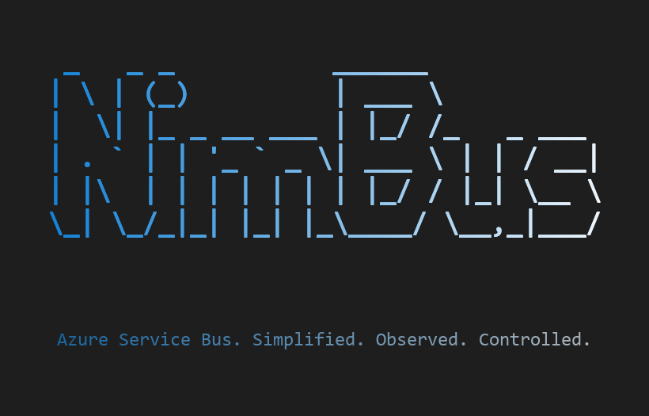

# NimBus



> *A nimbus for your Azure cloud — ordered, audited, and always accounted for.*

NimBus is an Azure Service Bus based integration platform with a shared SDK, management web app, and message tracking and storage.

## Building an Adapter

A NimBus **adapter** is a worker process that sits between an external system and the event bus — it subscribes to events from other systems, publishes events when its own backing system changes, or both. Most consumers of NimBus are writing adapters.

Four questions decide how the wiring looks:

1. **Subscribe, publish, or both?** Subscribers register handlers via `AddNimBusSubscriber` + `AddNimBusReceiver`. Publishers register `AddNimBusPublisher`.
2. **Long-running Worker or Azure Functions?** Worker = simple, in-process, easy to debug ([`samples/CrmErpDemo/Crm.Adapter`](samples/CrmErpDemo/Crm.Adapter)). Functions = serverless, native session triggers ([`samples/CrmErpDemo/Erp.Adapter.Functions`](samples/CrmErpDemo/Erp.Adapter.Functions)).
3. **Direct publish or SQL Server outbox?** Direct = stateless. Outbox = atomic with local DB writes via `AddNimBusSqlServerOutbox`.
4. **Aspire or manual `ServiceBusClient`?** `builder.AddAzureServiceBusClient("servicebus")` for Aspire; manual `AddSingleton<ServiceBusClient>` for Functions and other hosts.

The minimum viable subscriber is small — `IDeferredMessageProcessor` is auto-registered by `AddNimBusSubscriber`, so the floor really is this:

```csharp
var builder = Host.CreateApplicationBuilder(args);
builder.AddServiceDefaults();
builder.AddAzureServiceBusClient("servicebus");

builder.Services.AddNimBusSubscriber("BillingEndpoint", sub =>
{
    sub.AddHandlersFromAssemblyContaining<OrderPlacedHandler>();
});

builder.Services.AddNimBusReceiver(opts =>
{
    opts.TopicName = "BillingEndpoint";
    opts.SubscriptionName = "BillingEndpoint";
});

builder.Build().Run();
```

Add `builder.Services.AddNimBus(n => n.AddPipelineBehavior<LoggingMiddleware>())` when you want middleware in the pipeline.
Use `sub.AddHandler<OrderPlaced, OrderPlacedHandler>()` when you want to register or override a handler explicitly.

Next steps:

- [Building Adapters](docs/building-adapters.md) — full guide: publisher, subscriber, middleware (built-in + custom), retry policies, outbox, hosting choice
- [Getting Started](docs/getting-started.md) — end-to-end tutorial including Aspire local dev
- [SDK API Reference](docs/sdk-api-reference.md) — `IPublisherClient`, `IEventHandler<T>`, `RetryPolicy`, `IOutbox`, request/response

## Extensions

NimBus uses an extension framework to separate core messaging from optional features. Extensions are registered through the `AddNimBus()` builder and can hook into the message pipeline and lifecycle events.

- `src/NimBus.Extensions.Notifications`: sends notifications on message failures and dead-letters.

See [docs/extensions.md](docs/extensions.md) for the full guide on using and creating extensions.

## NuGet Packages

| Package | Description |
|---------|-------------|
| `NimBus.Abstractions` | Core abstractions and interfaces |
| `NimBus.Core` | Endpoint management, retry policies, logging |
| `NimBus.ServiceBus` | Azure Service Bus integration |
| `NimBus.SDK` | Publisher/subscriber SDK |
| `NimBus.CommandLine` | `nb` CLI tool |

### Install

Packages publish under the `Akaule.NimBus.*` prefix (the bare `NimBus.*` prefix is
reserved on nuget.org); assemblies and namespaces stay `NimBus.*`:

```shell
dotnet add package Akaule.NimBus.SDK
dotnet tool install -g Akaule.NimBus.CommandLine
```

### Publishing

Push a version tag to trigger the [NuGet publish workflow](.github/workflows/nuget-publish.yml):

```shell
git tag v1.0.0
git push origin v1.0.0
```

Pre-release versions are supported (e.g. `v1.0.0-preview.1`).

## Prerequisites

- .NET 10 SDK preview, matching the project target frameworks.
- Node.js 22+ (LTS), required by `src/NimBus.WebApp/ClientApp` and the `samples/CrmErpDemo/Crm.Web` / `Erp.Web` SPAs during build. Vite 8 and Vitest 4 are the minimum supported toolchain; older Node versions will fail at `npm install`.
- Access to NuGet package sources used by the solution.

## Build

From the repository root:

```powershell
dotnet build .\src\NimBus.CommandLine\NimBus.CommandLine.csproj
dotnet build .\src\NimBus.sln
```

Notes:

- `src/NimBus.WebApp` runs `npm install` and `npm run build` as part of the .NET build.
- `NSwag.MSBuild` is used directly from NuGet; no local `dotnet-tools.json` manifest is required.

## CLI: deploy to Azure

`nb` is the deployment tool. One command provisions the infrastructure, applies the Service Bus topology, and deploys the Resolver and management WebApp.

You need the Azure CLI (`az`) ≥ 2.60.0 on `PATH`, `az login` completed against the target subscription, and permission to create both resources *and* role assignments in the target resource group (plain Contributor is not enough — see the [Deployment Guide](docs/deployment.md)).

Nothing to clone or build first; `dnx` ships with the .NET 10 SDK:

```powershell
dnx Akaule.NimBus.CommandLine -- setup `
  --solution-id nimbus `
  --environment dev `
  --resource-group rg-nimbus-dev
```

That runs `infra apply` → `topology apply` → `deploy apps` in sequence. When the WebApp comes up, you have a working platform: audit trail, resubmit/skip, and the topology your endpoints publish to.

Resource names are derived from `--solution-id` and `--environment` — `sb-nimbus-dev`, `func-nimbus-dev-resolver`, `webapp-nimbus-dev-management`, and so on. The full inventory, SKUs, and required RBAC are in [Azure Infrastructure Requirements](docs/azure-requirements.md).

New deployments default to the cheapest sensible hosting: the Resolver on Flex Consumption (FC1, scales to zero) and the WebApp plan on `B1` for `dev`/`development`, `S1` elsewhere. Re-runs keep whatever plans already exist; override with `--resolver-plan` and `--management-plan-sku`.

Working inside this repo instead of installing the tool:

```powershell
dotnet run --project .\src\NimBus.CommandLine -- setup --solution-id nimbus --environment dev --resource-group rg-nimbus-dev
```

Everything else `nb` does — running the deployment steps individually, topology export, endpoint and container maintenance, EventCatalog and AsyncAPI export — is in the [CLI Reference](docs/cli.md).

## Local Development (Aspire)

The Aspire AppHost orchestrates the full platform locally. A built-in **Provisioner** creates the Service Bus topics/subscriptions before starting the Resolver and WebApp.

### 1. Set connection strings

```powershell
dotnet user-secrets set "ConnectionStrings:servicebus" "<your-servicebus-connection-string>" `
  --project .\src\NimBus.AppHost

dotnet user-secrets set "ConnectionStrings:cosmos" "<your-cosmos-connection-string>" `
  --project .\src\NimBus.AppHost
```

### 2. Run

```powershell
dotnet run --project .\src\NimBus.AppHost
```

The Aspire dashboard opens automatically. You'll see:

- **provisioner** — provisions Service Bus topology, then exits
- **resolver** — starts after provisioner completes
- **webapp** — starts after provisioner completes (external HTTP endpoint)
- **publisher** — sample HTTP API (`POST /publish/order`, `POST /publish/order-failed`)
- **subscriber** — sample event handler with middleware pipeline and separated DeferredProcessor

## CRM/ERP integration sample

`samples/CrmErpDemo/` is a larger, two-system reference scenario: a CRM and an ERP, each with its own SPA, REST API, SQL database, and adapter, exchanging domain events over Azure Service Bus.

What it demonstrates:

- **Transactional outbox** — entity insert and `nimbus.OutboxMessages` row commit on the same `SqlConnection` / `SqlTransaction` (no MSDTC), forwarded to Service Bus by an outbox dispatcher.
- **Two hosting models, identical handlers** — CRM adapter runs as a .NET Worker (`BackgroundService`), ERP adapter runs as Azure Functions isolated worker; the same `IEventHandler<T>` works in both.
- **Cross-topic forwarding without loops** — origin-prefixed event names (`CrmAccountCreated`, `ErpCustomerCreated`, …) plus `From IS NULL` filters on forwarding subscriptions make round-trip loops structurally impossible.
- **Session-based ordering** — `[SessionKey(nameof(AccountId))]` keeps the `CrmAccountCreated → ErpCustomerCreated → link-erp` round-trip ordered per account.
- **Operator surface** — reuses `nimbus-ops` (the `NimBus.WebApp` + Resolver) for full audit trail and resubmit/skip on dead-lettered sessions.
- **Pluggable message store** — runs against SQL Server by default (in a `nimbus` database on the same Aspire-managed SQL container as the CRM and ERP DBs); pass `--StorageProvider cosmos` to switch the audit/resolver/metrics store to Cosmos DB.

### Run it

```powershell
# 1. SPA dependencies (first run only)
cd samples/CrmErpDemo/Crm.Web; npm install; cd ../../..
cd samples/CrmErpDemo/Erp.Web; npm install; cd ../../..

# 2. Launch the demo. NimBus Service Bus emulator and SQL Server storage are the defaults.
cd samples/CrmErpDemo/CrmErpDemo.AppHost
aspire run
```

To use a real Azure Service Bus namespace instead, set `NIMBUS_SB_EMULATOR=false`
and store `ConnectionStrings:servicebus` in the AppHost's user-secrets.

Wait for `provisioner` to complete in the Aspire dashboard, then create an account in **crm-web** and watch it round-trip through `crm-adapter` → Service Bus → `erp-adapter` Function → `erp-api` → back to `crm-api` to populate the ERP customer id. Stop `erp-api` mid-flow to see the failure / blocked-session / resubmit path in **nimbus-ops**.

Full architecture diagrams, message flows, topology details, and a v2 domains backlog are in [`samples/CrmErpDemo/README.md`](samples/CrmErpDemo/README.md).

## CI/CD

Ready-to-use deployment pipelines ship with the repository — both run `infra apply` → `topology apply` → `deploy apps` and accept optional `resolver-plan` / `management-plan-sku` / `location` inputs:

- **GitHub Actions**: [`deploy.yml`](.github/workflows/deploy.yml), manually triggered, authenticates with OIDC (no stored secrets)
- **Azure DevOps**: [`azure-pipelines-deploy.yml`](pipelines/azure-pipelines-deploy.yml), manually triggered, uses a workload-identity service connection

Teams that provision infrastructure with their own tooling can drive the Bicep templates directly using the sample parameter files in [`deploy/bicep/parameters/`](deploy/bicep/parameters/).

The **[Deployment Guide](docs/deployment.md)** covers the full setup for every path: the Entra app + federated credentials for GitHub OIDC, the Azure DevOps service connection, the RBAC the deploying identity needs (the Bicep creates role assignments — plain Contributor is not enough), and the raw-Bicep walkthrough.

## Documentation

| Guide | Description |
|-------|-------------|
| [Getting Started](docs/getting-started.md) | Step-by-step tutorial: create a publisher, subscriber, and run with Aspire |
| [Deployment Guide](docs/deployment.md) | All deployment paths: one-command, GitHub Actions (OIDC), Azure DevOps, raw Bicep + required RBAC |
| [Azure Infrastructure Requirements](docs/azure-requirements.md) | Reference for governance review: resource inventory, provider registrations, RBAC matrix for pipeline identity, apps, and operators |
| [Building Adapters](docs/building-adapters.md) | Detailed guide for adapter authors — publisher, subscriber, middleware, hosting choice |
| [Azure Functions Hosting](docs/azure-functions-hosting.md) | Production hosting with Service Bus session triggers and DeferredProcessor |
| [Message Flows](docs/message-flows.md) | All 12 message flow patterns with mermaid diagrams |
| [Error Handling](docs/error-handling.md) | Adapter error-handling reference (transient, retry, dead-letter, classification) |
| [Throughput Tuning](docs/throughput-tuning.md) | Which Service Bus/NimBus parameters control throughput, what NimBus sets today, and recommended values per workload profile |
| [Subscription Admin](docs/service-bus-subscription-admin.md) | Admin → Subscriptions: finding and clearing a Service Bus backlog per subscription during an incident |
| [Deferred Messages](docs/deferred-messages.md) | Session blocking and deferral mechanics with Mermaid diagrams |
| [Pipeline Middleware](docs/pipeline-middleware.md) | Built-in middleware, custom behaviors, and lifecycle observers |
| [Consumer Inbox](docs/inbox-pattern.md) | Opt-in redelivery deduplication, providers, retention, and remaining idempotency windows |
| [Testing Guide](docs/testing.md) | Test layers, conformance suites, OpenTelemetry coverage, and diagrams |
| [CLI Reference](docs/cli.md) | All `nb` commands: infra, topology, deploy, endpoint, container, catalog |
| [SDK API Reference](docs/sdk-api-reference.md) | Interfaces: IPublisherClient, IEventHandler, RetryPolicy, IOutbox |
| [WebApp REST API](docs/webapp-rest-api.md) | The HTTP control plane: route map, auth, calling from outside the SPA, code generation, current external-grade gaps |
| [Extensions](docs/extensions.md) | Extension framework guide |
| [Architecture](docs/architecture.md) | System design and component overview |

## Acknowledgments

NimBus owes a clear intellectual debt to two open-source projects in the .NET messaging space. The design of the SDK, the pipeline of behaviors, the recoverability story (retries, dead-letter, audit, operator-driven resubmit/skip), and the framing of session-based ordering as a first-class concern are all heavily influenced by prior art from these communities.

- **[NServiceBus](https://particular.net/nservicebus)** by Particular Software — the primary source of inspiration. NimBus's approach to message handlers, the pipeline-of-behaviors pattern, the transactional outbox, the centralized audit/recovery surface (in the spirit of ServiceControl + ServicePulse), and the emphasis on operator workflows over silent dead-letter all trace back to NServiceBus's ecosystem.

NimBus is an independent implementation targeted specifically at Azure Service Bus and is not a port, fork, or derivative of either project. Any awkward design choices here are NimBus's own.

## License

This project and its solutions are licensed under the MIT License.
