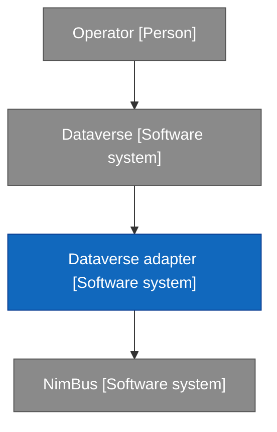
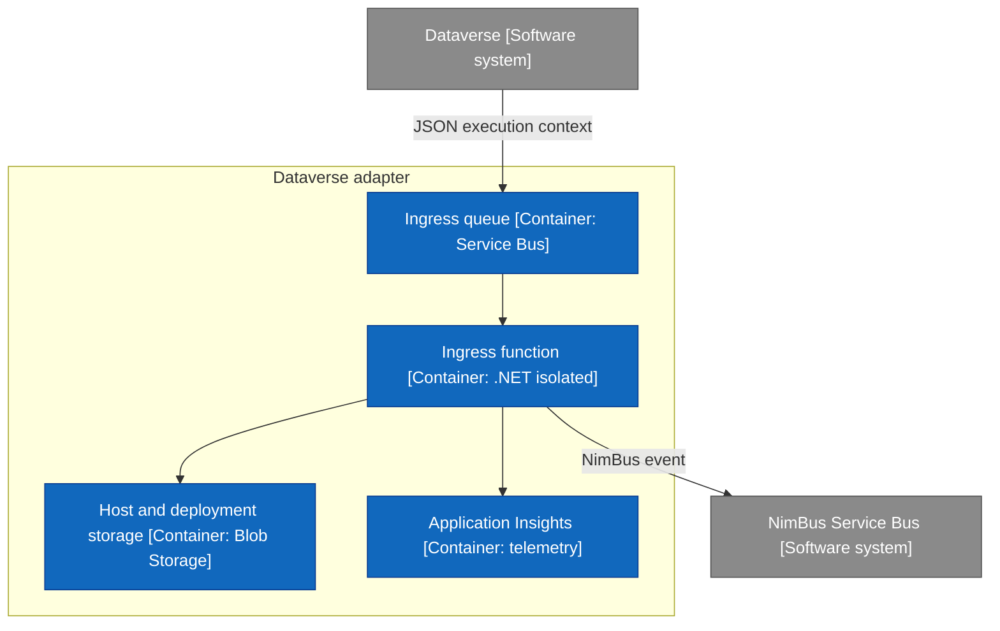
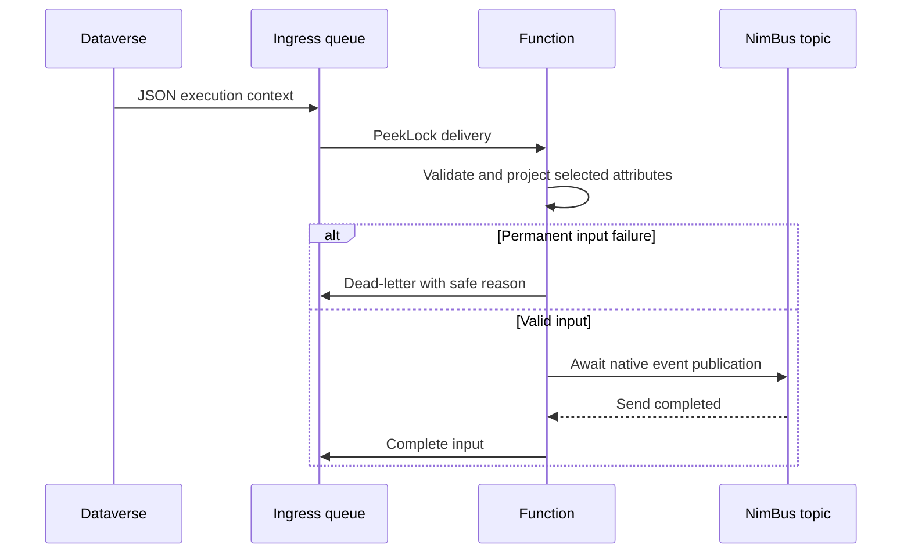
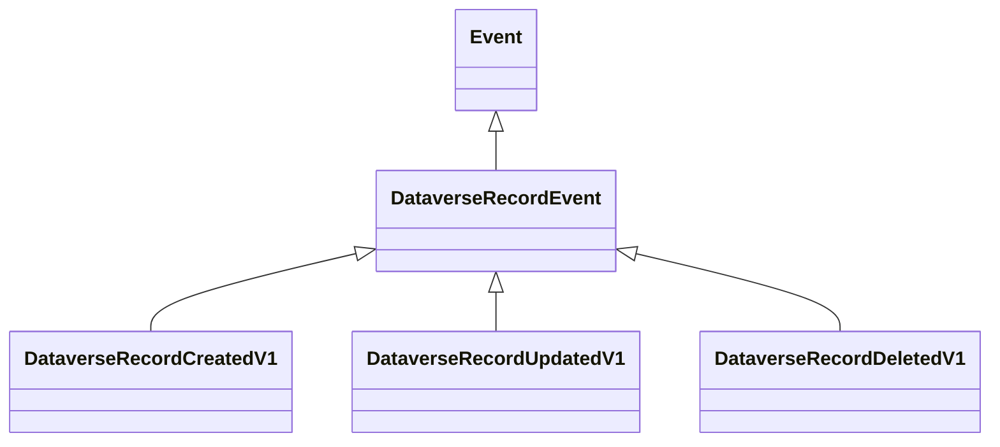

# Technical Design Document — Dataverse adapter

| Field | Value |
| --- | --- |
| Status | Preview implementation; external qualification pending |
| Runtime | .NET 10, Azure Functions v4 isolated |
| Packages | NimBus.Adapters.Dataverse.Contracts; NimBus.Adapters.Dataverse |
| Deployment | NimBus.Adapters.Dataverse.Functions |
| Source | adapters/Dataverse in the NimBus repository |
| Owner | TODO(human): assign operational and contract owners |

## 1. Purpose, scope and responsibilities

Receive configured Dataverse asynchronous record notifications, validate and project source attributes, publish versioned NimBus events, then complete the source queue message. No outbound Dataverse API calls, source record fetch, or NimBus subscriptions. Dependencies point toward public NimBus SDK contracts; no core project references this adapter.

Contract classes use V1 suffixes because NimBus EventType uses the CLR type name as its event ID. Breaking changes require a new contract and compatibility review. The first publication path is built and locally tested but not a production-qualified release.

## 2. Technical architecture

### 2.1 Context

### 2.2 Containers

### 2.3 Resources and authorization

`deploy/main.bicep` creates a Flex Consumption app/plan, user-assigned identity, dedicated queue, Send-only source SAS policy, Blob Storage, workspace and Application Insights. It references existing ingress and NimBus namespaces and an existing publisher topic, all in the same resource group. The identity receives queue-scoped Data Receiver, topic-scoped Data Sender and host-storage Blob Data Owner. Deployment leaves ingress disabled until explicitly enabled.

Dataverse uses its Service Endpoint SAS. The Functions input binding and output client use managed identity. Source credentials are not configured on the Function App. Infrastructure has passed Bicep compilation only; cloud authorization, host storage roles and customer network policy require real deployment validation. No namespace firewall exception is implied.

### 2.4 Configuration

`DataverseQueue`, `DataverseServiceBus__fullyQualifiedNamespace`, `NimBusServiceBus__fullyQualifiedNamespace`, `Dataverse__OrganizationId`, `Dataverse__PublisherEndpoint`, `Dataverse__Tables__<table>__<index>`. Optional instance-wide `Dataverse__PreImageAlias`, `Dataverse__PostImageAlias`, and `Dataverse__MaxBodyBytes`. Host storage and identity settings are separate; see example local settings and Bicep. Configuration is validated at startup.

## 3. Events and triggers

### 3.1 Consumed events

No NimBus events are consumed. The trigger receives a raw source execution context on a non-session queue.

### 3.2 Published events

Declared by `DataverseEndpoint` in the Contracts project:

| Trigger | Published contract |
| --- | --- |
| Create | [DataverseRecordCreatedV1](events.md#dataverserecordcreatedv1) |
| Update | [DataverseRecordUpdatedV1](events.md#dataverserecordupdatedv1) |
| Delete | [DataverseRecordDeletedV1](events.md#dataverserecorddeletedv1) |

### 3.3 Triggers [HUMAN]

Selected approach: event-driven async PostOperation (stage 40, mode 1) steps. No polling or batch schedule.

> TODO(human): approve tables/columns/images, source environment, expected volume and incident ownership before enabling a customer deployment.

## 4. Common implementation patterns

### 4.1 Ingress and settlement

`DataverseIngressFunction.RunAsync` bounds/decodes UTF-8 input and delegates to `DataverseIngress.ProcessAsync`. The coordinator invokes `DataverseContextReader`, constructs a native NimBus message, awaits `IPublisherClient.Publish(IMessage, CancellationToken)`, then invokes completion. Only permanent input failures are caught and dead-lettered. Send failures, lock loss and cancellation propagate. An outbox is not registered.

### 4.2 Echo loops

No source writes occur here. Bidirectional customer integrations must define their own origin/diff rules. The adapter does not discard every Depth > 1 notification, which could drop legitimate source changes.

### 4.3 Retries

Queue redelivery is the input retry mechanism (MaxDeliveryCount 10 in Bicep). Host auto-completion is disabled, prefetch is zero, maxConcurrentCalls is 8 and lock renewal is bounded to five minutes. There is no NimBus subscriber retry pipeline on this source queue. Retry budgets are configuration, not an SLA.

### 4.4 Missing data

Missing configured images, invalid identity, truncation and unsupported selected values are permanent failures. No lookup or reconstruction is attempted. Unconfigured tables and unsupported operations are rejected, not silently skipped.

### 4.5 Mapping

Field mapping is in [events.md](events.md). JSON is parsed as bounded JTokens with duplicate-key detection; no CLR type activation. Selected columns are sorted for stable output. Output content is bounded to 192 KiB before send.

### 4.6 Client discipline

No Dataverse HTTP client. A singleton Azure ServiceBusClient supplies the SDK publisher. Ingress destination cannot be selected by source payload fields.

### 4.7 Extension registration

`AddDataverseAdapter` supports IServiceCollection and INimBusBuilder. A second organization registration is rejected. The standard Function App registers a direct SDK publisher. Custom hosts supplying an outbox are responsible for their durable commit/dispatcher semantics and are not the qualified default.

### 4.8 Identity

MessageId is SHA-256 of organization/step/OperationId/table/record/output-type. SessionId is organization/table/record, hash-shortened above 128 bytes. Source correlation stays distinct. OperationId stability across source reposts remains unverified; deterministic hashing does not prove the source identity is correct.

## 5. Worked integration — record update

### 5.1 Functional description [HUMAN]

Translate a selected committed source update into a record-change notification. Downstream business mapping is outside this adapter.

> TODO(human): approve each customer's selected table/column semantics and downstream responsibilities.

### 5.2 Sequence

A crash between send and complete may republish. Broker duplicate detection is bounded; consumers must be idempotent. Session ordering does not reconstruct source commit order.

### 5.3 NFRs [HUMAN]

> TODO(human): define availability, throughput, latency, cold-start budget, data classification and retention. No measured production claims exist.

### 5.4 Entities

See the [event catalog](events.md#2-event-catalog) for fields and projection semantics.

### 5.5 Error scenarios

Malformed/oversized/truncated input dead-letters; unknown source/table/stage/operation dead-letters; missing selected image dead-letters. Publication or completion failure propagates. Use the [operations runbook](operations.md) for reason codes and replay. Input failures are not automatically visible in Resolver.

## 6. Other integrations

Create and Delete use the same coordinator. Create selects target attributes plus optional post-image; Delete emits identity and optional pre-image without assuming a surviving source record. See [Create](events.md#dataverserecordcreatedv1) and [Delete](events.md#dataverserecorddeletedv1). No additional integration direction is implemented.

## 7. Adapter-level NFRs [HUMAN]

Bounded input/output and concurrency are implemented. Actual throughput, source delay, scale-out, recovery time and SLA are unmeasured.

> TODO(human): supply NFR targets and a representative load profile.

## 8. Architectural risks

- Source occurrence identity is provisional until Dataverse retries are observed.
- At-least-once send/complete boundary can duplicate; pre-session processing can reorder.
- Synthetic fixtures may not cover organization-specific context/value encodings.
- Azure deployment/network/identity and released SDK compatibility are unqualified.
- Generic attributes can contain sensitive data; projection and downstream retention need customer ownership.

## 9. Logging and monitoring

Application Insights metrics aggregate received/rejected/published-and-completed attempts. Safe reason-code logs accompany rejection; successful settlement logs no payload. Monitor source System Jobs, ingress queue/DLQ and downstream NimBus separately. No custom dashboard/alert resources are shipped yet.

> TODO(human): supply dashboard links, alert thresholds, on-call ownership and telemetry retention.

## 10. Test basis

MSTest fixtures in `tests/NimBus.Adapters.Dataverse.Tests` exercise projection/nulls, contracts, source admission, typed values, stable identity, invalid inputs, publication-before-completion, cancellation and send/complete failure. Publisher tests use the real PublisherClient with a recording ISender. Build-bundle validates the generated isolated trigger metadata and explicit settlement flags. Bicep compilation validates syntax, not deployment.

External gaps: live Dataverse identity/payload captures, deployed Functions listener, real broker duplicate window, real NimBus subscriber/Resolver and source-free customer deployment.

## 11. Governance [HUMAN]

Documentation follows code; preview contracts must not be advertised as production approved.

> TODO(human): assign contract/release owners, review cadence and acceptance sign-off.

## 12. Related documents

[README](../README.md), [events](events.md), [registration](dataverse-registration.md), [operations](operations.md), [compatibility](compatibility.md). The implementation plan is in the source repository at `docs/plan/2026-09-09-dataverse-adapter.md`.

## Appendix A — History

2026-09-09: initial generate-from-code preview documentation using the adapter-docs template structure.

## Appendix B — Human decisions

Source environment and Azure resource group; operational/contract owner; table projections and images; NFR/load profile; retention/classification; release acceptance. These are pending, not inferred approvals.
