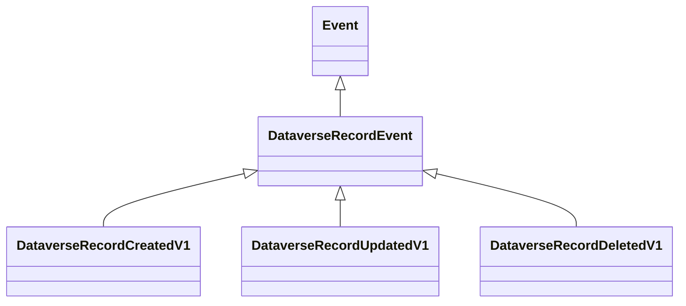

# Events — Dataverse adapter

Companion to [TDD](TDD.md). Status: preview; source identity and real-context compatibility await external qualification.

## 1. Inventory

`DataverseEndpoint` declares Produces for the three contracts below and consumes no NimBus events. The source queue carries JSON execution contexts, not these contracts.

All are published at least once. Idempotency is per source occurrence/outgoing MessageId, not simply RecordId: one record can change many times. Sessions serialize downstream broker arrivals, not the source's commit chronology.

## 2. Event catalog

Common fields, in source declaration order:

| Field | Type | Nullable | PII | Example / meaning |
| --- | --- | --- | --- | --- |
| OrganizationId | Guid | No | Customer classification | Source organization GUID |
| RegistrationId | Guid | No | Customer classification | OwningExtension.Id / step identity |
| OperationId | Guid | No | Customer classification | Async operation GUID; repost stability pending |
| Table | string | No | Customer classification | account; explicit allowlist |
| RecordId | Guid | No | Customer classification | Source primary record identity |
| CorrelationId | Guid | No | Customer classification | Original correlation, not unique-change identity |
| SessionId | string | No | Customer classification | dataverse:organization:table:record; hash-shortened if needed |
| Attributes | JObject | No | Potentially sensitive | Selected target attributes; missing key differs from explicit null |
| Before | JObject | Yes | Potentially sensitive | Selected configured pre-image; no implicit full snapshot |
| After | JObject | Yes | Potentially sensitive | Selected configured post-image; no implicit full snapshot |

All contract classes inherit `DataverseRecordEvent : NimBus.Core.Events.Event`, with `[SessionKey(nameof(SessionId))]`. The actual catalog IDs are the class names, including V1. The ingress validates identity and source shape before publication; the prebuilt SDK overload does not perform an additional implicit source validation. Do not assume general DataAnnotations prove GUID validity for arbitrary callers constructing these contracts.

### DataverseRecordCreatedV1

Create, async PostOperation. Attributes is the selected Target projection. Before is null. After is the selected post-image if its alias is configured, otherwise null. Target/post-image fields need not cover the entire record.

### DataverseRecordUpdatedV1

Update, async PostOperation. Attributes is a selected patch. Explicit null clears a value; absence communicates no attribute value in this context. Before/After carry configured image projections independently. No current-record enrichment occurs.

### DataverseRecordDeletedV1

Delete, async PostOperation. Attributes is empty. Before is the selected pre-image if configured. After is null. RecordId identifies the deleted record; no post-delete fetch is made.

## 3. Mapping

| Source | Event field / transformation |
| --- | --- |
| OrganizationId | OrganizationId; must equal configured organization |
| OwningExtension.Id | RegistrationId; required non-empty GUID |
| OperationId | OperationId; required non-empty GUID |
| PrimaryEntityName | Table; explicit allowlist |
| PrimaryEntityId | RecordId; must agree with Target and selected images |
| CorrelationId | CorrelationId |
| OrganizationId + Table + RecordId | SessionId; SHA-256 shortening above 128 UTF-8 bytes |
| InputParameters Target Attributes | Attributes; configured columns only, stable key ordering |
| PreEntityImages configured alias | Before, when applicable |
| PostEntityImages configured alias | After, when applicable |

Scalar JSON null/string/boolean/number values retain their representation. Money becomes `{kind: money, value: number}`; OptionSetValue becomes `{kind: choice, value: integer}`; EntityReference becomes `{kind: lookup, table: logicalName, id: guid}` without its display name; arrays of OptionSetValue become `{kind: choices, values: [...]}`. Date encodings remain source strings, not CLR values. Other selected complex values fail explicitly. Missing configured images and duplicate collection keys fail explicitly.

Output MessageId hashes organization, registration, operation, table, record and output contract ID. Receipt time and delivery count are deliberately excluded. Source occurrence identity must still be verified against the real tenant before release. MessageMaxSizeExceeded causes rejection even if the remaining JSON parses.

Ignored source fields include ParentContext, initiating user details, formatted display values and non-allowlisted attributes. No data-classification or retention promise is inferred from this projection.

> TODO(human): approve selected columns, sensitivity classification, retention, and real source value semantics per organization.

## 4. Change log

| Date | Version | Change | Evidence |
| --- | --- | --- | --- |
| 2026-09-09 | 0.1 preview | Initial V1 family and mappings | Synthetic parser and publication tests; external qualification pending |

## 5. Related

[TDD](TDD.md), [compatibility](compatibility.md), [registration](dataverse-registration.md), [operations](operations.md).
