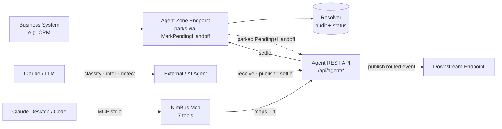
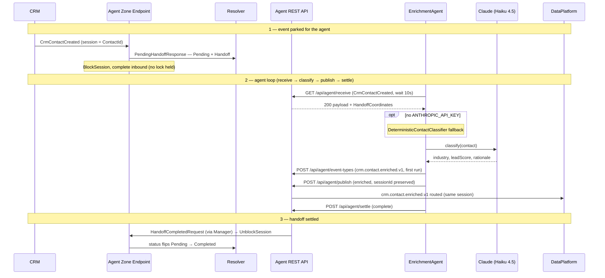
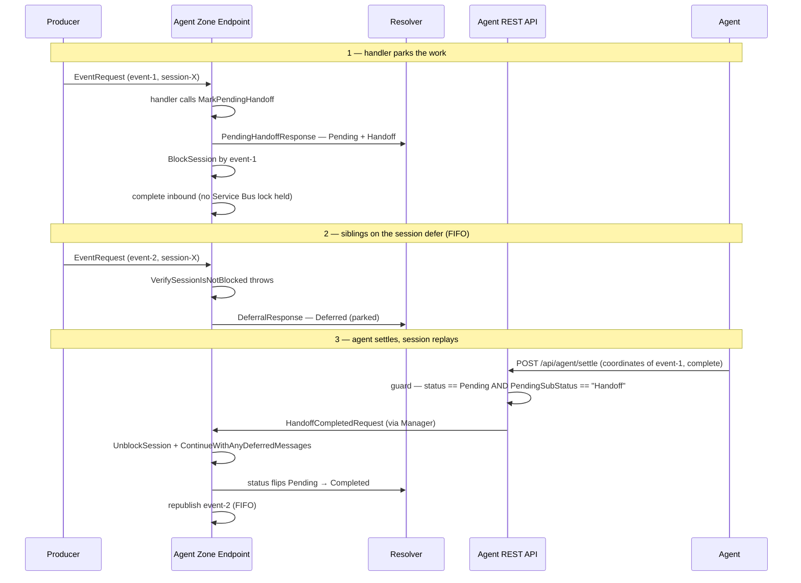
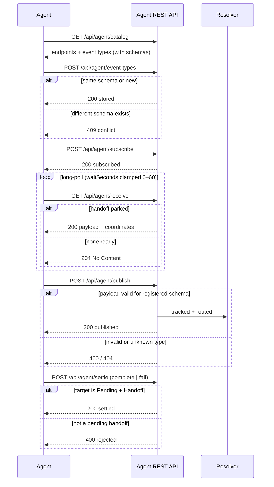
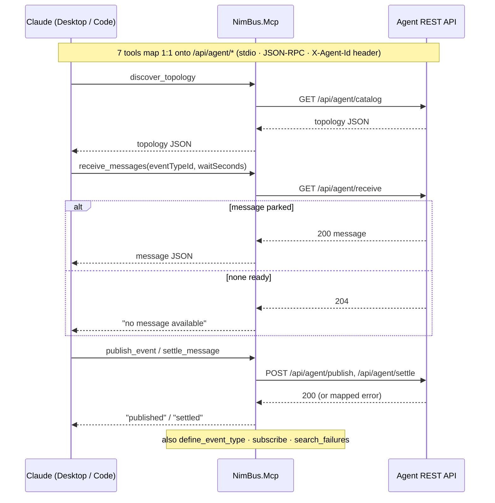
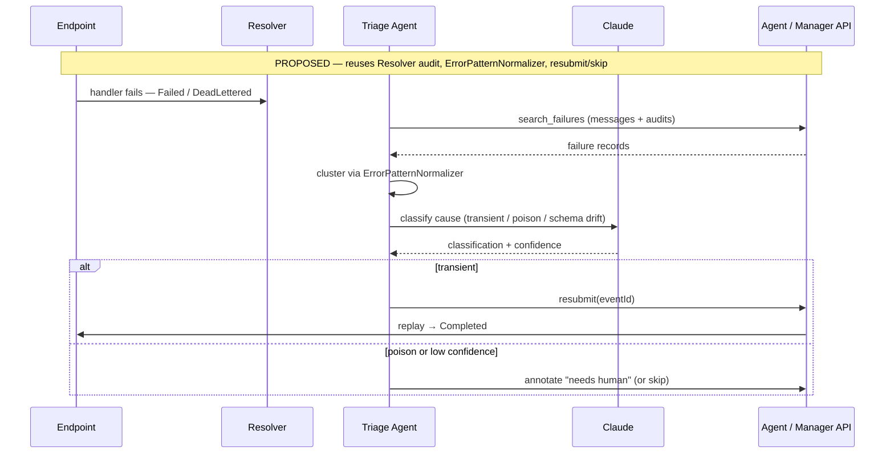
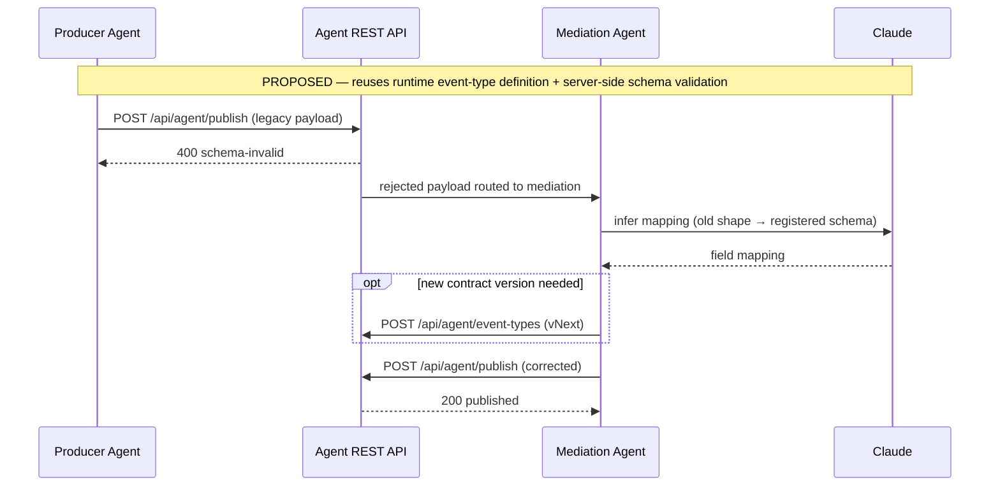
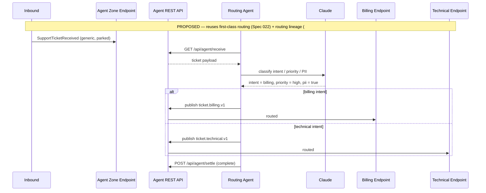
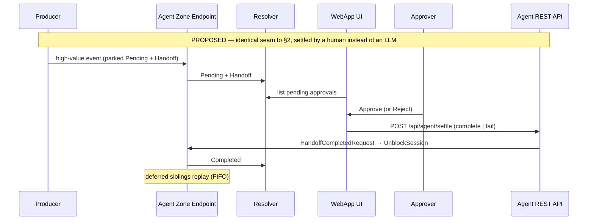
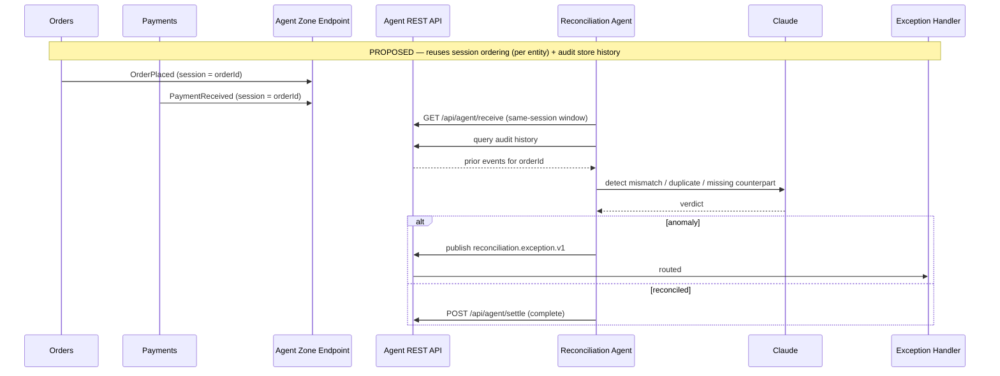

# Agent Use Cases — Interaction Visualizations

How AI (and human) agents participate in NimBus event flows. Every diagram shows the agent's
interaction **with** NimBus (the REST / MCP surface it calls) and its place **within** NimBus
(the park → receive → publish → settle seam, session ordering, and the Resolver audit trail).

Agents never hold a Service Bus lock. They join through a small seam: an endpoint **parks** a message
as a pending handoff, the agent **receives** it over REST (or MCP), does its work, **publishes** any
result, and **settles** the original handoff. Settlement unblocks the session and replays deferred
siblings in FIFO order. See [`message-flows.md`](message-flows.md) §13 for the underlying Service Bus
mechanics and [`agent-enrichment-demo.md`](agent-enrichment-demo.md) for an end-to-end walkthrough.

| Status | Meaning |
|---|---|
| `Pending` + `PendingSubStatus = "Handoff"` | Parked, awaiting an agent |
| `Deferred` | A session sibling parked behind the handoff |
| `Completed` / `Failed` | Settlement outcome (`complete` / `fail`) |

**Diagrams 1–4 reflect shipped code** (file references included). **Diagrams 5–9 are proposed** — each
notes the existing primitives it would reuse.

---

## Where agents plug into NimBus

---

## 1. Enrichment Agent  ·  **Implemented**

*Drop an LLM into an event stream as a first-class participant — it enriches messages inline with the
same ordering and audit guarantees as a native handler, and degrades to deterministic logic when the
model is unavailable.*

Source: [`AgentLoopWorker.cs`](../samples/CrmErpDemo/EnrichmentAgent/AgentLoopWorker.cs),
[`AgentZoneParkHandler.cs`](../samples/CrmErpDemo/CrmErpDemo.Contracts/Handlers/AgentZoneParkHandler.cs).

**Interaction notes** — receive long-poll is 10s; the enriched event carries the original `sessionId`
so downstream ordering holds; publish is validated server-side against the registered JSON schema.

---

## 2. Park / Handoff Seam  ·  **Implemented**

*Any message can be delegated out of the bus to an external worker without losing session ordering —
siblings block until the handoff settles, then replay automatically.* This is the reusable backbone
every other agent use case builds on.

Source: [`AgentZoneParkHandler.cs`](../samples/CrmErpDemo/CrmErpDemo.Contracts/Handlers/AgentZoneParkHandler.cs),
`StrictMessageHandler`; settle guard in
[`AgentImplementation.cs`](../src/NimBus.WebApp/Controllers/ApiContract/AgentImplementation.cs).

**Interaction notes** — settle is rejected with `400` unless the target is genuinely `Pending` + `Handoff`;
the `fail` outcome leaves the session blocked for operator Resubmit/Skip (symmetric to §13 of message-flows).

---

## 3. Agent REST API  ·  **Implemented**

*A self-describing REST contract that turns NimBus into a platform any agent — in any language — can join:
discover the topology, register event types at runtime, and exchange messages with schema enforcement.*

Source: [`AgentImplementation.cs`](../src/NimBus.WebApp/Controllers/ApiContract/AgentImplementation.cs).

**Interaction notes** — discovery (`catalog`) makes the bus self-describing so agents bootstrap with no
hard-coded contracts; `receive` is at-least-once (non-claiming), so handlers must tolerate duplicates.

---

## 4. MCP Bridge  ·  **Implemented**

*Make the integration platform itself an agent tool — an operator or LLM can discover topology, replay
failures, and publish corrective events in natural language, with no integration code.*

Source: [`NimBusAgentTools.cs`](../src/NimBus.Mcp/Tools/NimBusAgentTools.cs).

**Interaction notes** — the bridge is a thin translator over the same REST contract in §3; tool errors are
mapped to readable strings (e.g. a `409` becomes a "conflict" message the model can reason about).

---

## 5. AI Dead-Letter Triage & Auto-Resubmit  ·  **Proposed**

*Turn the WebApp's manual failure triage into an assisted one — cluster failures, diagnose the likely
cause, and auto-resubmit transient ones while escalating poison messages.*

**Reuses** — resubmit/skip + audit trail, the existing `ErrorPatternNormalizer` failure grouping, and the
`search_failures` capability already exposed to agents.

---

## 6. Schema-Drift Mediation / Auto-Mapping  ·  **Proposed**

*Close the loop on contract evolution — when a publish is rejected for schema drift, an agent infers the
mapping to the registered shape and republishes the corrected event.*

**Reuses** — runtime `event-types` registration and the server-side JSON-schema validation that already
produces the `400`/`409` rejection paths.

---

## 7. Content-Based Routing / Intelligent Triage  ·  **Proposed**

*Route events whose destination isn't statically known — classify intent, priority, and PII sensitivity,
then publish a typed, routed event the topology already knows how to deliver.*

**Reuses** — first-class routing (Spec 022 Phase 0) and routing-lineage visualization (#62) to record the
AI's decision; pairs naturally with the PII-masking work (spec 021).

---

## 8. Human-in-the-Loop Approval Gate  ·  **Proposed**

*The same park/handoff seam, but the "agent" is a person — high-value or low-confidence events wait for an
approver in the WebApp, and siblings replay on approval.*

**Reuses** — the deferred-replay + handoff machinery from §2 verbatim; only an approval surface in the
WebApp is new. Demonstrates the seam is not AI-only.

---

## 9. AI Reconciliation / Anomaly Detection  ·  **Proposed**

*Reason over a session-ordered stream to catch mismatches, duplicates, and missing counterparts, emitting
typed exception events for downstream handling.*

**Reuses** — session-based ordering gives the agent a coherent per-entity stream; the audit store supplies
the historical context for "is this anomalous?".

---

> Diagrams 5–9 are forward-looking designs, not shipped features. They reuse the same four primitives the
> implemented cases are built on: the **park/handoff seam**, the **Agent REST API**, **runtime event-type
> definition with schema validation**, and the **Resolver audit trail**.
