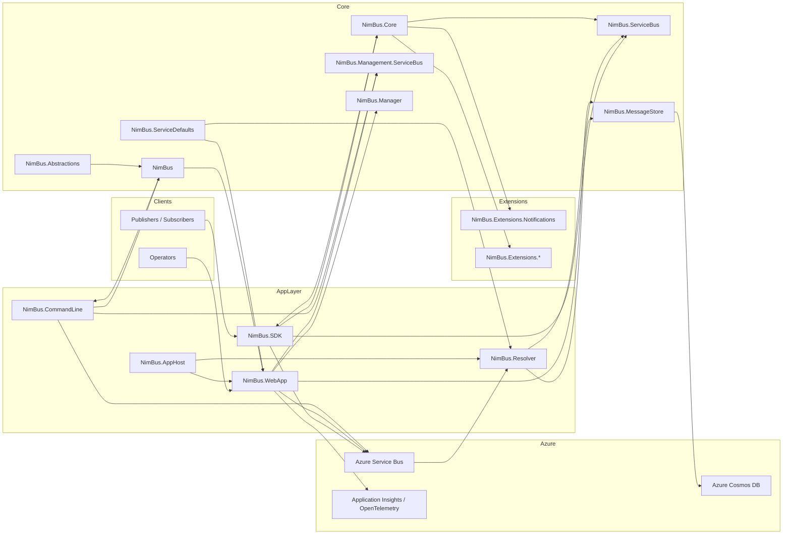
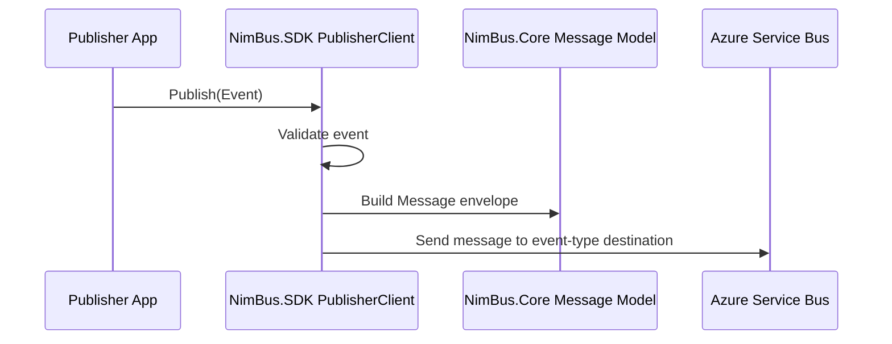
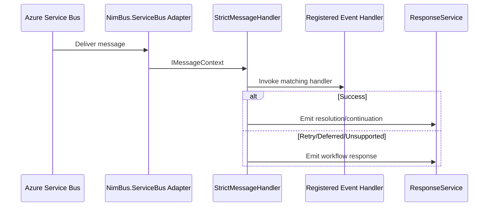
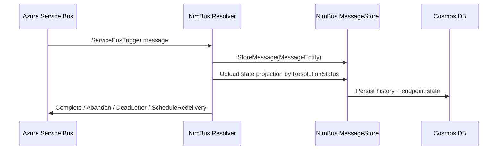
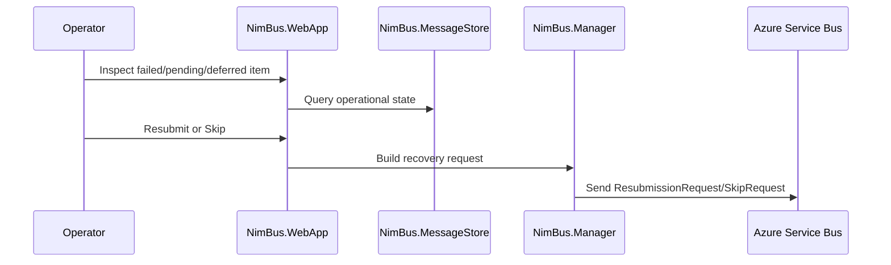

# NimBus Architecture

## Overview

NimBus is a message-driven integration platform built around Azure Service Bus, Cosmos DB, and a small set of deployable control-plane services. The repository combines:

- domain and topology definitions
- a transport-agnostic messaging workflow engine
- Azure Service Bus transport adapters
- an operational state store in Cosmos DB
- a management web application
- a resolver worker that materializes message history and per-endpoint resolution state
- CLI and infrastructure assets for deployment and topology provisioning

At a high level, the system accepts domain events, routes them to endpoint subscriptions over Service Bus, processes them through a strict session-aware message workflow, persists operational state to Cosmos DB, and exposes control/inspection capabilities through the management web app.

## Architecture at a glance



## Solution structure

The solution in `src/NimBus.sln` is organized into three broad groups.

### 1. Deployable applications

- `src/NimBus.WebApp`
  Management control plane. Hosts the SPA, generated REST API, SignalR push channel, and administrative workflows.
- `src/NimBus.Resolver`
  Azure Functions isolated worker. Consumes resolver messages from Service Bus and writes message/state projections into Cosmos DB.
- `src/NimBus.CommandLine`
  Operational CLI for provisioning infrastructure, exporting/applying topology, and deploying applications.
- `src/NimBus.AppHost`
  Aspire local orchestrator for the web app and resolver.

### 2. Shared platform libraries

- `src/NimBus.Abstractions`
  Base contracts for events, event types, endpoints, systems, and platform structure.
- `src/NimBus`
  Concrete domain model and platform topology.
- `src/NimBus.Core`
  Core message contracts and transport-agnostic workflow engine.
- `src/NimBus.ServiceBus`
  Azure Service Bus adapter layer.
- `src/NimBus.SDK`
  Consumer-facing publish/subscribe API.
- `src/NimBus.MessageStore`
  Cosmos DB-backed operational persistence.
- `src/NimBus.Management.ServiceBus`
  Service Bus topology management and provisioning.
- `src/NimBus.Manager`
  Recovery operations such as resubmission and skip.
- `src/NimBus.ServiceDefaults`
  Shared telemetry, health, resilience, and service-discovery defaults.

### 3. Extension packages

NimBus features are split between core platform libraries and optional extensions. Extensions are distributed as separate NuGet packages and plug into the message pipeline through hooks defined in `NimBus.Core.Extensions`.

The extension framework provides two hook points:

- **Pipeline behaviors** (`IMessagePipelineBehavior`): middleware that wraps message handling, executing before and after the handler in registration order.
- **Lifecycle observers** (`IMessageLifecycleObserver`): passive observers notified on message received, completed, failed, and dead-lettered events.

Extensions are composed through the `AddNimBus()` builder:

```csharp
services.AddNimBus(builder =>
{
    builder.AddMessageStore();       // optional platform service
    builder.AddNotifications();      // extension package
    builder.AddPipelineBehavior<CustomBehavior>();
});
```

Shipped extensions:

- `src/NimBus.Extensions.Notifications`
  Sends notifications on message failures and dead-letters through configurable channels.

Extension packages follow the naming convention `NimBus.Extensions.{Name}`. See [extensions.md](extensions.md) for the full guide on using and creating extensions.

### 4. Validation and deployment assets

- `tests/NimBus.Core.Tests`
  Validates workflow engine behavior.
- `tests/NimBus.ServiceBus.Tests`
  Validates Service Bus context and settlement semantics.
- `tests/NimBus.Resolver.Tests`
  Validates resolver persistence and retry behavior.
- `tests/NimBus.CommandLine.Tests`
  Validates CLI behavior and deployment support logic.
- `deploy/bicep`
  Azure infrastructure definitions.
- `deploy/*.ps1`
  Deployment scripts and compatibility helpers.

## Deployable runtime components

### NimBus.WebApp

`NimBus.WebApp` is the management control plane for the platform.

Key entrypoints and composition:

- `src/NimBus.WebApp/Program.cs`
  Creates the ASP.NET Core host and always adds user secrets.
- `src/NimBus.WebApp/Startup.cs`
  Composes authentication, MVC, SignalR, NSwag/OpenAPI, health checks, Cosmos, Service Bus, manager/admin services, and SPA hosting.
- `src/NimBus.WebApp/ClientApp`
  React 18 SPA with routes for endpoints, event types, messages, metrics, and admin workflows.

Primary responsibilities:

- host the authenticated management UI
- expose the backing management API from a contract-first OpenAPI definition
- query and mutate operational state in Cosmos DB
- issue recovery commands back into the messaging pipeline
- manage Service Bus topology and subscriptions
- surface operational telemetry and metrics
- push live UI updates through SignalR

Authentication and authorization:

- normal auth path uses Microsoft Identity Web for both browser and bearer-token flows
- requests are routed through a policy scheme that chooses OpenID Connect or JWT bearer based on the request
- a development-only local authentication bypass exists behind configuration flags
- endpoint-level authorization is implemented against endpoint role assignments in the platform model

Important code anchors:

- `src/NimBus.WebApp/Startup.cs`
- `src/NimBus.WebApp/api-spec.yaml`
- `src/NimBus.WebApp/Controllers/ApiContract/*.cs`
- `src/NimBus.WebApp/Hubs/GridEventsHub.cs`
- `src/NimBus.WebApp/Services/EndpointAuthorizationService.cs`
- `src/NimBus.WebApp/Services/ApplicationInsights/ApplicationInsightsService.cs`

Operational characteristics:

- build and publish invoke NSwag and Node-based SPA builds from MSBuild targets in `NimBus.WebApp.csproj`
- publish includes generated SPA assets and additional static artifacts
- runtime can use either connection strings or Azure identity-backed endpoints/namespaces depending on configuration

### NimBus.Resolver

`NimBus.Resolver` is a thin integration worker hosted as an Azure Functions isolated app.

Key entrypoints and composition:

- `src/NimBus.Resolver/Program.cs`
  Creates the Functions worker, applies shared service defaults, configures OpenTelemetry, configures Serilog, and registers resolver services.
- `src/NimBus.Resolver/Functions.cs`
  Defines a single Service Bus-triggered function named `Resolver`.
- `src/NimBus.Resolver/ServiceExtensions.cs`
  Registers Cosmos, Service Bus, message handling, logging, and adapter dependencies.
- `src/NimBus.Resolver/Services/ResolverService.cs`
  Implements the resolver business logic.

Primary responsibilities:

- consume session-enabled resolver messages from Service Bus
- persist normalized message history
- project messages into per-endpoint unresolved/completed/failed/deferred state
- handle Cosmos throttling through scheduled redelivery
- explicitly settle or dead-letter messages

Operational characteristics:

- no custom polling loop or background service; Azure Functions owns trigger activation and concurrency
- `host.json` configures Service Bus concurrency, session idle timeout, lock renewal, retry behavior, and explicit settlement
- the worker uses `IServiceBusAdapter` to translate Azure SDK trigger objects into NimBus message semantics

Important code anchors:

- `src/NimBus.Resolver/Functions.cs`
- `src/NimBus.Resolver/Services/ResolverService.cs`
- `src/NimBus.Resolver/host.json`

### NimBus.CommandLine

`NimBus.CommandLine` is the operational automation entrypoint.

Primary responsibilities:

- deploy infrastructure
- export platform topology
- apply Service Bus topology
- publish and deploy applications
- run an end-to-end setup workflow

This project bridges source-of-truth topology from `NimBus` into Azure infrastructure and messaging topology managed by `NimBus.Management.ServiceBus`.

### NimBus.AppHost

`NimBus.AppHost` is an Aspire app host intended for local orchestration.

From `src/NimBus.AppHost/Program.cs`, it:

- reads Cosmos and Service Bus connection strings
- starts the resolver function app with the required references/environment variables
- starts the web app with the same backing dependencies
- exposes the web app externally for local access

This project is not part of the production runtime path; it improves local development and local service composition.

## Shared library architecture

### NimBus.Abstractions

Purpose:

- foundational domain contracts
- event metadata and validation surface
- endpoint/system/platform abstractions

Important types:

- `Events/Event.cs`
- `Events/EventType.cs`
- `Endpoints/Endpoint.cs`
- `Platform.cs`

This layer contains no Azure-specific transport concerns. It is the platform model foundation.

### NimBus

Purpose:

- concrete business events
- concrete endpoint catalog
- concrete platform topology

Important types:

- `PlatformConfiguration.cs`
- `Events/*`
- `Endpoints/*`
- `Validation/*`

This project is the source of truth for which endpoints produce or consume which events.

### NimBus.Core

Purpose:

- canonical message envelope and message-state model
- transport-agnostic workflow engine
- retry, deferral, continuation, and response orchestration

Important types:

- `Messages/Message.cs`
- `Messages/MessageContent.cs`
- `Messages/MessageType.cs`
- `Messages/IMessageContext.cs`
- `Messages/StrictMessageHandler.cs`
- `Messages/ResponseService.cs`
- `Messages/RetryDefinitions.cs`

Core architectural role:

- receives a normalized transport-independent message context
- validates whether the message may progress
- invokes subscriber handlers
- blocks/unblocks sessions when required
- emits response or recovery messages
- controls continuation, retry, skip, deferral, and unsupported-event behavior

This is the heart of the message-processing model.

### NimBus.ServiceBus

Purpose:

- Azure Service Bus transport implementation for NimBus.Core abstractions

Important types:

- `ServiceBusAdapter.cs`
- `MessageContext.cs`
- `ServiceBusSession.cs`
- `Sender.cs`
- `DeferredMessageProcessor.cs`

Core architectural role:

- adapts `ServiceBusReceivedMessage` and settlement/session actions into `IMessageContext`
- maps message headers and body into the NimBus canonical form
- implements completion, abandon, deferral, dead-letter, and schedule-redelivery semantics
- emits transport telemetry such as queue wait and end-to-end latency

### NimBus.SDK

Purpose:

- public publish/subscribe programming model for application developers

Important types:

- `PublisherClient.cs`
- `SubscriberClient.cs`
- `EventHandlers/*`

Core architectural role:

- validates and serializes events for publication
- creates canonical `Message` envelopes
- wires subscriber handlers into `StrictMessageHandler`
- optionally enables deferred-message processing

This is the main library consumers would integrate with when building publishers or subscribers on NimBus.

### NimBus.MessageStore

Purpose:

- durable operational state and history store backed by Cosmos DB

Important types:

- `CosmosDbClient.cs`
- `MessageEntity.cs`
- `MessageAuditEntity.cs`
- `States/*`

Core architectural role:

- store immutable message history
- store audit history
- store unresolved event state by endpoint and status
- query operational views used by the web app and manager

Key state categories include:

- pending
- completed
- failed
- deferred
- dead-lettered
- skipped
- unsupported

### NimBus.Management.ServiceBus

Purpose:

- Service Bus topology management

Important types:

- `ServiceBusManagement.cs`
- `EndpointManagement.cs`

Core architectural role:

- create topics, subscriptions, forwarding rules, and deferred-processing paths
- enforce topology conventions derived from the platform definition

### NimBus.Manager

Purpose:

- issue operator-initiated recovery commands

Important type:

- `ManagerClient.cs`

Core architectural role:

- take stored failure records from the operational store
- emit `ResubmissionRequest` or `SkipRequest` messages
- feed those requests back into the same workflow engine used for normal processing

### NimBus.ServiceDefaults

Purpose:

- standardize cross-cutting runtime behavior across services

Important code:

- `src/NimBus.ServiceDefaults/Extensions.cs`

Capabilities:

- health checks
- service discovery
- resilient default `HttpClient`
- OpenTelemetry instrumentation
- OTLP and Azure Monitor export
- instrumentation for ASP.NET Core, HTTP, runtime, Cosmos, and Service Bus

## Primary execution flows

### 1. Publish flow



Notes:

- domain events derive from the abstractions layer and concrete event types are provided by `NimBus`
- routing uses event type metadata and session IDs for ordering/correlation

### 2. Subscriber processing flow



Key behaviors:

- session-aware ordering and blocking
- retry policy evaluation
- continuation and deferred processing
- manager-only recovery operations for some command types

### 3. Resolver persistence flow



Key behaviors:

- `RetryRequest` creates an audit entry before normal persistence
- Cosmos throttling triggers exponential backoff and scheduled redelivery
- dead-letter metadata overrides status mapping

### 4. Management and recovery flow



This design keeps operational intervention inside the same message lifecycle used by normal traffic.

## Data model and storage view

The data architecture is split between transport messages and operational projections.

### Transport model

Defined mainly in `NimBus.Core`:

- `Message`
- `MessageContent`
- `EventContent`
- `ErrorContent`
- `MessageType`
- `IMessageContext`

This is the canonical wire model used across publish, subscribe, resolver, and recovery flows.

### Operational persistence model

Defined mainly in `NimBus.MessageStore`:

- `MessageEntity`
  Immutable message-history record.
- `MessageAuditEntity`
  Audit record, including retry-related audits.
- `UnresolvedEvent` and related state models
  Endpoint-scoped operational projection of event state.

Cosmos DB acts as the durable system of record for:

- raw message history
- operator audits
- unresolved/resolution state by endpoint
- endpoint subscriptions and metrics views

The architecture intentionally separates event history from operator-facing read models.

## Control plane and API design

The control plane is centered on `NimBus.WebApp`.

### API style

- OpenAPI-first design in `src/NimBus.WebApp/api-spec.yaml`
- generated server contracts via NSwag
- hand-written implementation classes behind the generated interfaces

### Main API domains

- endpoint metadata and health/state
- message search and inspection
- unresolved/completed/failed/deferred event views
- metrics and telemetry
- administrative cleanup and topology operations
- development helpers and seed flows

### UI architecture

The SPA in `src/NimBus.WebApp/ClientApp` is a React-based operational frontend. It is not a thin shell over the backend; it is the primary operator experience and depends on:

- the generated management API
- SignalR push updates
- telemetry-driven views
- domain/topology data derived from the shared platform model

## Infrastructure and deployment architecture

### Infrastructure as code

Primary Bicep files:

- `deploy/bicep/deploy.core.bicep`
- `deploy/bicep/deploy.webapp.bicep`

Provisioned resource groups/components include:

- Azure Service Bus namespace
- Cosmos DB
- Application Insights
- storage account
- function app and function app plan
- web app and app service plan
- RBAC assignments

### Deployment workflow

There are two complementary deployment paths:

- scripted deployment through `deploy/*.ps1`
- CLI-driven deployment through `NimBus.CommandLine`

CLI responsibilities include:

- `infra apply`
- `topology export`
- `topology apply`
- `deploy apps`
- `setup`

### Topology provisioning

Topology provisioning is driven by the platform definition:

1. `NimBus/PlatformConfiguration.cs` defines endpoints and event relationships.
2. `NimBus.CommandLine` exports or applies topology.
3. `NimBus.Management.ServiceBus` creates matching Azure Service Bus entities and rules.

This keeps application topology declarative and versioned with code.

## Observability and operational concerns

Shared observability behavior lives in `NimBus.ServiceDefaults` and is used by both `NimBus.WebApp` and `NimBus.Resolver`.

Capabilities include:

- OpenTelemetry instrumentation
- OTLP export
- Azure Monitor export
- health checks
- HTTP resilience defaults
- service discovery

Additional application-specific observability:

- `NimBus.WebApp` uses Application Insights both for SDK telemetry and direct query/reporting services
- `NimBus.ServiceBus` records transport timings
- `NimBus.Resolver` records structured logs and persistence outcomes

Operationally important patterns:

- explicit Service Bus message settlement
- session-aware processing
- deferred and continuation workflows
- redelivery scheduling for transient and throttling scenarios
- Cosmos-backed read models for operator workflows

## Configuration model

Common configuration concerns across services:

- Cosmos DB connection string or endpoint
- Service Bus connection string or namespace
- Azure AD settings for the web app
- Application Insights identifiers and access
- environment-specific local-development toggles

Credential model:

- local and some deployment scenarios can use connection strings
- production-oriented paths can use managed identity via `DefaultAzureCredential`

This dual-mode approach exists in both the web app and resolver composition roots.

## Test coverage as architectural evidence

The tests help confirm the intended architecture:

- `tests/NimBus.Core.Tests/StrictMessageHandlerTests.cs`
  Verifies the workflow engine: resolution, retry, unsupported cases, deferral, continuation, and manager operations.
- `tests/NimBus.ServiceBus.Tests/MessageContextTests.cs`
  Verifies transport adaptation and settlement semantics.
- `tests/NimBus.Resolver.Tests/ResolverServiceTests.cs`
  Verifies resolver persistence, endpoint determination, throttling, and failure handling.
- `tests/NimBus.CommandLine.Tests`
  Verifies deployment/tooling support behavior.

This is a useful signal that the architecture is intentionally centered on a reusable message-processing core plus thin integration layers.

## Architectural characteristics

### Strengths

- clean separation between domain model, workflow engine, transport adapter, and operational store
- operator actions reuse the same message workflow rather than introducing out-of-band mutation paths
- topology is code-defined and provisioned from the same repository
- local orchestration exists through Aspire while production deployment remains Azure-native
- operational state is durable and queryable through Cosmos-backed projections

### Tradeoffs

- the web app is broad in scope: UI host, API host, SignalR hub, control plane, and telemetry aggregator
- build/publish complexity is higher because the web app couples SPA, NSwag generation, and server publish steps
- Cosmos client logic is concentrated in a large `CosmosDbClient`, which makes the persistence layer powerful but dense
- the architecture is strongly Azure-centric; portability is limited by design

## Recommended reading order

For a new engineer, the shortest path to understanding the system is:

1. `src/NimBus/PlatformConfiguration.cs`
2. `src/NimBus.Core/Messages/StrictMessageHandler.cs`
3. `src/NimBus.ServiceBus/ServiceBusAdapter.cs`
4. `src/NimBus.Resolver/Services/ResolverService.cs`
5. `src/NimBus.MessageStore/CosmosDbClient.cs`
6. `src/NimBus.WebApp/Startup.cs`
7. `src/NimBus.CommandLine/Program.cs`

## Summary

NimBus is a layered Azure-native event platform. The architectural center of gravity is not the web app or the resolver; it is the shared message workflow engine in `NimBus.Core`, surrounded by:

- a domain/topology layer (`NimBus.Abstractions`, `NimBus`)
- a transport integration layer (`NimBus.ServiceBus`, `NimBus.SDK`)
- an operational persistence layer (`NimBus.MessageStore`)
- a control plane (`NimBus.WebApp`, `NimBus.Manager`, `NimBus.Management.ServiceBus`)
- delivery/orchestration tooling (`NimBus.CommandLine`, `NimBus.AppHost`, `deploy`)

That structure makes the system understandable as one platform rather than a loose collection of applications: events enter through the SDK, move through a strict message lifecycle on Service Bus, are projected into Cosmos-backed operational state by the resolver, and are managed through the web app and CLI using the same topology and workflow rules defined in code.
