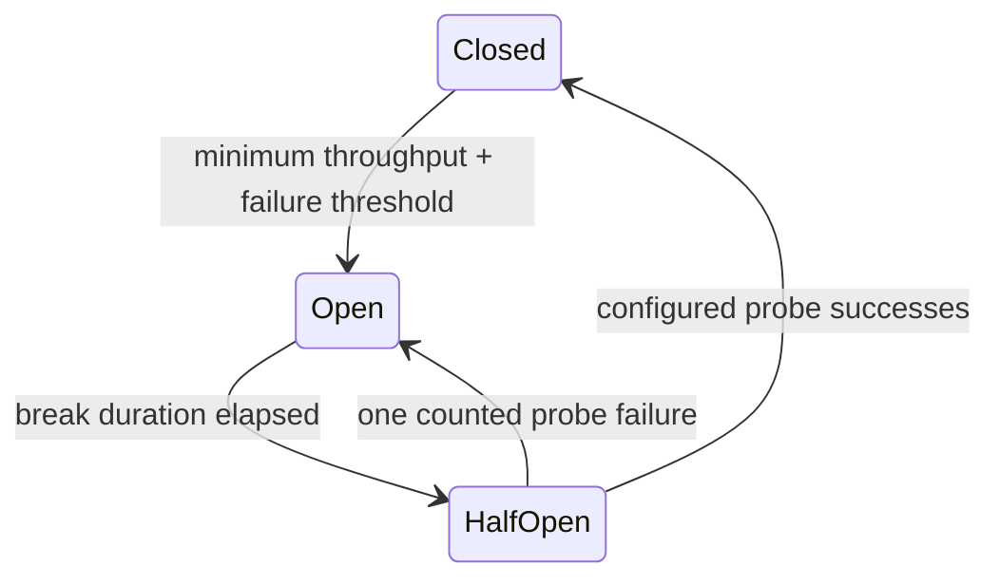

# Endpoint Circuit Breaker

NimBus can pause a subscriber when retry-eligible handler failures indicate that a downstream dependency is distressed. The feature is opt-in and scoped to the process's single subscriber endpoint.

Unlike a message-level circuit breaker, an open NimBus circuit does not throw or abandon messages. Every `NimBusReceiverHostedService` observing the endpoint stops and disposes its `ServiceBusSessionProcessor`. Messages remain untouched on the subscription and session ordering is preserved.

> **Prefetch caveat.** "No delivery attempts consumed" holds only for the default `PrefetchCount = 0`. With prefetch enabled, messages already sitting in the processor's prefetch buffer at open time have been received under peek-lock — their `DeliveryCount` is already incremented, and stopping the processor abandons them (or lets their locks expire). An outage that opens the circuit repeatedly burns one delivery attempt per open cycle for prefetched messages, which can dead-letter them via `MaxDeliveryCount` without any handler ever failing them. If you combine the breaker with the prefetch values recommended in [throughput tuning](throughput-tuning.md), budget `MaxDeliveryCount` accordingly or keep prefetch at 0 on breaker-protected endpoints.

## Configure

```csharp
services.AddNimBusSubscriber(options =>
{
    options.Endpoint = "billing";
}, subscriber =>
{
    subscriber.AddHandler<InvoiceRequested, InvoiceRequestedHandler>();
    subscriber.WithCircuitBreaker(circuit =>
    {
        circuit.MinimumThroughput = 10;
        circuit.FailurePercentageThreshold = 50;
        circuit.SamplingWindow = TimeSpan.FromMinutes(2);
        circuit.BreakDuration = TimeSpan.FromMinutes(1);
        circuit.HalfOpenProbeCount = 3;
        circuit.CountPermanentFailures = false;
        circuit.Exclude<ExpectedDependencyException>();
    });
});
```

`WithCircuitBreaker` installs its recorder and minimal pipeline infrastructure automatically; a separate `AddNimBus(...)` call is not required. Existing custom middleware still runs in its configured order.

| Option | Default | Meaning |
|---|---:|---|
| `MinimumThroughput` | 10 | Outcomes required in the current sampling window before evaluating the failure rate |
| `FailurePercentageThreshold` | 50 | Open when the failure percentage is greater than or equal to this value |
| `SamplingWindow` | 2 minutes | Sliding window used for closed-state outcomes |
| `BreakDuration` | 1 minute | Time receivers remain stopped before half-open probing |
| `HalfOpenProbeCount` | 3 | Consecutive successful probes required to close |
| `CountPermanentFailures` | `false` | Include poison/permanent failures in breaker failure counting |

`Exclude<TException>()` and `Exclude(predicate)` inspect the exception and its inner-exception chain.

## State flow



- **Closed:** receivers use their configured `MaxConcurrentSessions`.
- **Open:** receivers are stopped. In-flight handlers finish through normal processor shutdown; queued messages are not received or settled.
- **HalfOpen:** receivers are recreated with `MaxConcurrentSessions = 1`. Real messages are the probes. Success restores configured concurrency; a counted failure starts a fresh break.

When a process hosts multiple `AddNimBusReceiver(...)` registrations, every receiver observes the same endpoint breaker and pauses or resumes together.

## What counts

The recorder observes the pipeline result and never changes or replaces an exception.

- Counted: `EventContextHandlerException` (the retry disposition) and `TransientException`.
- Optional: `PermanentFailureException` when `CountPermanentFailures` is enabled.
- Ignored: `SessionBlockedException`, cancellation, unrelated middleware exceptions, configured exclusions, and platform heartbeat traffic.

Permanent failures are ignored by default because a poison message does not imply a failing downstream service. Session blocks are a secondary effect of an earlier failure and would otherwise double-count the incident.

## Operations and telemetry

The circuit only controls the client processor. It never changes the Service Bus topic or subscription status, so operator `ReceiveDisabled` controls remain authoritative and do not fight the breaker.

The `NimBus.Consumer` meter emits:

- `nimbus.circuit_breaker.transitions_total`, tagged with `nimbus.endpoint`, `nimbus.circuit_breaker.from`, and `nimbus.circuit_breaker.to`.
- `nimbus.circuit_breaker.state`, tagged with `nimbus.endpoint`; values are `Closed=0`, `Open=1`, and `HalfOpen=2`.

Lifecycle observers receive `OnCircuitStateChanged`. The Notifications extension sends Critical notifications when a circuit opens and Information notifications when it closes; set `NotificationOptions.NotifyOnCircuitOpen = false` to suppress both.

## Azure Functions limitation

An Azure Functions `[ServiceBusTrigger]` owns its receive loop, so NimBus cannot stop or reduce its concurrency. The recorder, in-process state, metrics, lifecycle callbacks, and notifications still work, but the function trigger continues receiving. Use a hosted `NimBusReceiverHostedService` when receiver pausing is required.
