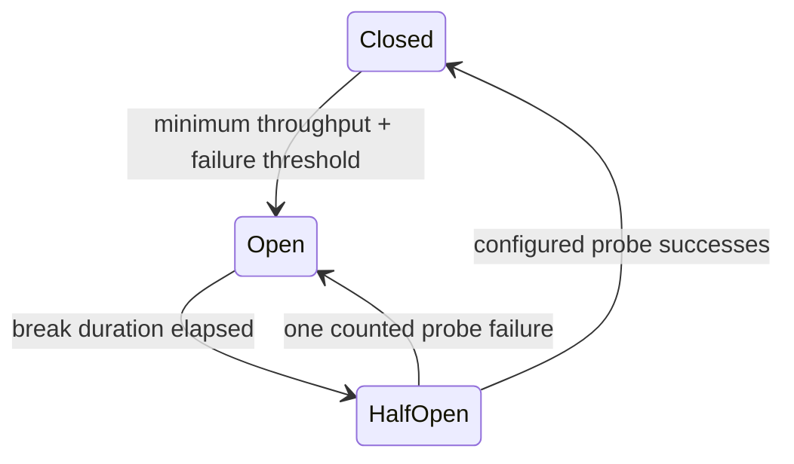

# Endpoint Circuit Breaker

NimBus can pause a subscriber when retry-eligible handler failures indicate that a downstream dependency is distressed. The feature is opt-in and scoped to the process's single subscriber endpoint.

Unlike a message-level circuit breaker, an open NimBus circuit does not throw or abandon messages. Every `NimBusReceiverHostedService` observing the endpoint stops and disposes its `ServiceBusSessionProcessor`. Messages remain untouched on the subscription and session ordering is preserved.

> **Prefetch caveat.** "No delivery attempts consumed" holds only for the default `PrefetchCount = 0`. With prefetch enabled, messages already sitting in the processor's prefetch buffer at open time have been received under peek-lock — their `DeliveryCount` is already incremented, and stopping the processor abandons them (or lets their locks expire). An outage that opens the circuit repeatedly burns one delivery attempt per open cycle for prefetched messages, which can dead-letter them via `MaxDeliveryCount` without any handler ever failing them. If you combine the breaker with the prefetch values recommended in [throughput tuning](throughput-tuning.md), budget `MaxDeliveryCount` accordingly or keep prefetch at 0 on breaker-protected endpoints.

## Configure

```csharp
services.AddNimBusSubscriber(options =>
{
    options.Endpoint = "billing";
}, subscriber =>
{
    subscriber.AddHandler<InvoiceRequested, InvoiceRequestedHandler>();
    subscriber.WithCircuitBreaker(circuit =>
    {
        circuit.MinimumThroughput = 10;
        circuit.FailurePercentageThreshold = 50;
        circuit.SamplingWindow = TimeSpan.FromMinutes(2);
        circuit.BreakDuration = TimeSpan.FromMinutes(1);
        circuit.HalfOpenProbeCount = 3;
        circuit.CountPermanentFailures = false;
        circuit.Exclude<ExpectedDependencyException>();
    });
});
```

`WithCircuitBreaker` installs its recorder and minimal pipeline infrastructure automatically; a separate `AddNimBus(...)` call is not required. Existing custom middleware still runs in its configured order.

| Option | Default | Meaning |
|---|---:|---|
| `MinimumThroughput` | 10 | Outcomes required in the current sampling window before evaluating the failure rate |
| `FailurePercentageThreshold` | 50 | Open when the failure percentage is greater than or equal to this value |
| `SamplingWindow` | 2 minutes | Sliding window used for closed-state outcomes |
| `BreakDuration` | 1 minute | Time receivers remain stopped before half-open probing |
| `HalfOpenProbeCount` | 3 | Consecutive successful probes required to close |
| `CountPermanentFailures` | `false` | Include poison/permanent failures in breaker failure counting |

`Exclude<TException>()` and `Exclude(predicate)` inspect the exception and its inner-exception chain.

## State flow


```mermaid
stateDiagram-v2
    Closed --> Open: minimum throughput + failure threshold
    Open --> HalfOpen: break duration elapsed
    HalfOpen --> Closed: configured probe successes
    HalfOpen --> Open: one counted probe failure
```

- **Closed:** receivers use their configured `MaxConcurrentSessions`.
- **Open:** receivers are stopped; queued messages are not received or settled. Stopping a processor cancels the token of every in-flight delivery, in every session. A handler that honours the token stops without settling and its message is redelivered after the restart. A delivery whose handler already returned or failed settles in full regardless: its response, session block, completion and any scheduled retry do not observe the cancellation (see [settlement and receiver shutdown](message-flows.md#settlement-and-receiver-shutdown)).
- **HalfOpen:** receivers are recreated with `MaxConcurrentSessions = 1`. Real messages that reach a handler are the probes. Success restores configured concurrency; a counted failure starts a fresh break.

When a process hosts multiple `AddNimBusReceiver(...)` registrations, every receiver observes the same endpoint breaker and pauses or resumes together.

## What counts

The recorder observes the pipeline result and never changes or replaces an exception.

- Counted: `EventContextHandlerException` (the retry disposition) and `TransientException`.
- Optional: `PermanentFailureException` when `CountPermanentFailures` is enabled.
- Ignored, as neither a success nor a failure: `SessionBlockedException`, cancellation, unrelated middleware exceptions, configured exclusions, discarded failures (the `Discard` disposition), platform heartbeat traffic, and deliveries answered without running a handler: operator skips, handoff settlements, legacy continuations, inbox duplicates, a `RetryRequest` for an event that no longer blocks its session, and an event type without a registered handler.

Scheduled retries (`RetryRequest`) and operator resubmissions (`ResubmissionRequest`) count like the original delivery. When their handler fails with the retry disposition, `StrictMessageHandler` settles the message itself: it sends the `ErrorResponse`, completes the message and, for a retry, schedules the next attempt, then returns without rethrowing. It reports the `EventContextHandlerException` on `IMessageContext.HandledFailure` instead, and the recorder counts it as though it had escaped the pipeline. A retry that fails during an outage therefore adds to the failure rate while the circuit is closed and is a failed probe while it is half-open; it cannot close the circuit. Configured exclusions still inspect the failure's inner-exception chain. A `TransientException` from a retry or resubmission propagates and is counted as usual.

Only a delivery that reached a handler counts as a success. A skip, a handoff settlement or a duplicate never calls the endpoint's dependencies; counted as successes, three operator skips during an outage would close a half-open circuit. `StrictMessageHandler` marks such deliveries with `HandlerOutcome.NotDispatched` (the inbox marks duplicates with `HandlerOutcome.DuplicateDetected`), and the recorder records nothing for them. A discarded failure is reported on `IMessageContext.HandledFailure`, but the `Discard` disposition, like a poison message, is not counted. A handler that marks a pending handoff did call its external system, so it counts as a success.

Permanent failures are ignored by default because a poison message does not imply a failing downstream service. Session blocks are a secondary effect of an earlier failure and would otherwise double-count the incident.

## Operations and telemetry

The circuit only controls the client processor. It never changes the Service Bus topic or subscription status, so operator `ReceiveDisabled` controls remain authoritative and do not fight the breaker.

The `NimBus.Consumer` meter emits:

- `nimbus.circuit_breaker.transitions_total`, tagged with `nimbus.endpoint`, `nimbus.circuit_breaker.from`, and `nimbus.circuit_breaker.to`.
- `nimbus.circuit_breaker.state`, tagged with `nimbus.endpoint`; values are `Closed=0`, `Open=1`, and `HalfOpen=2`.

Lifecycle observers receive `OnCircuitStateChanged`. The Notifications extension sends Critical notifications when a circuit opens and Information notifications when it closes; set `NotificationOptions.NotifyOnCircuitOpen = false` to suppress both.

## Azure Functions limitation

An Azure Functions `[ServiceBusTrigger]` owns its receive loop, so NimBus cannot stop or reduce its concurrency. The recorder, in-process state, metrics, lifecycle callbacks, and notifications still work, but the function trigger continues receiving. Use a hosted `NimBusReceiverHostedService` when receiver pausing is required.
