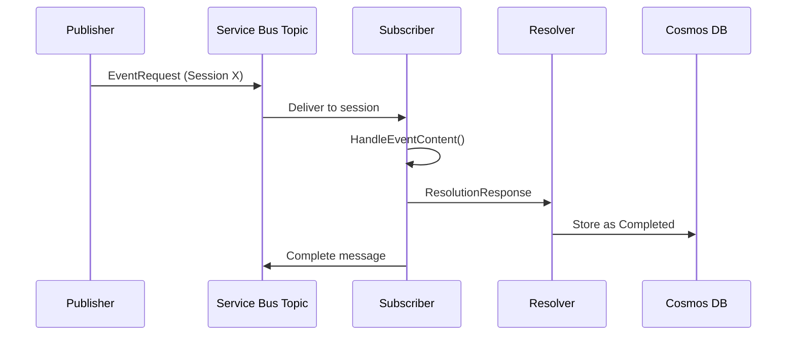
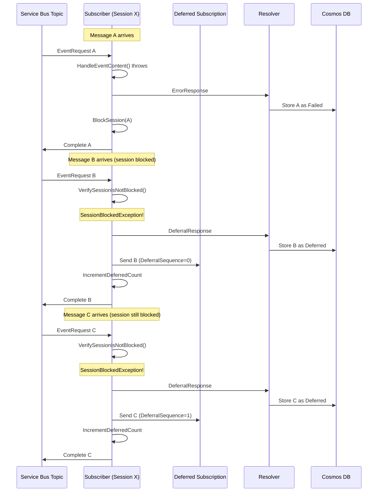
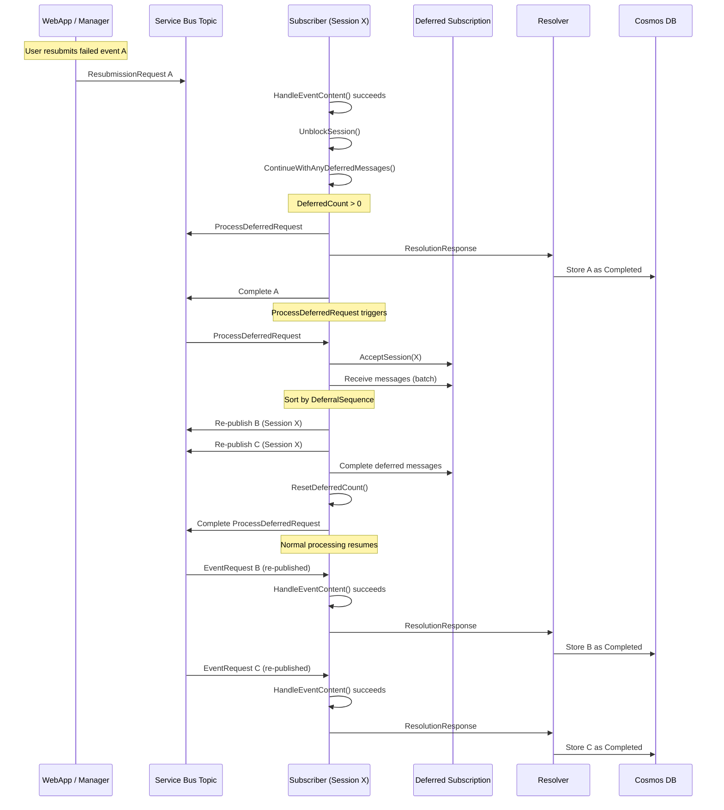

# Deferred Message Processing

This document explains how the platform preserves message ordering when a message fails, using Service Bus sessions and a deferred message subscription.

## Why Deferrals Exist

Service Bus **sessions** guarantee ordered delivery: messages within a session are processed one at a time, in order. When a message fails, all subsequent messages in that session must be held back — otherwise they'd be processed out of order or against stale state.

The deferral mechanism solves this by:
1. **Blocking** the session when a message fails
2. **Deferring** subsequent messages to a separate subscription
3. **Re-publishing** them in FIFO order once the blocking event is resolved

## Session State

Each Service Bus session maintains state (`SessionState` in `src/NimBus.ServiceBus/SessionState.cs`):

| Field | Purpose |
|-------|---------|
| `BlockedByEventId` | The EventId that caused the session to block (`null` = unblocked) |
| `DeferredCount` | Number of messages in the deferred subscription |
| `NextDeferralSequence` | Counter for ordering deferred messages (FIFO) |
| `DeferredSequenceNumbers` | Legacy: in-session deferred message sequence numbers |

## Message Flow Diagrams

### Normal Processing (Happy Path)

### Failure and Deferral

### Recovery: Resubmit / Retry / Skip

## How It Works Step by Step

### 1. A Message Fails

When `HandleEventContent()` throws a non-transient exception in `StrictMessageHandler`:

1. An `ErrorResponse` is sent to the Resolver (records event as **Failed**)
2. `BlockSession()` sets `BlockedByEventId` to this event's ID in session state
3. The message is completed (removed from the queue)

### 2. Subsequent Messages Are Deferred

When the next message arrives for the blocked session:

1. `VerifySessionIsNotBlocked()` checks `BlockedByEventId`
2. `SessionBlockedException` is thrown
3. A `DeferralResponse` is sent to the Resolver (records event as **Deferred**)
4. `DeferMessageToSubscription()`:
   - Gets next `DeferralSequence` number (for FIFO ordering)
   - Sends message to the **"Deferred"** subscription via `SendToDeferredSubscription()`
   - Increments `DeferredCount` in session state
   - Completes the original message

### 3. The Session Unblocks

When the failed event is resolved (resubmit, retry, or skip succeeds):

1. `UnblockSession()` clears `BlockedByEventId`
2. `ContinueWithAnyDeferredMessages()` checks:
   - **Legacy path**: Are there `DeferredSequenceNumbers` in session state? Send `ContinuationRequest`
   - **Modern path**: Is `DeferredCount > 0`? Send `ProcessDeferredRequest`

### 4. Deferred Messages Are Re-Published

`DeferredMessageProcessor.ProcessDeferredMessagesAsync()` (`src/NimBus.ServiceBus/DeferredMessageProcessor.cs`):

1. Accepts the session from the deferred subscription (`AcceptSessionAsync`)
2. Receives messages in batches (up to 100)
3. **Sorts by `DeferralSequence`** to maintain FIFO order
4. Re-publishes each to the main topic with the original `SessionId`
5. Completes deferred messages from the subscription
6. `ResetDeferredCount()` sets count back to 0

Re-published messages then flow through normal processing in their original order.

## Legacy vs Modern Pattern

The codebase supports two deferral approaches for backward compatibility:

| | Legacy (ContinuationRequest) | Modern (ProcessDeferredRequest) |
|---|---|---|
| **Storage** | Deferred in-session (Service Bus native defer) | Separate "Deferred" subscription |
| **Re-processing** | One message at a time via `ContinuationRequest` chain | Batch via `DeferredMessageProcessor` |
| **Ordering** | Session state `DeferredSequenceNumbers` | `DeferralSequence` message property |
| **Tracked by** | `DeferredSequenceNumbers` in session state | `DeferredCount` in session state |

`ContinueWithAnyDeferredMessages()` checks the legacy path first, then falls back to the modern path.

## Key Source Files

| Component | File |
|-----------|------|
| Handler logic (block, defer, unblock, continue) | `src/NimBus.Core/Messages/StrictMessageHandler.cs` |
| Session state model | `src/NimBus.ServiceBus/SessionState.cs` |
| Session state operations | `src/NimBus.ServiceBus/MessageContext.cs` |
| Deferral/continuation responses | `src/NimBus.Core/Messages/ResponseService.cs` |
| Batch re-processing | `src/NimBus.ServiceBus/DeferredMessageProcessor.cs` |
| Resolution state tracking | `src/NimBus.Resolver/Services/ResolverService.cs` |
| SessionBlockedException | `src/NimBus.Core/Messages/Exceptions/SessionBlockedException.cs` |
| Retry policy evaluation | `src/NimBus.Core/Messages/RetryPolicy.cs` |

## Test Coverage

The deferred message flow is covered by dedicated tests:

| Category | Key Tests |
|----------|-----------|
| Session blocking | `HandleEventRequest_WhenEventHandlerThrows_BlocksSession` |
| Deferring to subscription | `HandleEventRequest_WhenSessionIsBlocked_SendsToDeferredSubscription` |
| Deferral sequencing | `HandleEventRequest_WhenSessionBlocked_GetsDeferralSequence` |
| Deferred count tracking | `HandleEventRequest_WhenSessionBlocked_IncrementsDeferredCount` |
| Unblocking | `HandleSkipRequest_WhenSessionIsBlockedByThis_UnblocksSession` |
| Legacy continuation | `HandleContinuationRequest_WhenEventIsNextDeferred_InvokesEventHandler` |
| Modern batch processing | `HandleProcessDeferredRequest_WhenCalled_ProcessesDeferredAndResetsCount` |
| Recovery triggers | `HandleResubmissionRequest_WhenSucceedsAndDeferredCountGtZero_SendsProcessDeferredRequest` |

Additional tests exist in `tests/NimBus.ServiceBus.Tests/` for session state serialization and deferred message operations. End-to-end tests in `tests/NimBus.EndToEnd.Tests/` verify the complete deferral workflow including retry backoff, resubmission, and metadata integrity.
