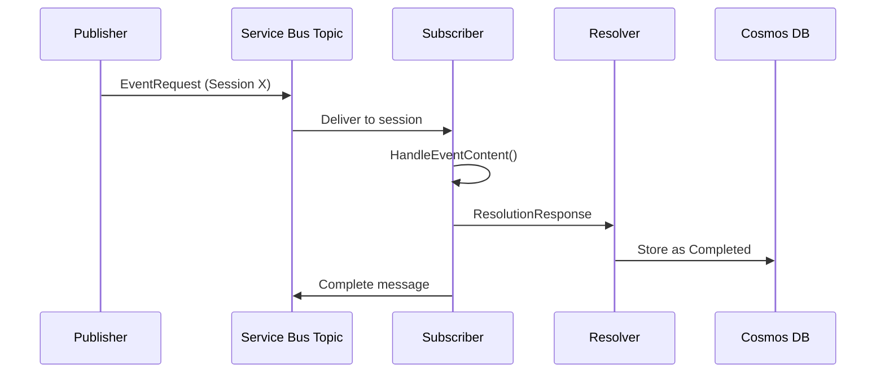
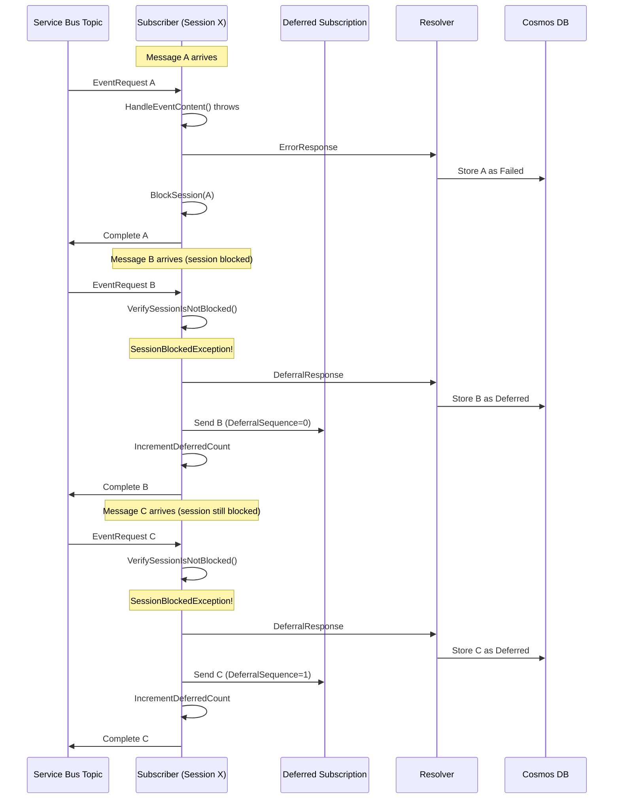
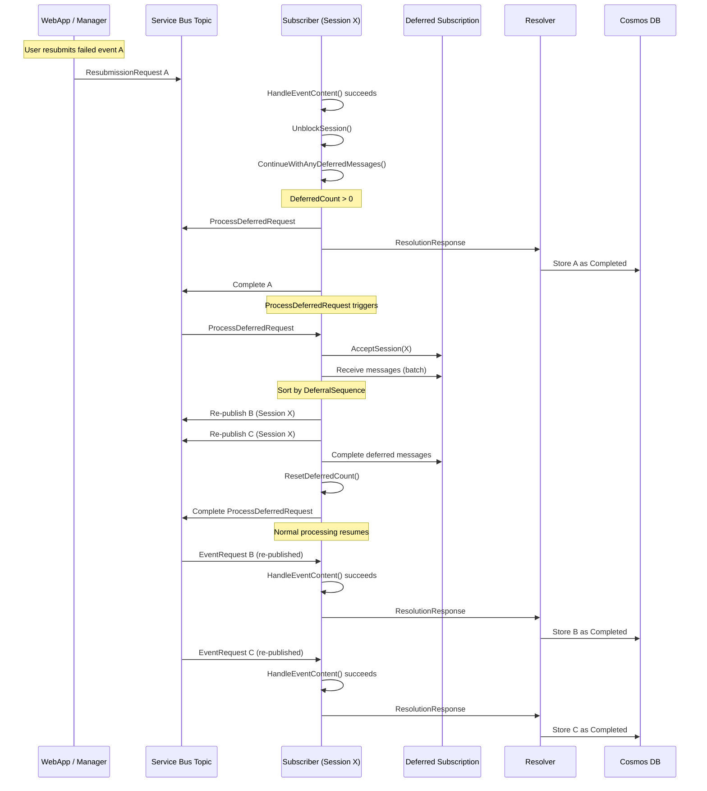

# Deferred Message Processing

This document explains how the platform preserves message ordering when a message fails, using Service Bus sessions and a deferred message subscription.

## Why Deferrals Exist

Service Bus **sessions** guarantee ordered delivery: messages within a session are processed one at a time, in order. When a message fails, all subsequent messages in that session must be held back — otherwise they'd be processed out of order or against stale state.

The deferral mechanism solves this by:
1. **Blocking** the session when a message fails
2. **Deferring** subsequent messages to a separate subscription
3. **Re-publishing** them in FIFO order once the blocking event is resolved

## Session State

Each Service Bus session maintains state (`SessionState` in `src/NimBus.ServiceBus/SessionState.cs`):

| Field | Purpose |
|-------|---------|
| `BlockedByEventId` | The EventId that caused the session to block (`null` = unblocked) |
| `DeferredCount` | Number of messages in the deferred subscription |
| `NextDeferralSequence` | Counter for ordering deferred messages (FIFO) |
| `DeferredSequenceNumbers` | Legacy: in-session deferred message sequence numbers |

## Message Flow Diagrams

### Normal Processing (Happy Path)

```mermaid
sequenceDiagram
    participant P as Publisher
    participant T as Service Bus Topic
    participant S as Subscriber
    participant R as Resolver
    participant DB as Cosmos DB

    P->>T: EventRequest (Session X)
    T->>S: Deliver to session
    S->>S: HandleEventContent()
    S->>R: ResolutionResponse
    R->>DB: Store as Completed
    S->>T: Complete message
```

### Failure and Deferral

```mermaid
sequenceDiagram
    participant T as Service Bus Topic
    participant S as Subscriber (Session X)
    participant D as Deferred Subscription
    participant R as Resolver
    participant DB as Cosmos DB

    Note over S: Message A arrives
    T->>S: EventRequest A
    S->>S: HandleEventContent() throws
    S->>R: ErrorResponse
    R->>DB: Store A as Failed
    S->>S: BlockSession(A)
    S->>T: Complete A

    Note over S: Message B arrives (session blocked)
    T->>S: EventRequest B
    S->>S: VerifySessionIsNotBlocked()
    Note over S: SessionBlockedException!
    S->>R: DeferralResponse
    R->>DB: Store B as Deferred
    S->>D: Send B (DeferralSequence=0)
    S->>S: IncrementDeferredCount
    S->>T: Complete B

    Note over S: Message C arrives (session still blocked)
    T->>S: EventRequest C
    S->>S: VerifySessionIsNotBlocked()
    Note over S: SessionBlockedException!
    S->>R: DeferralResponse
    R->>DB: Store C as Deferred
    S->>D: Send C (DeferralSequence=1)
    S->>S: IncrementDeferredCount
    S->>T: Complete C
```

### Recovery: Resubmit / Retry / Skip

```mermaid
sequenceDiagram
    participant W as WebApp / Manager
    participant T as Service Bus Topic
    participant S as Subscriber (Session X)
    participant D as Deferred Subscription
    participant R as Resolver
    participant DB as Cosmos DB

    Note over W: User resubmits failed event A
    W->>T: ResubmissionRequest A

    S->>S: HandleEventContent() succeeds
    S->>S: UnblockSession()
    S->>S: ContinueWithAnyDeferredMessages()
    Note over S: DeferredCount > 0
    S->>T: ProcessDeferredRequest
    S->>R: ResolutionResponse
    R->>DB: Store A as Completed
    S->>T: Complete A

    Note over S: ProcessDeferredRequest triggers
    T->>S: ProcessDeferredRequest
    S->>D: AcceptSession(X)
    S->>D: Receive messages (batch)
    Note over S: Sort by DeferralSequence
    S->>T: Re-publish B (Session X)
    S->>T: Re-publish C (Session X)
    S->>D: Complete deferred messages
    S->>S: ResetDeferredCount()
    S->>T: Complete ProcessDeferredRequest

    Note over S: Normal processing resumes
    T->>S: EventRequest B (re-published)
    S->>S: HandleEventContent() succeeds
    S->>R: ResolutionResponse
    R->>DB: Store B as Completed

    T->>S: EventRequest C (re-published)
    S->>S: HandleEventContent() succeeds
    S->>R: ResolutionResponse
    R->>DB: Store C as Completed
```

## How It Works Step by Step

### 1. A Message Fails

When `HandleEventContent()` throws a non-transient exception in `StrictMessageHandler`:

1. An `ErrorResponse` is sent to the Resolver (records event as **Failed**)
2. `BlockSession()` sets `BlockedByEventId` to this event's ID in session state
3. The message is completed (removed from the queue)

### 2. Subsequent Messages Are Deferred

When the next message arrives for the blocked session:

1. `VerifySessionIsNotBlocked()` checks `BlockedByEventId`
2. `SessionBlockedException` is thrown
3. A `DeferralResponse` is sent to the Resolver (records event as **Deferred**)
4. `DeferMessageToSubscription()`:
   - Gets next `DeferralSequence` number (for FIFO ordering)
   - Sends message to the **"Deferred"** subscription via `SendToDeferredSubscription()`
   - Increments `DeferredCount` in session state
   - Completes the original message

### 3. The Session Unblocks

When the failed event is resolved (resubmit, retry, or skip succeeds):

1. `UnblockSession()` clears `BlockedByEventId`
2. `ContinueWithAnyDeferredMessages()` checks whether `DeferredCount > 0` and, if so,
   sends a `ProcessDeferredRequest`

### 4. Deferred Messages Are Re-Published

`DeferredMessageProcessor.ProcessDeferredMessagesAsync()` (`src/NimBus.ServiceBus/DeferredMessageProcessor.cs`):

1. Accepts the session from the deferred subscription (`AcceptSessionAsync`)
2. Receives messages in batches (up to 100)
3. **Sorts by `DeferralSequence`** to maintain FIFO order
4. Re-publishes each to the main topic with the original `SessionId`
5. Completes deferred messages from the subscription
6. `ResetDeferredCount()` sets count back to 0

Re-published messages then flow through normal processing in their original order.

## A tracking row is Deferred but the broker message is missing

Open the event details page and choose **Check deferred message**. The recovery panel
shows two independent observations:

- **Recorded outcome**: the latest stored terminal response for this event, endpoint,
  and session, including its message ID and time. A later attempt or deferral is flagged;
  an earlier completion does not prove that the later attempt completed.
- **Broker presence**: a read-only peek of the endpoint and Deferred subscriptions,
  including their ordinary and transfer dead-letter queues. An explicit zero transfer
  dead-letter count from the administration API also establishes an empty queue,
  supporting emulators that cannot peek that subqueue. Each scan is bounded to
  2,000 messages, with a 20-second budget for the inspection. Errors and incomplete scans
  are **Unknown**, never proof of absence.

If no match is found and the Deferred record has been unchanged for at least 15 minutes,
an endpoint Contributor can choose **Skip tracking record**, enter a reason, and confirm.
The server repeats the inspection and conditionally changes the inspected row to Skipped.
If another writer has changed the row, the skip is refused. The event disappears from the
Deferred list while its history and an operator audit remain available under normal
retention rules. An audit-write failure is reported separately from the successful skip.

This action changes tracking only: it does not send a SkipRequest, remove broker messages,
unblock a session, or cancel a running handler. Peeking is a point-in-time observation;
scheduled topic messages and future replays can still arrive. Missing broker messages alone
do not establish successful business processing. See [Service Bus message browsing](https://learn.microsoft.com/en-us/azure/service-bus-messaging/message-browsing).

## Legacy Service Bus deferral (removed in v4.0.0)

Before the Deferred subscription existed, NimBus parked blocked messages with the Azure
Service Bus defer API and recorded their sequence numbers in session state
(`DeferredSequenceNumbers`), draining them one at a time with a `ContinuationRequest`
chain. v4.0.0 removed that drain (spec 027 §3):

- `SessionState.DeferredSequenceNumbers` is obsolete. It still round-trips, but it no
  longer blocks the session.
- An incoming `ContinuationRequest` is logged and completed without processing.
- A namespace that ever used the old defer API should drain any legacy Service Bus
  deferred messages with the `nb` CLI before upgrading.

## Key Source Files

| Component | File |
|-----------|------|
| Handler logic (block, defer, unblock, continue) | `src/NimBus.Core/Messages/StrictMessageHandler.cs` |
| Session state model | `src/NimBus.ServiceBus/SessionState.cs` |
| Session state operations | `src/NimBus.ServiceBus/MessageContext.cs` |
| Deferral/continuation responses | `src/NimBus.Core/Messages/ResponseService.cs` |
| Batch re-processing | `src/NimBus.ServiceBus/DeferredMessageProcessor.cs` |
| Resolution state tracking | `src/NimBus.Resolver/Services/ResolverService.cs` |
| SessionBlockedException | `src/NimBus.Core/Messages/Exceptions/SessionBlockedException.cs` |
| Retry policy evaluation | `src/NimBus.Core/Messages/RetryPolicy.cs` |

## Test Coverage

The deferred message flow is covered by dedicated tests:

| Category | Key Tests |
|----------|-----------|
| Session blocking | `HandleEventRequest_WhenEventHandlerThrows_BlocksSession` |
| Deferring to subscription | `HandleEventRequest_WhenSessionIsBlocked_SendsToDeferredSubscription` |
| Deferral sequencing | `HandleEventRequest_WhenSessionBlocked_GetsDeferralSequence` |
| Deferred count tracking | `HandleEventRequest_WhenSessionBlocked_IncrementsDeferredCount` |
| Unblocking | `HandleSkipRequest_WhenSessionIsBlockedByThis_UnblocksSession` |
| Legacy continuation | `HandleContinuationRequest_CompletesLegacyRequestWithoutProcessing` |
| Modern batch processing | `HandleProcessDeferredRequest_WhenCalled_ProcessesDeferredAndResetsCount` |
| Recovery triggers | `HandleResubmissionRequest_WhenSucceedsAndDeferredCountGtZero_SendsProcessDeferredRequest` |

Additional tests exist in `tests/NimBus.ServiceBus.Tests/` for session state serialization and deferred message operations. End-to-end tests in `tests/NimBus.EndToEnd.Tests/` verify the complete deferral workflow including retry backoff, resubmission, and metadata integrity.
