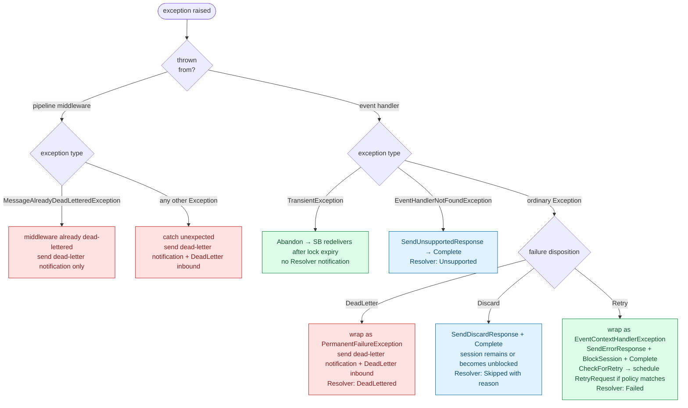
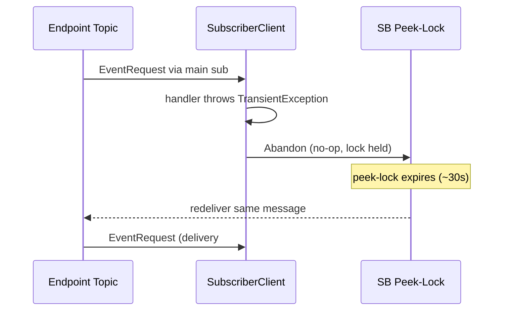
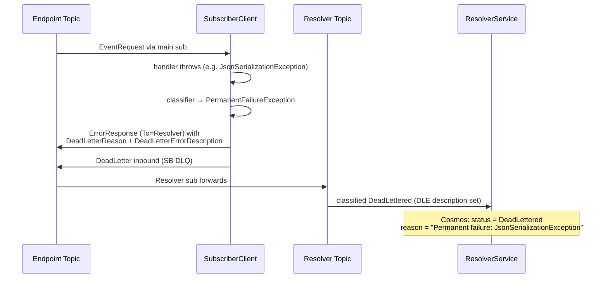
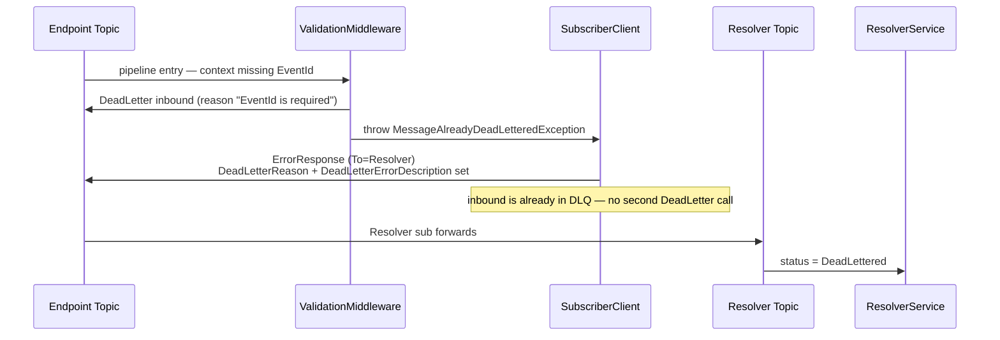

# Error Handling

How NimBus classifies and routes failures from a subscriber adapter — what each
exception type does, what the inbound message ends up as, and what the Resolver
records.

This is the reference for adapter authors. For the broader set of message
flows see [`message-flows.md`](message-flows.md); for the pipeline mechanics
see [`pipeline-middleware.md`](pipeline-middleware.md).

## Where errors happen

Two distinct call sites can throw inside the subscriber:

- **Pipeline middleware** — registered via `AddPipelineBehavior<T>()`. Wraps the
  terminal handler. Exceptions here are *not* wrapped — they bubble up raw.
- **Event handler** — your `IEventHandler<TEvent>.Handle(...)`. Exceptions here
  are caught inside `StrictMessageHandler.HandleEventContent` and either
  re-thrown (`TransientException`, `EventHandlerNotFoundException`) or wrapped
  according to the configured `IFailureDispositionClassifier`. The obsolete
  `IPermanentFailureClassifier` remains supported as a compatibility bridge.

## Decision tree



## Exception classification

| Exception | Origin | Inbound | Resolver | Adapter sees |
|---|---|---|---|---|
| `TransientException` | Handler | **Abandon** (lock expires, SB redelivers) | — | Same message redelivered; lifecycle observers fire `OnFailed` only |
| `EventHandlerNotFoundException` | Handler | Complete | `Unsupported` | One-shot — there's no handler, so nothing replays |
| `SessionBlockedException` | Handler — internal, raised when session is already blocked | Complete + parked on `Deferred` sub | `Deferred` | Will replay when session unblocks (resubmit / skip / retry success) |
| `EventContextHandlerException` (auto-wrap for the `Retry` disposition) | Handler | BlockSession + Complete | `Failed` | Retry scheduled if `IRetryPolicyProvider` matches; otherwise stays Failed until operator action |
| `PermanentFailureException` (auto-wrap for the `DeadLetter` disposition) | Handler | **DeadLetter** + notify Resolver | `DeadLettered` | No retry. SB DLQ + audit trail |
| Discarded handler exception (`Discard` disposition) | Handler | Complete; unblock first when processing a retry/resubmission | `Skipped`, with exception and classifier reason | No retry or DLQ; deferred session work continues |
| `MessageAlreadyDeadLetteredException` | Middleware (e.g. `ValidationMiddleware`) | already DeadLettered by middleware → notify Resolver only | `DeadLettered` | Validation failures, missing critical fields |
| Any other `Exception` from middleware | Middleware | **DeadLetter** + notify Resolver | `DeadLettered` | Includes raw user-middleware throws (e.g. demo's `ServiceModeMiddleware`) |

`DeadLettered` and `Failed` records both fall under the **Failed** column on the
endpoint dashboard (`Mapper.cs` aggregates `state.FailedCount + state.DeadletterCount`).
`Pending` and `Unsupported` both fall under **Pending** in the same view.

## Failure disposition matrix

| Disposition | Inbound message | Session | Resolver audit trail |
|---|---|---|---|
| `Retry` | Sends `ErrorResponse`, completes the inbound message, and schedules `RetryRequest` when policy and budget allow | Blocks after the initial failure; retry success or operator action releases it | `Failed`, including the handler error |
| `DeadLetter` | Dead-letters immediately; no retry budget is consumed | Does not create a retry block; an already-blocked retry session still requires operator action | `DeadLettered`, including the dead-letter reason |
| `Discard` | Sends an enriched `SkipResponse` and completes; never retries or enters the DLQ | Never leaves the session blocked; retry/resubmission discard unblocks and resumes deferred work | `Skipped`, with the exception type, message, and classifier name |

With no `IFailureDispositionClassifier` registered, NimBus preserves its prior
behavior: a registered legacy permanent-failure classifier maps permanent
exceptions to `DeadLetter`; every other ordinary exception maps to `Retry`.

> **Note on PendingHandoff.** `IEventHandlerContext.MarkPendingHandoff(...)` is
> **not** an exception path. The handler returns normally and
> `StrictMessageHandler` reads `messageContext.HandlerOutcome` after the
> handler returns to decide whether to send a `PendingHandoffResponse` and
> block the session. The outcome maps to `ResolutionStatus = Pending` with
> `PendingSubStatus = "Handoff"` — it shows up in the Pending column, not
> Failed. Settlement is driven by two new control messages
> (`HandoffCompletedRequest` / `HandoffFailedRequest`) issued by
> `IManagerClient.CompleteHandoff` / `FailHandoff`, which DO NOT re-invoke
> the user handler. See [ADR-012](adr/012-pending-handoff.md) and the
> [PendingHandoff flow](message-flows.md#13-pendinghandoff-async-completion)
> in the message-flows reference.

## Flows

### Transient failure (abandon + redeliver)

The handler raises `TransientException` to signal a recoverable downstream
issue (network blip, throttling, deadlock). NimBus does not call SB Abandon
explicitly — `MessageContext.Abandon` is a no-op so the SB peek-lock can
expire on its own and the message is redelivered. No notification reaches the
Resolver, so audit visibility is intentionally minimal for this path.



### Permanent failure (`DeadLetter` → dead-letter)

The handler throws an exception that the `IFailureDispositionClassifier` maps
to `DeadLetter`. For backward compatibility, a registered
`IPermanentFailureClassifier` is bridged to the same disposition (the default
legacy classifier matches `FormatException`,
`InvalidCastException`, `ArgumentException`, `NotSupportedException`, plus
type names containing `Serialization` / `Deserialization` / `Validation`).
`StrictMessageHandler.HandleEventContent` wraps it in
`PermanentFailureException`. The base `MessageHandler` dead-letters the
inbound message and notifies the Resolver — there is no retry.

The SDK JSON handler also normalizes missing, `null`, malformed, and
over-depth payloads directly to `PermanentFailureException`. JSON is read with
an isolated safe configuration (`TypeNameHandling.None`, maximum depth 32), so
ambient Newtonsoft defaults cannot enable polymorphic type construction. These
wire-format failures bypass retry even when a retry policy would otherwise
match.



### Discarded failure (complete + continue)

Use `Discard` for a known poison message that cannot succeed and does not need
operator DLQ handling. NimBus records an enriched `SkipResponse`, completes the
inbound message, and returns normally so lifecycle observers receive
`OnMessageCompleted`. It sends no `ErrorResponse` or `RetryRequest` and performs
no dead-letter operation. If the disposition is selected during retry or
resubmission, NimBus unblocks the session and resumes its deferred messages
before completing the discarded message.

### Validation rejection (middleware dead-lettered)

`ValidationMiddleware` rejects messages with missing critical fields
(`EventId`, or `EventTypeId` on an `EventRequest`). It dead-letters the
inbound directly and throws `MessageAlreadyDeadLetteredException` so the
base handler skips a second DeadLetter call but still sends the Resolver
notification.



### Unsupported event type

The receiving endpoint has no `IEventHandler` registered for the inbound
`EventTypeId`. Not a failure of the message — a topology mistake at the
catalog. The message is acked (Complete), no session block, and the Resolver
records `Unsupported`.

See Flow 9 in [`message-flows.md`](message-flows.md#9-unsupported-event-type).

For native `EventRequest` messages, the `EventTypeId` application property is
authoritative. Messages produced before that property existed may fall back to
the body value. If both values are present and disagree, or a known routed type
has an unreadable body, NimBus treats the message as a permanent malformed
message and dead-letters it without invoking the user handler.

### Handler failure with retry policy

The handler throws something the classifier does *not* mark permanent. NimBus
wraps it as `EventContextHandlerException`, sends `ErrorResponse` to the
Resolver (status `Failed`), blocks the session so siblings defer, completes
the inbound, then schedules a `RetryRequest` if a policy from
`IRetryPolicyProvider` matches.

See Flow 6 in [`message-flows.md`](message-flows.md#6-retry-automatic).

### Handler failure with no retry policy

Same as above but `CheckForRetry` finds no matching policy. The inbound is
completed, the Resolver records `Failed`, and the session stays blocked
until the operator resubmits or skips the failed event from the Manager UI.

See Flow 2 in [`message-flows.md`](message-flows.md#2-handler-failure--session-blocked).

### Dead-letter notification routing

Every dead-letter path above (`PermanentFailureException`,
`MessageAlreadyDeadLetteredException`, raw middleware throw) calls
`IResponseService.SendDeadLetterResponse` before the actual SB DeadLetter.
The notification is an `ErrorResponse`-typed message with the DLQ properties
populated; the Resolver short-circuits on `DeadLetterErrorDescription` and
classifies the audit record as `DeadLettered` regardless of `MessageType`.

See Flow 12 in [`message-flows.md`](message-flows.md#12-dead-letter-routed-to-resolver).
The notification is best-effort — if the publish fails, the SB DLQ remains
the source of truth and operators can recover via the Manager.

## Adapter author guidance

### When to throw what

| Situation | Throw |
|---|---|
| Downstream API timed out / connection refused / 503 | `TransientException` — let SB redeliver. Idempotent handlers are required for this to be safe. |
| Downstream API returned 400 with a structural problem the message can't fix on retry | Return `DeadLetter` from `IFailureDispositionClassifier` when operators need the DLQ payload; return `Discard` when a skipped audit record is sufficient |
| Downstream API returned 500 / 502 transient | Throw a regular `Exception` — recorded as `Failed`, retried per policy |
| Known poison event/version that should neither retry nor create DLQ noise | Return `Discard`; NimBus records `Skipped`, completes, and lets the session continue |
| Don't have a handler for this event type | Don't catch `EventHandlerNotFoundException` — let it bubble; you'll see it as `Unsupported` |

### When NOT to swallow

A pipeline middleware that catches and swallows handler exceptions makes the
message look successful (`SendResolutionResponse` fires). This breaks the
audit trail. Re-throw unless you're explicitly compensating (e.g.
short-circuit success for known idempotent no-ops).

### Configuring failure dispositions

```csharp
builder.Services.AddNimBusSubscriber("billingendpoint", subscriber =>
{
    subscriber.WithFailureDispositions(new AdapterFailureDispositionClassifier());
});

sealed class AdapterFailureDispositionClassifier : IFailureDispositionClassifier
{
    public FailureDisposition Classify(
        Exception exception,
        string eventTypeId,
        string? endpointName) => exception switch
    {
        KnownBadEventVersionException => FailureDisposition.Discard,
        MyDomain.InvariantViolationException => FailureDisposition.DeadLetter,
        _ => FailureDisposition.Retry,
    };
}
```

`IPermanentFailureClassifier` is obsolete but remains functional. When no new
classifier is registered, its `true` result maps to `DeadLetter`; `false` maps
to `Retry`. Registering `IFailureDispositionClassifier` takes precedence.

### Configuring retry

```csharp
builder.Services.AddNimBusSubscriber("billingendpoint", sub =>
{
    sub.AddHandler<OrderPlaced, OrderPlacedHandler>();
    sub.ConfigureRetryPolicies(policies =>
    {
        policies.AddDefaultPolicy(new RetryPolicy
        {
            MaxRetries = 3,
            Strategy   = BackoffStrategy.Exponential,
            BaseDelay  = TimeSpan.FromSeconds(5),
            MaxDelay   = TimeSpan.FromMinutes(5),
            Jitter     = JitterMode.Bounded,
            BoundedJitterFactor = 0.25,
        });
    });
});
```

Jitter spreads retries that would otherwise use the same calculated backoff
delay `d`:

- `JitterMode.None` is the default and keeps the deterministic delay unchanged.
- `JitterMode.Full` selects a delay uniformly from `[d, 2d)`.
- `JitterMode.Bounded` selects `d * (1 + U[0, factor))`; the default factor of
  `0.25` produces delays from `d` up to (but not including) `1.25d`.

`MaxDelay` is applied after jitter. Bounded jitter is useful when retry timing
must stay close to the configured backoff; full jitter provides a wider spread
when many sessions are likely to fail together.

Without a retry policy, handler failures stay in `Failed` until an operator
resubmits or skips them — there is no implicit retry.

### Custom middleware that needs to dead-letter

If you implement middleware that should reject a message outright (rather
than throwing into the retry path), call
`context.DeadLetter(reason, exception)` yourself and throw
`MessageAlreadyDeadLetteredException` so the base handler skips a second
DeadLetter and emits the Resolver notification. `ValidationMiddleware` is
the canonical example.

## Lifecycle observer hooks

For passive observation (alerting, metrics) without altering the flow:

| Observer call | Fires for |
|---|---|
| `OnMessageReceived` | every message before pipeline runs |
| `OnMessageCompleted` | success and discard paths — pipeline returns without throwing |
| `OnMessageFailed` | every catch branch in `MessageHandler.Handle` (transient, permanent, validation-rejected, unexpected) |
| `OnMessageDeadLettered` | only when the message ends up in DLQ — fires *after* the SB DeadLetter call |

Use the lifecycle observer for fan-out to channels like Slack/PagerDuty;
don't use it to gate processing — register a pipeline behavior for that.

## Where to look in source

| Concern | File |
|---|---|
| Catch ladder for the receiver | `src/NimBus.Core/Messages/MessageHandler.cs` |
| Handler-throw to retry/error mapping | `src/NimBus.Core/Messages/StrictMessageHandler.cs` (`HandleEventRequest`, `HandleEventContent`, `CheckForRetry`) |
| Failure disposition contract and legacy bridge | `src/NimBus.Core/Messages/IFailureDispositionClassifier.cs`, `DefaultFailureDispositionClassifier.cs` |
| Discard/dead-letter response shape | `src/NimBus.Core/Messages/ResponseService.cs` (`SendDiscardResponse`, `SendDeadLetterResponse`) |
| Validation middleware | `src/NimBus.Core/Pipeline/ValidationMiddleware.cs` |
| Resolver classification | `src/NimBus.Resolver/Services/ResolverService.cs` (`GetResultingStatus`) |
