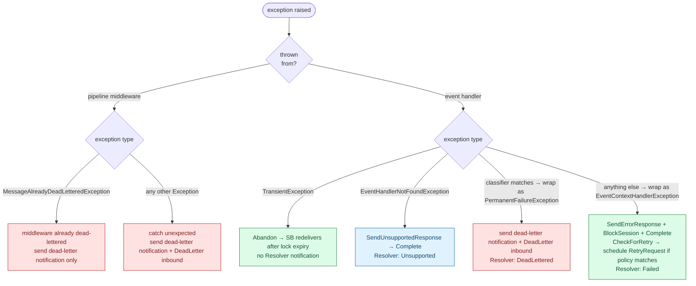
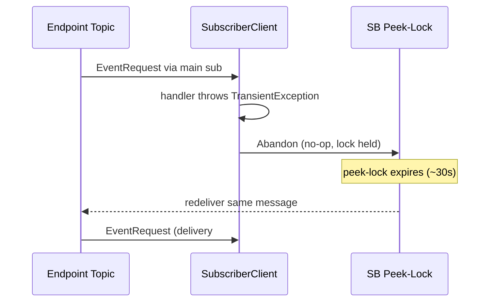
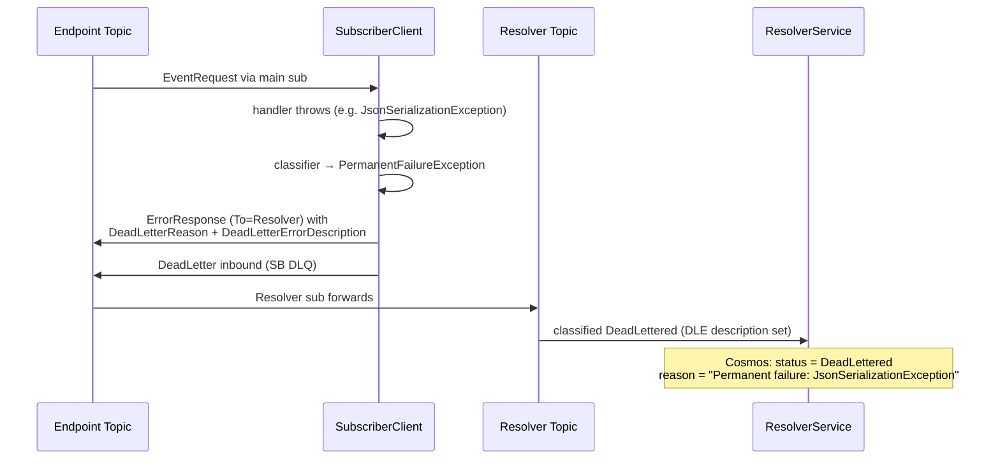
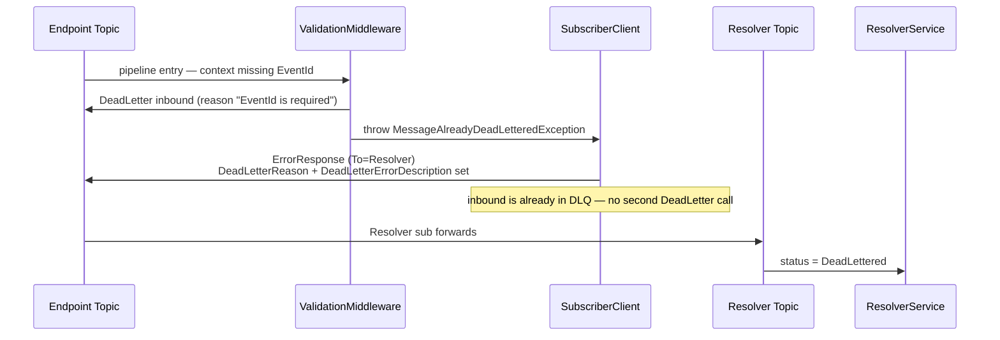

# Error Handling

How NimBus classifies and routes failures from a subscriber adapter — what each
exception type does, what the inbound message ends up as, and what the Resolver
records.

This is the reference for adapter authors. For the broader set of message
flows see [`message-flows.md`](message-flows.md); for the pipeline mechanics
see [`pipeline-middleware.md`](pipeline-middleware.md).

## Where errors happen

Two distinct call sites can throw inside the subscriber:

- **Pipeline middleware** — registered via `AddPipelineBehavior<T>()`. Wraps the
  terminal handler. Exceptions here are *not* wrapped — they bubble up raw.
- **Event handler** — your `IEventHandler<TEvent>.Handle(...)`. Exceptions here
  are caught inside `StrictMessageHandler.HandleEventContent` and either
  re-thrown (`TransientException`, `EventHandlerNotFoundException`) or wrapped
  in `EventContextHandlerException` (or `PermanentFailureException` if the
  configured `IPermanentFailureClassifier` matches).

## Decision tree



## Exception classification

| Exception | Origin | Inbound | Resolver | Adapter sees |
|---|---|---|---|---|
| `TransientException` | Handler | **Abandon** (lock expires, SB redelivers) | — | Same message redelivered; lifecycle observers fire `OnFailed` only |
| `EventHandlerNotFoundException` | Handler | Complete | `Unsupported` | One-shot — there's no handler, so nothing replays |
| `SessionBlockedException` | Handler — internal, raised when session is already blocked | Complete + parked on `Deferred` sub | `Deferred` | Will replay when session unblocks (resubmit / skip / retry success) |
| `EventContextHandlerException` (auto-wrap of any non-classified `Exception` from handler) | Handler | BlockSession + Complete | `Failed` | Retry scheduled if `IRetryPolicyProvider` matches; otherwise stays Failed until operator action |
| `PermanentFailureException` (auto-wrap when `IPermanentFailureClassifier` matches) | Handler | **DeadLetter** + notify Resolver | `DeadLettered` | No retry. SB DLQ + Cosmos audit |
| `MessageAlreadyDeadLetteredException` | Middleware (e.g. `ValidationMiddleware`) | already DeadLettered by middleware → notify Resolver only | `DeadLettered` | Validation failures, missing critical fields |
| Any other `Exception` from middleware | Middleware | **DeadLetter** + notify Resolver | `DeadLettered` | Includes raw user-middleware throws (e.g. demo's `ServiceModeMiddleware`) |

`DeadLettered` and `Failed` records both fall under the **Failed** column on the
endpoint dashboard (`Mapper.cs` aggregates `state.FailedCount + state.DeadletterCount`).
`Pending` and `Unsupported` both fall under **Pending** in the same view.

## Flows

### Transient failure (abandon + redeliver)

The handler raises `TransientException` to signal a recoverable downstream
issue (network blip, throttling, deadlock). NimBus does not call SB Abandon
explicitly — `MessageContext.Abandon` is a no-op so the SB peek-lock can
expire on its own and the message is redelivered. No notification reaches the
Resolver, so audit visibility is intentionally minimal for this path.



### Permanent failure (classifier match → dead-letter)

The handler throws an exception type the `IPermanentFailureClassifier`
considers permanent (default classifier matches `FormatException`,
`InvalidCastException`, `ArgumentException`, `NotSupportedException`, plus
type names containing `Serialization` / `Deserialization` / `Validation`).
`StrictMessageHandler.HandleEventContent` wraps it in
`PermanentFailureException`. The base `MessageHandler` dead-letters the
inbound message and notifies the Resolver — there is no retry.



### Validation rejection (middleware dead-lettered)

`ValidationMiddleware` rejects messages with missing critical fields
(`EventId`, or `EventTypeId` on an `EventRequest`). It dead-letters the
inbound directly and throws `MessageAlreadyDeadLetteredException` so the
base handler skips a second DeadLetter call but still sends the Resolver
notification.



### Unsupported event type

The receiving endpoint has no `IEventHandler` registered for the inbound
`EventTypeId`. Not a failure of the message — a topology mistake at the
catalog. The message is acked (Complete), no session block, and the Resolver
records `Unsupported`.

See Flow 9 in [`message-flows.md`](message-flows.md#9-unsupported-event-type).

### Handler failure with retry policy

The handler throws something the classifier does *not* mark permanent. NimBus
wraps it as `EventContextHandlerException`, sends `ErrorResponse` to the
Resolver (status `Failed`), blocks the session so siblings defer, completes
the inbound, then schedules a `RetryRequest` if a policy from
`IRetryPolicyProvider` matches.

See Flow 6 in [`message-flows.md`](message-flows.md#6-retry-automatic).

### Handler failure with no retry policy

Same as above but `CheckForRetry` finds no matching policy. The inbound is
completed, the Resolver records `Failed`, and the session stays blocked
until the operator resubmits or skips the failed event from the Manager UI.

See Flow 2 in [`message-flows.md`](message-flows.md#2-handler-failure--session-blocked).

### Dead-letter notification routing

Every dead-letter path above (`PermanentFailureException`,
`MessageAlreadyDeadLetteredException`, raw middleware throw) calls
`IResponseService.SendDeadLetterResponse` before the actual SB DeadLetter.
The notification is an `ErrorResponse`-typed message with the DLQ properties
populated; the Resolver short-circuits on `DeadLetterErrorDescription` and
classifies the audit record as `DeadLettered` regardless of `MessageType`.

See Flow 12 in [`message-flows.md`](message-flows.md#12-dead-letter-routed-to-resolver).
The notification is best-effort — if the publish fails, the SB DLQ remains
the source of truth and operators can recover via the Manager.

## Adapter author guidance

### When to throw what

| Situation | Throw |
|---|---|
| Downstream API timed out / connection refused / 503 | `TransientException` — let SB redeliver. Idempotent handlers are required for this to be safe. |
| Downstream API returned 400 with a structural problem the message can't fix on retry | Throw a permanent type (`FormatException`, `ArgumentException`, etc.) or register your own via `DefaultPermanentFailureClassifier.AddPermanentExceptionType<T>()` — straight to DLQ |
| Downstream API returned 500 / 502 transient | Throw a regular `Exception` — recorded as `Failed`, retried per policy |
| Local validation failure that should never replay | Same as above — the message goes to `Failed` and your retry policy decides. If you really want it dead-lettered immediately, wrap as a permanent type |
| Don't have a handler for this event type | Don't catch `EventHandlerNotFoundException` — let it bubble; you'll see it as `Unsupported` |

### When NOT to swallow

A pipeline middleware that catches and swallows handler exceptions makes the
message look successful (`SendResolutionResponse` fires). This breaks the
audit trail. Re-throw unless you're explicitly compensating (e.g.
short-circuit success for known idempotent no-ops).

### Configuring the classifier

```csharp
builder.Services.AddSingleton<IPermanentFailureClassifier>(_ =>
    new DefaultPermanentFailureClassifier()
        .AddPermanentExceptionType<MyDomain.InvariantViolationException>()
        .AddPermanentExceptionNamePattern("Compliance"));
```

Permanent classification is opt-in for non-default types — without it,
domain exceptions go through the standard retry path.

### Configuring retry

```csharp
builder.Services.AddNimBusSubscriber("billingendpoint", sub =>
{
    sub.AddHandler<OrderPlaced, OrderPlacedHandler>();
    sub.ConfigureRetryPolicies(policies =>
    {
        policies.AddDefaultPolicy(new RetryPolicy
        {
            MaxRetries = 3,
            Strategy   = BackoffStrategy.Exponential,
            BaseDelay  = TimeSpan.FromSeconds(5),
            MaxDelay   = TimeSpan.FromMinutes(5),
        });
    });
});
```

Without a retry policy, handler failures stay in `Failed` until an operator
resubmits or skips them — there is no implicit retry.

### Custom middleware that needs to dead-letter

If you implement middleware that should reject a message outright (rather
than throwing into the retry path), call
`context.DeadLetter(reason, exception)` yourself and throw
`MessageAlreadyDeadLetteredException` so the base handler skips a second
DeadLetter and emits the Resolver notification. `ValidationMiddleware` is
the canonical example.

## Lifecycle observer hooks

For passive observation (alerting, metrics) without altering the flow:

| Observer call | Fires for |
|---|---|
| `OnMessageReceived` | every message before pipeline runs |
| `OnMessageCompleted` | success path — pipeline returns without throwing |
| `OnMessageFailed` | every catch branch in `MessageHandler.Handle` (transient, permanent, validation-rejected, unexpected) |
| `OnMessageDeadLettered` | only when the message ends up in DLQ — fires *after* the SB DeadLetter call |

Use the lifecycle observer for fan-out to channels like Slack/PagerDuty;
don't use it to gate processing — register a pipeline behavior for that.

## Where to look in source

| Concern | File |
|---|---|
| Catch ladder for the receiver | `src/NimBus.Core/Messages/MessageHandler.cs` |
| Handler-throw to retry/error mapping | `src/NimBus.Core/Messages/StrictMessageHandler.cs` (`HandleEventRequest`, `HandleEventContent`, `CheckForRetry`) |
| Default permanent classifier | `src/NimBus.Core/Messages/DefaultPermanentFailureClassifier.cs` |
| Dead-letter response shape | `src/NimBus.Core/Messages/ResponseService.cs` (`SendDeadLetterResponse`) |
| Validation middleware | `src/NimBus.Core/Pipeline/ValidationMiddleware.cs` |
| Resolver classification | `src/NimBus.Resolver/Services/ResolverService.cs` (`GetResultingStatus`) |
