# Message Handling Flows

Complete reference for how messages flow through the NimBus platform's Service Bus topology.

## System Overview

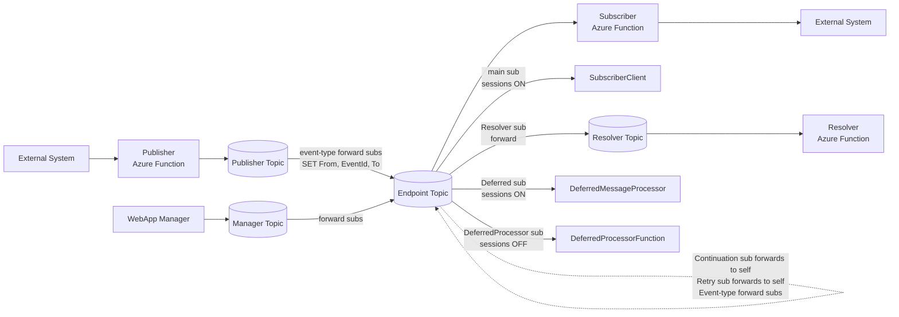

## Topics

| Topic | Purpose | Created by |
|---|---|---|
| `{endpointId}` | One per endpoint (e.g., `storefrontendpoint`, `billingendpoint`). Carries all messages for that endpoint. | Topology provisioner, per endpoint |
| `Resolver` | Central resolution tracking. Receives all response messages. | Topology provisioner, one per platform |
| `Manager` | Management operations. WebApp sends resubmit/skip here. | Topology provisioner, one per platform |

## Subscriptions per Endpoint Topic

Each endpoint topic has these subscriptions:

| Subscription | Sessions | Forward-To | Filter | Action | Consumer |
|---|---|---|---|---|---|
| `{endpointId}` | ON | — | `user.To = '{endpointId}'` | — | **SubscriberClient** (main handler) |
| `Resolver` | OFF | Resolver topic | `user.To = 'Resolver'` | `SET user.From = '{endpointId}'` | (forwarded) |
| `Resolver` (2nd rule) | OFF | Resolver topic | `user.To = '{endpointId}'` | — | (forwarded, for EventRequest tracking) |
| `Continuation` | OFF | self topic | `user.To = 'Continuation'` | `SET user.To = '{endpointId}'; SET user.From = 'Continuation'` | (forwarded back to main sub) |
| `Retry` | OFF | self topic | `user.To = 'Retry'` | `SET user.To = '{endpointId}'; SET user.From = 'Retry'` | (forwarded back to main sub) |
| `Deferred` | ON | — | `user.To = 'Deferred'` | — | **DeferredMessageProcessor** (reads via AcceptSession) |
| `DeferredProcessor` | OFF | — | `user.To = 'DeferredProcessor'` | — | **DeferredProcessorFunction** |
| `{eventTypeId}` | OFF | consuming endpoint topic | `user.EventTypeId = '{eventTypeId}'` | `SET user.From = '{endpointId}'; SET user.EventId = newid(); SET user.To = '{consumerId}'` | (forwarded to consumer) |

### Key Design Points

- **Session-enabled subscriptions** (`{endpointId}`, `Deferred`): guarantee ordered, exclusive delivery per session
- **Forward subscriptions** (`Continuation`, `Retry`): catch messages, rewrite properties, forward back to the same topic — the rewritten `To` then matches the main subscription
- **DeferredProcessor**: NOT session-enabled — it can trigger independently of the main function's session lock
- **Resolver subscription has two rules**: catches both responses (`To = 'Resolver'`) and original EventRequests (`To = '{endpointId}'`) so the Resolver sees the full message history

---

## Message Flows

### 1. Happy Path: Publish → Handle → Complete

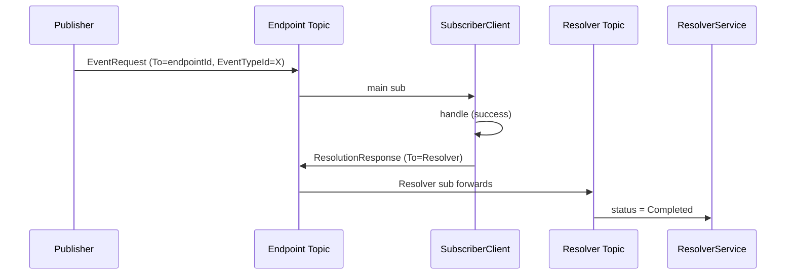

### 2. Handler Failure → Session Blocked

A non-permanent handler exception is wrapped as `EventContextHandlerException`. The session is blocked so siblings defer behind the failed event, the Resolver records `Failed`, and `CheckForRetry` schedules a `RetryRequest` if a policy from `IRetryPolicyProvider` matches the exception. Without a matching policy the event stays Failed until an operator resubmits or skips it.

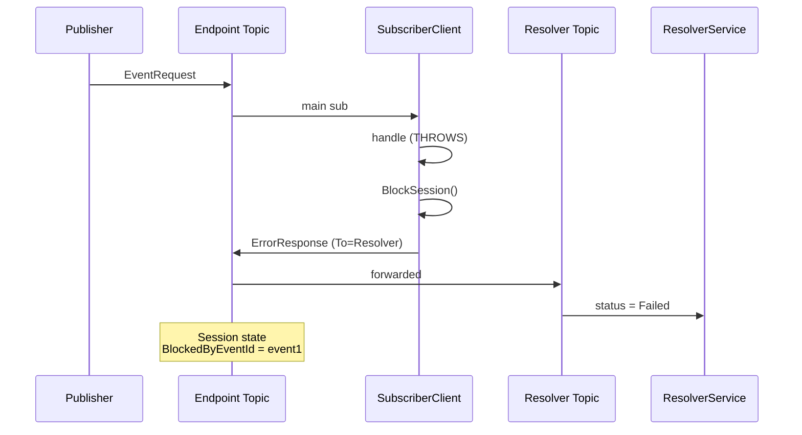

> See [`error-handling.md`](error-handling.md) for how exception types map to this vs. transient redelivery, immediate dead-letter, or unsupported.

### 3. Deferral: Subsequent Messages on Blocked Session

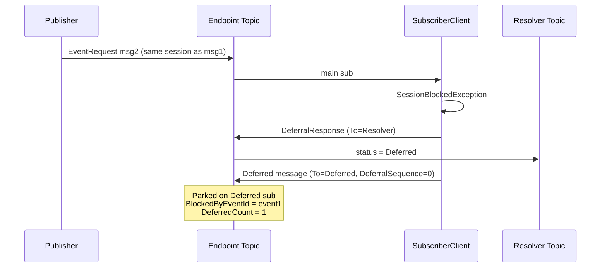

### 4. Resubmission → Unblock → Reprocess Deferred

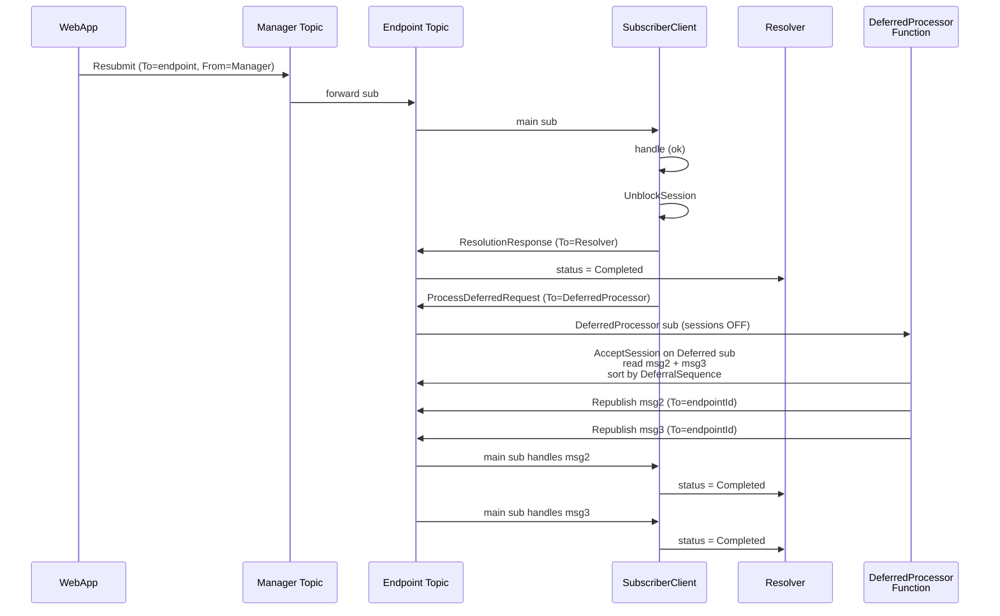

### 5. Skip → Unblock → Reprocess Deferred

Same as resubmission but the failed event is marked as Skipped instead of re-processed:

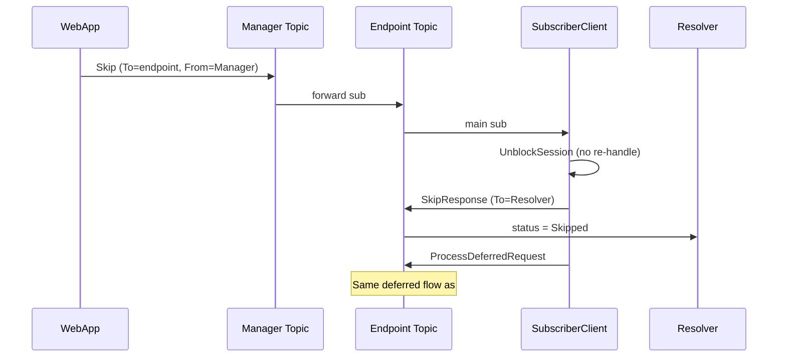

### 6. Retry (Automatic)

When a handler fails and a retry policy matches the exception:

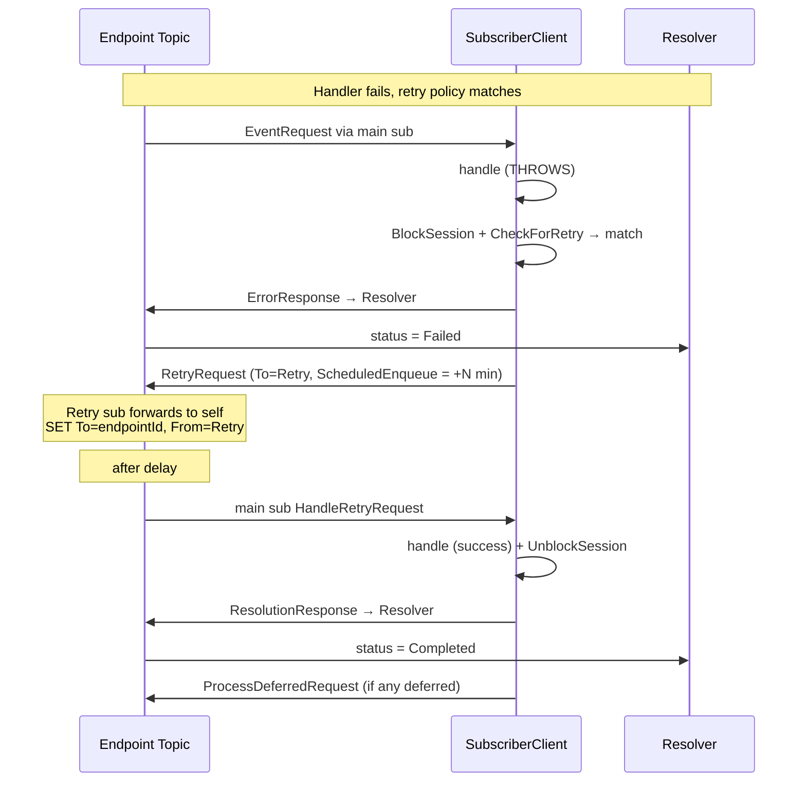

### 7. Continuation (Legacy Deferral)

For messages deferred using the older session-state approach (sequence numbers stored in `DeferredSequenceNumbers`):

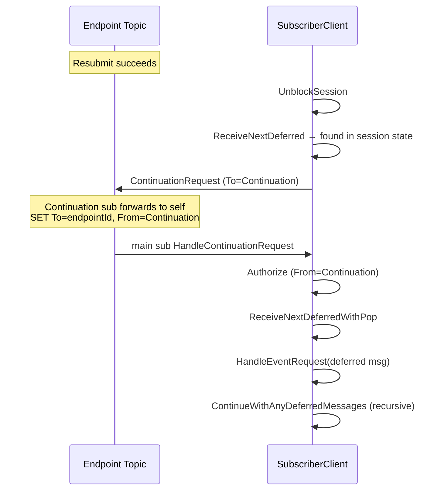

### 8. Heartbeat

Heartbeat messages bypass all handler logic and session checks:

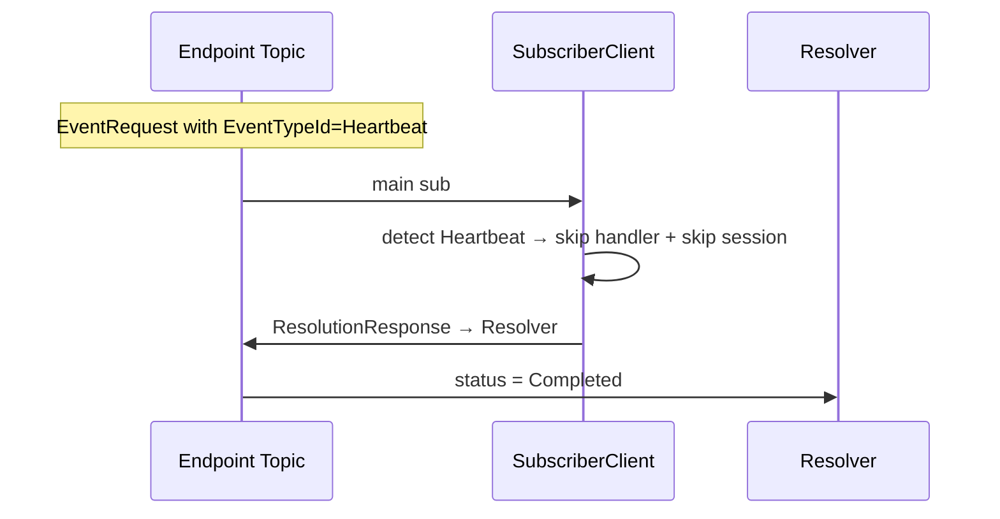

### 9. Unsupported Event Type

No handler registered for the event type:

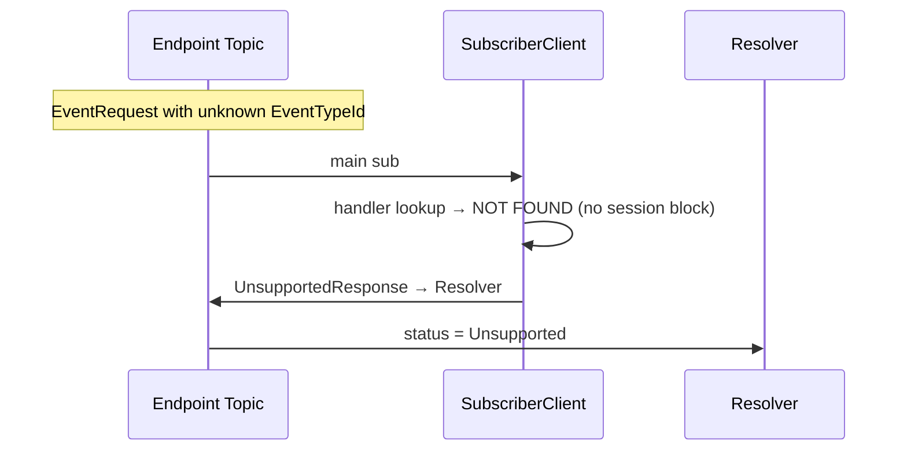

### 10. Event-Type Forwarding (Cross-Endpoint Routing)

How events flow from a producing endpoint to a consuming endpoint:

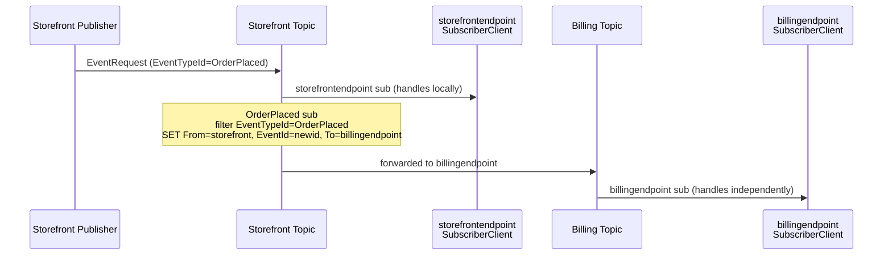

### 11. Transient Failure → Abandon → Redeliver

When the handler throws `TransientException` (network blip, throttling, deadlock — anything recoverable), NimBus **does not** call SB Abandon explicitly — `MessageContext.Abandon` is a deliberate no-op. The peek-lock simply expires after ~30 seconds and Service Bus redelivers the same message. No notification is sent to the Resolver, so audit visibility is intentionally minimal for this path.

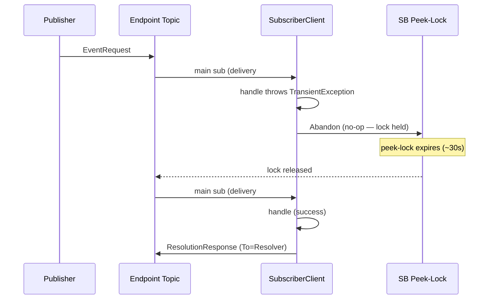

Handlers must be **idempotent** for this to be safe — the same event can be delivered repeatedly until the lock-expiry / max-delivery-count terminal kicks in.

### 12. Dead-letter Routed to Resolver

When `MessageHandler` dead-letters a message (unexpected exception, permanent failure, or middleware-validated dead-letter), it also publishes a notification to the Resolver carrying `DeadLetterReason` and `DeadLetterErrorDescription` as user properties. The Resolver short-circuits on `DeadLetterErrorDescription` and writes the audit record with `ResolutionStatus = DeadLettered`. The actual message still ends up in the Service Bus dead-letter queue — the notification just gives operators a record.

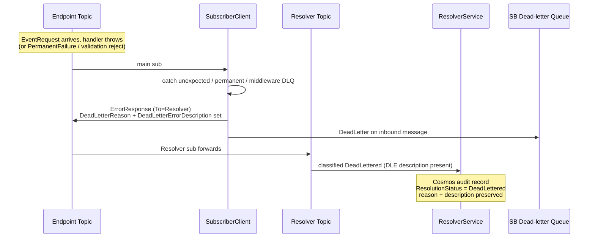

If the notification send fails, the dead-letter still happens — the DLQ remains the source of truth and operators can recover via the Manager.

---

## Retry Policies

When a handler fails, the `StrictMessageHandler` checks for a matching retry policy via `IRetryPolicyProvider`.

### Backoff Strategies

| Strategy | Delay Calculation | Example (BaseDelay=5s) |
|---|---|---|
| **Fixed** | Always `BaseDelay` | 5s, 5s, 5s, 5s |
| **Linear** | `BaseDelay × (attempt + 1)` | 5s, 10s, 15s, 20s |
| **Exponential** | `BaseDelay × 2^attempt` | 5s, 10s, 20s, 40s |

All strategies respect an optional `MaxDelay` cap.

### Policy Resolution Order

1. **Exception-based rules** — match specific exception types/messages to specific policies
2. **Event-type rules** — match by EventTypeId
3. **Default policy** — fallback if no specific rule matches
4. **No policy** — if no retry policy provider is configured, no retries are attempted

### Configuration

Retry policies are configured via `AddNimBusSubscriber(...).ConfigureRetryPolicies(...)`:

```csharp
services.AddNimBusSubscriber("billingendpoint", sub =>
{
    sub.AddHandler<OrderPlaced, OrderPlacedHandler>()
       .ConfigureRetryPolicies(policies =>
       {
           policies.AddEventTypePolicy("OrderPlaced", new RetryPolicy
           {
               MaxRetries = 3,
               Strategy = BackoffStrategy.Exponential,
               BaseDelay = TimeSpan.FromSeconds(5),
               MaxDelay = TimeSpan.FromMinutes(5)
           });
       });
});
```

**Source:** `src/NimBus.Core/Messages/RetryPolicy.cs`

---

## Session State

Stored in Service Bus session state (JSON serialized):

```json
{
  "BlockedByEventId": "event-guid-or-null",
  "DeferredSequenceNumbers": [],
  "DeferredCount": 0,
  "NextDeferralSequence": 0
}
```

| Field | Purpose |
|---|---|
| `BlockedByEventId` | Event ID that caused the failure. Prevents other messages in session from processing. |
| `DeferredSequenceNumbers` | Legacy: sequence numbers of messages deferred within session state |
| `DeferredCount` | New: count of messages sent to the Deferred subscription |
| `NextDeferralSequence` | Counter for ordering deferred messages (FIFO) |

---

## Cosmos DB State Tracking

The Resolver stores every message state change in Cosmos DB:

| Resolution Status | Triggered by | Meaning |
|---|---|---|
| `Pending` | EventRequest, ResubmissionRequest, RetryRequest | Message received, awaiting processing |
| `Completed` | ResolutionResponse | Successfully processed |
| `Failed` | ErrorResponse | Handler threw non-transient exception |
| `Deferred` | DeferralResponse | Session blocked, message parked |
| `Skipped` | SkipResponse | Manager chose to skip this event |
| `Unsupported` | UnsupportedResponse | No handler registered for event type |
| `DeadLettered` | ErrorResponse with DeadLetterReason set | NimBus dead-lettered the message — routed to Resolver alongside the SB DLQ move |

---

## Design Notes

- `ProcessDeferredRequest` messages are handled by `DeferredProcessorFunction` (a separate Azure Function on the `DeferredProcessor` subscription, sessions=OFF), NOT by `StrictMessageHandler`. This was cleaned up — `StrictMessageHandler.HandleProcessDeferredRequest()` has been removed.
- The `DeferredProcessorFunction` cannot reset the endpoint session state's `DeferredCount` because it runs on a non-session subscription. The stale count is harmless — it only causes a no-op `ProcessDeferredRequest` if a subsequent resubmit/skip occurs on an already-unblocked session.
- All message handlers must be **idempotent** — messages may be redelivered by Service Bus on transient failures.
- **Correlation IDs** are preserved across the entire message chain for distributed tracing via OpenTelemetry.
