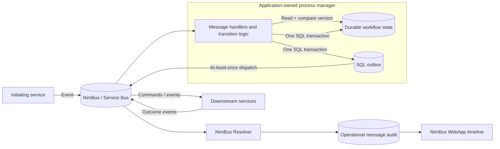

# Application-Level Orchestration

This guide defines the supported process-manager pattern for durable,
multi-step workflows in NimBus. [ADR-009](adr/009-orchestration-via-application-services.md)
is the normative boundary: NimBus supplies messaging, ordering, delivery, and
operational audit primitives; application code owns workflow state and business
transitions.

The terms *orchestrator* and *process manager* are used interchangeably here.
This pattern does not add a NimBus `Saga<TState>`, state-machine DSL, generic
saga repository, or framework-owned business state.

## Ownership Boundary

| NimBus owns | The application owns |
| --- | --- |
| Service Bus transport and topology | Workflow status and business invariants |
| Ordered delivery within a session | State schema, persistence, and migrations |
| Retry, deferral, and dead-letter mechanics | Idempotent transition logic |
| Publisher-side SQL outbox | Optimistic concurrency policy |
| Resolver message-status audit and WebApp timeline | Deadlines, compensation decisions, and escalation |

The Resolver is authoritative for NimBus message status and audit projections.
It is not an authoritative workflow store. A `Completed` message in the
Resolver means that message was handled; it does not mean the business workflow
is complete.



Keep deployment and access boundaries aligned with that ownership. Only trusted
producers should be able to send workflow commands. Validate domain identifiers
and invariants at the handler boundary; correlation or session identifiers are
tracing and ordering data, not authorization evidence.

## Choose the Smallest Interaction Pattern

| Pattern | Choose it when | Do not use it for |
| --- | --- | --- |
| Orchestration / process manager | Several asynchronous steps share a business outcome, durable progress, deadlines, or compensation | A single stateless reaction |
| Choreography | Services can react independently and no component needs to own the end-to-end status or cross-step invariant | Flows where hidden coupling, global deadlines, or coordinated rollback would make ownership unclear |
| Request/response | One caller needs one immediate, bounded response and can remain active while waiting | Durable workflows, long-running work, or publish-after-commit; request/response is not supported through the SQL outbox |
| `PendingHandoff` | One handler has handed a single message to a long-running external job and must block same-session siblings until that job settles | Coordinating multiple business services or storing workflow state |

`PendingHandoff` is a message-processing outcome, not a saga. It records that a
particular inbound message is awaiting an external result. Settlement completes
or fails that message without re-invoking its user handler. See
[PendingHandoff](pending-handoff.md) for the durable coordinates the application
must retain.

Request/response is similarly narrower than orchestration. It keeps the caller
waiting for a reply and has no durable process-manager state. Prefer published
outcome events when a step can outlive the request timeout or must survive a
caller restart.

## Workflow and Message Identity

Use the following conventions for every application-owned workflow:

| Value | Convention |
| --- | --- |
| Workflow ID | A stable domain/entity ID, such as `order-42`; it is the primary key of the state record |
| `SessionId` | The workflow ID for every message processed in order by that process manager |
| Conversation correlation ID | Capture one value when the workflow starts, persist it, and pass it to every application-emitted `Publish` call |
| `MessageId` | A deterministic ID for one logical command or event, derived from workflow ID plus durable transition/step identity |
| Parent lineage | The inbound `MessageId` that caused the new message |
| Origin lineage | The initiating `MessageId`, copied unchanged for the lifetime of the workflow |

Session ordering is local to a session-enabled endpoint subscription. It does
not create a transaction or global order across services. A downstream service
must also use the workflow ID as its session key when that service needs the
same per-workflow ordering.

Do not use the NimBus `EventId` as the workflow key. It identifies an
operationally tracked event and may be assigned by topology; the workflow ID is
an explicit domain value carried in the contract. Override `GetSessionId()` or
use `[SessionKey]` on every workflow contract; the default is a new GUID and
does not preserve workflow ordering.

Use deterministic message IDs such as:

```text
order-42:reserve-inventory:1
order-42:capture-payment:1
order-42:release-inventory:1
order-42:payment-timeout:1
```

The final ordinal is durable transition data, not a delivery count. Reprocessing
the same transition must reproduce the same ID; intentionally issuing the step
again must first persist a new ordinal. Do not use a timestamp, random GUID, or
retry count in this ID.

The typed publisher accepts all three broker identities explicitly:

```csharp
await publisher.Publish(
    command,
    sessionId: state.Id,
    correlationId: state.CorrelationId,
    messageId: "order-42:capture-payment:1");
```

Although `PublisherClient` derives a deterministic ID from event type and
serialized payload when `messageId` is omitted, an explicit business ID is
safer: unrelated serialization changes cannot alter it, and two intentional
occurrences of the same payload remain distinguishable.

### Propagate Lineage Explicitly

`IEventHandlerContext` currently exposes `MessageId` and `CorrelationId`, but
not `SessionId`, `ParentMessageId`, or `OriginatingMessageId`. Do not assume that
application-generated messages inherit those values implicitly. Put the
workflow and lineage fields in durable state and in every workflow contract
emitted after initiation:

```csharp
public abstract class OrderWorkflowEvent : Event
{
    public required string WorkflowId { get; init; }
    public required string ConversationCorrelationId { get; init; }
    public required string OriginatingMessageId { get; init; }
    public required string ParentMessageId { get; init; }

    public override string GetSessionId() => WorkflowId;
}
```

The initiating contract can be a normal domain event without lineage fields.
Its first handler captures `IEventHandlerContext.MessageId` as the origin in the
new durable state record; it does not try to mutate the received event. For each
emitted command or event, keep that stored origin and set `ParentMessageId` to
the current context's `MessageId`. The low-level `Publish(IMessage, ...)` path
can also populate NimBus's native lineage fields, but typed application
contracts remain necessary because the typed handler context does not expose
the full native lineage.

NimBus-generated operational response messages use their own correlation and
lineage rules for Resolver auditing. “One correlation ID” in this guide means
the persisted application conversation ID and every application-emitted
business message, not every internal Resolver response.

Treat all identifiers as bounded, opaque values. Validate length and format at
ingress, never put secrets or unnecessary personal data in them, and do not use
them as proof that a producer is authorized.

## Durable Workflow State

Store one application-owned record per workflow. A representative document is:

```json
{
  "id": "order-42",
  "status": "AwaitingPayment",
  "version": 3,
  "correlationId": "71db97f2a3f54b72b0d73c665ce86fd7",
  "originatingMessageId": "orders:order-placed:42",
  "processedMessages": {
    "orders:order-placed:42": "2026-07-19T10:00:00Z",
    "order-42:inventory-reserved:1": "2026-07-19T10:00:04Z"
  },
  "timeout": {
    "id": "order-42:payment-timeout:1",
    "dueAtUtc": "2026-07-20T10:00:04Z",
    "sequenceNumber": null
  },
  "createdAtUtc": "2026-07-19T10:00:00Z",
  "updatedAtUtc": "2026-07-19T10:00:04Z",
  "orderId": "order-42",
  "inventoryReservationId": "reservation-9001",
  "paymentId": null,
  "compensations": []
}
```

The schema may use a SQL row, a document, or several normalized tables, but it
must preserve these concepts:

- Current business status and allowed transition.
- An optimistic version (`rowversion`, numeric version, or ETag).
- Processed inbound `MessageId` values, or equivalent idempotency records with
  an explicit retention policy.
- Stable IDs for every emitted message and timeout.
- Timeout identity, deadline, and direct-scheduler sequence number when one is
  available.
- Creation/update timestamps and the domain references needed to resume or
  compensate.

Do not put the only copy of workflow state in an in-flight message. A message
may carry a snapshot for a stateless pipeline, but that is not the durable
process-manager pattern selected by ADR-009.

### Idempotent, Concurrent Transitions

For every inbound message:

1. Load the workflow record by its domain workflow ID.
2. If the inbound `MessageId` is already recorded, return successfully without
   emitting anything.
3. Validate that the current status permits the requested transition.
4. Compute deterministic outgoing IDs and apply the state transition.
5. Record the inbound ID before commit.
6. Save with an optimistic version check and persist outgoing messages in the
   same transaction where the SQL outbox pattern is used.
7. On a version conflict, discard the attempted transition, reload, and repeat
   the duplicate/status checks. Do not blindly overwrite the winning state.

Keep transition logic deterministic. Given the same state version and inbound
message, it should produce the same new state and outgoing message IDs.

## Handler and Publisher Pattern

The repository and transaction interfaces below are application abstractions;
the NimBus APIs are `IEventHandler<T>` and `IPublisherClient`.

```csharp
public sealed class InventoryReservedHandler(
    IOrderWorkflowStore workflows,
    IPublisherClient publisher)
    : IEventHandler<InventoryReserved>
{
    public Task Handle(
        InventoryReserved message,
        IEventHandlerContext context,
        CancellationToken cancellationToken)
    {
        return workflows.ExecuteTransitionAsync(
            message.WorkflowId,
            async (state, ct) =>
            {
                if (state.HasProcessed(context.MessageId))
                {
                    return;
                }

                state.RequireStatus(OrderWorkflowStatus.AwaitingInventory);
                state.RecordInventoryReservation(message.ReservationId);
                state.RecordProcessed(context.MessageId);
                state.Status = OrderWorkflowStatus.AwaitingPayment;

                var commandId = state.MessageIdFor("capture-payment", ordinal: 1);
                var command = new CapturePayment
                {
                    WorkflowId = state.Id,
                    OrderId = state.OrderId,
                    Amount = state.Amount,
                    ConversationCorrelationId = state.CorrelationId,
                    OriginatingMessageId = state.OriginatingMessageId,
                    ParentMessageId = context.MessageId,
                };

                await publisher.Publish(
                    command,
                    sessionId: state.Id,
                    correlationId: state.CorrelationId,
                    messageId: commandId);
            },
            cancellationToken);
    }
}
```

`ExecuteTransitionAsync` must load, version-check, and save the record. When the
SQL outbox is enabled it must also enclose the decorated publisher call in the
same SQL transaction. A direct publisher call is not made atomic merely because
it appears inside this callback.

## State and Publish Atomicity

### Direct Publish

Direct publish is appropriate when there is no local state write that must be
atomic with the message, or when the application has an explicit reconciliation
strategy. It has an unavoidable gap:

- Save state, then crash before publish: the next step is missing.
- Publish, then fail to save state: the next step can run while local state is
  stale, and a retry may publish it again.

Stable IDs and idempotent consumers limit duplicate effects, but they do not
close the missing-publish gap.

### SQL State and NimBus SQL Outbox

For SQL-backed workflow state, use the same physical `SqlConnection` and
`SqlTransaction` for the state mutation and `SqlServerOutbox` insert.
Registering the outbox alone is insufficient: without an ambient outbox
transaction, `SqlServerOutbox` opens and commits its own connection.

The current repository's concrete pattern is:

```csharp
public static async Task RunWithOutboxAsync(
    DbContext db,
    Func<Task> work,
    CancellationToken cancellationToken)
{
    var connection = (SqlConnection)db.Database.GetDbConnection();
    var openedHere = connection.State != ConnectionState.Open;
    if (openedHere)
    {
        await connection.OpenAsync(cancellationToken);
    }

    try
    {
        await using var transaction =
            (SqlTransaction)await connection.BeginTransactionAsync(cancellationToken);
        await db.Database.UseTransactionAsync(transaction, cancellationToken);

        using (SqlServerOutboxAmbientTransaction.Begin(connection, transaction))
        {
            await work(); // Save workflow state and call publisher.Publish here.
        }

        await transaction.CommitAsync(cancellationToken);
    }
    finally
    {
        await db.Database.UseTransactionAsync(null, cancellationToken);
        if (openedHere)
        {
            await connection.CloseAsync();
        }
    }
}
```

Use parameterized data access or an ORM for application state. Do not compose
SQL from message payloads or workflow identifiers.

After commit, the dispatcher sends pending outbox rows. Delivery remains
at-least-once: a dispatcher can send successfully and crash before marking the
row dispatched, and Service Bus or an operator can redeliver a message. NimBus
does not currently provide a consumer inbox, so each transition and downstream
side effect must be idempotent.

### Cosmos Workflow State

NimBus's Cosmos message-store provider is for operational message projections;
it is not an application outbox. Cosmos workflow state and the NimBus SQL
outbox cannot share an atomic transaction. Choose one of these explicitly:

- Keep workflow state and the provided outbox in the same SQL database.
- Build an application-owned Cosmos outbox in the same logical partition and
  relay it, with its own tests and operations.
- Use direct publish plus a durable reconciliation process that detects and
  repairs missing emissions.

Do not describe Cosmos state plus the SQL outbox as atomic, and do not introduce
a distributed transaction assumption.

## Multi-Step Flow

Every process-manager transition in this example updates state and writes its
outgoing message to the SQL outbox in one transaction.

```mermaid
sequenceDiagram
    participant Orders as Order service
    participant Bus as NimBus
    participant PM as Order process manager
    participant DB as Workflow DB + outbox
    participant Inventory as Inventory service
    participant Payments as Payment service

    Orders->>Bus: OrderPlaced (session order-42)
    Bus->>PM: OrderPlaced
    PM->>DB: Tx: create Started + ReserveInventory
    DB->>Bus: Dispatch ReserveInventory
    Bus->>Inventory: ReserveInventory
    Inventory->>Bus: InventoryReserved
    Bus->>PM: InventoryReserved
    PM->>DB: Tx: AwaitingPayment + CapturePayment + timeout
    DB->>Bus: Dispatch CapturePayment and timeout
    Bus->>Payments: CapturePayment

    alt Payment captured
        Payments->>Bus: PaymentCaptured
        Bus->>PM: PaymentCaptured
        PM->>DB: Tx: Completed; timeout becomes stale
    else Payment failed or deadline expires
        Payments->>Bus: PaymentFailed / PaymentDeadlineExpired
        Bus->>PM: Failure or timeout
        PM->>DB: Tx: Compensating + ReleaseInventory
        DB->>Bus: Dispatch ReleaseInventory
        Bus->>Inventory: ReleaseInventory
        Inventory->>Bus: InventoryReleased
        Bus->>PM: InventoryReleased
        PM->>DB: Tx: Compensated
    end
```

## Timeouts Are Messages

A timeout is a normal, immutable workflow message scheduled for future delivery.
Give it a deterministic identity and enough data to reject stale delivery:

```csharp
public sealed class PaymentDeadlineExpired : OrderWorkflowEvent
{
    public required string TimeoutId { get; init; }
    public required DateTime DueAtUtc { get; init; }
}
```

With NimBus's default registrations, inject the `ISender` registered by
`AddNimBusPublisher`. It is the direct Service Bus sender when no outbox is
present and the outbox decorator when `IOutbox` is registered. Build a complete
`IMessage` so the scheduled message uses the persisted native identity and
lineage rather than generated defaults:

```csharp
public sealed class WorkflowTimeoutScheduler(
    ISender sender,
    IWorkflowMessageFactory messages)
{
    public async Task<long?> ScheduleAsync(
        PaymentDeadlineExpired timeout,
        OrderWorkflowState state,
        string parentMessageId,
        CancellationToken cancellationToken)
    {
        var scheduledMessage = messages.Create(
            timeout,
            messageId: timeout.TimeoutId,
            sessionId: state.Id,
            correlationId: state.CorrelationId,
            parentMessageId: parentMessageId,
            originatingMessageId: state.OriginatingMessageId,
            originatingFrom: "OrderOrchestrator");

        var sequenceNumber = await sender.ScheduleMessage(
            scheduledMessage,
            new DateTimeOffset(timeout.DueAtUtc, TimeSpan.Zero),
            cancellationToken);

        // Outbox scheduling returns 0 because no broker sequence exists yet.
        return sequenceNumber == 0 ? null : sequenceNumber;
    }
}
```

Call `ScheduleAsync` inside the same application transition and persist its
result with `state.SetTimeout(timeout.TimeoutId, timeout.DueAtUtc,
sequenceNumber)`. With the outbox-decorated sender, both the state mutation and
scheduled outbox row commit through the ambient SQL transaction.

`IWorkflowMessageFactory` is application code. It must validate and serialize
the `IEvent` into a NimBus `Message` with `MessageType.EventRequest`,
`MessageContent.EventContent`, the event type as `To` and `EventTypeId`, and
every identity/lineage argument shown above. Keep this construction in one
tested factory so timeout scheduling does not bypass validation or silently
drop publisher identity. Do not derive `EventId` from the timeout ID; endpoint
topology assigns the operational `EventId`, while the payload `TimeoutId` and
broker `MessageId` remain stable.

`AddNimBusPublisher` uses `TryAddSingleton<ISender>`, so an earlier custom
`ISender` registration can shadow this public resolution even though
`IPublisherClient` builds its own sender. If the host has any custom sender
registration, bind the workflow scheduler explicitly to the intended direct or
outbox sender and prove the state-plus-schedule rollback in an integration test.
Do not assume an arbitrary resolved `ISender` shares the publisher's outbox.

This low-level factory emits the native NimBus format. A CloudEvents-enabled
orchestrator must also construct the required `CloudEventPublishContext` or use
an application scheduler that preserves the CloudEvents envelope; raw
`IMessage` construction does not apply `PublisherClient`'s private CloudEvents
projection.

The convenience `Schedule(IEvent, ...)` and `CancelScheduled(...)` methods exist
only on concrete `PublisherClient`, which `AddNimBusPublisher` does not register
by its concrete type. They also have no overload for an explicit correlation
ID, message ID, or lineage, so they do not satisfy this guide's strict workflow
metadata convention. Use them only for non-workflow reminders where generated
native metadata is acceptable.

The timeout handler must compare durable state before acting:

```csharp
if (state.Status != OrderWorkflowStatus.AwaitingPayment ||
    state.Timeout?.Id != message.TimeoutId)
{
    return; // Completed, superseded, or already handled.
}

state.BeginCompensation(message.TimeoutId);
```

For direct Service Bus scheduling, persist the returned sequence number and
call `ISender.CancelScheduledMessage` through the same direct sender when the
workflow advances. Cancellation is an optimization, not the correctness
mechanism: the handler must still tolerate a cancellation race and stale
delivery. Direct broker scheduling cannot commit atomically with workflow state,
so production code also needs a reconciliation path for the schedule-then-save
crash gap.

When scheduling through the transactional outbox, the outbox stores the due time
but returns `0`, because Service Bus assigns the real sequence number only after
dispatch. `CancelScheduledMessage` therefore throws `NotSupportedException` in
outbox mode. Do not store `0` and later attempt cancellation. Let the timeout
arrive and no-op after checking state, or use a separately configured direct
scheduler and accept that scheduling is outside the state transaction.

`PendingHandoff.ExpectedBy` is operational metadata for a pending external job;
it is not a substitute for an application-owned timeout message.

## Explicit Compensation

Compensation is a new business action, not a database rollback. The process
manager decides which prior effects require compensation and publishes explicit
messages such as `ReleaseInventory` or `RefundPayment`.

```csharp
state.Status = OrderWorkflowStatus.Compensating;
state.RecordCompensation("release-inventory", CompensationStatus.Pending);

await publisher.Publish(
    new ReleaseInventory
    {
        WorkflowId = state.Id,
        ReservationId = state.InventoryReservationId,
        ConversationCorrelationId = state.CorrelationId,
        OriginatingMessageId = state.OriginatingMessageId,
        ParentMessageId = context.MessageId,
    },
    sessionId: state.Id,
    correlationId: state.CorrelationId,
    messageId: state.MessageIdFor("release-inventory", ordinal: 1));
```

Persist each compensation's status and deterministic message ID. Compensation
handlers must be idempotent, and a failed compensation must remain visible for
retry or operator escalation. NimBus does not infer compensation order, execute
compensation automatically, or declare the workflow compensated from Resolver
message status.

## Test the Process Manager

Test application transitions independently from Service Bus, then test the
storage and transport boundaries:

- Happy path: each status permits exactly the expected next command.
- Duplicate delivery: the same inbound `MessageId` produces no second state
  change or outgoing outbox row.
- Optimistic conflict: one transition wins; the loser reloads and re-evaluates
  status and idempotency.
- Atomicity: rolling back the SQL transaction removes both the state mutation
  and outbox row; committing persists both.
- Dispatcher duplicate: dispatching the same stable `MessageId` twice causes one
  downstream business effect.
- Timeout race: completion and timeout in either order result in one terminal
  path; a stale timeout is a no-op.
- Compensation: every step is repeatable, failure remains recoverable, and a
  completed compensation is not issued again.
- Identity: all application-emitted messages retain the workflow session and
  conversation correlation ID, deterministic ID, and explicit lineage fields.
- Restart: a new process instance can resume using only durable state and
  messages; no correctness depends on in-memory timers or locks.

`InMemoryMessageBus` can assert that a timeout was scheduled or cancelled, but
it does not advance a virtual clock and deliver scheduled messages
automatically. Invoke the timeout handler explicitly in unit tests and use an
integration test for real scheduling behavior where needed.

## Current Limitations

- NimBus has no framework-owned saga DSL, saga repository, automatic
  compensation engine, or authoritative business-workflow state.
- There is no consumer inbox. Outbox dispatch, Service Bus delivery, retry, and
  operator resubmit are at-least-once paths.
- High-level scheduling and cancellation are only on concrete
  `PublisherClient`; `IPublisherClient` does not expose them or metadata
  override overloads.
- Outbox-backed scheduled messages cannot be cancelled through the current
  sequence-number API.
- Resolver and WebApp show operational message history, not the application's
  state machine or complete business status.
- NimBus provides no atomic transaction spanning Cosmos workflow state and the
  SQL outbox.
- Request/response is synchronous, requires Service Bus reply topology, and is
  not supported through the transactional outbox.
- No combination of sessions, retries, deterministic IDs, or outbox dispatch
  makes processing exactly once. Application transitions and side effects must
  remain idempotent.

## Production Checklist

- [ ] A single application service owns each workflow's status and invariants.
- [ ] The workflow ID is durable and used as the process-manager session ID.
- [ ] One application conversation correlation ID is persisted and propagated.
- [ ] Every logical outgoing message and timeout has a deterministic, persisted
      ID and explicit lineage.
- [ ] Incoming duplicates are checked before side effects or new messages.
- [ ] State saves use optimistic concurrency and conflicts reload before retry.
- [ ] SQL state and outbox inserts share the same connection and transaction, or
      the non-atomic alternative has a tested reconciliation path.
- [ ] Timeout handlers reject stale messages; correctness does not depend on
      cancellation succeeding.
- [ ] Compensation steps are explicit, idempotent, observable, and recoverable.
- [ ] Domain input is validated, producer permissions are least-privilege, and
      identifiers/logs contain no secrets or unnecessary personal data.
- [ ] Tests cover duplicates, concurrency, rollback, timeout races,
      compensation failure, dispatch replay, and process restart.
- [ ] Operational dashboards and alerts use Resolver/WebApp data without
      treating it as authoritative business state.
- [ ] Runbooks never claim exactly-once processing.

## Related Documentation and Reference Sample

- [ADR-009: Orchestration via Application Services](adr/009-orchestration-via-application-services.md)
  defines the architectural boundary.
- [Getting Started](getting-started.md) introduces publishing, subscribing, and
  session keys.
- [Building Adapters](building-adapters.md) covers production hosting, the SQL
  outbox, retries, and idempotency.
- [SDK API Reference](sdk-api-reference.md) documents publishing, scheduling,
  request/response, and `PendingHandoff` APIs.
- [ADR-005: Transactional Outbox](adr/005-transactional-outbox-sql-server.md)
  explains the publisher-side reliability decision.
- The companion process-manager reference service is planned as follow-on work
  at `samples/AspirePubSub/OrchestratorService/` within the existing
  [Aspire Pub/Sub samples](../samples/AspirePubSub/). Until that service exists,
  this guide is the canonical application-level pattern.
