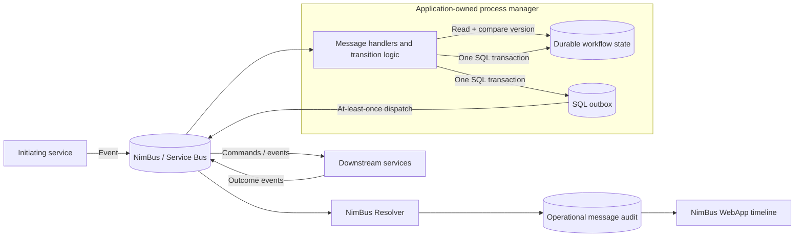

# Application-Level Orchestration

This guide defines the supported process-manager pattern for durable,
multi-step workflows in NimBus. [ADR-009](adr/009-orchestration-via-application-services.md)
is the normative boundary: NimBus supplies messaging, ordering, delivery, and
operational audit primitives; application code owns workflow state and business
transitions.

The terms *orchestrator* and *process manager* are used interchangeably here.
This pattern does not add a NimBus `Saga<TState>`, state-machine DSL, generic
saga repository, or framework-owned business state.

## Ownership Boundary

| NimBus owns | The application owns |
| --- | --- |
| Service Bus transport and topology | Workflow status and business invariants |
| Ordered delivery within a session | State schema, persistence, and migrations |
| Retry, deferral, and dead-letter mechanics | Idempotent transition logic |
| Publisher-side SQL outbox | Optimistic concurrency policy |
| Resolver message-status audit and WebApp timeline | Deadlines, compensation decisions, and escalation |

The Resolver is authoritative for NimBus message status and audit projections.
It is not an authoritative workflow store. A `Completed` message in the
Resolver means that message was handled; it does not mean the business workflow
is complete.


```mermaid
flowchart LR
    Source[Initiating service] -->|Event| Bus[(NimBus / Service Bus)]

    subgraph App[Application-owned process manager]
        Handler[Message handlers and transition logic]
        State[(Durable workflow state)]
        Outbox[(SQL outbox)]
        Handler -->|Read + compare version| State
        Handler -->|One SQL transaction| State
        Handler -->|One SQL transaction| Outbox
    end

    Bus --> Handler
    Outbox -->|At-least-once dispatch| Bus
    Bus -->|Commands / events| Services[Downstream services]
    Services -->|Outcome events| Bus

    Bus --> Resolver[NimBus Resolver]
    Resolver --> Audit[(Operational message audit)]
    Audit --> WebApp[NimBus WebApp timeline]
```

Keep deployment and access boundaries aligned with that ownership. Only trusted
producers should be able to send workflow commands. Validate domain identifiers
and invariants at the handler boundary; correlation or session identifiers are
tracing and ordering data, not authorization evidence.

## Choose the Smallest Interaction Pattern

| Pattern | Choose it when | Do not use it for |
| --- | --- | --- |
| Orchestration / process manager | Several asynchronous steps share a business outcome, durable progress, deadlines, or compensation | A single stateless reaction |
| Choreography | Services can react independently and no component needs to own the end-to-end status or cross-step invariant | Flows where hidden coupling, global deadlines, or coordinated rollback would make ownership unclear |
| Request/response | One caller needs one immediate, bounded response and can remain active while waiting | Durable workflows, long-running work, or publish-after-commit; request/response is not supported through the SQL outbox |
| `PendingHandoff` | One handler has handed a single message to a long-running external job and must block same-session siblings until that job settles | Coordinating multiple business services or storing workflow state |

`PendingHandoff` is a message-processing outcome, not a saga. It records that a
particular inbound message is awaiting an external result. Settlement completes
or fails that message without re-invoking its user handler. See
[PendingHandoff](pending-handoff.md) for the durable coordinates the application
must retain.

Request/response is similarly narrower than orchestration. It keeps the caller
waiting for a reply and has no durable process-manager state. Prefer published
outcome events when a step can outlive the request timeout or must survive a
caller restart.

## Workflow and Message Identity

Use the following conventions for every application-owned workflow:

| Value | Convention |
| --- | --- |
| Workflow ID | A stable domain/entity ID, such as `order-42`; it is the primary key of the state record |
| `SessionId` | The workflow ID for every message processed in order by that process manager |
| Conversation correlation ID | Capture one value when the workflow starts, persist it, and pass it to every application-emitted `Publish` call |
| `MessageId` | A deterministic ID for one logical command or event, derived from workflow ID plus durable transition/step identity |
| Parent lineage | The inbound `MessageId` that caused the new message |
| Origin lineage | The initiating `MessageId`, copied unchanged for the lifetime of the workflow |

Session ordering is local to a session-enabled endpoint subscription. It does
not create a transaction or global order across services. A downstream service
must also use the workflow ID as its session key when that service needs the
same per-workflow ordering.

Do not use the NimBus `EventId` as the workflow key. It identifies an
operationally tracked event and may be assigned by topology; the workflow ID is
an explicit domain value carried in the contract. Override `GetSessionId()` or
use `[SessionKey]` on every workflow contract; the default is a new GUID and
does not preserve workflow ordering.

Use deterministic message IDs such as:

```text
order-42:reserve-inventory:1
order-42:capture-payment:1
order-42:release-inventory:1
order-42:payment-timeout:1
```

The final ordinal is durable transition data, not a delivery count. Reprocessing
the same transition must reproduce the same ID; intentionally issuing the step
again must first persist a new ordinal. Do not use a timestamp, random GUID, or
retry count in this ID.

When a handler publishes the next workflow message, use its inbound context:

```csharp
await publisher.PublishFromContext(
    command,
    context,
    messageId: "order-42:capture-payment:1",
    cancellationToken: cancellationToken);
```

`PublishFromContext` requires the outgoing `MessageId`; there is no overload
that silently generates one. Derive it from the durable workflow ID, logical
transition, and workflow version or attempt. The method copies the inbound
`SessionId` and `CorrelationId`, sets the outgoing parent to the inbound
`MessageId`, and retains the original initiating message across later hops.

For application emissions that do not run in an inbound handler, use the
existing explicit `Publish(event, sessionId, correlationId, messageId)` overload
and obtain the identities from durable workflow state. Although the older
publisher overloads can derive an ID from event type and serialized payload, an
explicit business ID is safer: unrelated serialization changes cannot alter it,
and two intentional occurrences of the same payload remain distinguishable.

### Propagate Lineage Explicitly

`IEventHandlerContext` exposes `SessionId`, `CorrelationId`, `MessageId`,
`ParentMessageId`, and `OriginatingMessageId`. Pass that context explicitly to
`PublishFromContext`; NimBus does not keep an ambient or mutable “current
message.” For a first-hop legacy message whose origin is absent or `self`, the
publisher uses the inbound `MessageId` as the origin. On later hops it preserves
the inbound origin and always reparents to the current inbound `MessageId`.

The native lineage is transport metadata and survives both direct and SQL
outbox-backed publishing, including CloudEvents mode. A workflow contract may
also carry business-visible lineage when downstream domain logic requires it,
but it no longer needs to duplicate the native fields merely to propagate them:

```csharp
public abstract class OrderWorkflowEvent : Event
{
    public required string WorkflowId { get; init; }

    public override string GetSessionId() => WorkflowId;
}
```

Still persist the conversation correlation ID, originating message ID, and
deterministic outgoing IDs in workflow state. A timeout, reconciliation job, or
restart may need to emit a message without the original handler context; that
path must reconstruct explicit metadata from durable state rather than from
in-memory or ambient state.

NimBus-generated operational response messages use their own correlation and
lineage rules for Resolver auditing. “One correlation ID” in this guide means
the persisted application conversation ID and every application-emitted
business message, not every internal Resolver response.

Treat all identifiers as bounded, opaque values. Validate length and format at
ingress, never put secrets or unnecessary personal data in them, and do not use
them as proof that a producer is authorized.

## Durable Workflow State

Store one application-owned record per workflow. A representative document is:

```json
{
  "id": "order-42",
  "status": "AwaitingPayment",
  "version": 3,
  "correlationId": "71db97f2a3f54b72b0d73c665ce86fd7",
  "originatingMessageId": "orders:order-placed:42",
  "processedMessages": {
    "orders:order-placed:42": "2026-07-19T10:00:00Z",
    "order-42:inventory-reserved:1": "2026-07-19T10:00:04Z"
  },
  "timeout": {
    "id": "order-42:payment-timeout:1",
    "dueAtUtc": "2026-07-20T10:00:04Z",
    "sequenceNumber": null
  },
  "createdAtUtc": "2026-07-19T10:00:00Z",
  "updatedAtUtc": "2026-07-19T10:00:04Z",
  "orderId": "order-42",
  "inventoryReservationId": "reservation-9001",
  "paymentId": null,
  "compensations": []
}
```

The schema may use a SQL row, a document, or several normalized tables, but it
must preserve these concepts:

- Current business status and allowed transition.
- An optimistic version (`rowversion`, numeric version, or ETag).
- Processed inbound `MessageId` values, or equivalent idempotency records with
  an explicit retention policy.
- Stable IDs for every emitted message and timeout.
- Timeout identity, deadline, and direct-scheduler sequence number when one is
  available.
- Creation/update timestamps and the domain references needed to resume or
  compensate.

Do not put the only copy of workflow state in an in-flight message. A message
may carry a snapshot for a stateless pipeline, but that is not the durable
process-manager pattern selected by ADR-009.

### Idempotent, Concurrent Transitions

For every inbound message:

1. Load the workflow record by its domain workflow ID.
2. If the inbound `MessageId` is already recorded, return successfully without
   emitting anything.
3. Validate that the current status permits the requested transition.
4. Compute deterministic outgoing IDs and apply the state transition.
5. Record the inbound ID before commit.
6. Save with an optimistic version check and persist outgoing messages in the
   same transaction where the SQL outbox pattern is used.
7. On a version conflict, discard the attempted transition, reload, and repeat
   the duplicate/status checks. Do not blindly overwrite the winning state.

Keep transition logic deterministic. Given the same state version and inbound
message, it should produce the same new state and outgoing message IDs.

## Handler and Publisher Pattern

The repository and transaction interfaces below are application abstractions;
the NimBus APIs are `IEventHandler<T>` and `IPublisherClient`.

```csharp
public sealed class InventoryReservedHandler(
    IOrderWorkflowStore workflows,
    IPublisherClient publisher)
    : IEventHandler<InventoryReserved>
{
    public Task Handle(
        InventoryReserved message,
        IEventHandlerContext context,
        CancellationToken cancellationToken)
    {
        return workflows.ExecuteTransitionAsync(
            message.WorkflowId,
            async (state, ct) =>
            {
                if (state.HasProcessed(context.MessageId))
                {
                    return;
                }

                state.RequireStatus(OrderWorkflowStatus.AwaitingInventory);
                state.RecordInventoryReservation(message.ReservationId);
                state.RecordProcessed(context.MessageId);
                state.Status = OrderWorkflowStatus.AwaitingPayment;

                var commandId = state.MessageIdFor("capture-payment", ordinal: 1);
                var command = new CapturePayment
                {
                    WorkflowId = state.Id,
                    OrderId = state.OrderId,
                    Amount = state.Amount,
                };

                await publisher.PublishFromContext(
                    command,
                    context,
                    messageId: commandId,
                    cancellationToken: ct);
            },
            cancellationToken);
    }
}
```

`ExecuteTransitionAsync` must load, version-check, and save the record. When the
SQL outbox is enabled it must also enclose the decorated publisher call in the
same SQL transaction. A direct publisher call is not made atomic merely because
it appears inside this callback.

## State and Publish Atomicity

### Direct Publish

Direct publish is appropriate when there is no local state write that must be
atomic with the message, or when the application has an explicit reconciliation
strategy. It has an unavoidable gap:

- Save state, then crash before publish: the next step is missing.
- Publish, then fail to save state: the next step can run while local state is
  stale, and a retry may publish it again.

Stable IDs and idempotent consumers limit duplicate effects, but they do not
close the missing-publish gap.

### SQL State and NimBus SQL Outbox

For SQL-backed workflow state, use the same physical `SqlConnection` and
`SqlTransaction` for the state mutation and `SqlServerOutbox` insert.
Registering the outbox alone is insufficient: without an ambient outbox
transaction, `SqlServerOutbox` opens and commits its own connection.

The current repository's concrete pattern is:

```csharp
public static async Task RunWithOutboxAsync(
    DbContext db,
    Func<Task> work,
    CancellationToken cancellationToken)
{
    var connection = (SqlConnection)db.Database.GetDbConnection();
    var openedHere = connection.State != ConnectionState.Open;
    if (openedHere)
    {
        await connection.OpenAsync(cancellationToken);
    }

    try
    {
        await using var transaction =
            (SqlTransaction)await connection.BeginTransactionAsync(cancellationToken);
        await db.Database.UseTransactionAsync(transaction, cancellationToken);

        using (SqlServerOutboxAmbientTransaction.Begin(connection, transaction))
        {
            await work(); // Save workflow state and call publisher.PublishFromContext here.
        }

        await transaction.CommitAsync(cancellationToken);
    }
    finally
    {
        await db.Database.UseTransactionAsync(null, cancellationToken);
        if (openedHere)
        {
            await connection.CloseAsync();
        }
    }
}
```

Use parameterized data access or an ORM for application state. Do not compose
SQL from message payloads or workflow identifiers.

After commit, the dispatcher sends pending outbox rows. Delivery remains
at-least-once: a dispatcher can send successfully and crash before marking the
row dispatched, and Service Bus or an operator can redeliver a message. NimBus's
optional [consumer inbox](inbox-pattern.md) can skip a redelivery after the same
`MessageId` was recorded successfully. The inbox write is separate from the
application transaction, so each transition and downstream side effect must
still be idempotent.

### Cosmos Workflow State

NimBus's Cosmos message-store provider is for operational message projections;
it is not an application outbox. Cosmos workflow state and the NimBus SQL
outbox cannot share an atomic transaction. Choose one of these explicitly:

- Keep workflow state and the provided outbox in the same SQL database.
- Build an application-owned Cosmos outbox in the same logical partition and
  relay it, with its own tests and operations.
- Use direct publish plus a durable reconciliation process that detects and
  repairs missing emissions.

Do not describe Cosmos state plus the SQL outbox as atomic, and do not introduce
a distributed transaction assumption.

## Multi-Step Flow

Every process-manager transition in this example updates state and writes its
outgoing message to the SQL outbox in one transaction.

```mermaid
sequenceDiagram
    participant Orders as Order service
    participant Bus as NimBus
    participant PM as Order process manager
    participant DB as Workflow DB + outbox
    participant Inventory as Inventory service
    participant Payments as Payment service

    Orders->>Bus: OrderPlaced (session order-42)
    Bus->>PM: OrderPlaced
    PM->>DB: Tx: create Started + ReserveInventory
    DB->>Bus: Dispatch ReserveInventory
    Bus->>Inventory: ReserveInventory
    Inventory->>Bus: InventoryReserved
    Bus->>PM: InventoryReserved
    PM->>DB: Tx: AwaitingPayment + CapturePayment + timeout
    DB->>Bus: Dispatch CapturePayment and timeout
    Bus->>Payments: CapturePayment

    alt Payment captured
        Payments->>Bus: PaymentCaptured
        Bus->>PM: PaymentCaptured
        PM->>DB: Tx: Completed; timeout becomes stale
    else Payment failed or deadline expires
        Payments->>Bus: PaymentFailed / PaymentDeadlineExpired
        Bus->>PM: Failure or timeout
        PM->>DB: Tx: Compensating + ReleaseInventory
        DB->>Bus: Dispatch ReleaseInventory
        Bus->>Inventory: ReleaseInventory
        Inventory->>Bus: InventoryReleased
        Bus->>PM: InventoryReleased
        PM->>DB: Tx: Compensated
    end
```

## Timeouts Are Messages

A timeout is a normal, immutable workflow message scheduled for future delivery.
Give it a deterministic identity and enough data to reject stale delivery:

```csharp
public sealed class PaymentDeadlineExpired : OrderWorkflowEvent
{
    public required string TimeoutId { get; init; }
    public required DateTime DueAtUtc { get; init; }
}
```

Use the workflow-facing scheduling API on `IPublisherClient` (spec 025). It
carries the inbound context's session, correlation, and lineage exactly like
`PublishFromContext`, stamps the deterministic **TimeoutId** as both the first
delivery's `MessageId` and the `ScheduledMessageId` marker on every delivery,
and returns an opaque handle for cancellation:

```csharp
public async Task Handle(OrderPlaced evt, IEventHandlerContext context, CancellationToken ct)
{
    // ... persist workflow state with the timeout recorded as Pending ...

    var handle = await publisher.Schedule(
        new PaymentDeadlineExpired { TimeoutId = timeoutId, DueAtUtc = dueAtUtc },
        dueAtUtc,
        context,
        timeoutId,                      // deterministic: workflow id + transition + generation
        ct);

    // Persist the handle: NimBus never reconstructs one from TimeoutId alone.
    state.SetTimeout(timeoutId, dueAtUtc, handle);
}
```

Derive `timeoutId` from durable workflow identity, the transition name, and the
timeout generation (for example `order-42:payment-deadline:1`), at most 128
characters. Rescheduling arms a NEW generation with a new TimeoutId; a late
delivery of the old generation then fails the state guard and no-ops.

### Logical vs transport identity

`ScheduledMessageId` (the TimeoutId) is the timeout's *logical* identity. It is
stable across retries, deferred park/republish, throttle redelivery, and
operator resubmission, while every one of those clones mints its own transport
`MessageId` (reusing the original would trip broker duplicate detection and
silently drop the retry). The two are equal only on the first delivery.

Retry clones of a marked timeout also preserve the workflow conversation ID:
`CorrelationId` on a redelivered timeout is still the persisted workflow
conversation ID, not the previous attempt's MessageId (ordinary, unmarked
messages keep the legacy `CorrelationId = parent MessageId` retry convention
unchanged).

Typed handlers read the logical identity straight from the context:

```csharp
public async Task Handle(PaymentDeadlineExpired timeout, IEventHandlerContext context, CancellationToken ct)
{
    var state = await repository.Load(context.SessionId, ct);

    // Re-read durable state; key the guard on ScheduledMessageId, NEVER on
    // context.MessageId (that is the per-attempt transport identity).
    if (state.Status != OrderWorkflowStatus.AwaitingPayment ||
        state.Timeout?.Id != context.ScheduledMessageId)
    {
        context.ReportScheduledMessageOutcome(ScheduledMessageHandlingOutcome.IgnoredLate);
        return; // Completed, cancelled, superseded, or duplicate — observable no-op.
    }

    state.BeginCompensation(context.ScheduledMessageId);
    await repository.Save(state, ct); // optimistic concurrency decides the race
    context.ReportScheduledMessageOutcome(ScheduledMessageHandlingOutcome.Fired);
}
```

`ReportScheduledMessageOutcome` is purely diagnostic (the bounded
`nimbus.message.timeout.operations` metric); it never changes Resolver status
or handler outcome, and NimBus records only the receive when it is not called.

### Cancellation is an optimization

`CancelScheduled(handle)` suppresses work only when its transport-specific race
is won; durable workflow-state checks remain the correctness boundary in every
mode.

- **Direct (broker) mode** — `ScheduledMessageHandleKind.BrokerSequenceNumber`.
  Success returns `CancellationRequested` only: broker activation and
  cancellation are independent, so the timeout may still be delivered. The
  broker API is sequence-only, so NimBus validates the handle's *shape* but
  cannot verify the TimeoutId↔sequence pairing — a mismatched pair cancels
  whatever sequence was supplied. Direct scheduling is also two-phase (persist
  Pending, schedule after commit, persist the returned handle), so production
  code needs a reconciliation path for the schedule-then-save crash gap:
  reschedule with the same TimeoutId; the duplicate delivery is stale-safe.
- **SQL outbox, `SqlOwnedDueTime` mode** — `SqlOutboxSequenceNumber`. The
  scheduled row stays in SQL until due, so cancellation is linearized against
  dispatch: one conditional UPDATE decides the cancel-vs-dispatch-start race,
  and the CAS matches sequence AND TimeoutId AND scheduled-ness, so a forged
  handle affects zero rows. Outcomes are precise: `CancelledBeforeDispatch`
  (guaranteed never sent by an upgraded fleet), `AlreadyCancelled` (idempotent,
  no second mutation), `TooLate` (dispatch already started — the broker outcome
  may be ambiguous, so no false "cancelled" claim), `NotFound`.
- **Legacy long-only bridge** — `PublisherClient.Schedule(IEvent,
  DateTimeOffset)`/`CancelScheduled(long)` are `[Obsolete]` bridges. Direct
  behavior is unchanged; in outbox mode legacy `Schedule` returns the provider
  sequence only under `SqlOwnedDueTime` (0 otherwise) and `CancelScheduled(long)`
  stays `NotSupportedException` in all modes — the long alone cannot carry the
  timeout identity. Migrate to the handle API.

### SQL-owned due time and the delivery-mode cutover

`SqlServerOutboxOptions.ScheduledDelivery` gates the outbox protocol:

- `BrokerScheduleAtDispatch` (default) — today's behavior bit for bit,
  including `CreatedAtUtc` selection/ordering. The handle API throws
  `InvalidOperationException` naming the required mode so it cannot produce
  rows an old dispatcher fleet might mishandle.
- `SqlOwnedDueTime` — SQL owns the due time until it expires: rows become
  dispatch-eligible at `COALESCE(ScheduledEnqueueTimeUtc, StoredAtUtc)` (SQL
  time; a past due time means immediately eligible), the dispatcher claims due
  rows under leases, fences dispatch-start immediately before broker I/O, and
  sends with zero delay — no eager broker schedule and no broker sequence to
  cancel. The timing contract becomes "not before due; delivery can be late
  while the dispatcher is unavailable" — plan dispatcher availability
  accordingly.

Cutover runbook (an old dispatcher binary would eagerly broker-schedule
new-style rows and could send a row after `CancelledBeforeDispatch`):

1. **Phase 1** — upgrade binaries everywhere with the default mode. Zero
   behavior change; the schema migration is additive, applock-serialized, and
   ignored by old readers (adding the IDENTITY column may rewrite the table —
   schedule the first startup inside a maintenance window on large outboxes).
2. **Phase 2** — once no pre-upgrade dispatcher process remains, set
   `ScheduledDelivery = SqlOwnedDueTime` on every publisher and dispatcher
   host. The flip is the operator's assertion of full cutover; the
   `CancelledBeforeDispatch` guarantee holds only from this point. Config skew
   inside phase 2 degrades to at-least-once with possible eager broker
   scheduling — application-guard correctness is unaffected, only cancellation
   precision; converge quickly. Flipping back after cancellations or future-due
   rows exist is a misconfiguration (the default-mode query still refuses to
   dispatch a cancelled row).
3. **Phase 3** — adopt the handle-based `Schedule`/`CancelScheduled` API.

### Ordering, session heads, and the lease bound

In `SqlOwnedDueTime` mode a session has at most one in-flight row. A live
reservation or a dispatch-started row is the session **head** and blocks every
other row of that session in both key directions — a backdated (earlier-due)
insert therefore waits for the head to terminalize, then dispatches before
later-keyed successors. An expired *started* head bypasses the ordering
predicate on reclaim (it is the session's in-flight slot and must terminalize
first), so a backdated arrival can never wedge the session. The claim query
takes serializable key-range locks (`HOLDLOCK`) through a dedicated
session-ordering index and uses the `UPDLOCK, READPAST, READCOMMITTEDLOCK`
candidate hint set, which is valid under both lock-based READ COMMITTED and
READ_COMMITTED_SNAPSHOT (Azure SQL's default).

The per-attempt send window (`SendLeaseDuration` minus `SendLeaseSafetyMargin`,
validated to at least the 5-second `MinimumUsableSendWindow` floor) bounds each
send with a monotonic, clock-skew-immune budget anchored before the start
fence; the fence is owner-idempotent, so a consumed window triggers one lease
renewal instead of an instant-timeout retry loop. The bound is **best effort**:
a sender that ignores cancellation can outlive the lease, another worker may
reclaim and retry the row, and the overlapping duplicate (same transport
MessageId) is absorbed by the application idempotency guard — exactly one
attempt checkpoints the row. After an ambiguous send, a duplicate of an
earlier row may arrive after a later row; that reorder is confined to
duplicates and is absorbed by the same guard.

### Operator resubmission of failed timeouts

A terminally failed timeout keeps its identity through the Resolver audit
chain: Resolver-bound responses carry `ScheduledMessageId`/
`ScheduledEnqueueTimeUtc` plus the response-only `WorkflowCorrelationId`, the
stores persist them, and Resubmit (WebApp, per-endpoint fallback, and CLI
alike) restores them onto the `ResubmissionRequest` — including
`CorrelationId = WorkflowCorrelationId` for marked entities. After an operator
fixes a handler bug and resubmits, the workflow guard decides Fired vs
IgnoredLate like any other delivery. Resolver status remains operational
message history: Completed means the timeout message was handled, not that the
business timeout won.

### Observability

`nimbus.message.schedule.operations` (publisher; operation/mode/outcome) and
`nimbus.message.timeout.operations` (consumer; received, fired, ignored_late,
failed — keyed on the marker so retries still count as timeout traffic) carry
bounded dimensions only; TimeoutId, MessageId, SessionId, and CorrelationId
appear on spans and structured logs, never as metric tags. Outbox pending/lag
gauges are mode-scoped: in `SqlOwnedDueTime` a future timeout contributes
nothing until due and its lag counts from the due time.

The complete state diagrams, invariants, and race-by-race test matrix live in
the approved design:
[docs/specs/025-orchestration-safe-timeout-scheduling/spec.md](specs/025-orchestration-safe-timeout-scheduling/spec.md).

`PendingHandoff.ExpectedBy` is operational metadata for a pending external job;
it is not a substitute for an application-owned timeout message.

## Explicit Compensation

Compensation is a new business action, not a database rollback. The process
manager decides which prior effects require compensation and publishes explicit
messages such as `ReleaseInventory` or `RefundPayment`.

```csharp
state.Status = OrderWorkflowStatus.Compensating;
state.RecordCompensation("release-inventory", CompensationStatus.Pending);

await publisher.PublishFromContext(
    new ReleaseInventory
    {
        WorkflowId = state.Id,
        ReservationId = state.InventoryReservationId,
    },
    context,
    messageId: state.MessageIdFor("release-inventory", ordinal: 1),
    cancellationToken: cancellationToken);
```

Persist each compensation's status and deterministic message ID. Compensation
handlers must be idempotent, and a failed compensation must remain visible for
retry or operator escalation. NimBus does not infer compensation order, execute
compensation automatically, or declare the workflow compensated from Resolver
message status.

## Test the Process Manager

Test application transitions independently from Service Bus, then test the
storage and transport boundaries:

- Happy path: each status permits exactly the expected next command.
- Duplicate delivery: the same inbound `MessageId` produces no second state
  change or outgoing outbox row.
- Optimistic conflict: one transition wins; the loser reloads and re-evaluates
  status and idempotency.
- Atomicity: rolling back the SQL transaction removes both the state mutation
  and outbox row; committing persists both.
- Dispatcher duplicate: dispatching the same stable `MessageId` twice causes one
  downstream business effect.
- Timeout race: completion and timeout in either order result in one terminal
  path; a stale timeout is a no-op.
- Compensation: every step is repeatable, failure remains recoverable, and a
  completed compensation is not issued again.
- Identity: all application-emitted messages retain the workflow session and
  conversation correlation ID, deterministic ID, and explicit lineage fields.
- Restart: a new process instance can resume using only durable state and
  messages; no correctness depends on in-memory timers or locks.

`InMemoryMessageBus` can assert that a timeout was scheduled or cancelled, but
it does not advance a virtual clock and deliver scheduled messages
automatically. Invoke the timeout handler explicitly in unit tests and use an
integration test for real scheduling behavior where needed.

## Current Limitations

- NimBus has no framework-owned saga DSL, saga repository, automatic
  compensation engine, or authoritative business-workflow state.
- The consumer inbox is opt-in and records after the application handler. Its
  write is not atomic with application state, so outbox dispatch, Service Bus
  delivery, retry, and operator replay remain at-least-once at the side-effect
  boundary.
- High-level scheduling and cancellation are only on concrete
  `PublisherClient`; `IPublisherClient` does not expose them or metadata
  override overloads.
- Outbox-backed scheduled messages cannot be cancelled through the current
  sequence-number API.
- Resolver and WebApp show operational message history, not the application's
  state machine or complete business status.
- NimBus provides no atomic transaction spanning Cosmos workflow state and the
  SQL outbox.
- Request/response is synchronous, requires Service Bus reply topology, and is
  not supported through the transactional outbox.
- No combination of sessions, retries, deterministic IDs, or outbox dispatch
  makes processing exactly once. Application transitions and side effects must
  remain idempotent.

## Production Checklist

- [ ] A single application service owns each workflow's status and invariants.
- [ ] The workflow ID is durable and used as the process-manager session ID.
- [ ] One application conversation correlation ID is persisted and propagated.
- [ ] Every logical outgoing message and timeout has a deterministic, persisted
      ID and explicit lineage.
- [ ] Incoming duplicates are checked before side effects or new messages.
- [ ] State saves use optimistic concurrency and conflicts reload before retry.
- [ ] SQL state and outbox inserts share the same connection and transaction, or
      the non-atomic alternative has a tested reconciliation path.
- [ ] Timeout handlers reject stale messages; correctness does not depend on
      cancellation succeeding.
- [ ] Compensation steps are explicit, idempotent, observable, and recoverable.
- [ ] Domain input is validated, producer permissions are least-privilege, and
      identifiers/logs contain no secrets or unnecessary personal data.
- [ ] Tests cover duplicates, concurrency, rollback, timeout races,
      compensation failure, dispatch replay, and process restart.
- [ ] Operational dashboards and alerts use Resolver/WebApp data without
      treating it as authoritative business state.
- [ ] Runbooks never claim exactly-once processing.

## Related Documentation and Reference Sample

- [ADR-009: Orchestration via Application Services](adr/009-orchestration-via-application-services.md)
  defines the architectural boundary.
- [Getting Started](getting-started.md) introduces publishing, subscribing, and
  session keys.
- [Building Adapters](building-adapters.md) covers production hosting, the SQL
  outbox, retries, and idempotency.
- [SDK API Reference](sdk-api-reference.md) documents publishing, scheduling,
  request/response, and `PendingHandoff` APIs.
- [ADR-005: Transactional Outbox](adr/005-transactional-outbox-sql-server.md)
  explains the publisher-side reliability decision.
- The companion process-manager reference service is planned as follow-on work
  at `samples/AspirePubSub/OrchestratorService/` within the existing
  [Aspire Pub/Sub samples](../samples/AspirePubSub/). Until that service exists,
  this guide is the canonical application-level pattern.
