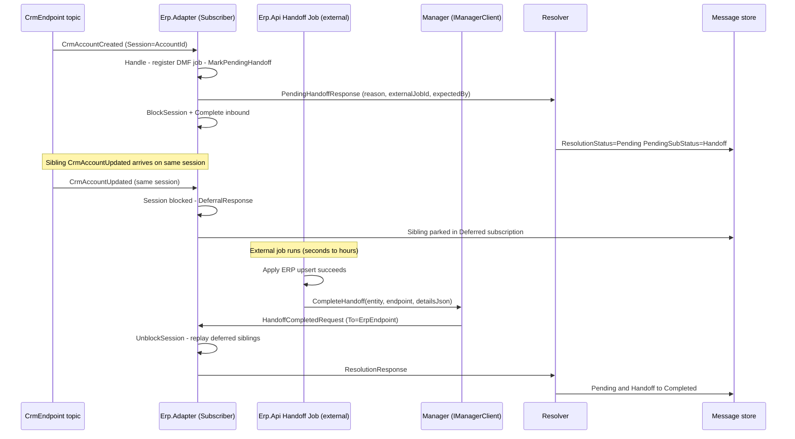
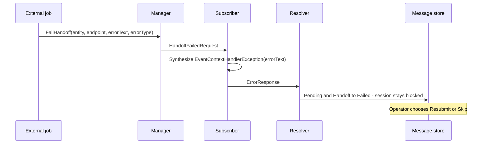

# Pending Handoff — long-running external work

How a NimBus subscriber hands a message off to a system that takes minutes
to hours to finish, keeps session ordering, and settles the message later
without re-invoking the user handler.

This is the operator/adapter-author reference for the feature. The
architectural decision lives in
[ADR-012](adr/012-pending-handoff.md); the on-wire flow appears as
[Flow 13](message-flows.md#13-pendinghandoff-async-completion) in the
message-flows catalogue; the relationship to other handler outcomes is
called out in
[`error-handling.md`](error-handling.md#exception-classification). This
document is the practitioner-level walk-through.

## When to use it

Use PendingHandoff when the handler delegates to an external system that:

- Takes longer than a Service Bus peek-lock can be held (~5 minutes), so
  the inbound message must be settled promptly while the work continues.
- Reports back asynchronously (callback, polled job status, file-drop,
  human approval).
- Must preserve session FIFO ordering — sibling messages in the same
  session have to wait for this work to finish before they run.

Classic examples: Dynamics 365 F&O DMF imports, batch ETL pipelines,
human approval queues, external signing/clearing workflows.

**Don't use it for** in-process retries (use the normal retry path),
fast downstream HTTP calls (just `await` them), or fire-and-forget work
(publish a follow-up event and return).

## End-to-end flow

The canonical reference is the **CrmErpDemo** sample. `CrmAccountCreated`
arrives at the ERP adapter; when handoff-mode is on, the handler registers
a fake DMF job and hands off. A background service drains expired jobs,
applies the ERP upsert, and tells NimBus to settle the message. Sibling
`CrmAccountUpdated` events on the same session defer FIFO and replay
after settlement.



The failure path is identical up to the settlement message: the external
job calls `IManagerClient.FailHandoff` instead, the subscriber translates
that into a synthesized `EventContextHandlerException`, and the audit
row flips Pending → Failed. The session stays blocked until an operator
clicks Resubmit or Skip from the WebApp.



## Handler side — declaring the handoff

The handler does normal work, then calls
`IEventHandlerContext.MarkPendingHandoff(...)` and returns. **It does not
throw.** `StrictMessageHandler` reads the outcome after the handler
returns and emits the `PendingHandoffResponse` automatically.

Reference: [`samples/CrmErpDemo/Erp.Adapter.Functions/Handlers/CrmAccountCreatedHandler.cs`](../samples/CrmErpDemo/Erp.Adapter.Functions/Handlers/CrmAccountCreatedHandler.cs)

```csharp
public sealed class CrmAccountCreatedHandler(
    IErpApiClient erp,
    IHandoffModeClient handoffMode,
    IHandoffJobRegistration jobRegistration,
    ILogger<CrmAccountCreatedHandler> logger)
    : IEventHandler<CrmAccountCreated>
{
    public async Task Handle(
        CrmAccountCreated message,
        IEventHandlerContext context,
        CancellationToken cancellationToken = default)
    {
        var mode = await handoffMode.GetAsync(cancellationToken);
        if (mode.Enabled)
        {
            var jobId = $"DMF-{Guid.NewGuid():N}".Substring(0, 16);

            // Register the external work. The job needs the audit-row coordinates
            // (EventId, SessionId, MessageId, EventTypeId, CorrelationId) so the
            // settlement step can address the same message later.
            await jobRegistration.RegisterAsync(new HandoffJob
            {
                EventId = context.EventId,
                SessionId = message.AccountId.ToString(),
                MessageId = context.MessageId,
                OriginatingMessageId = context.MessageId,
                EventTypeId = context.EventType,
                CorrelationId = context.CorrelationId,
                ExternalJobId = jobId,
                DueAt = DateTime.UtcNow.AddSeconds(mode.DurationSeconds),
                PayloadJson = JsonConvert.SerializeObject(message),
            }, cancellationToken);

            // Signal the outcome. The handler returns normally — the runtime
            // sends PendingHandoffResponse, blocks the session, and completes
            // the inbound message after Handle returns.
            context.MarkPendingHandoff(
                reason: "Awaiting ERP DMF import job (demo)",
                externalJobId: jobId,
                expectedBy: TimeSpan.FromSeconds(mode.DurationSeconds));
            return;
        }

        // Non-handoff path — synchronous downstream call.
        await erp.UpsertCustomerAsync(message.AccountId, /* … */, cancellationToken);
    }
}
```

Three things to know about `MarkPendingHandoff`:

| Parameter | Required | What the operator sees in the WebApp |
|---|---|---|
| `reason` | yes | Free-text label in the Pending row's detail pane. Make it human-readable: "Awaiting D365 DMF import" beats "handoff". |
| `externalJobId` | optional | Searchable identifier for the external work. Used by support to correlate the message with the upstream system. |
| `expectedBy` | optional | Relative timespan. The runtime stores the absolute UTC deadline. Used by the WebApp to flag overdue handoffs. |

Calling it multiple times is idempotent — the last call wins. You can
also do business logic before the call; only the values at handler-return
time are read.

## Settlement side — completing or failing the work

The external system (or a worker that watches it) tells NimBus how the
work ended by calling **`IManagerClient.CompleteHandoff`** or
**`FailHandoff`**. Both expect a `MessageEntity` populated with the
audit-row coordinates and `PendingSubStatus = "Handoff"`; everything
else can be null.

Reference: [`samples/CrmErpDemo/Erp.Api/HandoffMode/HandoffJobBackgroundService.cs`](../samples/CrmErpDemo/Erp.Api/HandoffMode/HandoffJobBackgroundService.cs)

```csharp
private async Task SettleAsync(HandoffJob job, CancellationToken cancellationToken)
{
    // CompleteHandoff / FailHandoff only inspect these six fields plus
    // PendingSubStatus. Anything else is accepted as null.
    var entity = new MessageEntity
    {
        EventId = job.EventId,
        SessionId = job.SessionId,
        MessageId = job.MessageId,
        OriginatingMessageId = job.OriginatingMessageId,
        EventTypeId = job.EventTypeId,
        CorrelationId = job.CorrelationId,
        PendingSubStatus = "Handoff",
    };

    await using var scope = services.CreateAsyncScope();
    var manager = scope.ServiceProvider.GetRequiredService<IManagerClient>();

    if (workSucceeded)
    {
        // Anything you want the audit trail to remember about the result.
        // Stored on the resulting ResolutionResponse and visible in the WebApp
        // flow timeline.
        var detailsJson = JsonConvert.SerializeObject(new
        {
            importedRecordId = job.ExternalJobId,
        });

        await manager.CompleteHandoff(entity, "ErpEndpoint", detailsJson);
    }
    else
    {
        // errorText becomes the ErrorContent on the Failed audit row.
        // errorType is a free-text classifier for grouping/alerting.
        await manager.FailHandoff(
            entity,
            "ErpEndpoint",
            errorText: "DMF rejected: invalid postal code",
            errorType: "DmfValidationError");
    }
}
```

Critical invariant: **the user handler is not re-invoked on settlement.**
If business state needs to change as part of a successful handoff (the
sample writes the ERP customer row), the settlement code has to do that
itself. The handler ran once at the start; settlement is purely an
audit/session-state transition.

### Wiring the Manager client

Settlement code typically lives outside the subscriber process (an API,
a worker, an Azure Function). Wherever it lives, register the manager
client and the same Service Bus client the rest of the platform uses:

```csharp
services.AddSingleton<IManagerClient, ManagerClient>();
services.AddAzureServiceBusClient("servicebus");
```

`IManagerClient.CompleteHandoff` / `FailHandoff` publish to the
subscriber endpoint's topic — no extra topology setup beyond what the
adapter already provisions.

## Audit semantics

| Stage | ResolutionStatus | PendingSubStatus | What the dashboard shows |
|---|---|---|---|
| After `PendingHandoffResponse` | `Pending` | `"Handoff"` | Pending column, "Awaiting external" badge with reason and ETA |
| After `HandoffCompletedRequest` → `ResolutionResponse` | `Completed` | `null` | Completed column |
| After `HandoffFailedRequest` → `ErrorResponse` | `Failed` | `null` | Failed column; operator can Resubmit / Skip |

Handoff metadata persisted alongside the row: `HandoffReason`,
`ExternalJobId`, `ExpectedBy`. Schema columns are added by
`0009_Handoff.sql` (SQL Server provider); the Cosmos provider stores
them on the document directly.

The `PendingSubStatus = "Handoff"` discriminator distinguishes a
pending-handoff entry from a deferred entry parked by session blocking.
Both belong to the Pending bucket on the endpoint dashboard.

## Operator surface (NimBus.WebApp)

The management UI treats handoff entries as first-class:

- The flow timeline colours the three new message types
  (`PendingHandoffResponse`, `HandoffCompletedRequest`,
  `HandoffFailedRequest`) so the lifecycle is visible at a glance.
- The message detail pane shows `HandoffReason`, `ExternalJobId`, and
  `ExpectedBy` when `PendingSubStatus = "Handoff"`.
- Resubmit / Skip remain available on a failed handoff (after
  `FailHandoff`) — the same controls used for any other Failed entry.

There is no operator action *during* the Pending stage. Settlement is
driven by the external system through `IManagerClient`, not by the
WebApp. If an external system is permanently stuck, the operator can
manually `FailHandoff` via the CLI or a one-off script to release the
session.

## See also

- [ADR-012 — PendingHandoff outcome](adr/012-pending-handoff.md) — why
  the feature is an `Outcome` enum and not an exception type.
- [Message Flows § 13](message-flows.md#13-pendinghandoff-async-completion) —
  the on-wire message diagram including deferred-sibling replay.
- [Error Handling](error-handling.md) — where PendingHandoff sits in the
  larger handler-outcome decision tree.
- [Deferred Messages](deferred-messages.md) — how session blocking and
  FIFO replay work, which the handoff path reuses without modification.
