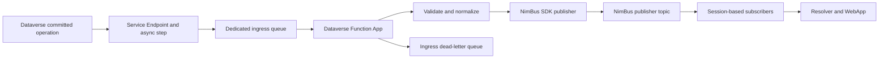

# Dataverse adapter extension — implementation plan

Date: 2026-09-09
Status: Local preview implemented and verified; external qualification is pending. Release build and all 14 local tests pass. No Azure resources or Dataverse registrations have been changed.

## Implementation evidence (2026-09-09)

- Implemented under `adapters/Dataverse`: Contracts, reusable ingress library, isolated Function App, explicit catalog endpoint, adapter solution and MSTest tests.
- Local input tests cover synthetic JSON only; source identity remains provisional. Runtime uses the existing repository Functions SDK family rather than migrating other hosts to Azure.Functions.Sdk.
- Implemented explicit publish-before-complete, permanent-input DLQ classification, stable provisional IDs, bounded projection, optional images and raw date-string preservation. Unsupported operations/tables are explicitly rejected; silent exclusions and custom business mapper hooks are not implemented.
- Added Bicep, source-free preview bundle/build/deploy scripts, a manually dispatchable compatibility build against an explicit published NimBus version, and preview CI artifact upload. No public release workflow/tag or minimum compatible SDK range is claimed.
- Added generate-from-code adapter TDD, events, registration, operations and compatibility documentation. Customer NFRs, owners, retention and real-environment acceptance remain open.
- Remaining gates: actual Functions listener/cloud smoke, Dataverse identity/payload captures, actual broker/subscriber/Resolver tests, published package compatibility and clean customer Azure deployment. Bicep compilation and generated trigger metadata do not replace those gates.
- Template currently scopes existing namespaces/topic to the deployment resource group. No alert resources, shared generic adapter framework, CLI management surface or SQL persistence is included.

## Outcome and decisions

Ship Dataverse ingestion as an optional, reusable NimBus platform extension. A customer deploys a versioned Azure Function App, configures its Dataverse Service Endpoint and steps, and receives standard NimBus events without writing ingestion code or cloning the NimBus repository.

- Keep source in this repository under `adapters/Dataverse/`; give the adapter its own solution, packages, deployment artifact, and CI entry point.
- Azure Functions v4 with a .NET 10 isolated worker is the default and only packaged host in v1. Do not also build a worker/container product for the first release.
- Default Azure hosting: Linux Flex Consumption. Validate runtime/region availability during the deployment spike. Premium is a documented alternative where customer networking or capacity requirements justify it, rather than a second mandatory deployment target.
- Default transport: one dedicated, non-session ingress queue per Dataverse environment/adapter instance. Publish through the existing NimBus SDK to the configured publisher endpoint; downstream NimBus subscriptions retain their normal sessions.
- Register asynchronous PostOperation steps for Create, Update, and Delete. JSON execution contexts are the supported input format. Account/contact configurations are examples; supported standard/custom tables use the same runtime.
- Publish versioned Dataverse record events by default. Business-specific mapping is optional and lives outside the standard contracts.
- Core never references Dataverse or the adapter. Reuse `INimBusBuilder`/DI rather than introducing a generic adapter framework.
- Treat ingress delivery as at least once. No claim of exactly-once publication or Dataverse commit-order preservation.

This plan assumes Dynamics applications backed by Dataverse. Finance and Operations-specific business events and Business Central-specific integration protocols are separate adapters or future work.

## Architecture



The Function App is a platform extension deployment, not a plug-in loaded into the Resolver or WebApp. The input is a Dataverse execution context, not a native NimBus subscriber message: do not pass it directly to `ISubscriberClient.Handle`.

## Existing implementation to reuse

| Existing source | Reuse and boundary |
| --- | --- |
| `src/NimBus.Core/Extensions/INimBusBuilder.cs` and `INimBusExtension.cs` | Public DI registration; no new extension discovery system |
| `src/NimBus.SDK/IPublisherClient.cs` and `PublisherClient.cs` | Publishing with explicit session/correlation/message identity; cancellation-aware prebuilt message overload if required |
| `samples/CrmErpDemo/DataPlatform.Adapter.Functions/` | Isolated Functions startup and telemetry reference, not a source of customer-specific handlers or relaxed analyzer settings |
| `docs/azure-functions-hosting.md` | Existing subscriber hosting reference; explain why ingress uses a non-session trigger instead |
| `src/NimBus.Core/Outbox/OutboxSender.cs` | Existing outbox capability; not a ready-made atomic ingress inbox/outbox transaction |
| `docs/adr/015-customer-deployment-distribution.md` | Align with source-free customer deployments and existing artifact distribution |
| `.github/workflows/nuget-publish.yml` | Existing release builds/packs only `src/NimBus.sln`; adapter release needs explicit wiring |
| `Directory.Build.props` | `Akaule.*` package IDs, nullable/API docs and Release settings; inherit these defaults |

## Proposed repository layout

```text
adapters/
  README.md
  Dataverse/
    NimBus.Adapters.Dataverse.sln
    README.md
    src/
      NimBus.Adapters.Dataverse.Contracts/
      NimBus.Adapters.Dataverse/
      NimBus.Adapters.Dataverse.Functions/
    tests/
      NimBus.Adapters.Dataverse.Tests/
      NimBus.Adapters.Dataverse.Functions.Tests/
      NimBus.Adapters.Dataverse.IntegrationTests/
      fixtures/
    deploy/
      main.bicep
      parameters.example.json
      deploy.ps1
    docs/
      TDD.md
      events.md
      dataverse-registration.md
      operations.md
      compatibility.md
```

Contracts depend only on the minimal NimBus event contracts and serialization primitives. The reusable adapter library contains parsing, validation, normalization and publication orchestration. The Functions project owns trigger bindings, settlement and host configuration. Package IDs follow `Akaule.NimBus.Adapters.Dataverse[.Contracts]`; the Functions project produces a deployment artifact rather than a general-purpose library package.

One Function App handles one configured Dataverse organization in v1. Multiple organizations use separate deployments and identities. Keep a registration/configuration schema local to this adapter until another adapter establishes a real shared requirement.

## Contract and configuration design

Proposed v1 events: `DataverseRecordCreated`, `DataverseRecordUpdated`, and `DataverseRecordDeleted`, each with an explicit versioned event-type ID and catalog registration.

Common fields: source organization/environment identity, table logical name, record GUID, source operation identity, source correlation, source operation time when available, ingress receipt time, and registration identity when available. Do not conflate source operation time with receipt time or claim an absent source sequence/version.

- Create: configured available post-image/target data, explicitly marked with its completeness/representation.
- Update: changed-attribute patch with explicit null values distinct from absent attributes; configured images may be carried separately. Filtering attributes indicate inclusion in an update, not proof that the value changed.
- Delete: record identity plus configured available pre-image; never attempt a post-delete fetch as the default.
- Normalize lookup references, money, options, option collections, GUIDs, dates and nulls into documented JSON-safe values. Do not expose `Microsoft.Xrm.Sdk` types in public event contracts or enable arbitrary CLR type deserialization.
- Preserve table/column logical names. Do not fetch the current record automatically or label current state as the historical event snapshot.
- Configure allowed tables, operations and columns, required image aliases, output publisher endpoint, source organization, session policy and payload bounds. An explicit allowlist is required; unknown input fails closed with a documented classification.
- Use a scoped source registration manifest for setup, examples and validation. The default deployment must not require customer code. Support an optional mapping interface for custom hosts later in the implementation, without arbitrary runtime code loading.
- Initial mapping contract emits one event per accepted input. Fan-out business transformations and calls back into Dataverse are outside v1.

## Identity, ordering and settlement

Source identity is a release-blocking feasibility question, not a guessed formula. Capture real Dataverse retries to determine which identifiers remain stable across a Dataverse repost, broker redelivery and DLQ replay. Scope identities by organization and registration; neither record ID nor correlation ID alone identifies an individual change. The broker MessageId alone may cover redelivery but not Dataverse reposts. Quarantine contexts that cannot meet the documented identity rule instead of silently assigning a fresh random ID.

Derive the outgoing MessageId deterministically from the verified source occurrence plus output event identity/version. Use a bounded encoded/hash representation where necessary. Session defaults to organization + table + record GUID. Preserve source correlation separately and make output serialization deterministic across retries.

Default v1 processing:

1. Receive with PeekLock, single-message trigger and automatic completion disabled.
2. Validate source, operation, bounds and truncation indicators; normalize and construct the NimBus event/envelope through supported APIs.
3. Await the configured NimBus publisher's direct send. Pass cancellation through supported APIs; verify outgoing metadata and actual topic routing.
4. Complete the input only after successful send. On send/complete ambiguity, leave the input eligible for redelivery.

The crash window after send and before completion can publish a duplicate. Stable IDs and configured broker duplicate detection mitigate this within its retention window; consumers must remain idempotent for later retries/replays. Test both cases. A standalone "processed" marker before send can lose messages; a marker after send cannot provide atomic exactly-once delivery. Do not add one and claim otherwise.

Do not require SQL for v1. If durable ingestion/outbox storage is later required, separately design an atomic inbox-plus-outbox commit and prove dispatch behavior in a scaling Function App. Merely registering `OutboxSender` does not establish that transaction or guarantee a background dispatcher runs while the host scales to zero.

NimBus sessions serialize downstream arrivals; Dataverse asynchronous delivery and parallel Function invocations can reorder source changes before publication. Document this explicitly. Include source version metadata where actually available; strict state synchronization needs a defined version/reconciliation strategy and is outside the default adapter's promise.

## Implementation sequence and acceptance gates

### 1. Prove the external integration and hosting assumptions

Use an explicitly designated Dataverse development environment and isolated Azure resources. Capture sanitized JSON fixtures for Create, Update and Delete, including lookup/choice/money/null attributes, configured images and repeated delivery. Verify broker properties, operation identity, message format, absence/presence of SessionId, authorization and the deployed Functions trigger.

Exercise source registration, SAS rotation and the customer's intended network path. Dataverse-to-Service-Bus SAS is separate from the Function App's managed identity; do not assume a generic trusted-services exception permits Dataverse through a locked-down namespace.

**Exit:** observed payload/identity contract, working .NET 10 Function in the selected hosting plan, documented network/auth prerequisites. No production release or final public contract until identity stability has evidence. Lack of tenant access blocks only this gate; local package/parser/test work can continue with clearly labeled provisional fixtures.

### 2. Scaffold the adapter boundary and freeze contracts

Create the adapter solution and three source projects above. Add tests using MSTest and inherited repository quality rules. Define the contract serialization, catalog registration, configuration validation and registration manifest. Write failing tests before parser/normalizer implementation. Add the adapter to the extension catalog documentation.

**Exit:** contracts round-trip through the normal NimBus serializer, do not leak Dataverse SDK types, and can be referenced by a small consumer without loading the Functions host.

### 3. Implement parsing and publication orchestration

Implement a bounded JSON reader for the supported execution-context subset, source/operation validation, record normalization, identity/session generation and publication through the existing SDK. Recognize `MessageMaxSizeExceeded` and missing required data explicitly. Use real fixture tests from step 1; document unsupported value kinds rather than silently stringifying them.

Classify ignored-by-configuration inputs separately from malformed input: intentional exclusions may complete with an observable reason; malformed/truncated supported events dead-letter. Verify configuration identity against context identity; do not trust input to select arbitrary destinations.

**Exit:** repeat input generates equivalent event content and identical outgoing identity; distinct updates to the same record remain distinct. Sender metadata, event-type routing and cancellation are verified against the actual SDK implementation.

### 4. Implement the Functions host and failure behavior

Add the queue trigger with `IsSessionsEnabled=false` and `AutoCompleteMessages=false`. Reuse a singleton Service Bus client for publishing; support separate ingress and NimBus namespaces. Expose bounded concurrency and lock-renewal configuration; avoid aggressive prefetch by default. Validate options at startup.

Use the Functions host's Service Bus retry/redelivery mechanism for transient errors. Explicitly dead-letter permanent parse/contract failures with stable reason codes and sanitized descriptions. Preserve cancellation and lock-loss behavior. The successful path must await publication before completion; unsupported/malformed messages must never be published.

**Exit:** tests cover send failure, completion failure after send, process interruption, duplicate delivery, parallel invocations, cancellation, poison input, and correct disposition. A real Functions host discovers the trigger and receives a broker message; a direct C# invocation of the function method alone is insufficient proof.

### 5. Ship deployment and Dataverse onboarding

Provide Bicep and a release-artifact deployment script for the Function App, host/deployment storage, telemetry, ingress queue and scoped role assignments. Reference the existing NimBus namespace/publisher resources; do not grant the runtime topology-management rights. Apply NimBus event/endpoint topology through the established provisioning path.

Use managed identity for Function ingress receive and NimBus publish, and identity-based Functions host storage where supported. Distinguish runtime grants from the deployment principal's provisioning permissions. Document Dataverse's entity-scoped Send SAS registration and rotation without placing keys in committed parameters, logs, artifacts or outputs. Configure broker duplicate detection deliberately on the output topic and state its bounded protection.

Dataverse setup includes Service Endpoint JSON registration, async steps, filtering attributes, image aliases/columns, enabling/disabling steps, a test operation, and rollback. Initially use documented Plug-in Registration Tool instructions plus the versioned manifest; do not build an automatic tenant-mutating installer before the setup contract is proven.

**Exit:** a clean customer deployment directory can install pinned artifacts and configure an organization without a NimBus source checkout. Validate Bicep before deployment, then prove the documented setup in the designated test environment.

### 6. Add operational evidence and end-to-end validation

Emit structured logs and metrics for received, published, intentionally ignored, invalid/dead-lettered, failed, processing latency and source-to-ingress age when a reliable timestamp exists. Correlate with source identity and NimBus message/session identity. Avoid payload logging and high-cardinality metric labels.

Alert on ingress age/backlog, DLQ growth and repeated send/authentication failures. Document three separate failure domains: Dataverse System Jobs, adapter ingress/DLQ, and NimBus downstream Resolver processing. A source-only adapter does not automatically answer NimBus subscriber heartbeat probes; verify its catalog/health presentation rather than showing it as an offline subscriber.

Provide a runbook for inspecting and deliberately replaying selected ingress DLQ messages after correction, preserving original identity. No automatic perpetual DLQ replay or unbounded logging of source data. Show how to find the resulting event and consumer outcome in the WebApp.

**Exit:** a real Dataverse operation reaches a real NimBus subscriber and Resolver audit; a failed normalization remains in the ingress DLQ; a subscriber failure appears through normal NimBus handling. Verify retries do not change logical identity, and demonstrate the documented duplicate/order limits.

### 7. Package, release and document compatibility

Add adapter CI that restores/builds/tests its explicit solution and publishes its Functions project. Pin a supported Functions SDK/toolchain after step 1; restore the Functions project explicitly when required by the selected SDK. Keep nullable, XML API docs and analyzer checks; do not copy sample-project analyzer exemptions.

Produce Contracts and adapter NuGet packages, a tested Functions deployment bundle, Bicep/parameters/setup docs, and a manifest recording adapter version, artifact hashes and tested NimBus version range. Start with an explicit adapter version stream/tag such as `dataverse-v0.1.0`, without changing core release behavior. Verify the new tag does not accidentally trigger core publishing.

Adapter CI triggers on adapter changes and relevant SDK/core/shared build inputs. Include a consumer compatibility build against packed/released NimBus dependencies so project references cannot hide use of unreleased APIs. Test the minimum advertised compatible version and current version. Release from the exact tested outputs, not a later unverified rebuild.

Use the existing adapter documentation skill when producing `docs/TDD.md` and `docs/events.md`; include operations, registration, deployment and compatibility guides. Customer sample business mapping can follow after the no-code default path works.

**Exit:** released artifacts deploy without source and pass the clean-install smoke test. No standalone worker, generic plug-in marketplace, custom `nb adapters` CLI or WebApp redesign is required for this release.

## Verification checklist

- Local deterministic tests: shape/value normalization, missing-vs-null, bounded payloads, allowed sources, truncation, repeat/distinct identity, session mapping, routing and cancellation.
- Functions settlement tests: success, permanent failure, transient failure, post-send completion failure, pause/restart/redelivery and cancellation.
- Broker integration: actual published properties/body, configured sessions, duplicate-detection window and consumer idempotency behavior.
- Azure smoke: deployed isolated Functions trigger, managed identity, source SAS, runtime storage, networking and scale-out behavior.
- Dataverse acceptance: committed Create/Update/Delete with configured images; inspect System Jobs and correlate source to final NimBus outcome.
- Operational acceptance: DLQ alert/replay, expired credential diagnosis, source age/backlog and downstream incident distinction.
- Packaging acceptance: pinned deployment from an empty customer directory; upgrade/rollback retains queue data and stable contract compatibility.

Tests are written before implementation for new behavior. Use correct-case working directory `C:\Git\NimBus`, MSTest `[TestClass]`/`[TestMethod]`, repository test warning conventions and Release checks. No push, PR, cloud deployment or Dataverse registration is performed by this planning task.

## Deferred work

Outbound Dataverse writes; automatic current-record enrichment; guaranteed source-order reconstruction; durable source outbox; topic ingress host variant; customer business schemas; worker/container distribution; generic adapter framework; custom UI/CLI adapter management. Revisit each against a concrete customer requirement.

## References checked

- [NimBus extension model](../../extensions.md).
- [Existing NimBus Functions subscriber guide](../../azure-functions-hosting.md).
- [Dataverse Service Bus integration](https://learn.microsoft.com/en-us/power-apps/developer/data-platform/azure-integration): execution-context JSON and truncation behavior.
- [Dataverse Service Endpoint registration](https://learn.microsoft.com/en-us/power-apps/developer/data-platform/walkthrough-configure-azure-sas-integration): SAS destination configuration.
- [Azure Functions isolated worker guide](https://learn.microsoft.com/en-us/azure/azure-functions/dotnet-isolated-process-guide): .NET 10 support and Linux Flex Consumption rather than legacy Linux Consumption; current SDK/restore requirements must be reflected in the host build.
- [Service Bus trigger](https://learn.microsoft.com/en-us/azure/azure-functions/functions-bindings-service-bus-trigger): explicit settlement and identity-based connections.
- [Dataverse concurrency guidance](https://learn.microsoft.com/en-us/power-apps/developer/data-platform/scalable-customization-design/concurrency-issues): asynchronous concurrency does not establish a per-record delivery-order guarantee.
