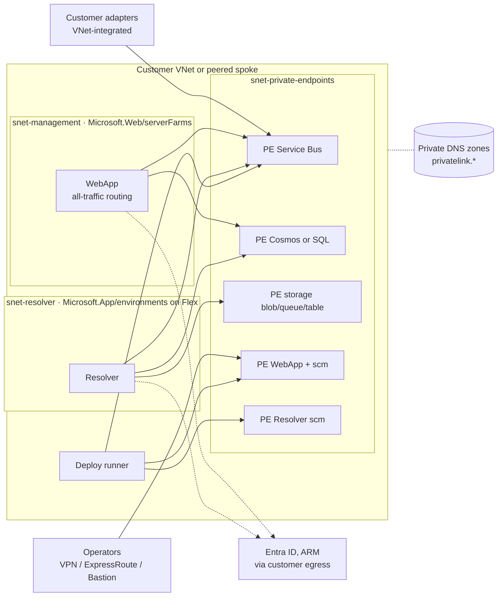

# Spec 034 — Private networking deployment mode (VNet-only NimBus)

Status: Draft for review (2026-09-24). Phase 0 (§5.6) implemented in `fd2a578a`; Phases 1–4 not
started. Topology visual: `topology.html` in this folder.
Baseline: master `c9d1a723`.
Scope: `deploy/bicep`, the `nb` CLI (`infra apply`, `setup`, `topology apply`, `deploy apps`), the
two deploy pipelines, two small WebApp changes, docs. No change to the transport, the storage
contracts or the message flow.
Why: security-focused customers require that every NimBus component and data path runs inside
their virtual network. NimBus cannot meet that today. This spec defines what the requirement
means, what blocks it, and an opt-in `private` deployment mode that meets it.
Review status: one external review (2026-09-24); all five findings accepted, see §15.

## 1. Summary

The application code is largely ready. The Resolver, the WebApp and the SDK reach Service Bus
by host name with managed identity, reach Cosmos DB with Entra RBAC, and manage Cosmos containers
through Azure Resource Manager. A private endpoint changes what a host name resolves to, not the
name, so no transport or store code has to change.

The infrastructure is not ready:

1. Service Bus is deployed on the **Standard** tier. Private endpoints and VNet service endpoints
   exist only on **Premium**. This is the one blocker that is not a template flag, and the one
   with a real cost impact.
2. No template declares a virtual network, private endpoint, private DNS zone or
   `publicNetworkAccess: 'Disabled'`. Azure SQL is explicitly public, with a firewall rule that
   admits every Azure tenant.
3. Neither app is VNet-integrated. On Elastic Premium the Resolver would also stop scaling
   against a private Service Bus unless runtime scale monitoring is switched on.
4. Deployment runs on public hosted agents. `nb topology apply` (Service Bus data plane) and
   `nb deploy apps` (Kudu/scm) cannot reach private endpoints from there.

The design adds an opt-in `networkMode = private` to the Bicep templates and the CLI (default
`public`, unchanged). It uses bring-your-own subnets, three private-DNS modes that fit enterprise
landing zones, Service Bus Premium, private monitoring through an Azure Monitor Private Link Scope,
an in-network deployment runner, and a two-pass, reversible switch for existing deployments
(§5.13). Identity hardening (no SQL password, local auth off, Key Vault) follows as a later
phase (§5.12).

Found along the way, independent of networking: the WebApp still queries Application Insights
with an API key, and Microsoft retired API-key access to that query API on 2026-03-31 (§5.6,
Phase 0).

## 2. What "everything runs in a virtual network" means

Customers use the phrase loosely. This spec treats it as these acceptance criteria:

- **R1 No inbound public path.** Service Bus, the message store (Cosmos DB or Azure SQL), the
  Functions storage account, the WebApp and the Resolver (including their Kudu/scm endpoints) and,
  when configured, Key Vault and Application Insights/Log Analytics reject traffic from the
  public internet.
- **R2 Controlled egress.** Both apps send all outbound traffic, application and configuration
  traffic alike, into the customer VNet, where the customer's NSGs, route tables and firewall
  decide what leaves.
- **R3 Private service-to-service traffic.** Every hop between NimBus components and Azure data
  services uses a private endpoint and private DNS.
- **R4 Private operator access.** People reach the WebApp only from the private network (VPN,
  ExpressRoute, Bastion), optionally through a customer-managed reverse proxy or WAF.
- **R5 Private operations.** Deployments and operator CLI commands run from inside the network.
- **R6 Policy-compatible.** A private deployment succeeds when the customer enforces the Azure
  Policy built-ins that deny public network access or require private link for these services.
  Every resource must be compliant in the PUT that creates it, not patched afterwards.
- **R7 No regression.** `networkMode = public` (the default) makes no effective change to what is
  deployed today. It does declare today's defaults for the properties private mode changes (for
  example `publicNetworkAccess: 'Enabled'`), so that switching back from private is deterministic
  (§5.13).

Non-goals: putting Microsoft Entra ID or Azure Resource Manager inside the VNet (they are public
control-plane services, reached through controlled egress, §5.11); App Service Environment;
Network Security Perimeter; customer-managed keys; hosting customer adapters (requirements are
documented, §5.9); transports other than Azure Service Bus (AGENTS.md).

## 3. Current state

| Component | Today (evidence) | Can it be private? | Gap |
|---|---|---|---|
| Service Bus | `sku: Standard` (`deploy/bicep/templates/servicebusNamespace.bicep:8`), API `2022-01-01-preview`, no network properties | No. Standard only offers an IP firewall | Premium SKU, private endpoint, public access off |
| Cosmos DB | No network properties (`templates/cosmosDB.bicep`). Apps use Entra RBAC. Shared containers are declared in Bicep; per-endpoint containers are created and deleted through ARM (`EndpointContainerProvisioner.cs:79`, `ArmCosmosContainerAdmin`) | Yes, any tier | Private endpoint, public access off |
| Azure SQL | `publicNetworkAccess: 'Enabled'` (`templates/azureSql.bicep:27`) and the `AllowAllWindowsAzureIps` 0.0.0.0 rule (`:36`). SQL login with the admin password inside the app connection string (`deploy.core.bicep:285`) | Yes | Private endpoint, public access off (Phase 4: managed identity) |
| Functions storage | Public. Elastic Premium uses account-key connection strings for `AzureWebJobsStorage` and the content share (`deploy.core.bicep:281,313`, `templates/storageaccount.bicep:33`). Flex uses its identity | Yes | Private endpoints (blob/queue/table, plus file on EP), public access off, pre-created content share on EP |
| Resolver | No VNet integration, no private endpoint. Service Bus trigger by FQDN with managed identity. No HTTP triggers | Yes (Flex and EP) | VNet integration, private endpoint for scm, EP runtime scale monitoring |
| WebApp | No VNet integration, no private endpoint. Plan B1 (dev) or S1 | Yes (Basic and above support both) | VNet integration with all-traffic routing, private endpoint, public access off |
| Application Insights | Component without a workspace (`templates/applicationInsights.bicep`). The WebApp queries `api.applicationinsights.io` with `x-api-key` (`src/NimBus.WebApp/Startup.cs:585-589`), a key `nb infra apply` deletes and recreates on every run (`InfrastructureDeployer.cs:389`) | Only workspace-based, through an AMPLS | Workspace-based component, AMPLS, Entra query auth |
| Deployment | `runs-on: ubuntu-latest` (`.github/workflows/deploy.yml:50`), `vmImage: ubuntu-latest` (`pipelines/azure-pipelines-deploy.yml:38`). `nb topology apply` reads `RootManageSharedAccessKey` and calls the Service Bus data plane (`src/NimBus.CommandLine/ServiceBusTopologyProvisioner.cs:77-80`). `nb deploy apps` pushes zips to Kudu (`AppDeploymentService.cs:61,179`) | Needs an in-network runner | Runner, pre-flight check |
| Operator CLI | `nb endpoint …` and `nb container …` already accept an FQDN or endpoint with `DefaultAzureCredential` (`CommandRunner.cs`) | Yes | Must run in-network |

What already works and needs no code change:

- Managed-identity Service Bus clients in the Resolver (`src/NimBus.Resolver/ServiceExtensions.cs:45`)
  and the WebApp (`Startup.cs:480-483`), and Cosmos RBAC in both.
- Cosmos container management goes through ARM. Data-plane network rules don't affect the
  control plane.
- SQL schema migrations run inside the apps (`SqlServerSchemaInitializer`, a hosted service
  running DbUp), not from the deploy agent.
- The optional Resolver → WebApp storage-hook notifier (`ServiceExtensions.cs:77`) resolves the
  WebApp through the private DNS zone once both apps are integrated.
- The Bicep templates are embedded in the CLI by a glob (`NimBus.CommandLine.csproj:29`), so new
  modules ship without packaging changes.

## 4. Target topology

**Subnets.** These are inputs. NimBus does not change a customer VNet unless the optional
convenience network (§7, Phase 3) is used.

| Subnet | Used by | Delegation | Size (Microsoft guidance) | Notes |
|---|---|---|---|---|
| Private endpoints | All NimBus private endpoints (6–10) | none | /27 is ample | Can be shared with other workloads |
| Resolver integration | Resolver Function App | Flex: `Microsoft.App/environments`. EP: `Microsoft.Web/serverFarms` | Flex: /27 for one app, /26 if shared. EP (Windows): /24 recommended, /28 minimum | Same region as the app. Flex rejects subnet names containing `_`. Flex needs the `Microsoft.App` provider registered |
| Management integration | WebApp | `Microsoft.Web/serverFarms` | /26 recommended, /28 minimum | Same region as the app |

An integration subnet can't also host private endpoints.

**Private DNS zones.**

| Service | Private endpoint group id | Zone |
|---|---|---|
| Service Bus | `namespace` | `privatelink.servicebus.windows.net` |
| Cosmos DB (NoSQL) | `Sql` | `privatelink.documents.azure.com` |
| Azure SQL | `sqlServer` | `privatelink.database.windows.net` |
| Storage | `blob`, `queue`, `table`, plus `file` on EP | `privatelink.{blob,queue,table,file}.core.windows.net` |
| WebApp and Resolver, including scm | `sites` | `privatelink.azurewebsites.net` |
| Key Vault (Phase 4) | `vault` | `privatelink.vaultcore.azure.net` |
| Azure Monitor (AMPLS `create` mode only) | `azuremonitor` | `privatelink.monitor.azure.com`, `privatelink.oms.opinsights.azure.com`, `privatelink.ods.opinsights.azure.com`, `privatelink.agentsvc.azure-automation.net`, and the blob zone above |

## 5. Design

### 5.1 Principles

- **Opt-in and sticky.** `public` stays the default (R7). The CLI records the intended network
  state on the resource group and converges to it on every run, in the spirit of the location and
  plan-type pins it already applies (`InfrastructureDeployer.ApplyAsync`). Leaving private mode
  needs an explicit `--network-mode public` (§5.13).
- **Ordered.** Within a deployment, dependencies come before dependants, and nothing is locked
  before the apps reach it privately (§5.13).
- **Bring your own network.** Subnets are inputs, so the core templates have one code path.
  Enterprises almost always own their hub-and-spoke networks.
- **Pluggable DNS.** Create, reuse or leave DNS to the customer's Azure Policy (§5.3).
- **Compliant at creation.** Network properties sit in each resource's initial declaration, so
  deny policies pass (R6).
- **One provisioning path.** Topology is still created only by `ServiceBusTopologyProvisioner`.
  The runner goes to the network; the network isn't opened for the runner.
- **Flex Consumption is the preferred Resolver plan for private mode.** It uses identity-based
  storage, has no Azure Files content share, and scales on VNet-restricted triggers natively.
  Elastic Premium stays supported.

### 5.2 Template changes (private mode)

| Template | Change |
|---|---|
| `deploy.core.bicep`, `deploy.webapp.bicep` | New parameters: `networkMode` (`public` or `private`, default `public`), `privateEndpointSubnetId`, `resolverSubnetId`, `managementSubnetId`, `privateDnsMode`, `privateDnsZoneScope`, `privateDnsLinkVnetIds`, `serviceBusCapacity`, `serviceBusNamespaceName` (empty keeps `sb-{solution}-{env}`), `monitorPrivateLinkMode`, `monitorPrivateLinkScopeId`, `allowPublicAccess` (selects the `private-transition` state, default `false`, §5.13). Input validation in the style of the existing `storageValidation`. |
| `templates/servicebusNamespace.bicep` | `sku` parameter. On Premium: `capacity` (messaging units), `premiumMessagingPartitions: 1`, `minimumTlsVersion: '1.2'`, and `publicNetworkAccess` plus a `networkRuleSets/default` (trusted-service bypass off) set per network state (§5.13): Disabled, default action Deny, in `private`. API `2024-01-01`. Topology is compatible: the provisioner never sets `EnablePartitioning` and creates topics at 5120 MB with ordering and 10-minute duplicate detection (`src/NimBus.ServiceBus/Provisioning/ServiceBusTopologyProvisioner.cs:204-218`), which a non-partitioned Premium namespace supports (size to verify, §13). |
| `templates/cosmosDB.bicep` | `publicNetworkAccess` per state (§5.13); `networkAclBypass: 'None'` in `private`. Also delete the unused `connectionString` output (`:140`, no consumer), which reads the account keys on every deployment. |
| `templates/azureSql.bicep` | `publicNetworkAccess` per state (§5.13). The `AllowAllWindowsAzureIps` rule is declared in `public` and `private-transition` only. An incremental deployment doesn't delete a resource that drops out of the template, so the CLI deletes the rule explicitly when a server switches to `private` (§5.13). |
| `templates/storageaccount.bicep` | In `private`: `publicNetworkAccess: 'Disabled'`, `networkAcls.defaultAction: 'Deny'`, `allowBlobPublicAccess: false`, `minimumTlsVersion: 'TLS1_2'`. In `public` and `private-transition` the first two are declared open (Enabled, Allow): Deny alone already cuts off every client that doesn't yet have a private path (§5.13). EP: declare the content file share, because the platform can't create it once the account is private, and keep shared-key access, which the Azure Files content share needs. Flex could use `allowSharedKeyAccess: false` (Phase 4). API bump. |
| `templates/flexConsumptionFunctionApp.bicep` | `virtualNetworkSubnetId`, `publicNetworkAccess` per state, `sites` private endpoint. Flex routes all outbound traffic into the VNet without a setting (whether that includes managed-identity token requests: §13). |
| `templates/functionApp.bicep` (EP) | API bump. `virtualNetworkSubnetId`. `outboundVnetRouting.allTraffic: true`, not the legacy `vnetRouteAllEnabled` / `vnetContentShareEnabled` flags: legacy route-all covers application traffic only, while `allTraffic` also routes configuration traffic (content share, managed-identity token acquisition) and is what Microsoft's built-in audit policy checks (API version: §13). NSGs and firewalls on the subnet must allow 443 and 445 to the file private endpoint. `siteConfig.functionsRuntimeScaleMonitoringEnabled: true`. Without it a VNet-restricted trigger never scales past the prewarmed instance count, so the Resolver would stay on one instance whatever `resolverMaxInstances` says. The Resolver loads WebJobs Service Bus extension 5.17.0 (generated `WorkerExtensions.csproj`), above the minimum for target-based scaling. Also `publicNetworkAccess` per state and a `sites` private endpoint. |
| `templates/webApp.bicep` | `virtualNetworkSubnetId`, `outboundVnetRouting.allTraffic: true` (as for EP), `publicNetworkAccess` per state, `sites` private endpoint, explicit `minTlsVersion: '1.2'`. |
| `templates/applicationInsights.bicep`, new `templates/logAnalyticsWorkspace.bicep` | §5.6. |
| `templates/roleAssignments.bicep` | A read role for the WebApp identity on the Application Insights component (Phase 0). |
| New `templates/privateEndpoint.bicep` | One private endpoint plus an optional DNS zone group (array of zone ids). Used about eight times. |
| New `templates/privateDnsZones.bicep` | Zones and VNet links for DNS mode `create`. |

Every network resource NimBus creates carries the tag `nimbus-deployment = <solutionId>-<environment>`,
so the cleanup in §5.13 can tell NimBus-owned resources from the customer's.

Hand-written modules rather than Azure Verified Modules: the templates compile at deploy time
from the copy embedded in the CLI (ADR-015). Registry modules would make every `nb infra apply`
depend on the public Bicep registry, which in-network runners may not reach.

### 5.3 Private DNS modes

- **`create`** (for standalone installs, evaluation and VNets dedicated to NimBus). NimBus creates
  the zones it needs in its own resource group, each zone once (storage and AMPLS share the blob
  zone). It links them to `privateDnsLinkVnetIds` (default: the VNet of the private-endpoint
  subnet) and adds a zone group to each private endpoint. A linked zone answers for every name of
  its type resolved from that VNet, so a NimBus-created `privatelink.blob.core.windows.net` linked
  into a shared VNet would hide other storage accounts' private endpoints. NimBus therefore
  creates its links with fallback to internet (`resolutionPolicy: 'NxDomainRedirect'`, Private DNS
  API 2024-06-01 or later), and shared or hub-connected VNets should use `existing` or `external`.
  A VNet can't link two zones with the same name, so a VNet that already links a hub zone fails the
  deployment with a conflict rather than breaking silently.
- **`existing`** (hub-and-spoke). The zones already live in a customer resource group, usually in
  the hub. `privateDnsZoneScope` is that resource group's id, and NimBus builds each zone id from
  the standard zone name. The deploying identity needs Private DNS Zone Contributor there, and the
  zone-group module is scoped across subscriptions.
- **`external`** (policy-driven landing zones). NimBus creates private endpoints without zone
  groups. The customer's DeployIfNotExists policy or custom DNS writes the records, possibly
  minutes later. The pre-flight check (§5.7) waits for them before any data-plane step runs.

In every mode, creating a private endpoint changes the resource's public DNS answer so that it
points into the privatelink zone. Any network whose DNS carries that zone (an adapter VNet linked
to the hub zones, for example) then needs the new record, or fallback to internet on its link.
Otherwise it loses resolution even while public access is still on (§6).

Custom DNS servers must either host the privatelink zones or forward the public zones
(`servicebus.windows.net` and so on) to Azure DNS at 168.63.129.16.

### 5.4 Service Bus tier

- Private mode creates Premium, with `--service-bus-capacity` messaging units (default 1).
- The CLI reads an existing namespace's `sku.tier`, capacity and `publicNetworkAccess`, as it
  reads plans today (`InfrastructureDeployer.DiscoverExistingPlansAsync`). It never sends Standard
  for an existing Premium namespace, and refuses private mode on an existing Standard namespace
  with the options in §6. Azure can't convert Standard to Premium in place. The network mode
  itself comes from the recorded intent, not from this discovery (§5.13).

### 5.5 CLI surface

New options on `nb infra apply` and `nb setup`, passed to Bicep only when given, as the
capacity options are:

| Option | Values | Default |
|---|---|---|
| `--network-mode` | `public`, `private` | The intended state recorded on the resource group (§5.13), otherwise `public` |
| `--private-endpoint-subnet-id` | resource id | Required in private mode |
| `--resolver-subnet-id` | resource id | Required in private mode |
| `--webapp-subnet-id` | resource id | Required in private mode |
| `--private-dns` | `create`, `existing`, `external` | Required in private mode (§12, decision 2) |
| `--private-dns-zone-scope` | resource group id | Required with `existing` |
| `--private-dns-link-vnet-id` | resource id, repeatable | VNet of the private-endpoint subnet (`create` only) |
| `--service-bus-capacity` | 1, 2, 4, 8, 16 | 1 |
| `--monitor-private-link` | `existing`, `create`, `none` | Required in private mode (§12, decision 4) |
| `--monitor-private-link-scope-id` | resource id | Required with `existing` |
| `--allow-public-access` | flag | Off. Selects `private-transition` (§5.13, §6) |
| `--skip-transition` | flag | Off. Allows a direct public → private switch, accepting downtime (§5.13) |
| `--dns-wait` | minutes | 10. Retry window of the pre-flight check (§5.7) |
| `--service-bus-namespace-name` | name | `sb-{solution}-{env}`. Also on `topology apply`, `deploy apps` and `setup` (§6, option A) |

Validation runs before any side effect, in the style of `PlanSelection`:

- subnets exist, sit in the app's pinned region, carry the right delegation for the chosen
  Resolver plan, and have no `_` in the name on Flex;
- the private-endpoint subnet isn't an integration subnet;
- the management plan SKU isn't Free or Shared (reuse `PlanSelection.SupportsAlwaysOn`);
- the `Microsoft.Network` and, on Flex, `Microsoft.App` providers are registered (a warning, like
  the existing `Microsoft.EventGrid` check).

New optional members go on `InfrastructureOptions` (`CommandSupport.cs:153`).

### 5.6 Monitoring

**Phase 0: Entra-authenticated query. Independent, ships first.**

- Microsoft retired API-key access to the Application Insights query API
  (`api.applicationinsights.io`) on 2026-03-31. The WebApp's log view (`ApplicationInsightsService`,
  `Startup.cs:578-590`) is therefore expected to fail in deployed environments today.
- `nb infra apply` still deletes and recreates a `management-app` API key on every run
  (`InfrastructureDeployer.cs:389-431`). Whether `api-key create` itself still succeeds is
  unverified (§13). If it doesn't, every `nb infra apply` fails at "Preparing web app
  infrastructure inputs".
- Change: get a token with `DefaultAzureCredential` for `https://api.applicationinsights.io/.default`
  and send it as a bearer token. The endpoint, query and result parser stay the same. Grant the
  WebApp identity a read role on the component in `roleAssignments.bicep` and stop creating API
  keys in the CLI.
- Keep `apiKey` in `deploy.webapp.bicep` as an accepted, ignored, deprecated parameter until the
  next major, because raw-Bicep callers pass it (`docs/versioning.md`).

**Phase 2: private telemetry.**

- **Workspace-based Application Insights.** Add a Log Analytics workspace
  (`templates/logAnalyticsWorkspace.bicep`) and set `WorkspaceResourceId` and
  `IngestionMode: 'LogAnalytics'` on the component. The current template declares no workspace, so
  the component is either classic or bound to a workspace NimBus doesn't control (check on a
  deployed environment, §13). Either way it can't be added to an AMPLS as it stands. Attaching a
  workspace to an existing component is one-way.
- **`--monitor-private-link existing`** (recommended for enterprises). Add the component and the
  workspace as scoped resources to the customer's AMPLS, with the module scoped to the AMPLS
  resource group and names prefixed `nimbus-<solutionId>-<environment>-` (scoped resources can't
  be tagged). Turn off public ingestion and query on both.
- **`--monitor-private-link create`.** NimBus creates an AMPLS, its private endpoint and the five
  zones. Use this only for VNets that don't share DNS with other workloads. Azure Monitor
  ingestion and query use shared global endpoints, so a second AMPLS on the same DNS overrides the
  first and breaks other workloads' monitoring. Access modes default to Open, so other resources
  monitored from the same VNet keep working. PrivateOnly is documented as the stricter option.
- **`--monitor-private-link none`.** Telemetry leaves through the customer's egress to the public
  Azure Monitor endpoints. That breaks R1/R3 for telemetry only, so private mode requires the
  choice to be explicit.
- **Query path.** If an AMPLS doesn't serve `api.applicationinsights.io`, move
  `ApplicationInsightsService` to a resource-centric query with `Azure.Monitor.Query` against the
  component (§13).

### 5.7 Deploying from inside the network

| Step | Target | Needs the private network? |
|---|---|---|
| `nb infra apply`: discovery, Bicep, role assignments | Azure Resource Manager | No |
| Per-endpoint Cosmos containers (`EndpointContainerProvisioner`) | ARM (`az cosmosdb sql container create`) | No |
| `nb topology apply` | Service Bus data plane (`ServiceBusAdministrationClient`) | Yes |
| `nb deploy apps` | Kudu/scm of both apps | Yes |
| SQL database users (Phase 4) | Azure SQL | Yes |
| Operator commands (`nb endpoint …`, `nb container …`) | Service Bus and Cosmos data planes | Yes |
| Release artifacts and platform packages | GitHub, NuGet feeds | Egress only |

**Runner options:**

- GitHub-hosted larger runners with Azure private networking. The runner's NIC is injected into
  the customer VNet. Available on Team and Enterprise plans, and only for larger runners.
- Self-hosted GitHub runners or Azure DevOps agents in the VNet or a peered one.
- Azure DevOps Managed DevOps Pools with VNet injection.

The runner needs to resolve the privatelink zones, a route to the private-endpoint subnet, and
egress to ARM, Entra, GitHub or Azure DevOps, NuGet and the Bicep CLI download.

**Pipelines:**

- `deploy.yml` gains a `runs-on` input (default `ubuntu-latest`). It passes the network options
  from environment-scoped variables (`vars.NB_NETWORK_MODE`, `vars.NB_PRIVATE_ENDPOINT_SUBNET_ID`,
  and so on): they differ per environment, and the job already binds `environment:`.
- `azure-pipelines-deploy.yml` gains a `pool` parameter and the same pass-through.
- One job runs every step. Running infra on a hosted agent is possible, since it only needs ARM,
  but one job is simpler to reason about.

**Pre-flight check.** It runs right before the steps that need the private network, never
before the endpoints can exist:

- at the start of `nb topology apply` and `nb deploy apps`, which assume the infrastructure is
  already there;
- inside `nb setup`, after infrastructure deployment and before topology. On a fresh deployment
  nothing exists earlier;
- in `nb infra apply` and `nb setup` before the Bicep deployment, when the recorded state is
  `private-transition` and the target is `private`. The endpoints already exist from pass 1, and
  this is the last chance to stop before anything is locked (§5.13).

For each host the next step uses (the namespace FQDN; the default and scm host names of both
apps; in Phase 4 the SQL server), the check compares the resolved address with the private
endpoint's own address, read from its `customDnsConfigs`:

- **Match:** continue.
- **No record, a public address, or a different private address:** retry with backoff for up to
  `--dns-wait` minutes. In `external` DNS mode the customer's policy writes records
  asynchronously, and forwarders may still cache the old public answer.
- **Still no match:** fail, naming the host and the diagnosis. A public address means this
  machine doesn't use the private zone; no record means the records aren't provisioned yet; a
  different private address means a stale record.

In `private-transition` a mismatch before a data-plane step is a warning, because public access
still works. Before locking, it's an error.

**`nb topology apply` authentication.** It keeps reading `RootManageSharedAccessKey` by default.
When the namespace has `disableLocalAuth: true` (Phase 4) or `--auth entra` is passed, it uses the
FQDN with `DefaultAzureCredential`, the same factory the operator commands use
(`CommandRunner.CreateServiceBusAdministrationClient`). The deploying identity then needs Azure
Service Bus Data Owner on the namespace.

### 5.8 Operator access and ingress

**Direct access (default).** Operators browse the default host name
`webapp-{solution}-{env}-management.azurewebsites.net`, which resolves to the private endpoint
through the privatelink zone. The default `*.azurewebsites.net` certificate and the existing Entra
redirect URI keep working unchanged.

**Behind a customer reverse proxy** (Application Gateway/WAF, or Front Door Premium with Private
Link), two WebApp constraints apply:

1. The WebApp doesn't process `X-Forwarded-Host` (there's no `UseForwardedHeaders`). The proxy
   must therefore preserve the original host name, with a custom domain bound on the app.
   Otherwise OIDC redirect URIs are built from the internal host.
2. The login rate limiter partitions on the last `X-Forwarded-For` hop (`ClientIpPartitionKey.cs:72`,
   `docs/rate-limiting.md`). Behind a proxy that hop is the proxy, so every user shares one bucket.
   Phase 3 adds `RateLimiting:TrustedProxyHops` (default 1, today's behaviour).

**Other effects:**

- SignalR (in-process, `Startup.cs:370`) works over the private endpoint and through Application
  Gateway, which supports WebSockets.
- These portal tools stop working from outside the network and need an in-network browser: Cosmos
  Data Explorer, Service Bus Explorer, Log Analytics queries (with query public access off), and
  Functions "Code + Test".
- Every other WebApp client must be in-network too: the REST agent SDK (`NimBus.Agents`), the MCP
  server (`NimBus.Mcp`) and the Resolver's optional storage-hook notifier.

### 5.9 Customer adapters

No SDK change is needed. Adapters must:

- be VNet-integrated (App Service, Functions, Container Apps or AKS);
- resolve `privatelink.servicebus.windows.net`;
- be allowed to open AMQP connections (5671/5672) to the private-endpoint subnet.

The SDK doesn't expose AMQP over WebSockets today; that's a follow-up if a customer only allows
443. Adapters on Functions Elastic Premium need runtime scale monitoring, as the Resolver does;
Flex scales natively. Role assignments that adapters hold on the namespace are the customer's to
re-grant after a namespace change (§6).

### 5.10 Other NimBus clients and extensions

- The Notifications extension (Teams, SendGrid, webhooks) runs in customer apps. Its targets
  belong in the customer's egress allowlist.
- Integration Intelligence (TypeSafe) runs in the WebApp and calls `api.typesafe.ai`. In private
  mode, either allow that host or leave the feature off.

### 5.11 Egress allowlist (all-traffic routing sends everything to the customer's firewall)

| Destination | Caller | Why |
|---|---|---|
| Microsoft Entra ID (`login.microsoftonline.com`; service tag `AzureActiveDirectory`) | Both apps | Managed-identity token acquisition, which `outboundVnetRouting.allTraffic` routes through the VNet; OIDC sign-in and token validation in the WebApp |
| Azure Resource Manager (`management.azure.com`; `AzureResourceManager`) | WebApp (Cosmos mode) | Container administration through ARM |
| Azure Monitor public endpoints (`AzureMonitor`) | Both apps | Only with `--monitor-private-link none` |
| `api.typesafe.ai` | WebApp | Only if Integration Intelligence (TypeSafe) is enabled |
| Teams, SendGrid, webhook targets | Customer apps | Notifications extension |

Because `allTraffic` also routes managed-identity token requests, the Entra row must be in place
before either app is VNet-integrated. Otherwise the apps lose Service Bus, the store and storage
the moment integration is enabled (§6).

### 5.12 Identity hardening (Phase 4)

Private networking closes the network path. Security reviews ask next about secrets and local
authentication.

**Azure SQL with managed identity.**

- Entra admin on the server, optionally Entra-only authentication.
- App connection strings use `Authentication=Active Directory Managed Identity`.
- Contained users for the Resolver and WebApp identities, with data reader and writer plus DDL
  rights, because DbUp `AutoApply` runs inside the apps. The alternative is to run migrations from
  the CLI and switch the apps to `VerifyOnly`.
- `nb infra apply` creates those users from the in-network runner, as the Entra admin.
- This is not configuration-only. Since Microsoft.Data.SqlClient 7.0 the Entra authentication
  providers ship in the separate `Microsoft.Data.SqlClient.Extensions.Azure` package. NimBus pins
  7.0.2 in four `src` projects, the 7.0.2 binary reports a missing authentication provider without
  that package, and no NimBus project references it. The same gap affects customers who pass a
  managed-identity connection string with `--sql-mode external`, and the SQL outbox and inbox
  packages.

**Local authentication off:**

- Service Bus `disableLocalAuth` (needs the Entra topology path, §5.7).
- Cosmos `disableLocalAuth` (the apps already use RBAC).
- Storage `allowSharedKeyAccess: false` (Flex only; the EP content share needs keys).
- Application Insights `DisableLocalAuth`. The Azure Monitor exporter in `NimBus.ServiceDefaults`
  must then authenticate with Entra (§13).

**Key Vault** with a private endpoint, for the secrets that remain: the Entra client secret (set
out of band today), the EP storage connection string, and the SQL login if it's kept. App settings
reference the vault. That needs VNet integration (already there) and the Key Vault Secrets User
role.

### 5.13 Network states, deployment order and rollback

A deployment is always in one of three network states. The CLI records the intended state and
converges to it on every run.

| Setting | `public` | `private-transition` (pass 1) | `private` |
|---|---|---|---|
| Service Bus `publicNetworkAccess` | Enabled (declared only on Premium) | Enabled; network rule set default Allow | Disabled |
| Cosmos DB `publicNetworkAccess` | Enabled | Enabled | Disabled |
| Azure SQL | Enabled, `AllowAllWindowsAzureIps` rule | Enabled, rule kept | Disabled, rule deleted |
| Storage `publicNetworkAccess` / `networkAcls.defaultAction` | Enabled / Allow | Enabled / Allow | Disabled / Deny |
| Sites `publicNetworkAccess` (both apps, including scm) | Enabled | Enabled | Disabled |
| Private endpoints and DNS | None | Created | Created |
| App VNet integration, `outboundVnetRouting.allTraffic` | None | On | On |
| Application Insights / Log Analytics public ingestion and query (Phase 2) | Enabled | Enabled | Per `--monitor-private-link` |

**Recorded intent.**

- Before deploying, the CLI writes the intended state as the tag `nimbus-network-mode` on the
  resource group. Only then does it deploy.
- A later run without `--network-mode` reads the tag. It therefore reproduces the last intended
  state, including `private-transition`, even when the previous run was interrupted halfway.
- Precedence: explicit flag, then the tag, then observed state (a namespace with public access
  Disabled counts as private), then `public`.
- The CLI never silently opens a resource. If the observed state is more locked down than the
  tag, it stops and asks for an explicit `--network-mode`.
- If policy forbids writing the tag, the CLI stops and says so. Operators then pass
  `--network-mode` on every run.

**Order inside one deployment.** Enforced with Bicep `dependsOn`, so that no app starts in a
network where its dependencies don't resolve:

1. DNS zones and VNet links (`create` mode).
2. Data resources (Service Bus, store, storage) with the state's access settings. A fresh private
   deployment creates them locked (R6); nothing uses them yet.
3. Private endpoints and zone groups.
4. App VNet integration and routing. EP content share over the VNet needs the file endpoint from
   step 3.

A partial run is always safe to repeat. Pass 1 locks nothing. Pass 2 only locks data resources
that the apps already reach privately, and runs the pre-flight check before the deployment starts
(§5.7). Switching an existing public deployment straight to `private` would lock data resources
before the apps are integrated (step 2 before step 4). The CLI therefore refuses that switch
unless the deployment went through `private-transition` first, or `--skip-transition` is passed
to accept the downtime.

**Going back to public.** `--network-mode public`, when the recorded state is `private` or
`private-transition`, runs an ordered cleanup. It has to: incremental deployments keep resources
that drop out of the template, so re-deploying public mode alone would leave private endpoints,
DNS links and AMPLS associations behind.

1. Write the tag, then deploy public mode. Every data resource and site is open again while the
   private endpoints and VNet integration still exist, so clients work on either path.
2. Remove VNet integration and routing from both apps (`az webapp vnet-integration remove` and
   the Functions equivalent).
3. Delete the private endpoints NimBus owns. Their zone groups, and the A records those created,
   go with them.
4. In `create` mode, delete the VNet links and zones NimBus created and any AMPLS it created. In
   `existing` mode, remove only the scoped resources NimBus added to the customer's AMPLS.

Cleanup touches only resources tagged `nimbus-deployment = <solutionId>-<environment>`, plus the
AMPLS scoped resources named with the `nimbus-<solutionId>-<environment>-` prefix. It never
touches `existing` or `external` zones, customer VNets and subnets, or the customer's AMPLS
itself.

Some things stay by design: the Premium namespace (no downgrade), the workspace-based Application
Insights component, and DNS records the customer created outside Azure Private DNS. The CLI lists
those host names so they can be removed.

Each step is idempotent. An interrupted cleanup continues on the next run, because the tag
already says `public`.

## 6. Moving an existing deployment to private mode

1. **Prepare** the subnets, DNS and runner, and register the providers. Two things must be in
   place before pass 1:
   - **Egress.** The rules in §5.11 must already be live. `allTraffic` routing moves the apps'
     managed-identity token requests and telemetry into the customer network the moment VNet
     integration is enabled.
   - **DNS in other networks.** Every other network whose DNS carries one of the privatelink
     zones needs the new records, or fallback to internet on its link (§5.3). This includes
     adapter VNets linked to hub zones. Once a private endpoint exists, the public name points
     into the zone, and a zone without the record answers NXDOMAIN.
2. **Service Bus tier.** This is the only step that can't be undone and that can affect messages.
   Service Bus migrations don't copy messages, so every option starts the same way: quiesce
   publishers and let the Resolver and subscribers drain. Scheduled redeliveries, deferred and
   dead-lettered messages must be processed, resubmitted from the store, or knowingly written off.
   The WebApp's subscription admin page shows what remains.
   - **A. New Premium namespace under a new name** (`--service-bus-namespace-name`). Run
     `nb topology apply` against it and re-point the adapters. Predictable; adapters change
     configuration.
   - **B. Microsoft's Standard → Premium migration** (`az servicebus migration start` /
     `complete`). The old FQDN becomes an alias of the Premium namespace, so adapters keep their
     configuration. DNS switch-over takes about five minutes; RBAC isn't migrated; the migration
     is one-way. NimBus still needs the name override, because the Premium namespace has a
     different resource name. How the alias resolves through `privatelink.servicebus.windows.net`
     is unverified (§13).
   - **C. Drain, delete, recreate as Premium under the same name.** Every name stays the same.
     Anything not drained is lost, and adapters' role assignments on the namespace are deleted
     with it. Suitable for dev and test.

   Recommendation: A for production, C for non-production, B only once the DNS question is
   answered.
3. **Two-pass network switch** (states in §5.13).
   - **Pass 1:** `--network-mode private --allow-public-access` moves to `private-transition`. It
     creates the private endpoints, DNS and VNet integration. Every public path stays open,
     including storage's firewall default and the SQL rule.
   - **Verify** from both apps (Kudu console, Resolver logs) and from adapter networks that the
     names resolve to the private addresses.
   - **Pass 2:** `--network-mode private` (without the flag) moves to `private`. The CLI repeats
     the DNS check from the runner, and only then locks everything and deletes the SQL rule.
4. **Elastic Premium storage.** Restricting the Resolver's existing storage account restarts the
   app and briefly stops it. Microsoft suggests swapping to a new secured account to keep downtime
   short. Moving the Resolver to Flex at the same time avoids the content share entirely; like
   today's plan switch, that means deleting the Resolver app and the core plan first
   (`docs/deployment.md`).
5. **Application Insights.** Attaching a workspace is one-way. Older telemetry stays with the
   component's original retention.

**Rollback.** `--network-mode public` runs the ordered cleanup in §5.13, from either
`private-transition` or `private`. It restores public access first, then removes VNet
integration, the private endpoints and the DNS resources NimBus owns. Two steps are not
reversible: the Service Bus tier (step 2) and the Application Insights workspace (step 5).

## 7. Phases

| Phase | Content | Size (rough) | Ships independently |
|---|---|---|---|
| 0 | Entra-authenticated Application Insights query; stop creating API keys | About 100 lines plus tests | Yes, now |
| 1 | Private mode: Service Bus Premium, private endpoints and all three DNS modes, VNet integration with all-traffic routing, EP runtime scale monitoring, the three network states with recorded intent, ordered deployment and ordered cleanup (§5.13), CLI options, validation, pre-flight with retries, namespace-name override, pipeline inputs, `docs/private-networking.md` | Largest: about 10 templates plus the CLI | Yes |
| 2 | Monitoring private link: workspace-based Application Insights, AMPLS `existing` and `create` | Medium | After 1 |
| 3 | Reverse-proxy support (`TrustedProxyHops`); optional convenience network (`deploy.network.bicep`, `--create-network`) | Small | Yes |
| 4 | Identity hardening: SQL managed identity, local auth off, Entra topology path, Key Vault | Medium | After 1 |

Phase 1 on its own meets R1–R7, except for telemetry, which needs an explicit
`--monitor-private-link none` until Phase 2 ships.

## 8. Verification

- **CLI unit tests** (`tests/NimBus.CommandLine.Tests`, through `RecordingAzureCliRunner`):
  - option parsing and validation (subnet delegation and region, SKU rules, required
    combinations);
  - parameter pass-through per state, as in `InfrastructureDeployerCapacityTests` and
    `InfrastructureDeployerSecretTests`;
  - recorded intent:
    - a rerun without `--network-mode` after pass 1 stays in `private-transition`;
    - a run that fails after writing the tag converges on the next run;
    - observed state more locked down than the tag stops the run;
    - a direct public → private switch is refused without `--skip-transition`;
  - pre-flight check:
    - `setup` runs it after infrastructure and before topology;
    - the transition → private step runs it before deploying;
    - the retry window, and all three diagnoses, with a stub resolver;
  - cleanup deletes only NimBus-owned resources, never `existing` or `external` zones, and resumes
    correctly after an interruption;
  - SQL rule deletion on the switch to `private`;
  - SKU pins;
  - `topology apply` auth selection (`ServiceBusTopologyProvisionerTests`).
- **Template assertions**, in the style of `BicepTemplateProviderTests`:
  - public mode declares no network resources, only the explicit open defaults;
  - `private-transition` keeps storage's default action at Allow and keeps the SQL rule;
  - `private` sets `publicNetworkAccess: 'Disabled'` on every data resource;
  - EP and the WebApp set `outboundVnetRouting.allTraffic` and none of the legacy flags;
  - EP turns on runtime scale monitoring;
  - app VNet integration depends on the private-endpoint modules.
- **WebApp tests:** `ApplicationInsightsService` sends a bearer token and no `x-api-key`
  (Phase 0). Rate-limiter hop tests (Phase 3).
- **Bicep:**
  - `az bicep build` on every entry template;
  - `what-if` in public mode against an existing public deployment shows only the explicit open
    defaults (the R7 gate);
  - `what-if` in each private state against a sandbox.
- **Live test** (sandbox subscription, manual, results recorded in the PR):
  - deploy private mode with DNS `create` and a self-hosted runner VM, then run `nb setup`;
  - run the full cycle public → `private-transition` → `private` → public while a client publishes
    continuously, and count failed operations per step. Expected: none, except with
    `--skip-transition`;
  - cancel a deployment mid-pass (`az deployment group cancel`) and rerun without flags;
  - publish from an in-VNet client and see the Resolver's audit row in the WebApp over the private
    endpoint;
  - from outside the network, Service Bus, the store, storage, the WebApp and both scm endpoints
    refuse connections;
  - `nslookup` from the runner returns private addresses;
  - an EP Resolver scales out under load;
  - telemetry arrives through the AMPLS (Phase 2).
- **Policy:** assign the built-in deny policies for public network access and private link, and
  the audit policy for `outboundVnetRouting.allTraffic`, on the sandbox resource group. The private
  deployment must succeed and report compliant (R6).
- **Commands:** `dotnet build src/NimBus.sln -c Release`,
  `dotnet test tests/NimBus.CommandLine.Tests`, `dotnet test tests/NimBus.WebApp.Tests`.

## 9. Documentation

- New `docs/private-networking.md`: topology, subnet and DNS tables, the network states, runner
  setup, egress allowlist, operator access, cost, and the migration and rollback runbook from §6.
- Updates:
  - `docs/deployment.md`: add the private path to the path table, plus troubleshooting;
  - `docs/azure-requirements.md`: Premium SKU, private-endpoint count, the `Microsoft.Network` and
    `Microsoft.App` providers, and a link in place of the SQL row's private-endpoint warning;
  - `docs/cli.md`;
  - `docs/authentication.md`: Application Insights query auth, and SQL managed identity in
    Phase 4;
  - `docs/rate-limiting.md` (Phase 3).
- `deploy/bicep/parameters/deploy.core.private.example.bicepparam`.
- ADR-016: private networking is an opt-in, bring-your-own-network deployment mode.

## 10. Cost

- Service Bus Premium is billed per messaging unit per hour, roughly an order of magnitude more
  than a lightly used Standard namespace. One messaging unit covers typical NimBus volumes. Check
  the regional price on the Azure pricing page.
- 6–10 private endpoints: Service Bus 1, store 1, storage 3–4, Resolver 1, WebApp 1, Key Vault
  0–1, AMPLS 0–1. Each is billed hourly plus per GB processed.
- Private DNS zones in `create` mode; Log Analytics ingestion (Application Insights billing moves
  to the workspace); runner compute.
- No App Service or Functions plan change: B1, S1, Flex and EP1 all support VNet integration and
  private endpoints.

## 11. Alternatives considered

- **Standard Service Bus with an IP firewall and a NAT gateway.** Standard supports IP rules, not
  VNet rules. Pinning access to a NAT gateway's static IP still leaves the namespace on the public
  internet, which fails R1 and R3. It could become a "hardened public" option for cost-sensitive
  customers, but not in this spec.
- **Provisioning topology through ARM so hosted runners are enough.** That adds a second
  provisioning path. AGENTS.md makes `ServiceBusTopologyProvisioner` the only one, and the
  `ClearEndpoint` path, which recreates subscriptions with its own hard-coded settings
  (`ServiceBusManagement.CreateSubscription`), already has to be kept in sync by hand. App
  deployment would still need scm.
- **Keeping Kudu public, restricted to hosted-runner IPs.** Hosted-runner IP ranges are broad, so
  this fails R1.
- **Run-from-package URLs instead of Kudu.** The runner then has to write to a storage account,
  which is private too. That moves the problem instead of solving it.
- **App Service Environment v3.** Full isolation but expensive. Multi-tenant plans with private
  endpoints and VNet integration already meet R1–R7.
- **Rehosting on Container Apps or AKS.** That's a rewrite (AGENTS.md: enhance incrementally).
- **Network Security Perimeter.** It governs PaaS-to-PaaS access but doesn't put App Service
  compute in a VNet. Revisit it as an addition if customers ask.
- **Azure Verified Modules.** See §5.2.
- **Complete-mode deployments for rollback.** They would delete resources that drop out of the
  template, but also anything else in the resource group that the template doesn't declare. The
  ownership-tagged cleanup in §5.13 is narrower.

## 12. Open decisions

1. **Network ownership.** Bring-your-own subnets only (recommended for Phase 1), or also a
   NimBus-created VNet for evaluation (`--create-network`, Phase 3)?
2. **DNS default.** Require an explicit `--private-dns` in private mode (recommended since the
   review: `create` can hide other private endpoints in a shared VNet, §5.3), or default to
   `create` for a one-command experience?
3. **Service Bus migration option** for existing environments. Recommendation: A for production
   (§6).
4. **Monitoring in private mode.** Require an explicit `--monitor-private-link` (recommended), or
   default to `none` with a warning?
5. **Public mode.** Should it also become workspace-based? Classic Application Insights is
   retired, but the change is one-way. Recommendation: a separate change.
6. **Elastic Premium in private mode.** Fully supported (recommended; documented as needing
   shared-key storage), or Flex only?
7. **Phase 4 scope.** Keep it in this spec or move it to a follow-up spec?
8. **Query path under private link.** Bearer token on the same endpoint, or `Azure.Monitor.Query`?
   The answer depends on §13.

## 13. Facts to verify before implementing

- A non-partitioned Premium namespace accepts topics created with `MaxSizeInMegabytes = 5120`.
- Option B: how the post-migration alias resolves through `privatelink.servicebus.windows.net`.
- Flex Consumption:
  - which storage sub-resources need private endpoints (blob only, or blob, queue and table);
  - whether the deployment container keeps working with storage public access disabled.
    Microsoft's azd Flex templates with VNet enabled are the reference to check against;
  - whether Flex routes managed-identity token requests through the VNet. If it does, the Entra
    egress row in §5.11 applies to Flex as written.
- `outboundVnetRouting`:
  - which `Microsoft.Web` API version introduces it;
  - whether Basic (B1) plans accept it;
  - whether `az webapp vnet-integration remove` also clears it, or cleanup must reset it
    explicitly.
- A private endpoint's `customDnsConfigs` lists every host name the pre-flight check needs (for
  `sites`, both the default and the scm names).
- AMPLS and queries:
  - whether an AMPLS serves `api.applicationinsights.io` queries;
  - whether resource-centric `Azure.Monitor.Query` queries against a component accept the classic
    table names (`traces`) that `ApplicationInsightsService` uses today.
- Which role lets the WebApp identity query the component (Monitoring Reader or Reader).
- Whether `az monitor app-insights api-key create` still succeeds after the retirement. This
  decides how urgent Phase 0 is for `nb infra apply`.
- On an existing deployment, whether the component is classic or workspace-based
  (`az monitor app-insights component show --query workspaceResourceId`).
- Whether access through a private endpoint leaves the client's address as the last
  `X-Forwarded-For` hop in App Service (rate limiter).
- Whether Azure SQL ignores firewall rules while `publicNetworkAccess` is `Disabled`. This decides
  whether deleting `AllowAllWindowsAzureIps` is required or only tidiness.
- SqlClient 7:
  - whether `Microsoft.Data.SqlClient.Extensions.Azure` registers its providers automatically or
    needs an explicit call;
  - whether EF Core in `NimBus.Extensions.Identity` resolves the same SqlClient version.
- Whether the Azure Monitor exporter in `NimBus.ServiceDefaults` can authenticate with a
  credential (only needed for Application Insights `DisableLocalAuth`).
- The exact built-in Azure Policy names and ids for the R6 compliance matrix.
- Whether the customer's GitHub plan offers Azure private networking for larger runners.

## 14. References

Microsoft Learn pages, as of 2026-09-24:

- Service Bus private endpoints: premium tier only, `privatelink.servicebus.windows.net`, DNS
  troubleshooting — https://learn.microsoft.com/azure/service-bus-messaging/private-link-service
- Service Bus IP firewall: Standard supports IP filtering but not VNet or private endpoints —
  https://learn.microsoft.com/azure/service-bus-messaging/service-bus-ip-filtering
- Standard to Premium migration: alias, entities copied, messages and RBAC not migrated —
  https://learn.microsoft.com/azure/service-bus-messaging/service-bus-migrate-standard-premium
- Azure Functions networking: subnet sizes and delegations, Flex VNet triggers, EP runtime scale
  monitoring — https://learn.microsoft.com/azure/azure-functions/functions-networking-options
- Secured storage for Functions —
  https://learn.microsoft.com/azure/azure-functions/configure-networking-how-to
- App Service routing: `outboundVnetRouting.allTraffic` routes application and configuration
  traffic, including managed-identity token acquisition; legacy route-all covers application
  traffic only — https://learn.microsoft.com/azure/app-service/configure-vnet-integration-routing
- App Service private endpoints: supported SKUs including Basic, scm DNS records —
  https://learn.microsoft.com/azure/app-service/overview-private-endpoint
- Storage default network access rule —
  https://learn.microsoft.com/azure/storage/common/storage-network-security-set-default-access
- ARM deployment modes (incremental keeps resources missing from the template) —
  https://learn.microsoft.com/azure/azure-resource-manager/templates/deployment-modes
- Private DNS fallback to internet (`NxDomainRedirect`) —
  https://learn.microsoft.com/azure/dns/private-dns-fallback
- Azure Monitor Private Link Scope: shared endpoints, one AMPLS per DNS, access modes —
  https://learn.microsoft.com/azure/azure-monitor/fundamentals/private-link-security
- Application Insights query API keys retired on 2026-03-31 —
  https://learn.microsoft.com/answers/questions/2260881/api-keys-for-querying-data-from-azure-monitor-appl
- GitHub-hosted runners with Azure private networking —
  https://docs.github.com/en/organizations/managing-organization-settings/about-azure-private-networking-for-github-hosted-runners-in-your-organization

## 15. Review trail

One external review of the first draft (2026-09-24) raised five findings. All were accepted.

1. **Pre-flight timing.** The check ran before `nb setup` had created anything. It now runs after
   infrastructure deployment and before the data-plane steps. It also runs before locking on the
   transition → private step, with a bounded retry window and three distinct diagnoses (§5.7).
2. **Routing.** Legacy route-all routes application traffic only. The templates now require
   `outboundVnetRouting.allTraffic`, which also routes managed-identity token acquisition, so both
   apps need Entra egress in place before integration (§5.2, §5.11, §6). This corrects the first
   draft's claim that managed identity needed no egress rule.
3. **Transitional access.** `--allow-public-access` left firewall behaviour undefined: storage's
   default action would already have been Deny. A state table now fixes every access setting per
   state, and the deployment order is explicit (§5.13).
4. **Network-mode discovery.** Discovery read only Service Bus `publicNetworkAccess`, which loses
   the transitional state. The intended state is now a resource-group tag written before each
   deployment, with defined precedence and conflict handling (§5.13).
5. **Rollback scope.** Rollback promised more than incremental deployments deliver. It is now an
   ordered, ownership-aware cleanup, with a list of what stays by design (§5.13, §6).

Addressing 2 and 5 surfaced one more risk. A zone created in DNS `create` mode and linked into a
shared VNet hides other private endpoints of the same type. NimBus-created links therefore use
fallback to internet, the mode is limited to dedicated VNets, and `--private-dns` became a
required choice in private mode (§5.3, §12 decision 2).
