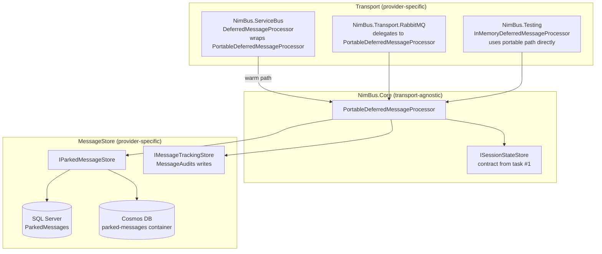
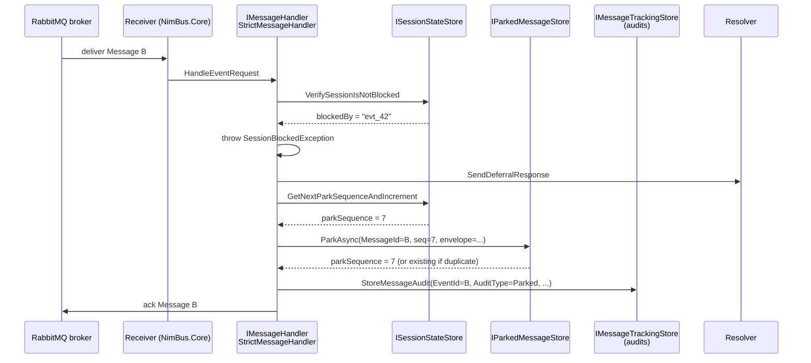
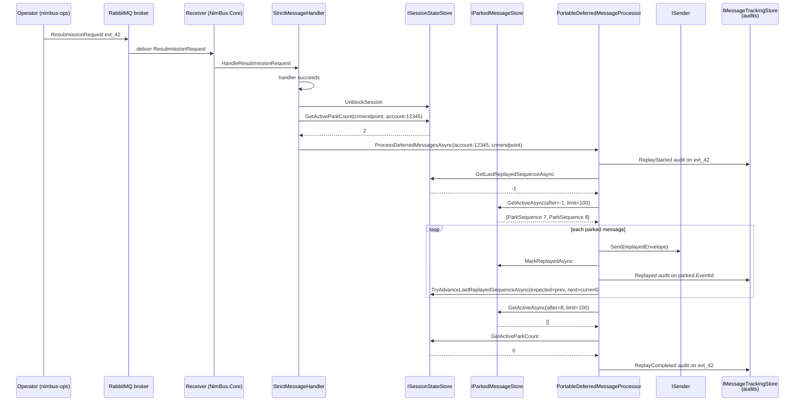
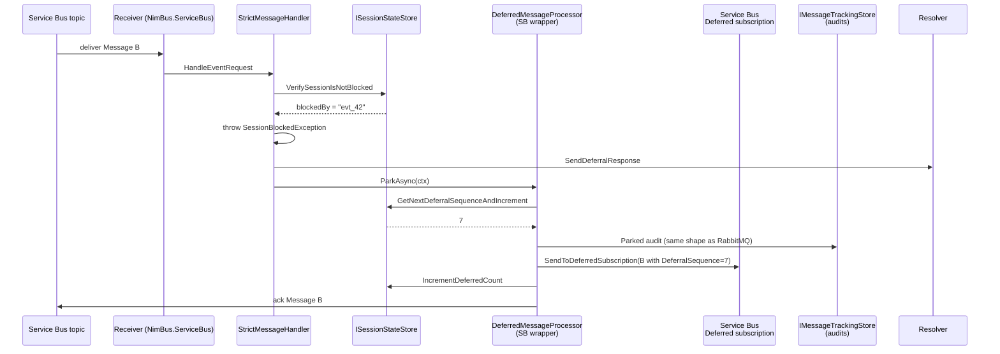
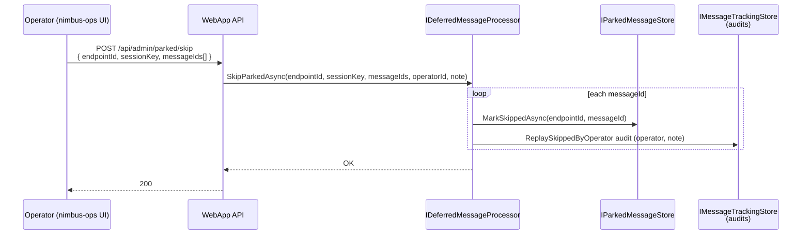

# Design: Deferred-by-Session as a Transport-Agnostic Park-and-Replay Primitive

Spec: [003-rabbitmq-transport](./spec.md) — FR-050, FR-051, FR-052, FR-053, FR-054, NFR-011
Issue: [#20](https://github.com/akakaule/NimBus/issues/20)
Phase: 6.1 (foundation, before the RabbitMQ provider lands in 6.2)
Status: Draft
Author/round: design-only — no production code yet.

This document is the design for moving the deferred-by-session primitive out of `NimBus.ServiceBus` and into a new `PortableDeferredMessageProcessor` in `NimBus.Core` that operates against `MessageStore`. It is the prerequisite for the RabbitMQ provider, but the design lands in Phase 6.1 because the disentanglement (task #1) and this work together define the seam between transport and store.

> **Scope of this document.** Everything below is a design. No production code exists yet. The implementer can take this document and the linked source files and write the code without re-deriving the design.

---

## 1. Why this matters

Today, deferred-by-session is implemented in `NimBus.ServiceBus.DeferredMessageProcessor`. It works by:

1. Sending the parked message to a separate `Deferred` subscription that is **session-enabled**, with the message's original `SessionId` preserved.
2. When the blocking event resolves, calling `ServiceBusClient.AcceptSessionAsync(topic, "Deferred", sessionId)` to lock the session on the deferred subscription.
3. Receiving the parked messages in batches, sorting by `DeferralSequence`, and re-publishing to the main topic with `SessionId` restored.

That implementation depends on three Service-Bus-native primitives:

- **Session-locked receive on a subscription** (`AcceptSessionAsync`) — RabbitMQ has no equivalent. There is no "lock all messages with this session-id" operation in AMQP.
- **In-place message storage on a session-enabled subscription** — RabbitMQ would need a per-session queue or a per-session header binding, neither of which composes well with the consistent-hash exchange we use for ordering.
- **Service Bus's session-state document** — RabbitMQ has no per-session state primitive.

Worse, the parked messages live *on the broker*, where the operator UI can't see them and our audit trail can't reach them. They show up in the WebApp only because we proxy them through the Resolver (`DeferralResponse`), which writes a row to `MessageStore.UnresolvedEvents`. The actual message bodies are on Service Bus, opaque.

**The portable solution is to park messages in `MessageStore` (the place where everything else durable already lives), keyed by `SessionKey`, ordered by arrival, and to replay them in FIFO order on session unblock.** Service Bus continues to use its native session-deferral as a *performance* optimization for the warm path, but every park/replay/skip emits the same audit-trail entries as the portable RabbitMQ path. Externally, the two are observationally identical.

This is FR-050/FR-051/FR-054 verbatim. The audit-trail-identical constraint is the load-bearing one: it is what lets the WebApp render the same UI for any transport, and what lets the `nimbus-ops` skip flow work without transport-specific branches.

---

## 2. High-level architecture



Three new contracts are introduced:

| Contract | Lives in | Purpose |
|---|---|---|
| `IParkedMessageStore` | `NimBus.MessageStore.Abstractions` | CRUD over the parked-messages table/container. One implementation per storage provider. |
| `ISessionStateStore` | `NimBus.MessageStore.Abstractions` | Per-session block flag, owner event id, replay checkpoint. **Defined by task #1** — this design is a consumer of that contract, not the place it is introduced. |
| `IDeferredMessageProcessor` | `NimBus.Core.Messages` (already exists; signature evolves) | Replays parked messages on unblock. Implementation `PortableDeferredMessageProcessor` is new and lives in `NimBus.Core`. |

One existing class is rewired:

- `NimBus.ServiceBus.DeferredMessageProcessor` becomes a *wrapper* around `PortableDeferredMessageProcessor`. It still uses native session-deferral for the actual broker-side park, but the audit-trail entries are written through the same code path as RabbitMQ.

---

## 3. Parked-message data model

### 3.1 Logical shape

A *parked message* is a complete `Message` envelope (the same shape that crosses the transport wire, serialized as JSON), tagged with:

| Field | Type | Notes |
|---|---|---|
| `EndpointId` | string | Receiver endpoint that parked the message. Used as the partition key on Cosmos. |
| `SessionKey` | string | The application-level session key (`SessionId` on Service Bus, the consistent-hash header value on RabbitMQ). |
| `ParkSequence` | long | Monotonic per `(EndpointId, SessionKey)`. Assigned at park time. Replay order is `ASC` on this column. |
| `MessageId` | string | The original message-id (idempotency key — see §4). |
| `EventId` | string | The originating event id (used by the audit trail). |
| `EventTypeId` | string | For audit visibility ("DraftCreated" etc.). |
| `BlockingEventId` | string | The event-id that blocked the session at park time. Stored for diagnostic visibility in `nimbus-ops`. May be NULL if the session is parking-as-a-policy (rare). |
| `MessageEnvelopeJson` | string (JSON) | The full `Message` (or `MessageContent` + headers) — exactly what gets republished. |
| `MessageBytes` | binary, optional | Reserved for future use if we need to carry transport-specific bytes (see Open Questions). |
| `ParkedAtUtc` | datetime2 | Wall-clock park time. |
| `ReplayedAtUtc` | datetime2, NULL | Set at replay-complete; row is *not* deleted (forensic value). The `LastReplayedSequence` checkpoint is the operative cursor; `ReplayedAtUtc` is for human/operator visibility. |
| `SkippedAtUtc` | datetime2, NULL | Set when an operator skips parked messages from `nimbus-ops`. Mutually exclusive with `ReplayedAtUtc`. |

The "row is not deleted" decision is deliberate: parked messages have audit value. We keep them, mark them `ReplayedAtUtc` or `SkippedAtUtc`, and rely on a separate retention policy (TTL on Cosmos, scheduled cleanup on SQL) for eventual purging. This is the same pattern as `MessageAudits` and `Messages` today.

### 3.2 SQL Server (DbUp) schema sketch

DbUp script: `src/NimBus.MessageStore.SqlServer/Schema/0009_ParkedMessages.sql`

```sql
-- 0009_ParkedMessages.sql
-- Park-and-replay storage for the transport-agnostic deferred-by-session
-- primitive. See docs/specs/003-rabbitmq-transport/deferred-by-session-design.md.

IF OBJECT_ID('[$schema$].[ParkedMessages]', 'U') IS NULL
BEGIN
    CREATE TABLE [$schema$].[ParkedMessages] (
        [Id]                     BIGINT          IDENTITY(1,1) NOT NULL PRIMARY KEY,
        [EndpointId]             NVARCHAR(200)   NOT NULL,
        [SessionKey]             NVARCHAR(200)   NOT NULL,
        [ParkSequence]           BIGINT          NOT NULL,
        [MessageId]              NVARCHAR(200)   NOT NULL,
        [EventId]                NVARCHAR(200)   NOT NULL,
        [EventTypeId]            NVARCHAR(200)   NULL,
        [BlockingEventId]        NVARCHAR(200)   NULL,
        [MessageEnvelopeJson]    NVARCHAR(MAX)   NOT NULL,
        [ParkedAtUtc]            DATETIME2       NOT NULL,
        [ReplayedAtUtc]          DATETIME2       NULL,
        [SkippedAtUtc]           DATETIME2       NULL,
        [CreatedAtUtc]           DATETIME2       NOT NULL
            CONSTRAINT [DF_ParkedMessages_CreatedAtUtc] DEFAULT (SYSUTCDATETIME()),

        -- Idempotency: re-parking the same MessageId at the same endpoint is a no-op.
        CONSTRAINT [UQ_ParkedMessages_Endpoint_MessageId]
            UNIQUE ([EndpointId], [MessageId]),

        -- ParkSequence is monotonic per (EndpointId, SessionKey). Without this,
        -- two parallel receivers parking concurrently for the same session could
        -- collide on sequence numbers (we allocate from a sequence counter — see
        -- ISessionStateStore.GetNextParkSequenceAndIncrement).
        CONSTRAINT [UQ_ParkedMessages_Endpoint_Session_Sequence]
            UNIQUE ([EndpointId], [SessionKey], [ParkSequence])
    );

    -- Replay query: WHERE EndpointId=? AND SessionKey=? AND ReplayedAtUtc IS NULL
    --              AND SkippedAtUtc IS NULL ORDER BY ParkSequence ASC.
    CREATE INDEX [IX_ParkedMessages_Replay]
        ON [$schema$].[ParkedMessages]
        ([EndpointId], [SessionKey], [ParkSequence])
        INCLUDE ([MessageEnvelopeJson], [MessageId], [EventId], [EventTypeId])
        WHERE [ReplayedAtUtc] IS NULL AND [SkippedAtUtc] IS NULL;

    -- Operator view: "show me what's parked at this endpoint right now".
    CREATE INDEX [IX_ParkedMessages_Endpoint_Active]
        ON [$schema$].[ParkedMessages]
        ([EndpointId], [SessionKey], [ParkedAtUtc] DESC)
        WHERE [ReplayedAtUtc] IS NULL AND [SkippedAtUtc] IS NULL;
END
GO
```

Notes on the choice:

- **`NVARCHAR(MAX)` for the envelope.** Service Bus has a 256 KB / 1 MB message limit (depending on tier); RabbitMQ default is unbounded but practical limits apply. `NVARCHAR(MAX)` accommodates either. We do not use FILESTREAM/BLOB; the WebApp message-detail page already handles `NVARCHAR(MAX)` payloads.
- **Composite key, not just `(EndpointId, MessageId)`**, even though that's the idempotency key. The composite `(EndpointId, SessionKey, ParkSequence)` is the natural read order; making it a UNIQUE constraint lets us catch duplicate sequence allocation as a constraint violation rather than a silent corruption.
- **Two unique constraints, not one.** `UQ_..._MessageId` ensures idempotency (FR-052). `UQ_..._Sequence` ensures FIFO replay safety (FR-053).
- **Filtered indexes** keep replay scans cheap as the table grows: rows that have been replayed or skipped are omitted from the active index.
- **No foreign key to `Messages`.** Parked messages reference the `Messages` row indirectly via `(EventId, MessageId)`; an FK would couple write order across tables and serialize the park path. This mirrors how `MessageAudits` references events (no FK).

### 3.3 Cosmos DB schema sketch

Container: `parked-messages`
Partition key: `/endpointId`
TTL: optional, defaults to 30 days from `replayedAtUtc` / `skippedAtUtc` (terminal state — rows in active state are immune to TTL).

Document shape:

```jsonc
{
  "id": "{endpointId}|{messageId}",            // idempotency key (deterministic)
  "endpointId": "crmendpoint",                  // partition key
  "sessionKey": "account-12345",
  "parkSequence": 7,                            // long
  "messageId": "8a4b...",
  "eventId": "evt_99",
  "eventTypeId": "CrmAccountUpdated",
  "blockingEventId": "evt_42",
  "messageEnvelopeJson": "{...}",               // string, the full Message
  "parkedAtUtc": "2026-05-04T12:34:56.789Z",
  "replayedAtUtc": null,
  "skippedAtUtc": null,
  "type": "ParkedMessage",                      // discriminator (per-container convention)
  "ttl": null                                   // set on terminal-state transition
}
```

Choices:

- **Partition key `/endpointId`**, not `/sessionKey`. Sessions are typically high-cardinality and short-lived; per-endpoint partitioning keeps related operator queries (list parked at endpoint) cheap, while keeping the per-session replay query within a single logical partition (server-side query with `WHERE endpointId=? AND sessionKey=?`).
- **Deterministic `id`** (`{endpointId}|{messageId}`) is the idempotency key. Cosmos `CreateItem` with `IfNoneMatch:*` returns 409 on duplicate; we treat 409 as success (FR-052).
- **TTL only on terminal-state transition.** A live parked message must never be TTL'd (would lose ordering). When we set `replayedAtUtc` or `skippedAtUtc`, we *also* set `ttl: 2592000` (30 days). Until then, the document is permanent.
- **No `_etag` optimistic concurrency** for the park path itself — idempotency handles redelivery races. Optimistic concurrency *is* used on the replay-checkpoint update inside `ISessionStateStore` (task #1's contract).

### 3.4 In-memory store conformance

`NimBus.Testing` already runs the storage conformance suite. The in-memory `IParkedMessageStore` is a `ConcurrentDictionary<(EndpointId, MessageId), ParkedMessage>`, plus a sorted view keyed by `(EndpointId, SessionKey)`. It satisfies the same interface, runs in the same MSTest project, and gates the Cosmos and SQL providers from regressing.

---

## 4. Idempotency strategy

> FR-052: "Park-in-MessageStore MUST be idempotent on `MessageId` — a re-delivered message that is already parked MUST NOT be parked twice."

The transport delivers messages **at-least-once**. A receiver crash after parking but before settling the broker message will trigger redelivery. The portable processor must detect this and treat the second delivery as a no-op.

### 4.1 Park-time idempotency

The natural key is `(EndpointId, MessageId)`. Each provider exposes the same operation:

```csharp
public interface IParkedMessageStore
{
    /// <summary>
    /// Parks the given message at the given session. Idempotent on (EndpointId, MessageId):
    /// if a row with the same natural key already exists, this is a no-op and returns
    /// the existing row's <see cref="ParkSequence"/> so the caller can settle the
    /// broker message.
    /// </summary>
    /// <returns>
    /// The <see cref="ParkSequence"/> assigned to this parked message. On duplicate
    /// park, returns the previously-assigned sequence.
    /// </returns>
    Task<long> ParkAsync(ParkedMessage message, CancellationToken cancellationToken);

    Task<IReadOnlyList<ParkedMessage>> GetActiveAsync(
        string endpointId, string sessionKey, long afterSequence, int limit,
        CancellationToken cancellationToken);

    Task MarkReplayedAsync(string endpointId, string messageId, CancellationToken cancellationToken);

    Task MarkSkippedAsync(string endpointId, string sessionKey, CancellationToken cancellationToken);
}
```

#### SQL Server: `MERGE` on the natural key

```sql
MERGE [$schema$].[ParkedMessages] AS target
USING (VALUES (@EndpointId, @MessageId)) AS source([EndpointId], [MessageId])
    ON target.[EndpointId] = source.[EndpointId]
   AND target.[MessageId]  = source.[MessageId]
WHEN NOT MATCHED THEN
    INSERT ([EndpointId], [SessionKey], [ParkSequence], [MessageId], [EventId],
            [EventTypeId], [BlockingEventId], [MessageEnvelopeJson], [ParkedAtUtc])
    VALUES (@EndpointId, @SessionKey, @ParkSequence, @MessageId, @EventId,
            @EventTypeId, @BlockingEventId, @MessageEnvelopeJson, @ParkedAtUtc)
OUTPUT inserted.[ParkSequence], $action AS [Action];
```

`@ParkSequence` is allocated by `ISessionStateStore.GetNextParkSequenceAndIncrement(endpointId, sessionKey)` *before* the `MERGE`. If the `MERGE` is a no-op (duplicate `MessageId`), the pre-allocated sequence is wasted — but sequence numbers are not required to be contiguous, only monotonic, so wastage is acceptable. The implementation reads the existing row's `ParkSequence` from the `OUTPUT` clause when `$action = 'NONE'` is observed (i.e., when the row already existed, we re-query to return the *real* sequence to the caller).

> **Refinement.** A simpler implementation: do the `MERGE` first with a placeholder `ParkSequence = -1`, observe `$action`, and only allocate-and-update when the row is a fresh insert. This avoids wasted sequence numbers entirely. The trade-off is two round-trips on the cold path. **Decision: prefer the two-step variant**; throughput on the warm path matters more than insert simplicity, and wasted sequence numbers — while harmless — show up in operator-facing audits as "gaps" that are easy to misread.

The two-step variant:

```sql
-- Step A: Conditional insert with placeholder.
INSERT INTO [$schema$].[ParkedMessages] (...)
SELECT @EndpointId, @SessionKey, /* placeholder */ -1, @MessageId, ...
WHERE NOT EXISTS (
    SELECT 1 FROM [$schema$].[ParkedMessages]
    WHERE [EndpointId] = @EndpointId AND [MessageId] = @MessageId
);

-- @@ROWCOUNT tells us if it was a fresh park or a duplicate.
IF @@ROWCOUNT = 1
BEGIN
    -- Step B: Allocate sequence and stamp it.
    EXEC @Sequence = [$schema$].[NextParkSequence] @EndpointId, @SessionKey;
    UPDATE [$schema$].[ParkedMessages]
        SET [ParkSequence] = @Sequence
        WHERE [EndpointId] = @EndpointId AND [MessageId] = @MessageId;
    SELECT @Sequence;
END
ELSE
BEGIN
    -- Duplicate park: return the existing sequence.
    SELECT [ParkSequence] FROM [$schema$].[ParkedMessages]
        WHERE [EndpointId] = @EndpointId AND [MessageId] = @MessageId;
END
```

This is the variant we'll implement. It serializes sequence allocation behind the unique constraint on `(EndpointId, MessageId)`, which is exactly what we want.

#### Cosmos: deterministic `id` + `IfNoneMatch:*`

Cosmos has no MERGE, but it has a much simpler equivalent: deterministic `id` plus conditional create.

```csharp
var doc = new ParkedMessageDocument
{
    Id = $"{endpointId}|{messageId}",  // deterministic
    // ... other fields
    ParkSequence = await sessionStateStore.GetNextParkSequenceAndIncrementAsync(
        endpointId, sessionKey, ct),
};

try
{
    await container.CreateItemAsync(doc,
        new PartitionKey(endpointId),
        new ItemRequestOptions { IfNoneMatchETag = "*" },
        cancellationToken: ct);
    return doc.ParkSequence;
}
catch (CosmosException ex) when (ex.StatusCode == HttpStatusCode.Conflict)
{
    // Duplicate park: read existing.
    var existing = await container.ReadItemAsync<ParkedMessageDocument>(
        doc.Id, new PartitionKey(endpointId), cancellationToken: ct);
    return existing.Resource.ParkSequence;
}
```

Same semantics: same `MessageId` → same `id` → first writer wins → all subsequent parkers read the existing row.

**Sequence allocation is wasted on duplicate parks here too**, because we allocate before the `CreateItemAsync` call. We accept that on Cosmos: the alternative (read-then-write) costs an extra RU per park on the warm path. Wasted sequence numbers don't break replay ordering (they're only required to be monotonic, not contiguous).

### 4.2 Replay-time idempotency

A crash mid-replay means: we `Send`'d a republished message to the transport, but didn't update `LastReplayedSequence` (or the broker-side ack didn't return). On restart, we re-replay the same message. The receiver picks it up, but: how does the *receiver* avoid double-processing it?

This is the standard inbox pattern. NimBus does *not* yet have a generic inbox (Phase 3.2 backlog item), but for parked-message replay specifically:

- The republished message carries the same `EventId`, `MessageId`, and `SessionId` it had at park time.
- The receiver's normal processing already records `(eventId)` in `MessageStore.UnresolvedEvents` with `ResolutionStatus.Pending`. If the replay completes the second time, the resolver writes `Completed`. If the resolver finds an existing `Completed` row first, the second response is a no-op (already true today via the conditional upload pattern in `IMessageTrackingStore.UploadCompletedMessage`).
- Net: at-least-once replay × idempotent resolver = at-most-once perceived effect.

**This is not new infrastructure.** It is the existing exactly-once-by-resolver-projection guarantee. The only thing new for parked messages is that the *transport-side* idempotency check (don't re-park) is now in `IParkedMessageStore.ParkAsync`.

---

## 5. Crash-resilience checkpoint design

> FR-053: "The deferred-processor MUST be resilient to crash mid-replay. Restart MUST resume from the next un-replayed parked message; no parked message MUST be lost or replayed twice."

### 5.1 Per-session checkpoint

A new field is added to `ISessionStateStore` (the contract from task #1):

```csharp
public interface ISessionStateStore
{
    // ... existing methods from task #1: Block/Unblock/IsBlocked/GetBlockedBy/...

    /// <summary>
    /// Allocates the next monotonic park sequence for the given session and
    /// increments the counter atomically. Used by the portable park path at park time.
    /// </summary>
    Task<long> GetNextParkSequenceAndIncrementAsync(
        string endpointId, string sessionKey, CancellationToken cancellationToken);

    /// <summary>
    /// Returns the highest <c>ParkSequence</c> that has been replayed for the
    /// given session. Initial value is <c>-1</c> (nothing replayed yet).
    /// </summary>
    Task<long> GetLastReplayedSequenceAsync(
        string endpointId, string sessionKey, CancellationToken cancellationToken);

    /// <summary>
    /// Atomically advances the replay checkpoint. Conditional on the current
    /// value being <paramref name="expected"/> — fails (and the caller retries)
    /// if a concurrent replayer has already advanced past this point.
    /// </summary>
    Task<bool> TryAdvanceLastReplayedSequenceAsync(
        string endpointId, string sessionKey, long expected, long next,
        CancellationToken cancellationToken);
}
```

The replay loop is forward-progress only:

```
1. Read checkpoint = GetLastReplayedSequenceAsync(endpoint, session)
2. Read batch       = ParkedMessageStore.GetActiveAsync(endpoint, session,
                                                        afterSequence: checkpoint,
                                                        limit: BatchSize)
3. For each message in ascending ParkSequence order:
     a. Send republished message to transport (sender.Send)
     b. ParkedMessageStore.MarkReplayedAsync(endpoint, messageId)
     c. Audit Replayed entry to MessageAudits
     d. checkpoint := message.ParkSequence
     e. TryAdvanceLastReplayedSequenceAsync(endpoint, session, expected: checkpoint - 1,
                                            next: checkpoint)
4. If batch.Count == BatchSize, loop with the new checkpoint.
   Else, peek for newer parked messages (see §6.3); if none, mark replay-complete and exit.
```

### 5.2 What survives a crash

| Crash point | Recovery behaviour |
|---|---|
| After `Send` but before `MarkReplayedAsync` | On restart, the row is still active. We re-`Send` the same message. Resolver-side idempotency absorbs the duplicate. |
| After `MarkReplayedAsync` but before `TryAdvanceLastReplayedSequenceAsync` | Row is marked replayed; checkpoint is stale. On restart, `GetActiveAsync(afterSequence: stale_checkpoint)` returns the *next* active row — the row we already marked is filtered out by the `WHERE ReplayedAtUtc IS NULL` index. Replay continues from the next message; checkpoint catches up on the next successful advance. The mismatch between checkpoint and `MarkReplayedAsync` state is self-healing. |
| After `TryAdvanceLastReplayedSequenceAsync` but before audit | Idempotent: audit-write retry on next loop iteration — but in practice we order audit-write before `TryAdvance`, so this case is "audit written, advance not yet". Same self-healing as above. |
| Mid-`Send` (transport returns transient error) | The transport raises a transient exception; `PortableDeferredMessageProcessor` does not advance, the loop retries on the next replay tick. |

The forward-progress invariant (`checkpoint` is monotonically non-decreasing) plus the active-only index makes replay self-healing without compensating writes.

### 5.3 Concurrent replayers

Two receivers might pick up the same `ProcessDeferredRequest` simultaneously. The conditional advance (`TryAdvanceLastReplayedSequenceAsync` with `expected:`) is the serialization point:

- Replayer A reads `checkpoint = 5`, processes seq 6, calls `TryAdvance(expected=5, next=6)` → succeeds.
- Replayer B reads `checkpoint = 5`, processes seq 6 (sees the same active row), `Send`s the message (broker-side idempotency keys the receiver's processing), calls `TryAdvance(expected=5, next=6)` → fails because A advanced first. B re-reads checkpoint = 6, gets the next batch, continues.

The duplicate `Send` is absorbed by resolver idempotency (§4.2). The two replayers do not both `MarkReplayedAsync` for the same row — but if they did, it's a write-the-same-bytes-twice no-op (we use unconditional update for `MarkReplayedAsync`; the row is monotone-state).

**Decision: do not attempt distributed locking for replayers.** The conditional checkpoint advance plus resolver idempotency is sufficient. Adding a leader election here is over-engineering for an edge case that is already correctness-safe.

---

## 6. FIFO replay ordering

> FR-050 acceptance #2: "Given the session is unblocked … parked messages are replayed in FIFO send order."

### 6.1 Sequence allocation

`ParkSequence` is monotonic per `(EndpointId, SessionKey)`. It is **not** monotonic across sessions or across endpoints. Two parallel parkers for the same session must serialize on sequence allocation; cross-session parking is unconstrained.

SQL Server: a separate counter table keyed by `(EndpointId, SessionKey)`:

```sql
IF OBJECT_ID('[$schema$].[ParkSequenceCounters]', 'U') IS NULL
BEGIN
    CREATE TABLE [$schema$].[ParkSequenceCounters] (
        [EndpointId]    NVARCHAR(200) NOT NULL,
        [SessionKey]    NVARCHAR(200) NOT NULL,
        [NextSequence]  BIGINT        NOT NULL,
        [CreatedAtUtc]  DATETIME2     NOT NULL CONSTRAINT [DF_ParkSequenceCounters_CreatedAtUtc] DEFAULT (SYSUTCDATETIME()),
        CONSTRAINT [PK_ParkSequenceCounters] PRIMARY KEY CLUSTERED ([EndpointId], [SessionKey])
    );
END
GO
```

`GetNextParkSequenceAndIncrement` is `UPDATE ... OUTPUT inserted.NextSequence - 1 ... SET NextSequence = NextSequence + 1` (`UPSERT` on missing). The clustered PK is the natural lock; concurrent allocations for the *same* session serialize, concurrent allocations for *different* sessions parallelize.

(In task #1's `ISessionStateStore`, this counter could collapse into the broader session-state row alongside the block flag — that decision is task #1's. The contract method is the same; the underlying storage is task #1's choice.)

Cosmos: per-session document with `_etag` optimistic-concurrency loop. Standard pattern. Not different from how `BlockedByEventId` will be tracked.

### 6.2 Replay query

```sql
SELECT TOP (@BatchSize)
    [Id], [ParkSequence], [MessageId], [EventId], [EventTypeId],
    [MessageEnvelopeJson], [SessionKey], [BlockingEventId]
FROM [$schema$].[ParkedMessages] WITH (READPAST, ROWLOCK)
WHERE [EndpointId]   = @EndpointId
  AND [SessionKey]   = @SessionKey
  AND [ParkSequence] > @AfterSequence
  AND [ReplayedAtUtc] IS NULL
  AND [SkippedAtUtc]  IS NULL
ORDER BY [ParkSequence] ASC;
```

`READPAST` is included so that a concurrent replayer (rare, but possible) skips locked rows rather than blocking. The conditional checkpoint advance handles the resulting ordering correctly.

Cosmos equivalent:

```sql
SELECT TOP @BatchSize *
FROM c
WHERE c.endpointId = @endpointId
  AND c.sessionKey = @sessionKey
  AND c.parkSequence > @afterSequence
  AND IS_NULL(c.replayedAtUtc)
  AND IS_NULL(c.skippedAtUtc)
ORDER BY c.parkSequence ASC
```

(A composite index on `endpointId, sessionKey, parkSequence` is required; this is declared in the container's indexing policy.)

### 6.3 Messages parked while replay is in progress

Scenario: replay has drained sequences 1..7. A new message lands in the broker, the receiver parks it as sequence 8 (the session is still flagged "replaying"). What happens?

**Decision:** the replay loop checks for newer parked messages **before** declaring the session drained. Concretely:

```
loop:
    batch = GetActiveAsync(after=checkpoint, limit=BatchSize)
    if batch.Empty:
        // Race window: could a newer message have landed *just now*?
        // Re-check session-blocked flag + active-park count.
        if SessionStateStore.GetActiveParkCount(endpoint, session) == 0:
            // Truly drained. Mark replay-complete; emit ReplayComplete audit; exit.
            return
        else:
            // Newer parks landed — loop back.
            continue
    process(batch)
```

The "newer parks while replay is in progress" question hinges on **what unblocks the session**. Two answers, by transport:

- **Service Bus (warm path)**: the session has been unblocked by the resubmit/skip/retry of the original failing event. From that moment, *new* messages from the broker arrive and are *not* parked — the receiver's `VerifySessionIsNotBlocked` passes and they go through normal processing. The race is only between (a) parks already in flight when unblock happened and (b) the start of replay. In practice, this is a sub-millisecond window; the loop-back-and-recheck handles it cleanly.

- **RabbitMQ (portable path)**: same logic. A new message arriving after the session unblocks goes to normal processing on the partition queue. There is no separate "deferred" exchange in the RabbitMQ topology — the broker just delivers new messages. Newer-during-replay arrives only if a parker has not yet observed the unblocked state; same loop-back-and-recheck handles it.

**Edge case: session unblock + immediate re-block.** Suppose event A blocks the session, B is parked, A is resubmitted (succeeds, session unblocks, B is replayed and processed, B fails, session re-blocks under B). The replay loop has already exited; B's failure goes through the normal `BlockSession` path, and any subsequent messages will be parked under the new block. This is correct: each block-replay-block cycle is independent.

---

## 7. Audit-trail entries

> FR-054: "The deferred-processor MUST emit `MessageStore.MessageAudits` entries for each park, replay, and skip operation, identical in shape across transports."

The existing `MessageAuditEntity` (`src/NimBus.MessageStore.Abstractions/MessageAuditEntity.cs`) currently has:

```csharp
public class MessageAuditEntity
{
    public string AuditorName { get; set; }
    public DateTime AuditTimestamp { get; set; }
    public MessageAuditType AuditType { get; set; }
    public string? Comment { get; set; }
}

public enum MessageAuditType
{
    Resubmit,
    ResubmitWithChanges,
    Skip,
    Retry,
    Comment
}
```

The shape is exactly right. We extend `MessageAuditType`:

```csharp
public enum MessageAuditType
{
    Resubmit,
    ResubmitWithChanges,
    Skip,
    Retry,
    Comment,

    // Park-and-replay (new)
    Parked,             // recorded when a message is parked
    ReplayStarted,      // recorded when ProcessDeferredRequest begins replay for a session
    Replayed,           // recorded when each parked message is replayed
    ReplayCompleted,    // recorded when the replay loop drains the session
    ReplaySkippedByOperator,  // recorded when an operator triggers SkipParked
}
```

The `Comment` field carries human-readable context. `AuditorName` is the actor: `"NimBus"` for system-emitted entries (park, replay), `"<operator-id>"` for operator-emitted entries (skip).

### 7.1 Per-event audit shapes

| Event | Stored against `EventId` | `AuditType` | `AuditorName` | `Comment` |
|---|---|---|---|---|
| Park | the parked message's `EventId` | `Parked` | `"NimBus"` | `"Parked at endpoint {endpointId}, session {sessionKey}, sequence {parkSequence}, blockedBy {blockingEventId}"` |
| Replay-start | the *blocking* event's `EventId` (the one whose successful re-handling triggered replay) | `ReplayStarted` | `"NimBus"` | `"Replay started: endpoint {endpointId}, session {sessionKey}, count {activeParks}"` |
| Replay-each | the parked message's `EventId` | `Replayed` | `"NimBus"` | `"Replayed at endpoint {endpointId}, session {sessionKey}, sequence {parkSequence}"` |
| Replay-complete | the *blocking* event's `EventId` | `ReplayCompleted` | `"NimBus"` | `"Replay completed: endpoint {endpointId}, session {sessionKey}, count {replayed}"` |
| Skip-by-operator | the parked message's `EventId` (one row per parked message in the session) | `ReplaySkippedByOperator` | the operator id | operator-supplied note, or `"Skipped via nimbus-ops"` if blank |

The "store against the parked message's `EventId`" choice means each parked message has its own audit row visible in the message-detail page (the existing `GetMessageAudits(eventId)` call returns these). The "store against the blocking event's `EventId`" choice for `ReplayStarted` and `ReplayCompleted` means the operator looking at the *blocking* event's history sees what happened on its resolution.

### 7.2 Audit identicality across transports

This is the critical FR-054 / NFR-011 contract. The Service Bus warm path **emits the same audit rows** as the RabbitMQ portable path, even when Service Bus is using its native session-deferral. Mechanically, this means the wrapper class (`NimBus.ServiceBus.DeferredMessageProcessor`, see §8) calls into `PortableDeferredMessageProcessor`'s audit-write helper for each park/replay/skip — even when the actual *storage* of the parked message is Service-Bus-native rather than `IParkedMessageStore`.

The NFR-011 conformance test compares two runs of the CrmErpDemo failure-and-resubmit scenario (one on each transport) and asserts byte-for-byte identical audit-row shape (modulo timestamps and run-specific ids).

---

## 8. Service Bus optimization path

> FR-051: "The Service Bus transport MAY use native session-deferral as an internal performance optimization. … the externally-observable audit trail in `MessageStore` MUST be identical to the portable park-and-replay path."

### 8.1 Options considered

We considered three options:

1. **Drop native deferral entirely.** Service Bus uses the same `IParkedMessageStore` path as RabbitMQ. **Rejected**: this loses the Service Bus performance optimization (broker-side park-and-replay is faster than round-tripping through SQL/Cosmos), and the Service Bus deployment now incurs an unnecessary store dependency on the parking path.
2. **Native deferral only, audit-trail bolted on.** Service Bus keeps `DeferredMessageProcessor` as is, but adds `MessageAudits` writes at park and replay points. **Rejected**: this duplicates the audit-emission code in two places (Service Bus's `DeferredMessageProcessor` and the new `PortableDeferredMessageProcessor`); the FR-054 identicality contract becomes a code-review concern instead of a structural one.
3. **Wrapper pattern: `NimBus.ServiceBus.DeferredMessageProcessor` wraps `PortableDeferredMessageProcessor`.** Native deferral is the *storage* primitive; audit emission is delegated to the portable processor's helper methods. **Selected.** This makes the audit-trail identicality structural: the same code emits the same rows.

### 8.2 The wrapper

Sketch (no implementation yet):

```csharp
namespace NimBus.ServiceBus;

public sealed class DeferredMessageProcessor : IDeferredMessageProcessor
{
    private readonly ServiceBusClient _client;
    private readonly string _deferredSubscriptionName;
    private readonly IPortableDeferredAuditEmitter _audits; // NEW: portable audit-emission helper
    private const int BatchSize = 100;

    // ParkAsync (called from StrictMessageHandler.DeferMessageToSubscription)
    public async Task ParkAsync(IMessageContext ctx, CancellationToken ct)
    {
        // 1. Emit Parked audit BEFORE broker-side park, so a crash between
        //    these two steps leaves an audit row pointing at a parked message
        //    that doesn't exist (which the operator UI tolerates) rather than
        //    the inverse (a parked message with no audit).
        await _audits.EmitParkedAsync(
            endpointId: ctx.To,
            sessionKey: ctx.SessionId,
            messageId: ctx.MessageId,
            eventId: ctx.EventId,
            eventTypeId: ctx.EventTypeId,
            parkSequence: await ctx.GetNextDeferralSequenceAndIncrement(ct),
            blockingEventId: await ctx.GetBlockedByEventId(ct),
            ct);

        // 2. Send to the Service-Bus-native Deferred subscription, exactly
        //    as today.
        await _responseService.SendToDeferredSubscription(ctx, sequence, ct);

        // 3. Mark the count.
        await ctx.IncrementDeferredCount(ct);
        await ctx.Complete(ct);
    }

    // ProcessDeferredMessagesAsync (called by ProcessDeferredRequest handler)
    public async Task ProcessDeferredMessagesAsync(string sessionId, string topicName,
                                                   CancellationToken ct)
    {
        await _audits.EmitReplayStartedAsync(/* ... */, ct);

        var receiver = await _client.AcceptSessionAsync(topicName, _deferredSubscriptionName,
                                                       sessionId, cancellationToken: ct);
        await using (receiver) await using (var sender = _client.CreateSender(topicName))
        {
            int totalReplayed = 0;
            while (!ct.IsCancellationRequested)
            {
                var messages = await receiver.ReceiveMessagesAsync(BatchSize, TimeSpan.FromSeconds(5), ct);
                if (messages == null || messages.Count == 0) break;

                foreach (var m in messages.OrderBy(GetDeferralSequence))
                {
                    await sender.SendMessageAsync(CreateRepublishedMessage(m, sessionId, topicName), ct);
                    await receiver.CompleteMessageAsync(m, ct);

                    // Emit Replayed audit per message — same shape as portable path.
                    await _audits.EmitReplayedAsync(/* ... */, ct);
                    totalReplayed++;
                }

                if (messages.Count < BatchSize) break;
            }

            await _audits.EmitReplayCompletedAsync(/* ... totalReplayed ... */, ct);
        }
    }
}
```

The new helper interface:

```csharp
namespace NimBus.Core.Messages;

internal interface IPortableDeferredAuditEmitter
{
    Task EmitParkedAsync(string endpointId, string sessionKey, string messageId,
                        string eventId, string eventTypeId, long parkSequence,
                        string blockingEventId, CancellationToken ct);

    Task EmitReplayStartedAsync(string endpointId, string sessionKey,
                                 string blockingEventId, int activeParks, CancellationToken ct);

    Task EmitReplayedAsync(string endpointId, string sessionKey, string messageId,
                           string eventId, string eventTypeId, long parkSequence, CancellationToken ct);

    Task EmitReplayCompletedAsync(string endpointId, string sessionKey,
                                   string blockingEventId, int totalReplayed, CancellationToken ct);

    Task EmitReplaySkippedByOperatorAsync(string endpointId, string sessionKey,
                                           string operatorId, string note,
                                           IReadOnlyList<(string EventId, string MessageId, long ParkSequence)> skipped,
                                           CancellationToken ct);
}
```

Both the wrapper and the portable processor depend on the same emitter. The emitter writes `MessageAuditEntity` rows via `IMessageTrackingStore.StoreMessageAudit`. **Audit identicality is structural.**

### 8.3 What about the RabbitMQ path?

`NimBus.Transport.RabbitMQ` does not have a `DeferredMessageProcessor` of its own. Instead, the receiver-side handler:

1. Catches `SessionBlockedException` (same as today).
2. Calls `PortableDeferredMessageProcessor.ParkAsync(ctx, ct)`. This writes to `IParkedMessageStore`, emits the `Parked` audit, and acks the broker message.
3. When the session unblocks (resubmit/skip/retry succeeds), the same receiver handler triggers `PortableDeferredMessageProcessor.ProcessDeferredMessagesAsync(sessionKey, endpointId, ct)`. This loops over `IParkedMessageStore.GetActiveAsync`, sends each replayed message via `ISender.Send` (the new transport-neutral sender from task #2), marks each replayed in the store, and emits the `Replayed`/`ReplayCompleted` audits.

There is no RabbitMQ-specific code in the deferred-processing path. That's the whole point of FR-050.

---

## 9. Operator UI: the "skip parked messages" affordance

> FR-050 acceptance #5: "Given parked messages are visible in `nimbus-ops`, then the operator can manually cancel deferral and skip them with the same UI affordance available today."

The existing skip-by-operator flow is the model:

- Operator clicks "Skip" on a failed event in `nimbus-ops`.
- WebApp sends a `SkipRequest` message (via the `From: ManagerId` constraint).
- `StrictMessageHandler.HandleSkipRequest` runs: unblocks the session, continues with deferred messages, sends a `SkipResponse`.
- Resolver records the skip via `IMessageTrackingStore.UploadSkippedMessage` + `StoreMessageAudit` (`AuditType = Skip`).

For the parked-messages-as-rows case, we add a *second* affordance: "Skip parked messages on this session". This is operator-driven, separate from "Skip the failing event":

- Operator views a blocked session in `nimbus-ops`. The UI now shows the list of parked messages (sourced from `IParkedMessageStore.GetActiveAsync`).
- Operator clicks "Skip all parked" or selects individual rows and clicks "Skip selected".
- WebApp calls a new admin endpoint: `POST /api/admin/parked/skip` with `{ endpointId, sessionKey, messageIds[] }`.
- The endpoint invokes `IDeferredMessageProcessor.SkipParkedAsync(endpointId, sessionKey, messageIds, operatorId, note, ct)`.
- That method:
  1. For each `messageId`, calls `IParkedMessageStore.MarkSkippedAsync(endpointId, messageId)`.
  2. Emits `MessageAuditType.ReplaySkippedByOperator` audit per skipped message (storing the operator id and note).
  3. If all parked messages for the session are now in terminal state, the session moves toward unblock per the normal flow (separate concern — the session unblock is driven by the *blocking event's* resolution, not by skipping parked messages; skipping a parked message does not unblock the session unless that message was the blocker, which it is not by definition).

The new `IDeferredMessageProcessor` method:

```csharp
public interface IDeferredMessageProcessor
{
    // existing
    Task ProcessDeferredMessagesAsync(string sessionKey, string endpointId,
                                       CancellationToken cancellationToken = default);

    // new
    Task ParkAsync(IMessageContext ctx, CancellationToken ct = default);

    Task SkipParkedAsync(string endpointId, string sessionKey,
                         IReadOnlyList<string> messageIds, string operatorId, string note,
                         CancellationToken ct = default);
}
```

The `ParkAsync` signature replaces the implicit "park via `_responseService.SendToDeferredSubscription` + `IncrementDeferredCount`" pattern that lives inside `StrictMessageHandler.DeferMessageToSubscription` today. Centralizing it in the interface means the handler dispatches uniformly and the per-transport implementation (Service Bus wrapper vs. portable) is opaque.

### 9.1 What the UI shows

A new pane on the existing endpoint-detail page:

- **Parked messages**: a table grouped by `SessionKey`, with rows ordered by `ParkSequence ASC`. Each row shows `EventTypeId`, `EventId`, `ParkedAtUtc`, `BlockingEventId`. Each session group shows the blocking event prominently.
- **Actions**: per row, "View" (navigate to the message-detail page); per session group, "Skip all parked" (with confirmation modal). The "Resubmit blocking event" action stays in the blocking event's normal detail page — that's where it lives today and we don't move it.

This is FR-082's neutral terminology: "Parked messages" rather than "Service Bus deferred subscription contents". Same UI on either transport.

---

## 10. Sequence diagrams

### 10.1 Park (RabbitMQ portable path)



### 10.2 Replay (RabbitMQ portable path)



### 10.3 Park (Service Bus warm path with wrapper)



The key observation: the `Mts` (audit) write happens in both paths with **identical shape**. The replay path is structurally similar — Service Bus's `AcceptSessionAsync`+`ReceiveMessagesAsync` replaces RabbitMQ's `IParkedMessageStore.GetActiveAsync`, but the audit emission is the same.

### 10.4 Skip-by-operator



---

## 11. Integration with the disentanglement (task #1)

The portable processor depends on `ISessionStateStore` for:

- `IsSessionBlockedAsync`, `GetBlockedByEventIdAsync` — these already exist in concept (today on `IMessageContext`); task #1 moves them into the store contract.
- `GetNextParkSequenceAndIncrementAsync` — this is the renamed-and-relocated counter previously known as `GetNextDeferralSequenceAndIncrement` on `IMessageContext`. The semantic is the same; the location moves.
- `GetLastReplayedSequenceAsync`, `TryAdvanceLastReplayedSequenceAsync` — **net-new** methods, introduced by *this* design and added to `ISessionStateStore`. Task #1 must include these in its initial cut.
- `GetActiveParkCount(endpointId, sessionKey)` — convenience query (replaces the old `DeferredCount` reads). Implementation could either be a counter maintained in `ISessionStateStore` or a `COUNT(*)` against `IParkedMessageStore` (cheaper for SQL, slightly more expensive for Cosmos due to RU). Decision deferred to implementation; the contract is store-side.

**This means task #5's implementation depends on task #1's contract being merged first.** The design document is independent (you're reading it without task #1 having merged), but the code changes for task #5 cannot land until `ISessionStateStore` exists.

The `[Obsolete]` bridge methods that task #1 leaves on `IMessageContext` (per FR-111) include the existing `GetNextDeferralSequenceAndIncrement`, `IncrementDeferredCount`, `GetDeferredCount`, `ResetDeferredCount` — they delegate to `ISessionStateStore`. Existing callers continue to compile with deprecation warnings; new callers (the portable processor) inject `ISessionStateStore` directly.

---

## 12. Conformance and test plan

### 12.1 Storage conformance suite (`tests/NimBus.MessageStore.*.Tests`)

Add `IParkedMessageStoreConformanceTests` running against in-memory, SQL Server, and Cosmos providers:

| Test | Asserts |
|---|---|
| `Park_NewMessage_StoresRow` | `GetActiveAsync` returns the row with the expected `ParkSequence`. |
| `Park_DuplicateMessageId_IsIdempotent` | Second park returns the *first* park's `ParkSequence`; only one row exists. |
| `Park_ConcurrentDifferentSessions_ParallelizesSequences` | Two parks for two sessions allocate sequence 0 each; no cross-session contention. |
| `Park_ConcurrentSameSession_SerializesSequences` | Two parks for the same session allocate consecutive sequences (in some order); no duplicates. |
| `GetActive_FiltersReplayedAndSkipped` | Replayed and skipped rows do not appear in `GetActiveAsync`. |
| `MarkReplayed_IsIdempotent` | Calling twice does not error and leaves the row in `Replayed` state with the first call's `ReplayedAtUtc`. |
| `MarkSkipped_IsIdempotent` | Same. |
| `GetActive_OrderingIsAscendingParkSequence` | Returned rows are strictly ascending. |
| `GetActive_AfterSequenceFilter` | `afterSequence` excludes rows with `ParkSequence <= afterSequence`. |

### 12.2 Deferred-processor conformance (`tests/NimBus.Core.Tests/DeferredMessageProcessorConformanceTests.cs`)

A new conformance class running against an in-memory `IParkedMessageStore` + in-memory `ISender`:

| Test | Asserts |
|---|---|
| `Park_OnSessionBlocked_StoresAndAcks` | `ParkAsync` writes to the store, increments deferred count, completes the broker message, and emits the `Parked` audit. |
| `Park_DuplicateMessageId_DoesNotDoubleAudit` | Second park on the same `MessageId` emits one audit row, not two. |
| `Replay_FifoOrder` | 5 messages parked out-of-order are replayed in `ParkSequence` order. |
| `Replay_NewMessageDuringReplay_IsCaughtBeforeExit` | A message parked at sequence 6 while seq 1..5 are being replayed is caught by the loop's recheck and replayed in the same processor invocation. |
| `Replay_CrashAfterSendBeforeMarkReplayed_ResumesIdempotently` | Simulated crash: `Send` succeeded, `MarkReplayedAsync` did not. On restart, replay re-sends the same message; the receiver's resolver-idempotency absorbs the duplicate; the second pass succeeds. |
| `Replay_EmitsAuditTrail` | One `ReplayStarted`, N `Replayed`, one `ReplayCompleted` audit row per replay invocation. |
| `Skip_RemovesParkedAndAuditsOperator` | Skipped rows disappear from `GetActiveAsync`; `ReplaySkippedByOperator` audit row exists with the operator id. |
| `Skip_DoesNotUnblockSession` | Skipping parked messages does not call `UnblockSession`. (The blocking event is unblocked separately.) |

### 12.3 NFR-011 byte-for-byte audit-trail test

`tests/NimBus.EndToEnd.Tests/AuditTrailIdenticalityTests.cs`:

1. Run the CrmErpDemo failure-and-resubmit scenario on `--Transport servicebus`. Snapshot the `MessageAudits` rows for the relevant `EventId` set.
2. Repeat on `--Transport rabbitmq`.
3. Diff the two snapshots after normalizing `AuditTimestamp` (round to whole seconds) and run-specific ids (`MessageId` GUIDs).
4. Assert the two snapshots are equal.

This is the structural proof of FR-051/FR-054. It is the gating test for Phase 6.2.

---

## 13. Migration and rollout

The disentanglement (task #1) and this design must land together: code can't ship `PortableDeferredMessageProcessor` without `ISessionStateStore`, and the `[Obsolete]` bridges on `IMessageContext` are harmless until both are merged.

Rollout order:

1. **Task #1**: introduce `ISessionStateStore`, deprecate the equivalent `IMessageContext` methods, ship one provider (Cosmos) with the new contract. Bridges keep the old code paths working.
2. **Task #5 (this work)**: introduce `IParkedMessageStore`, `PortableDeferredMessageProcessor`, the SQL Server `0009_ParkedMessages.sql` script, the Cosmos `parked-messages` container provisioning, and the Service Bus wrapper. The wrapper continues to use native session-deferral, so warm-path performance is unchanged. RabbitMQ's portable path now exists in code (but no transport adapter consumes it yet).
3. **Task #9 (RabbitMQ provider)**: wires up the RabbitMQ adapter to call `PortableDeferredMessageProcessor.ParkAsync` from its receiver loop and `ProcessDeferredMessagesAsync` from its replay handler. No new behaviour from this task's perspective.

Existing Service-Bus deployments are unaffected at the persistence-layer (no schema change is required to use the wrapper — the `0009_ParkedMessages.sql` script creates the table but the wrapper does not write to it; only the portable path writes parked-message rows). New audit rows (`Parked`, `ReplayStarted`, etc.) appear in `MessageAudits` on Service Bus deployments as soon as the wrapper rolls out — the WebApp's audit-trail rendering treats unknown audit types as visible-but-uninterpreted, so this is forward-compatible.

---

## 14. Performance, sizing, and operational considerations

### 14.1 Park-path latency

The portable park path is one round-trip to `IParkedMessageStore` per parked message. SQL Server: ~2-3 ms on a co-located connection; Cosmos: ~5-10 RU per insert at typical sizes. This is *additional* latency over the broker-side ack. For RabbitMQ, this is the only park primitive available, so the cost is acceptable. For Service Bus (warm path), the cost is *not* paid — the wrapper uses native session-deferral, and the audit row is the only store write per park.

### 14.2 Replay-path throughput

Replay is bounded by the slower of two costs:

- `IParkedMessageStore.GetActiveAsync(limit=BatchSize)` — one query per batch.
- `Send` per message + `MarkReplayedAsync` per message + `TryAdvanceLastReplayedSequenceAsync` per message.

`BatchSize = 100` is the default (matching the existing Service Bus `BatchSize`). At this size, replay throughput is ~few-hundred messages/sec on SQL Server, ~few-tens on Cosmos (RU-bound). For typical sessions with 1–10 parked messages, replay completes in milliseconds. For pathological sessions with thousands of parked messages, replay is bounded by the back-end transport's send throughput, not the store.

### 14.3 Storage growth

The "row not deleted" decision means parked messages accumulate. Sizing: for a session that parks 5 messages per failure × 10 failures per day × 30 days = 1,500 rows × ~5 KB envelope = ~7.5 MB/day. Over a year: ~3 GB. SQL Server handles this trivially; Cosmos at 5 RU/insert × 1,500 inserts = 7,500 RU/day, ~negligible cost.

Cleanup: a scheduled cleanup job (similar to the existing `IMessageTrackingStore` cleanup) deletes rows where `ReplayedAtUtc IS NOT NULL OR SkippedAtUtc IS NOT NULL` AND `CreatedAtUtc < DATEADD(day, -30, SYSUTCDATETIME())`. The retention window mirrors the existing `MessageAudits` retention (30 days). Cosmos uses TTL set on terminal-state transition (§3.3).

### 14.4 Hot-session skew

A session that parks far more than the average degrades replay performance for that session only — other sessions are unaffected (replays are per-session). The `ParkSequenceCounters` row for a hot session sees serialized increments, which is the correct behaviour for FIFO ordering. No sharding is required.

### 14.5 Operator dashboard query cost

`nimbus-ops` lists parked messages per endpoint. The query is `SELECT ... WHERE EndpointId = ? AND ReplayedAtUtc IS NULL AND SkippedAtUtc IS NULL` against the active-only filtered index. Cost is `O(active parked at endpoint)`, which is small in practice (most endpoints have zero or few active parked messages). The dashboard refreshes every 10s by default; this is well within budget.

---

## 15. Open questions

These are areas where the design is genuinely uncertain and a future implementer should be prepared to make a judgment call (or escalate).

1. **`IParkedMessageStore` placement**: as a fifth top-level contract under `NimBus.MessageStore.Abstractions` (alongside `IMessageTrackingStore`, `ISubscriptionStore`, `IEndpointMetadataStore`, `IMetricsStore`), or as a method group on `IMessageTrackingStore`?
   - **Lean**: separate contract. `IMessageTrackingStore` is already the largest interface in the codebase; adding park-and-replay would push it past comfortable cohesion. The Cosmos provider already uses one container per concern, so a fifth container fits naturally.
   - **Open**: do we need a fifth `*Store` registration? The DI extension cost is one line per provider — fine.

2. **Parked-message payload size budget**: what's the maximum envelope size we accept on the park path?
   - SQL Server: `NVARCHAR(MAX)` is unbounded at the table level, but row-size limits apply (8 KB inline + LOB overflow). Practical max: ~1 GB per row, which is way more than any sensible message.
   - Cosmos: 2 MB per document. This is the *binding* constraint.
   - Service Bus: 256 KB / 1 MB depending on tier.
   - RabbitMQ: practical limit ~128 MB but realistically <1 MB.
   - **Lean**: enforce a 1 MB envelope-size cap at park time. Larger messages are rejected at the park boundary with a clear error (the caller's only recourse is to redesign — we don't try to chunk).
   - **Open**: where does the cap live? Probably on `ITransportCapabilities.MaxParkedMessageSizeBytes` (transport-driven) interacting with `IStorageProviderCapabilities.MaxParkedDocumentSizeBytes` (store-driven), with the active limit being `min(transport, store)`.

3. **`GetActiveParkCount` implementation**: counter in `ISessionStateStore` (cheaper read, more writes), or `COUNT(*)` against `IParkedMessageStore` (one fewer write at park time, cheap on SQL but RU-expensive on Cosmos)?
   - **Lean**: counter in `ISessionStateStore`, kept in sync with `IParkedMessageStore` on park/replay/skip. The hot-path read (every receiver decision to enter the replay loop) needs to be fast; the extra increment on park is cheaper than a per-replay-decision `COUNT(*)`.
   - **Open**: drift between counter and store under the (rare) idempotency-bypass path. Mitigation: on each `ProcessDeferredMessagesAsync` invocation, after the loop drains, re-derive the count from `IParkedMessageStore.GetActiveAsync(limit=1).Count == 0` and reconcile if non-zero.

4. **How does `nimbus-ops` real-time-update parked-message lists?** The existing SignalR push for endpoint-state updates uses `IMessageStateChangeNotifier`. Do we add a `ParkedMessagesChanged` notification, or rely on the existing `EndpointStateChanged` to trigger a refetch?
   - **Lean**: piggyback on the existing notifier with a coarse "parked-messages-changed" topic per endpoint, debounced. Per-row updates are too noisy for SignalR.
   - **Open**: confirm the SignalR contract surface is amenable to adding one more event type without breaking the WebApp client.

5. **What if the `Send` during replay fails permanently** (transport rejects the message — say, RabbitMQ broker confirms `nack` due to a topology issue)? Does the parked row stay live forever?
   - **Lean**: a per-replay retry counter on the parked row. After N (configurable) failed `Send` attempts, mark the row as `DeadLettered` (new state) and emit a `ReplayFailed` audit. The session's replay loop continues with the next row; the dead-lettered parked message is surfaced separately in `nimbus-ops` for operator action.
   - **Open**: the conformance suite needs a test for this. Decide on the exact threshold (3? 10?) and whether it's per-row or per-session.

6. **Cross-region operation**: if NimBus is deployed multi-region (Service Bus geo-DR + Cosmos multi-region), is replay safe across regions?
   - **Lean**: yes, because the conditional checkpoint advance serializes via the storage provider's optimistic concurrency. Cosmos's multi-region writes use last-writer-wins on the document, but `_etag` ensures we detect the conflict and retry-from-fresh-read. SQL Server is single-region; multi-region deployments are necessarily multi-database with per-region storage.
   - **Open**: confirm the multi-region behaviour in the Cosmos conformance suite. Currently untested. Out of scope for v1 of this design but flagged.

7. **Audit-trail emission ordering**: should the `Parked` audit be written before or after the broker ack?
   - **Lean**: before the broker ack. If the audit write fails, we throw and the broker redelivers — but the next attempt's `IParkedMessageStore.ParkAsync` is idempotent (returns the same `ParkSequence`), and the audit emission is itself a single row insert that will succeed on retry. The window where audit-without-park exists is closed by the idempotency. The window where park-without-audit exists is *not* closed if we do them in the opposite order — operator UI shows the parked message but with no `Parked` audit, which is confusing.
   - **Open**: confirm by reading the existing `IMessageTrackingStore.UploadDeferredMessage` ordering — does the resolver write the `UnresolvedEvent` row before or after sending the `DeferralResponse`? The portable path should match.

---

## 16. Out of scope (for this design round)

- Production code. No `PortableDeferredMessageProcessor.cs`, no `IParkedMessageStore.cs`, no DbUp `0009_ParkedMessages.sql`, no Cosmos provisioning. Implementation is the next iteration.
- Cross-transport in-flight migration. If a deployment switches from Service Bus to RabbitMQ, parked messages on the old transport are not portable to the new one. Documented in the spec's *Out of Scope*.
- An inbox pattern for *general* exactly-once message delivery. The replay-side idempotency we rely on (resolver projection treats duplicates as no-ops) is sufficient for parked-message replay; a generic inbox is a separate design (Phase 3.2 backlog).
- Sharding of parked messages within a session. A 10,000-message-deep session is rare and the natural read-and-replay loop handles it; sharding is over-engineering.
- A web-API for cross-session operator queries (e.g., "show all parked messages across the cluster"). The endpoint-detail page handles per-endpoint visibility; cluster-wide views are a future feature.

---

## 17. Summary of decisions

| Decision | Choice | Rationale |
|---|---|---|
| Where parked messages live | `IParkedMessageStore` (new contract) under `NimBus.MessageStore.Abstractions` | Fifth concern, separate from `IMessageTrackingStore`'s already-large surface |
| Park-time idempotency | Two-step: insert-if-new on `(EndpointId, MessageId)`, then sequence-stamp | Avoids wasted sequence numbers (no audit-visible gaps) at the cost of two SQL round-trips |
| FIFO replay | Monotonic `ParkSequence` per `(EndpointId, SessionKey)`; `ORDER BY ParkSequence ASC`; conditional checkpoint advance | Forward-progress invariant is self-healing under crash |
| Crash-resilience | `LastReplayedSequence` per session in `ISessionStateStore`; replay loop is forward-progress only | No compensating writes, no leader election |
| Service Bus optimization | Wrap `DeferredMessageProcessor` around `PortableDeferredMessageProcessor`'s audit emitter | Native session-deferral preserved on warm path; audit-trail identicality is structural |
| Audit-trail | Extend `MessageAuditType` with `Parked`, `ReplayStarted`, `Replayed`, `ReplayCompleted`, `ReplaySkippedByOperator` | Same shape, same contract, same UI rendering |
| Operator skip | New `IDeferredMessageProcessor.SkipParkedAsync(...)` + `POST /api/admin/parked/skip` | Mirrors existing skip-by-operator ergonomics; per-row visibility |
| SQL Server storage | `0009_ParkedMessages.sql` with composite unique constraints + filtered indexes | Two unique constraints (idempotency + sequence safety); active-only index for replay scans |
| Cosmos storage | `parked-messages` container, `/endpointId` partition key, deterministic `id`, `IfNoneMatch:*` for idempotency, TTL on terminal-state transition | Standard Cosmos idiom; 30-day retention via TTL |
| What stays in `NimBus.ServiceBus.DeferredMessageProcessor` | The native `AcceptSessionAsync`/`ReceiveMessagesAsync` storage and replay; nothing else | Performance optimization, not a load-bearing primitive |

---

## 18. Implementation checklist (for the follow-up round)

- [ ] Add `IParkedMessageStore` to `NimBus.MessageStore.Abstractions`
- [ ] Add `Parked`, `ReplayStarted`, `Replayed`, `ReplayCompleted`, `ReplaySkippedByOperator` to `MessageAuditType`
- [ ] Add `GetLastReplayedSequenceAsync`, `TryAdvanceLastReplayedSequenceAsync`, `GetActiveParkCount` to `ISessionStateStore` (depends on task #1)
- [ ] Implement `PortableDeferredMessageProcessor` in `NimBus.Core`
- [ ] Implement `IPortableDeferredAuditEmitter` in `NimBus.Core`
- [ ] Update `NimBus.ServiceBus.DeferredMessageProcessor` to be a wrapper
- [ ] Update `StrictMessageHandler.DeferMessageToSubscription` to call `IDeferredMessageProcessor.ParkAsync`
- [ ] Write `0009_ParkedMessages.sql` and `0010_ParkSequenceCounters.sql` (the latter scoped to task #1's session-state schema)
- [ ] Implement SQL Server `IParkedMessageStore`
- [ ] Implement Cosmos `IParkedMessageStore`
- [ ] Implement in-memory `IParkedMessageStore` (under `NimBus.Testing`)
- [ ] Add `IParkedMessageStoreConformanceTests` — runs against all three providers
- [ ] Add `DeferredMessageProcessorConformanceTests` — runs against in-memory wiring
- [ ] Add `AuditTrailIdenticalityTests` — runs CrmErpDemo on both transports and compares
- [ ] Wire the `nimbus-ops` parked-messages pane (separate task: #28 / WebApp transport-aware view)

End of design.
