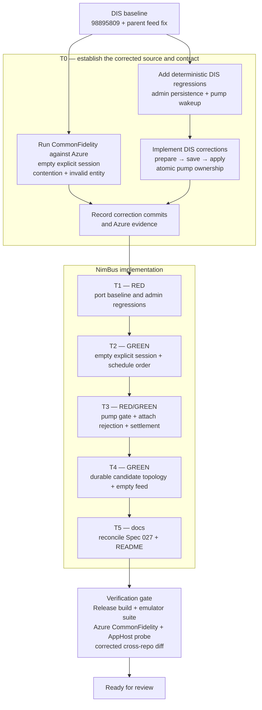

# Spec 029 — Service Bus Emulator fidelity hardening

Status: implemented locally
Depends on: Spec 027 (NimBus Service Bus Emulator)
Port baseline: DIS commit `98895809` (`fix: harden service bus emulator fidelity`) in `C:\Git\KL\DIS`
Review status: implementation and local verification complete; protected
real-Azure CommonFidelity verification remains pending because
`NIMBUS_SBEMULATOR_TEST_CS` was unavailable during implementation.

## 1. Context

`NimBus.ServiceBusEmulator` and DIS's `BH.DIS.ServiceBusEmulator` share a
codebase. DIS received a hardening pass that NimBus has not. Review of that
pass found two remaining correctness defects, so matching `98895809` alone
is not an acceptance criterion. The intended changes are listed below; the
empty-session contract must also resolve the contrary requirements in Spec 027.

| # | Divergence in NimBus today | NimBus caller that hits it |
|---|---|---|
| A | `TryAcceptSession` returns null for a session with no messages and no stored state, so an explicit `AcceptSessionAsync(sessionId)` on an empty session spins until the link closes. DIS accepts it immediately; this is the proposed contract, subject to the existing Spec 027 Azure live-probe requirement in T0. | `SubscriptionAdminService`, `AdminService`, `DeferredMessageProcessor` (any explicit-session accept whose message TTL'd out between discovery and accept) |
| B | Admin `PUT`/`DELETE` mutates live topology before journal persistence. The response body is already buffered, but save failures can leave an undurable mutation and an incorrect success/error response; an `InvalidOperationException` is mapped to `409 MessagingEntityAlreadyExists`. Cancellation can leave an entity that vanishes on restart. | Provisioner, WebApp subscription admin |
| C | The pump stays resident at zero credit. During drain completion or send-failure recovery, `OnFlow` can see `_receiving` still set and return just before the finishing pump clears it, dropping the restart until another flow arrives. | Receivers whose flow races drain completion or send-failure recovery |
| D | `ProcessDueWorkCore` walks `_scheduled` backwards and enqueues as it goes, so messages due together get sequence numbers in reverse publish order — breaks per-session FIFO. | Deferred flow (`ScheduleMessagesAsync` of same-session messages) |
| E | A non-DLQ `CompleteMessageAsync` inside a `TransactionScope` throws `NotSupportedException` inside the disposition callback; only `KeyNotFoundException` is caught, so `dispositionContext.Complete()` never runs and the client blocks on settlement. | Any consumer wrapping completion in a transaction (real Service Bus supports it) |
| F | An empty Atom feed is emitted as a self-closing `<feed/>`, which the Azure SDK treats as not-found. | `GetTopicsAsync` on a fresh namespace (provisioner bootstrap) |

## 2. Goals

1. Address A–F using the reviewed DIS baseline and the corrections below.
2. Preserve acknowledged data-plane operations when admin persistence fails,
   and eliminate the receive-pump lost wakeup under all tested interleavings.
3. Port the DIS regressions and add deterministic concurrency and failure tests.
4. Reconcile Spec 027's session requirements, fidelity invariants, and acceptance
   tests, and update the README to describe the resulting contract consistently.

## 3. Non-goals

- The three findings that are **identical in both repos and unfixed in both**:
  `TcpMultiplexer.DisposeAsync` racing in-flight `ProxyAsync` tasks; `AdminXml`
  mapping unknown entity statuses to `Active` (so `Disabled` returns 200 and does
  nothing); `Peek` filtering to `Active` and hiding locked messages. Per the
  parallel-codebase rule these are fixed in DIS first and mirrored afterwards —
  they get their own change. See §8.
- Wiring changes in `NimBus.AppHost`. The opt-in `NIMBUS_SB_EMULATOR` switch and
  the provisioner's `UseDevelopmentEmulator` detection are unaffected.
- Anything in the unrelated `endpoints-list.tsx` edits currently sitting
  uncommitted in the NimBus working tree. Stage files explicitly; never `git add -A`.

## 4. Approach

### 4.1 Port inventory and ordering

Use `98895809` as a source reference, not as an unreviewed patch to apply in
full. It changes three production files (`AdminEndpoints`, `BrokerNamespace`,
`BrokerLinkProcessor`) and adds **six** tests across two test files. It does
**not** contain the `AdminXml.Feed` fix or
`Stock_sdk_can_enumerate_an_empty_namespace`; those already exist in its parent
`98895809^` (`2e894f35`). Import that method and test separately from the parent
snapshot.

The implementer owns the DIS correction work in T0: implement §§4.2–4.3 with
regression evidence, then record the exact commits here before porting them
to NimBus. DIS-first is the chosen ordering for this change.
Those corrections are prerequisites for this change, unlike the deferred
follow-ups in §8. Do not import the unsafe rollback or stale-credit gate as an
intermediate GREEN implementation. This plan revision does not itself execute
work in DIS, push commits, or open PRs.

During implementation, inventory the selected source/test hunks and normalize
namespaces, repo-specific identifiers, and `DIS_SBEMULATOR_` environment names.
Apply tests and production changes in the task order below using scoped edits.
Read both versions before resolving source drift, especially the DLQ replay
transaction path; preserve NimBus's existing fixes and test infrastructure.

The one DIS test whose name is repo-specific
(`DIS_topology_provisioner_is_compatible_and_idempotent`) corresponds to the
existing NimBus `Stock_sdk_provisioner_second_apply_has_zero_mutations`; keep
the NimBus name and do not import a duplicate.

### 4.2 Admin persistence must not rewind live message processing

Reject the baseline `CaptureTopologyRollback()` design. It restores every
subscription's message lists, locks/session state, schedules, and sequence
counters while the admin semaphore excludes only other admin mutations.
The review reproduced an acknowledged send disappearing (`1 → 0` messages)
and an acknowledged completion being undone (`0 → 1`) after rollback.

Use the existing journal definition records plus one prepared admin delta.
`TopologyJournal` persists only topic, subscription, and rule definitions;
after startup replay, production topology writers are the admin handlers.
There is no auto-delete-on-idle writer to arbitrate. No shadow broker or copy
of runtime message state is needed. The implementation shape is
`admin gate → validate/build candidate → save candidate → apply delta`:

- Serialize admin writers across preparation, journal persistence, and commit.
- Split each broker admin operation into preparation/validation and application.
  Under `_gate`, validate against committed definitions and build their snapshot
  with the requested delta, without changing live topology or raising callbacks.
  Perform fallible preparation, including SQL rule compilation, before saving;
  retain prepared values for application rather than repeating fallible work.
- Add `TopologyJournal.SaveAsync(TopologySnapshot, CancellationToken)` using the
  existing snapshot schema. Make its definition records internally accessible
  as needed; preserve existing callers and the journal format. Persist the
  explicit candidate rather than reconstructing it from the live broker.
- While persistence is pending, data-plane operations and admin reads continue
  against committed topology. Preserve message collections, session state,
  locks, schedules, and sequence counters on retained entities.
- After a successful journal replacement, apply the prepared delta under
  `_gate`. Preserve `TopicCreated` / `SubscriptionCreated` callbacks inside that
  lock and retain `UpdateSubscription` forwarding behavior. Complete application
  and required entity registrations before returning success or releasing the
  admin writer gate. A successful delete may remove its entity's data as usual;
  a failed delete must leave that data and concurrent operations intact.
- A persistence failure or cancellation before the durable commit discards the
  candidate only. Never restore a namespace-wide runtime snapshot. Once the
  journal replacement succeeds, finish the in-memory commit even if the request
  is subsequently cancelled; response delivery failure cannot undo the commit.

T0 implements this scoped shape and proves the commit boundary, including SQL
validation, forwarding, and AMQP entity registration. Preparation failures must
leave the journal unchanged; commit-side behavior must not leave durable and
live topology different. Do not hold a monitor across an `await` or block all
message traffic on filesystem I/O.

### 4.3 Receive-pump completion must preserve a concurrent flow

The baseline `Complete(bool hasCredit)` still loses a wakeup: the caller samples
zero credit, `OnFlow` then records restart intent, and `Complete(false)` clears
that intent. The review reproduced both callbacks returning without a pump.

Treat restart intent as authoritative under the pump gate. Completion must
consume that intent or release ownership atomically, without discarding it
because of a credit value sampled before taking the gate. Recheck link/credit
state in the owning pump as needed; allow at most one owner. Link closure must
terminate pumping, and drain completion must not erase a later flow. Verify
the actual endpoint/gate integration as well as the gate in isolation.

## 5. Tasks

Work in order. Use an isolated worktree on `fix/emulator-fidelity-hardening`,
branched from `origin/master`, and retain this document at its existing path.
Use Conventional Commits locally; no push or PR without an explicit ask.
Retain the repository's PR-based flow. T0 performs the DIS corrections and
introduces the NimBus Azure contract tests; T1–T5 complete the NimBus port.



The durable topology boundary used by T4 is:

```mermaid
sequenceDiagram
    participant A as Admin request
    participant G as Admin writer gate
    participant B as Broker
    participant J as Topology journal
    participant P as AMQP frontend

    A->>G: Acquire
    G->>B: Validate and prepare definition delta
    B-->>G: Candidate snapshot + prepared apply
    Note over B: Live topology and message state remain unchanged
    G->>J: Atomically persist candidate
    alt persistence fails or is cancelled before replacement
        J-->>G: Failure
        G-->>A: 500, or aborted request
        Note over B: Discard candidate; preserve data-plane changes
    else journal replacement succeeds
        J-->>G: Durable commit
        G->>B: Apply prepared delta under broker lock
        B->>P: Registration callback for new entity
        G-->>A: Buffered success response
    end
    G->>G: Release
```

### T0 — implement DIS corrections and verify the Azure contract

- Completed in DIS commits
  `7dfa2df7676f098f6d6682fa2c736504334960b9` (durable candidate topology and
  atomic pump restart) and
  `9edc52c63ee1ecac437e8f2dbc8fcb1bf33d32e4` (prompt invalid-session attach
  rejection and explicit-attach cleanup). The rollback and stale-credit tests
  were observed RED against `98895809`; the corrected DIS Release suite passes
  all 55 tests.
- Resolve SES-4 through the existing NimBus compatibility harness. Port
  `Stock_sdk_can_lock_an_explicit_empty_session` into `SdkSmokeTests.cs` now,
  retaining `[TestCategory("CommonFidelity")]`; T1 retains this test rather than
  adding it again. Add a previously-materialized-but-now-empty variant if not
  already covered, and reuse
  `Stock_sdk_contended_explicit_session_reports_session_cannot_be_locked` for
  competing-owner behavior. Include the invalid non-session-entity attach case
  needed by T3 so the expected SDK error is observed rather than guessed.
- Run these tests locally against a dedicated Azure dev namespace using
  `NIMBUS_SBEMULATOR_TEST_CS` and `--filter TestCategory=CommonFidelity` in the
  existing test project. `EmulatorProcess.StartAsync` uses that external
  connection when nonempty, otherwise starts a local emulator. Verify the
  external setting is present without printing it, and record the SDK version,
  bounded timeout/cancellation, test results, and actual Azure execution.
  A green run alone does not prove which target was used.
  This local Azure step was unavailable because `NIMBUS_SBEMULATOR_TEST_CS` was
  absent; the cases remain tagged and the protected workflow is the outstanding
  fidelity gate.
- Keep the cases tagged for `.github/workflows/servicebus-emulator-compat.yml`,
  which runs CommonFidelity on master pushes and manual dispatch on master using
  `NIMBUS_SBEMULATOR_COMPAT_CS`. Reuse this workflow for continuing verification;
  no separate Azure probe executable or new workflow is needed.
- The intended contract is immediate acceptance of an unlocked empty explicit
  session, existing contention errors, and next-session discovery limited to
  deliverable messages. If Azure evidence contradicts it, revise A and its
  documentation/tests before implementation. If unavailable, record the missing
  evidence and leave the fidelity claim unresolved.
- Record the complete port manifest: six tests from `98895809`, the feed method
  and seventh test from `98895809^`, and the upstream correction files/tests.

### T1 — RED: port the tests

Files:

- `tests/NimBus.ServiceBusEmulator.Tests/BrokerNamespaceTests.cs` — add
  `Explicit_empty_session_can_be_locked`,
  `Scheduled_messages_due_together_preserve_publish_order`.
- `tests/NimBus.ServiceBusEmulator.Tests/SdkSmokeTests.cs` — retain T0's
  `Stock_sdk_can_lock_an_explicit_empty_session` and related contract tests; add
  `Transactional_complete_on_regular_subscription_fails_without_hanging`,
  `Failed_topology_journal_save_rolls_back_admin_mutation`,
  `Stock_sdk_can_enumerate_an_empty_namespace`.

Additional regressions required from the corrected upstream baseline:

- Pause persistence deterministically, then send, complete, schedule/cancel,
  and update session state on retained entities before injecting save failure
  or cancellation. Assert those acknowledged changes survive, including locks
  and sequence monotonicity. Exercise failed create, update, and delete for
  topics, subscriptions, and rules; include successful mutation controls.
- While a candidate mutation is pending, verify admin reads and AMQP operations
  see committed topology. Verify serialized admin writers cannot overwrite one
  another's journal state, and restart replays only committed topology.
- Cancel before journal replacement and immediately after it: assert candidate
  discard in the former case and a completed durable/live commit in the latter.
- Verify invalid SQL fails before journal replacement; successful subscription
  updates retain forwarding behavior, and committed creates register entities
  usable through the SDK. Keep callback and forwarding checks at the real
  application boundary.

Use controlled barriers or an internal persistence test seam, not timing sleeps
to hit races. Add `AdminMutationTests.cs` for in-process commit/failure tests if
needed, alongside broker and SDK coverage. Exercise the production coordinator
and journal boundary, not a duplicate test-only implementation.

Run the existing suite first to establish a baseline, then build and run the
new regressions to demonstrate failures at the intended assertions. Add pump
tests in T3, where their gate seam is introduced. Add admin coordinator tests
with T4 if they need its new internal seam, observing behavioral RED before the
fix. Do not leave tests commented out or count a compile failure as concurrency
evidence. The seven baseline regressions are distributed across T0–T3, with
additional correction cases; there is no fixed T1 failure count. Keep every
spawned emulator's journal path isolated, and unset the external connection for
local fault-injection runs.

Commit: `test(emulator): pin Service Bus fidelity behaviours`

### T2 — GREEN: session acceptance and scheduling order (A, D)

File: `src/NimBus.ServiceBusEmulator/Broker/BrokerNamespace.cs`

- Remove the `materialized` guard in `TryAcceptSession` so an explicit session
  id is lockable when otherwise eligible under the T0 contract; preserve
  contention checks. Next-session discovery still requires deliverable messages.
- `ProcessDueWorkCore`: collect due entries first, then enqueue in publish
  order.
- Do not add `CaptureTopologyRollback` or its runtime snapshots. The corrected
  topology mutation support belongs to T4.

Commit: `fix(emulator): lock empty explicit sessions and keep scheduled publish order`

### T3 — RED/GREEN: pump ownership, session attach rejection, and settlement (C, E)

Files:

- `tests/NimBus.ServiceBusEmulator.Tests/BrokerNamespaceTests.cs` — introduce
  `Receive_pump_restarts_when_flow_arrives_while_it_is_finishing` here, together
  with the minimum compilable gate seam. Add the stale-credit and ownership
  interleavings, observe their behavioral failures, then port the corrected gate.
- `tests/NimBus.ServiceBusEmulator.Tests/SdkSmokeTests.cs` — retain T0's bounded
  invalid-attach test and exercise actual endpoint recovery. Force flow after a
  zero-credit sample but before completion, and immediately after ownership is
  released. Cover drain and send-failure recovery: delivery resumes without an
  additional flow, at most one pump owns delivery, and closure terminates it.
- `src/NimBus.ServiceBusEmulator/Protocol/BrokerLinkProcessor.cs` — implement
  the following attach, disposition, and pump changes.

Reject a session receiver attach to a subscription with `RequiresSession=false`
immediately, before entering the acceptance loop, using T0's verified error
mapping. Under A, a valid unlocked explicit ID is accepted immediately and
contention already throws; extending a timeout does not fix the invalid-entity
case. Retain the next-available-session timeout and cancellation/link-close
cleanup. Do not import the blanket explicit-attach timeout change from DIS.

- In `DisposeMessage`, catch `NotSupportedException` and complete the
  disposition with `new Error("amqp:not-implemented")` instead of throwing.
- Port the corrected pump gate and endpoint integration described in §4.3,
  including the stale-credit regression. Do not port `Complete(bool hasCredit)`
  unchanged from `98895809`.
- Verify successful DLQ replay commit/rollback remains supported and unsupported
  regular transactional completion fails within a bounded SDK timeout.

Commit: `fix(emulator): close the receive-pump lost-wakeup window and reject transactional completes cleanly`

### T4 — GREEN: admin plane atomicity (B, F)

Files:

- `src/NimBus.ServiceBusEmulator/Broker/BrokerNamespace.cs` and, if required,
  `Broker/BrokerModels.cs` — prepare and commit topology metadata per §4.2;
  preserve retained entities' runtime state and enforce the commit boundary.
- `src/NimBus.ServiceBusEmulator/Storage/TopologyJournal.cs` — persist the
  prepared candidate through `SaveAsync(TopologySnapshot, CancellationToken)`,
  retaining existing schema, atomic replacement, and startup replay compatibility.
  Reuse the existing definition records with suitable internal visibility. Add a
  narrow internal persistence seam for deterministic tests if required.
- `src/NimBus.ServiceBusEmulator/Admin/AdminEndpoints.cs` — serialize admin
  writers and coordinate prepare/persist/commit. Buffer success until commit;
  reset the buffer before a `500 MessagingEntityPersistenceError` on persistence
  failure. Cancellation before commit discards the candidate; an aborted HTTP
  request need not receive a response (`499` may be recorded server-side).
  Cancellation or response-write failure after durable commit must not discard it.
- Check `Protocol/AmqpFrontend.cs` entity-registration callbacks as part of the
  commit boundary; include a scoped change only if the corrected upstream design
  needs one. Test newly committed entities through the stock SDK.
- `src/NimBus.ServiceBusEmulator/Admin/AdminXml.cs` — give the empty feed a
  `<title>` element, explicitly importing `Feed` from `98895809^`.

Commit: `fix(emulator): make admin mutations atomic with the topology journal`

### T5 — docs

Files:

- `docs/specs/027-service-bus-emulator/spec.md` — reconcile **SES-4**, its
  **SES-8** reference, **TST-2 CommonFidelity** acceptance criteria, and the
  **M2** live-probe milestone with T0's recorded session contract. Replace the
  requirement that a never-materialized accept must pend if A is confirmed;
  describe immediate valid explicit acceptance, contention, prompt invalid-entity
  rejection, next-session timeout, and cancellation without prescribing a new
  explicit-attach timeout.
  Preserve request/reply coverage when the receiver accepts before the reply
  exists: receiving must still wait and deliver the eventual reply.
- In §7.1 `[FID]`, add the empty-session contract, preservation of acknowledged
  data-plane changes on admin persistence failure, visibility only of committed
  topology, and atomic pump ownership/restart handling. Search the full spec for
  stale or contradictory session, cancellation, and acceptance-test wording.
- `src/NimBus.ServiceBusEmulator/README.md` — one sentence under the
  supported-surface paragraph noting empty-session locking and that
  transactional completion outside the DLQ replay path is rejected with
  `amqp:not-implemented` rather than hanging.

Commit: `docs(emulator): record fidelity invariants from the hardening pass`

## 6. Verification

- `dotnet build src/NimBus.sln -c Release` — Release promotes CS warnings to
  errors; this is what CI runs.
- `dotnet test tests/NimBus.ServiceBusEmulator.Tests` — all existing tests
  plus the seven imported regressions and all correction cases green. Build and
  test this project in Release too; retain failure/passing evidence for the
  concurrency interleavings and persistence boundaries, not just test counts.
- Rerun the existing SDK DLQ transaction/replay and zero-churn provisioner tests
  as part of that suite. Successful commit/rollback and bounded rejection of
  unsupported regular transactional completion must all pass.
- Azure compatibility: run `dotnet test tests/NimBus.ServiceBusEmulator.Tests
  -c Release --filter TestCategory=CommonFidelity` with a verified nonempty
  `NIMBUS_SBEMULATOR_TEST_CS` for a dedicated Azure dev namespace. Preserve the
  tags so `servicebus-emulator-compat.yml` continuously exercises these cases.
  Record target provenance without exposing credentials; do not count a local
  fallback or an unverified historical green run as Azure evidence. Separately
  run local emulator fault-injection tests with the variable unset.
- Diff against the **recorded corrected DIS commits**, normalizing namespaces,
  identifiers, and environment variables. Include `Storage/` and changed tests
  in addition to `Admin/`, `Broker/`, and `Protocol/`. Account explicitly for the
  separately imported feed fix/test and retained NimBus-specific behavior; do
  not require an empty diff against the known-defective `98895809` snapshot.
- Emulator-side end-to-end only: start `NimBus.AppHost` with
  `NIMBUS_SB_EMULATOR=true` using the
  repository's Aspire workflow and verify the provisioner completes. Run a stock
  SDK probe using that AppHost's actual emulator connection string: create a
  uniquely named topic and session-enabled subscription, publish no messages,
  and call `AcceptSessionAsync(topic, subscription, "empty-session", ...)`.
  Disable retries, use a five-second operation budget and a fifteen-second
  overall cancellation deadline, and assert a receiver with that session ID is
  returned under the confirmed A contract. Dispose it and delete only the probe's
  entities. Record the result; never log the connection string. Opening Admin →
  Subscriptions or draining an empty subscription is not evidence of this accept.
  This verifies AppHost wiring and the local emulator, not real Azure semantics.
- Confirm SES-4, TST-2, M2, the new fidelity invariants, and the README describe
  one contract. Include T0's Azure probe evidence before claiming CommonFidelity.

### 6.1 Implementation record

- NimBus implementation commit:
  `c0ae474bd61122f7b3be04885fd861b2f26fede4`.
- `dotnet build src/NimBus.sln -c Release`: passed with no errors. The existing
  solution-wide analyzer warnings remain; this change introduced no build error.
- `dotnet test src/NimBus.sln -c Release --no-build --verbosity minimal`: passed.
  Optional live-provider tests were skipped by their existing environment guards.
- `dotnet test tests/NimBus.ServiceBusEmulator.Tests -c Release`: 56 passed;
  the two cleanup-adjusted explicit-session probes were rerun and passed after
  the implementation commit was finalized.
- Aspire isolated smoke: emulator and WebApp reached `Healthy`, the provisioner
  reached `Finished`, and the two stock-SDK empty-session probes passed against
  the AppHost-generated connection (2/2). The connection string was not logged;
  the isolated AppHost was stopped after the probe.
- Corrected cross-repo production comparison: all six changed production files
  match the two recorded DIS correction commits after normalizing namespaces and
  the repository-specific journal temporary-path prefix.
- Real Azure was not claimed: `NIMBUS_SBEMULATOR_TEST_CS` was absent. The
  `CommonFidelity` cases remain wired to the protected compatibility workflow.

## 7. Risks

- **Upstream correctness.** `98895809` is insufficient. The data-loss rollback
  and stale-credit race are required corrections, not accepted parity debt.
- **Commit boundary.** Journal replacement is the durable commit point. Validate
  topology changes before it and prove in-memory application and entity
  registration finish afterward despite request cancellation. A process crash
  after replacement must replay the committed topology on restart; message
  persistence remains outside the emulator's contract.
- **Patch drift.** Preserve NimBus `c93d1ac` DLQ replay behavior and existing
  test-process isolation when adapting the corrected source and tests.
- **Pump restart/drain.** A corrected gate must neither leave positive credit
  without an owner nor create concurrent pumps or unbounded synchronous restart
  recursion. Deterministically cover drain, closure, and both sides of ownership
  release; the original three-assertion gate test alone is insufficient.
- **Contract evidence.** The current SES-4 wording contradicts the proposed
  empty-session behavior. T0 resolves that disagreement; an emulator test cannot
  substitute for the required Azure observation.

## 8. Follow-ups (separate change, DIS first)

Fix in `c:\Git\KL\DIS`, verify, then mirror here:
1. `Hosting/TcpMultiplexer.cs` — track proxy tasks and await them in
   `DisposeAsync`.
2. `Admin/AdminXml.cs` — reject unknown entity statuses with `400` instead of
   defaulting to `Active`.
3. `Broker/BrokerNamespace.cs` `Peek` — include `Locked` messages, as the real
   broker does.
