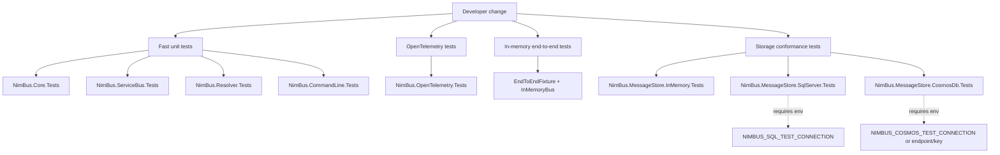
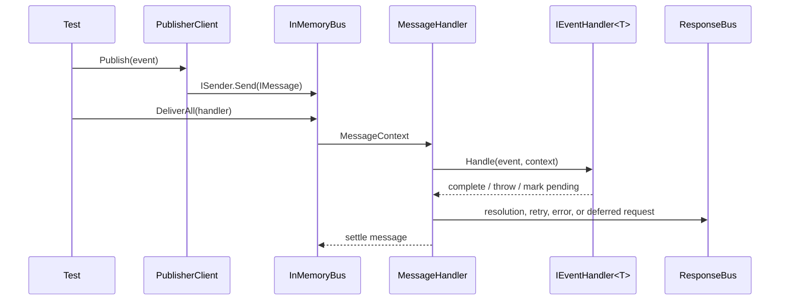
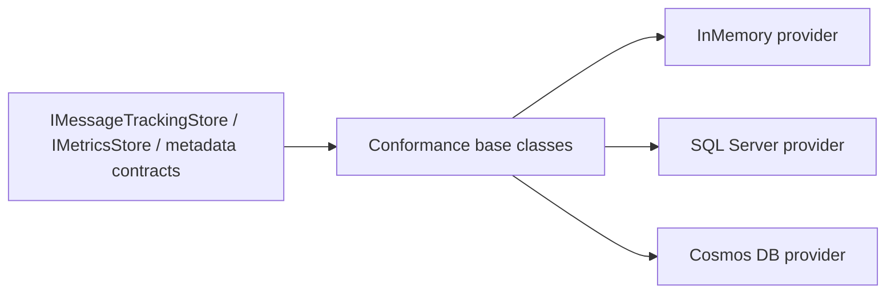
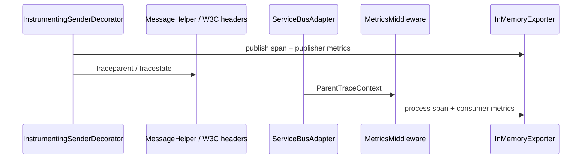
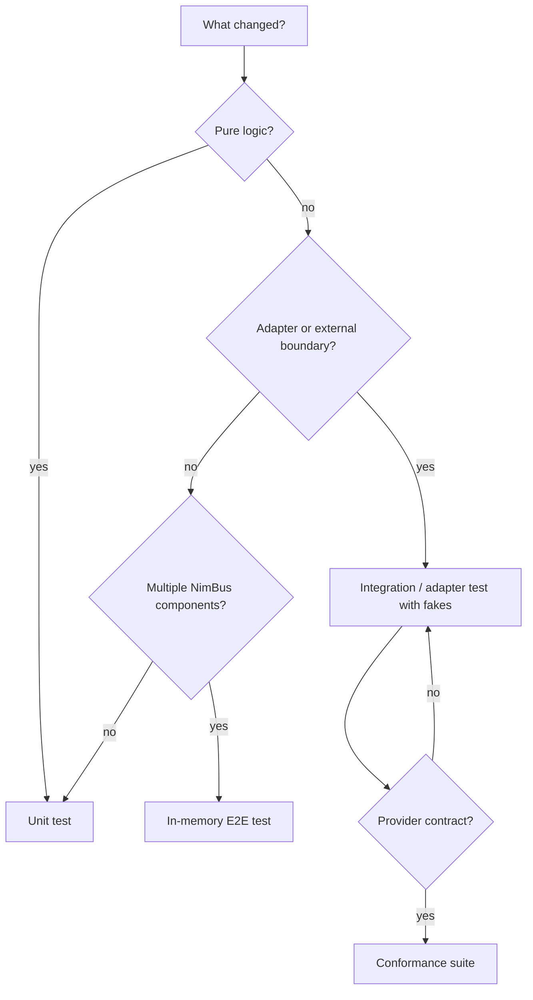

# Testing Guide

NimBus uses a layered test strategy. Fast unit tests protect core message
semantics, provider conformance tests protect pluggable storage behavior, and
end-to-end tests exercise the in-memory publish/receive workflow without
requiring Azure Service Bus.

## Test Suite Map



## Projects

| Project | Layer | Purpose |
|---|---|---|
| `tests/NimBus.Core.Tests` | Unit / component | Message handlers, retry policies, pipeline behaviors, outbox core logic, extension registration. |
| `tests/NimBus.ServiceBus.Tests` | Unit / adapter | Service Bus message conversion, session behavior, deferred processor, SDK-facing Service Bus behavior. |
| `tests/NimBus.OpenTelemetry.Tests` | Unit / integration | Instrumentation registration, W3C propagation, spans, metrics, metric-cardinality guardrails, DI wiring. |
| `tests/NimBus.EndToEnd.Tests` | End-to-end in memory | Full publish -> receive -> handler -> response workflows using `EndToEndFixture`. |
| `tests/NimBus.Resolver.Tests` | Unit / component | Resolver state transitions, audit writes, retry/dead-letter behavior. |
| `tests/NimBus.MessageStore.InMemory.Tests` | Conformance | Always-on provider conformance for the in-memory message store. |
| `tests/NimBus.MessageStore.SqlServer.Tests` | Live integration / conformance | Same storage conformance suite against SQL Server; skipped when no SQL connection env var is set. |
| `tests/NimBus.MessageStore.CosmosDb.Tests` | Live integration / conformance | Same storage conformance suite against Cosmos DB; skipped when no Cosmos env vars are set. |
| `tests/NimBus.CommandLine.Tests` | Unit / integration-light | CLI naming, command context, topology provisioner behavior with fakes. |

## Running Tests

From the repository root:

```powershell
dotnet test .\src\NimBus.sln
```

Fast focused runs:

```powershell
dotnet test .\tests\NimBus.Core.Tests\NimBus.Core.Tests.csproj
dotnet test .\tests\NimBus.ServiceBus.Tests\NimBus.ServiceBus.Tests.csproj
dotnet test .\tests\NimBus.OpenTelemetry.Tests\NimBus.OpenTelemetry.Tests.csproj
dotnet test .\tests\NimBus.EndToEnd.Tests\NimBus.EndToEnd.Tests.csproj
```

Live provider tests are environment-gated:

```powershell
$env:NIMBUS_SQL_TEST_CONNECTION = "Server=...;Database=...;User Id=...;Password=...;TrustServerCertificate=True"
dotnet test .\tests\NimBus.MessageStore.SqlServer.Tests\NimBus.MessageStore.SqlServer.Tests.csproj

$env:NIMBUS_COSMOS_TEST_CONNECTION = "AccountEndpoint=...;AccountKey=..."
dotnet test .\tests\NimBus.MessageStore.CosmosDb.Tests\NimBus.MessageStore.CosmosDb.Tests.csproj
```

When the env vars are missing, the live provider tests call `Assert.Inconclusive`
so local contributors can still run the rest of the suite.

## End-To-End Harness

The E2E tests do not require Azure Service Bus. They use an in-memory sender and
Service Bus message conversion to exercise the same message contracts that the
real adapter sees.



Use E2E tests for behavior that depends on multiple framework pieces working
together: routing, retries, session blocking, pending handoff, deferred replay,
operator skip/resubmit, and lifecycle observer ordering.

Avoid using E2E tests for small pure decisions. Prefer unit tests for retry
policy selection, message conversion, validation behavior, and individual
middleware outcomes.

## Storage Conformance

Storage providers must satisfy the same provider-neutral behavior. The abstract
suite lives in `src/NimBus.Testing/Conformance`; each provider test project only
supplies a concrete store instance.



When adding storage behavior, add the assertion to the conformance base class
first. That forces every provider to prove the same public contract and keeps
provider-specific tests focused on setup, schema, and operational edge cases.

## OpenTelemetry Tests

`tests/NimBus.OpenTelemetry.Tests` uses OpenTelemetry in-memory exporters to
inspect spans and metrics directly.



The suite should protect these invariants:

- `AddNimBusInstrumentation()` registers every public meter/source and is idempotent.
- W3C `traceparent` and `tracestate` round-trip through transport headers.
- Publish and process spans share a trace id and have the correct parent-child relationship.
- `Activity.Current` inside the pipeline is the framework-managed `NimBus.Process` span.
- Error paths set `ActivityStatusCode.Error`, `error.type`, and an `exception` event.
- Metric tags never include per-message identifiers such as message id, conversation id, or session key.

## Choosing The Right Test Level



Use the lowest test level that catches the regression:

- Unit test: deterministic logic, pipeline behavior, message shape, retry policy.
- Adapter/integration test: Service Bus conversion, DI wiring, telemetry exporter behavior.
- Conformance test: provider-neutral storage or future transport behavior.
- E2E test: user-visible workflow across publish, receive, handler, response, and session state.

## Current Observability Coverage Boundaries

The OpenTelemetry tests cover the implemented publisher, consumer, W3C
propagation, Service Bus receive boundary, and DI publisher wiring.

Outbox, deferred processor, resolver, store decorators, observable gauges, and
verbose-mode per-step spans are represented by public meter/source constants but
do not yet have full production instrumentation call sites. Add behavior tests
for those components when each implementation slice lands; until then, tests
that only assert constants are not sufficient.
