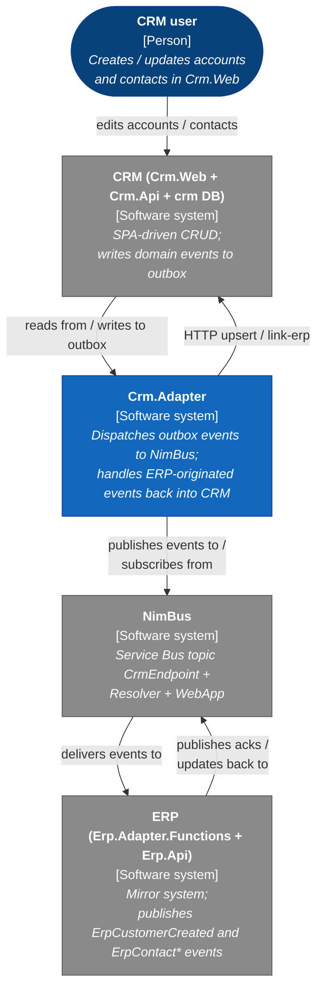
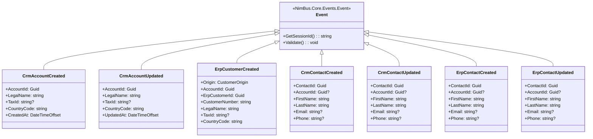
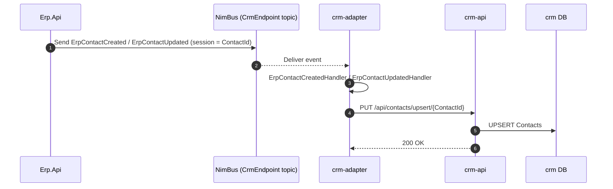

# Technical Design Document — Crm.Adapter

<!--
  Legend:
    [AUTO]  — derived from source code; safe to regenerate.
    [HUMAN] — owned by business / NFR / security; see Appendix B.
    [MIXED] — AI-drafted, human must review.
-->

| | |
|---|---|
| **Document type** | TDD (Technical Design Document) |
| **Adapter** | Crm.Adapter (`Crm.Adapter`, Aspire resource `crm-adapter`) |
| **Status** | Draft |
| **Version** | 0.1 |
| **Owner** | {TBD — see Appendix B} |
| **Source repository** | `samples/CrmErpDemo/Crm.Adapter` (in the NimBus repo) |
| **Deployment unit(s)** | `crm-adapter` Container App (via Aspire / `Microsoft.NET.Sdk.Worker`) |
| **Runtime** | .NET 10 (`net10.0`), `Microsoft.Extensions.Hosting` worker |
| **NimBus version** | Project references (`NimBus.SDK`, `NimBus.Outbox.SqlServer`, `NimBus.ServiceDefaults`) — no NuGet pin |
| **Last reviewed** | 2026-04-27 |
| **Next review** | {TBD} |

> **Scope of this document.** Technical implementation of `Crm.Adapter` for developers and operations. Covers every integration the adapter handles — the outbox dispatch path that publishes CRM-originated events to NimBus, and the subscriber path that handles ERP-originated events back into the CRM API. Contains no business rationale; the demo's storyline lives in [`../README.md`](../../README.md) and the higher-level NimBus docs.

---

## 1. Adapter purpose, scope, responsibilities

### 1.1 Purpose  <!-- [MIXED] -->

Bridge between the CRM SQL database (written by `Crm.Api`) and the NimBus message bus on the `CrmEndpoint` topic: forward CRM-originated domain events out of the SQL outbox to Service Bus, and apply ERP-originated events back into the CRM via the CRM API.

### 1.2 Scope  <!-- [MIXED] -->

| In scope | Out of scope |
|---|---|
| Outbox dispatch to Service Bus topic `CrmEndpoint` | Writing entities directly to the CRM database (owned by `Crm.Api`) |
| Subscribing to `CrmEndpoint` and applying inbound events via the CRM REST API | Originating outbound events (the publish call lives in `Crm.Api`) |
| Deferred-message replay for unblocked sessions | NimBus topology provisioning (owned by `CrmErpDemo.Provisioner`) |
| Idempotent calls to `Crm.Api` (upsert / link-erp) | Authentication / authorization (the demo runs without auth) |

### 1.3 Responsibilities  <!-- [AUTO] — derived from `Program.cs` and `Handlers/*` -->

1. **Outbox dispatch.** Run `OutboxDispatcherHostedService` (registered via `AddNimBusOutboxDispatcher(TimeSpan.FromSeconds(1))`) that polls the `OutboxMessages` table in the `crm` SQL database and forwards rows to `OutboxDispatcherSender`, which wraps a `ServiceBusSender` for the `CrmEndpoint` topic.
2. **Subscribe to `CrmEndpoint`.** Run `NimBusReceiverHostedService` (registered via `AddNimBusReceiver`) bound to topic/subscription `CrmEndpoint` / `CrmEndpoint`. Dispatch inbound messages through the NimBus pipeline (`LoggingMiddleware`, `MetricsMiddleware`, `ValidationMiddleware`) into registered `IEventHandler<T>` implementations.
3. **Apply inbound events.** Use `HttpClient`-typed `ICrmApiClient` to call back into `Crm.Api`:
   - `ErpCustomerCreated` (from ERP) → `ErpCustomerCreatedHandler`. If `Origin=Crm`: `POST /api/accounts/{id}/link-erp`. If `Origin=Erp`: `PUT /api/accounts/external/{erpCustomerId}`.
   - `ErpContactCreated` (from ERP) → `ErpContactCreatedHandler` → `PUT /api/contacts/upsert/{contactId}`.
   - `ErpContactUpdated` (from ERP) → `ErpContactUpdatedHandler` → `PUT /api/contacts/upsert/{contactId}`.
4. **Deferred-message replay.** Run `DeferredProcessorService` against `CrmEndpoint/deferredprocessor` (sessions OFF) — replays deferred messages in FIFO once a session is unblocked.
5. **Outbox table bootstrap.** On startup, call `(SqlServerOutbox)IOutbox.EnsureTableExistsAsync()` so a fresh DB does not race the dispatcher.

### 1.4 Versioning  <!-- [MIXED] -->

The adapter ships with the demo (`samples/CrmErpDemo/`) and follows the NimBus repo version. The public surface is the NimBus event contract (`Produces<>` / `Consumes<>` in `CrmErpDemo.Contracts/Endpoints/CrmEndpoint.cs`); breaking it requires coordinated changes in `Erp.Adapter.Functions`. New handlers and additive event fields are MINOR. Schema-breaking changes (renamed property, type change, removed `[SessionKey]`, removed event) are MAJOR.

### 1.5 Architecture at a glance  <!-- [MIXED] -->

`Crm.Adapter` is a single .NET 10 worker that hosts three independent NimBus pipelines: an outbox dispatcher, a session-aware subscriber, and a deferred-message replayer. Outbound publishes are written by `Crm.Api` to the SQL outbox table inside the same DB transaction as the entity write (transactional outbox); the adapter dispatches them on a 1-second poll. Inbound handlers are stateless and idempotent — they call back into `Crm.Api` over HTTP (typed `HttpClient` with Aspire service discovery). The CrmErpDemo follows an origin-prefixed event-naming convention: each event has exactly one producer (`Crm*` events from CRM, `Erp*` events from ERP), so cross-topic loops are structurally impossible. The legacy round-trip discriminator `ErpCustomerCreated.Origin` still distinguishes ERP-originated customers from CRM-originated round-trip acks (see §4.2).

| Direction | Source | Target | Event family | Handler / route | Ordering key | Criticality | Owner |
|---|---|---|---|---|---|---|---|
| CRM → NimBus | `Crm.Api` (SQL outbox) | NimBus topic `CrmEndpoint` | `CrmAccountCreated`, `CrmAccountUpdated`, `CrmContactCreated`, `CrmContactUpdated` | [`OutboxDispatcherHostedService`](#5-worked-integration--account-round-trip) | `AccountId` / `ContactId` | {TBD} | {TBD} |
| NimBus → CRM | NimBus topic `CrmEndpoint` | `Crm.Api` (HTTP) | `ErpCustomerCreated` | [`ErpCustomerCreatedHandler`](#5-worked-integration--account-round-trip) | `AccountId` | {TBD} | {TBD} |
| NimBus → CRM | NimBus topic `CrmEndpoint` | `Crm.Api` (HTTP) | `ErpContactCreated`, `ErpContactUpdated` | [`ErpContactCreatedHandler` / `ErpContactUpdatedHandler`](#61-erp-originated-contact-update) | `ContactId` | {TBD} | {TBD} |

> Criticality + owner are open questions — see Appendix B.

---

## 2. Technical architecture

### 2.1 System context (C4 Level 1)  <!-- [MIXED] -->



### 2.2 Container diagram (C4 Level 2)  <!-- [AUTO] — derived from `CrmErpDemo.AppHost/Program.cs` and `Crm.Adapter/Program.cs` -->

```mermaid
graph TB
    erp["<b>Erp.Adapter.Functions / Erp.Api</b><br/>[Software system]"]
    nimbusSb["<b>NimBus Service Bus</b><br/>[Software system]<br/><i>Topic CrmEndpoint<br/>(provisioned by CrmErpDemo.Provisioner)</i>"]

    subgraph crmSys["CRM (Crm.Web + Crm.Api + Crm.Adapter)"]
        web["<b>crm-web</b><br/>[Container: Vite SPA]<br/><i>React + TS UI</i>"]
        api["<b>crm-api</b><br/>[Container: ASP.NET Core minimal API]<br/><i>CRUD over crm DB;<br/>publishes events to outbox</i>"]
        adapter["<b>crm-adapter</b><br/>[Container: .NET 10 Worker]<br/><i>Outbox dispatcher,<br/>subscriber pipeline,<br/>deferred-message replay</i>"]
        sql[("<b>crm DB</b><br/>[Container: SQL Server]<br/><i>Entities + OutboxMessages<br/>(NimBus.Outbox.SqlServer)</i>")]
    end

    user(["<b>CRM user</b><br/>[Person]"]) -->|HTTPS| web
    web -->|HTTPS<br/>service discovery| api
    api -->|EF Core<br/>same DB transaction| sql
    adapter -->|polls outbox<br/>every 1s| sql
    adapter -->|publishes (OutboxDispatcherSender)<br/>Service Bus| nimbusSb
    nimbusSb -->|delivers (session-aware)<br/>topic CrmEndpoint / sub CrmEndpoint| adapter
    adapter -->|HTTP PUT/POST<br/>typed HttpClient| api
    erp -->|publishes events to| nimbusSb

    classDef container fill:#1168bd,stroke:#0b3d91,color:#ffffff
    classDef store     fill:#1168bd,stroke:#0b3d91,color:#ffffff
    classDef external  fill:#8a8a8a,stroke:#545454,color:#ffffff
    classDef boundary  fill:none,stroke:#1168bd,stroke-dasharray:4 4,color:#1168bd
    classDef person    fill:#08427b,stroke:#0b3d91,color:#ffffff

    class web,api,adapter container
    class sql store
    class erp,nimbusSb external
    class user person
    class crmSys boundary
```

### 2.3 Azure resources  <!-- [AUTO] — from `CrmErpDemo.AppHost/Program.cs` -->

The demo runs locally via .NET Aspire. The adapter is **not** declared with separate Bicep/Terraform; deployment is through Aspire's manifest publishing.

| Resource | Aspire reference | Purpose |
|---|---|---|
| SQL Server (Aspire-managed container) | `builder.AddSqlServer("sql")` | Hosts the `crm` database |
| `crm` database | `sql.AddDatabase("crm")` | Entities + outbox table |
| Service Bus connection | `builder.AddConnectionString("servicebus")` | Topic `CrmEndpoint` (provisioned by `CrmErpDemo.Provisioner`) |
| Cosmos DB connection | `builder.AddConnectionString("cosmos")` | Used by `NimBus.Resolver` and `nimbus-ops` (not by the adapter directly) |
| `crm-adapter` project | `builder.AddProject<Projects.Crm_Adapter>("crm-adapter")` | This adapter |
| `crm-api` project | `builder.AddProject<Projects.Crm_Api>("crm-api")` | Target of adapter HTTP callbacks |
| `provisioner` project | `builder.AddProject<Projects.CrmErpDemo_Provisioner>("provisioner")` | Creates topics/subscriptions (`CrmEndpoint`, `ErpEndpoint`) |

Aspire `WithReference` calls on `crm-adapter`: `servicebus`, `crmDb` (`crm` connection string), `crmApi` (service-discovery URL).

> **NimBus topology** (Service Bus topic + subscription, Cosmos containers for Resolver state per ADR-008) is provisioned by `CrmErpDemo.Provisioner` from the `Endpoint` declaration. The adapter does not own the topic; the topic name equals the endpoint class name (`CrmEndpoint`).

### 2.4 Endpoints and authorisation  <!-- [AUTO] -->

**Inbound (adapter exposes):**

| Endpoint | Path | Auth | Caller |
|---|---|---|---|
| NimBus subscription | n/a (Service Bus session-aware receiver via `AddNimBusReceiver`, topic `CrmEndpoint` / sub `CrmEndpoint`) | Connection-string-based (demo) | NimBus |
| Deferred-processor subscription | n/a (Service Bus processor on `CrmEndpoint/deferredprocessor`, no sessions) | Connection-string-based (demo) | NimBus |

**Outbound (adapter calls):**

| Target | URL pattern | Auth |
|---|---|---|
| `crm-api` (link-erp) | `{crm-api}/api/accounts/{accountId}/link-erp` | None (demo); typed `HttpClient` with Aspire service discovery |
| `crm-api` (account upsert from ERP) | `{crm-api}/api/accounts/external/{erpCustomerId}` | None (demo) |
| `crm-api` (contact upsert) | `{crm-api}/api/contacts/upsert/{contactId}` | None (demo) |
| Service Bus | `sb://{servicebus-namespace}/CrmEndpoint` | Connection string from Aspire |
| SQL `crm` outbox | `Server=...; Database=crm;` | Connection string from Aspire |

> **Auth gap (demo only).** No bearer/MI auth on the HTTP calls into `crm-api`, no Managed Identity to Service Bus / SQL. This is acceptable for a local Aspire demo but flagged in §8 for any production lift.

### 2.5 Security  <!-- [MIXED] -->

| Control | Implementation |
|---|---|
| Adapter → `crm-api` auth | None (demo) |
| Adapter → Service Bus auth | Connection string from `ConnectionStrings:servicebus` (user secret on the AppHost) |
| Adapter → SQL `crm` | Connection string from `ConnectionStrings:crm` (Aspire-injected) |
| Inbound webhook auth | n/a — adapter exposes no HTTP surface |
| Secrets | User secrets on the AppHost; not stored in code |
| PII in logs | Handlers log identifiers only (`AccountId`, `ErpCustomerId`, `CustomerNumber`, `ContactId`). Bodies are not logged. ✅ |
| TLS | Inherits Aspire defaults |

> **Production lift checklist** (out of scope for the demo, recorded for §8 / Appendix B):
> - Switch Service Bus to Managed Identity (`AddAzureServiceBusClient` already supports it via `DefaultAzureCredential`).
> - Switch SQL to Managed Identity.
> - Add bearer auth on `Crm.Api` and propagate from `Crm.Adapter`.
> - Emit Key Vault references for any non-Aspire-injected secrets.

### 2.6 Configuration  <!-- [AUTO] -->

| Source | Content |
|---|---|
| `appsettings.json` | `Logging:LogLevel` only (Default Information; Hosting.Lifetime Information) |
| Connection strings (Aspire-injected) | `ConnectionStrings:crm` (required — throws on startup if missing); `ConnectionStrings:servicebus` (used by `AddAzureServiceBusClient`) |
| Service-discovery keys | `services:crm-api:https:0` / `services:crm-api:http:0` — resolved from Aspire `WithReference(crmApi)`; falls back to `Crm:ApiBaseUrl` if missing |
| Hard-coded | Outbox poll interval `TimeSpan.FromSeconds(1)`; topic name `"CrmEndpoint"`; deferred-processor subscription `"deferredprocessor"` |

> TODO(human): consider extracting the outbox poll interval and the topic name to `appsettings.json` if the adapter is ever lifted out of the demo.

---

## 3. Events and triggers

**Source of truth:** `samples/CrmErpDemo/CrmErpDemo.Contracts/Endpoints/CrmEndpoint.cs`.

The endpoint class extends `NimBus.Core.Endpoints.Endpoint` and declares the contract via `Produces<TEvent>()` / `Consumes<TEvent>()`. The class name (`CrmEndpoint`) is the topic name. `ISystem.SystemId = "Crm"`.

See [`events.md`](./events.md) for field-level event schemas and full mapping tables. This section is the index.

### 3.1 Consumed events (NimBus → adapter)  <!-- [AUTO] -->

| Event | Handler (`IEventHandler<T>`) | Direction / outcome | Notes |
|---|---|---|---|
| `ErpCustomerCreated` | `ErpCustomerCreatedHandler` (`Crm.Adapter/Handlers`) | Branch on `Origin`: `Crm` → `POST link-erp`; `Erp` → `PUT account/external/{id}` | Round-trip ack of `CrmAccountCreated` or originating ERP customer |
| `ErpContactCreated` | `ErpContactCreatedHandler` (`Crm.Adapter/Handlers`) | `PUT /api/contacts/upsert/{ContactId}` | Idempotent on `ContactId` |
| `ErpContactUpdated` | `ErpContactUpdatedHandler` (`Crm.Adapter/Handlers`) | `PUT /api/contacts/upsert/{ContactId}` | Idempotent on `ContactId` |

### 3.2 Published events (adapter → NimBus, via outbox dispatch)  <!-- [AUTO] -->

The adapter does not call `IPublisherClient.Publish(...)` itself. Outbound events are written by `Crm.Api` to the SQL outbox table; the adapter's `OutboxDispatcherHostedService` picks them up and forwards them to the `CrmEndpoint` topic via `OutboxDispatcherSender`.

| Event | Trigger (in `Crm.Api`) | Published via |
|---|---|---|
| `CrmAccountCreated` | `POST /api/accounts/` | Outbox → `OutboxDispatcherSender` → topic `CrmEndpoint` |
| `CrmAccountUpdated` | `PUT /api/accounts/{id}` | Outbox → `OutboxDispatcherSender` → topic `CrmEndpoint` |
| `CrmContactCreated` | `POST /api/contacts/` | Outbox → `OutboxDispatcherSender` → topic `CrmEndpoint` |
| `CrmContactUpdated` | `PUT /api/contacts/{id}` | Outbox → `OutboxDispatcherSender` → topic `CrmEndpoint` |

### 3.3 Triggers  <!-- [HUMAN] -->

| Trigger | Type | Frequency / schedule | Notes |
|---|---|---|---|
| Outbox dispatch | Polled | Every 1 s (hard-coded in `Program.cs`) | Default batch size 100. Batch can be raised if outbox throughput becomes a bottleneck. |
| Inbound subscription | Continuous | Driven by Service Bus delivery | Session-aware. Concurrency / prefetch use `NimBusReceiverOptions` defaults. |
| Deferred-processor | Continuous | Driven by Service Bus delivery on `deferredprocessor` sub | `MaxConcurrentCalls = 1`, `AutoCompleteMessages = false`. |

> TODO(human): document the expected daily volume of CRM account / contact mutations and confirm whether the 1s outbox poll is acceptable under that load.

---

## 4. Common implementation patterns

### 4.1 Handler skeleton  <!-- [AUTO] — `Crm.Adapter/Handlers/ErpCustomerCreatedHandler.cs` -->

```csharp
public sealed class ErpCustomerCreatedHandler(
    ICrmApiClient crm,
    ILogger<ErpCustomerCreatedHandler> logger)
    : IEventHandler<ErpCustomerCreated>
{
    public async Task Handle(
        ErpCustomerCreated message,
        IEventHandlerContext context,
        CancellationToken cancellationToken = default)
    {
        if (message.Origin == CustomerOrigin.Crm)
        {
            // CRM → ERP → CRM round-trip ack.
            await crm.LinkErpAsync(
                message.AccountId, message.ErpCustomerId, message.CustomerNumber, cancellationToken);
            return;
        }

        // ERP-originated customer — upsert into CRM.
        await crm.UpsertFromErpAsync(
            message.ErpCustomerId,
            new AccountUpsertPayload(null, message.LegalName, message.TaxId, message.CountryCode, message.CustomerNumber),
            cancellationToken);
    }
}
```

Notable points:

- Constructor-injected `HttpClient`-typed client (`ICrmApiClient`) and `ILogger<T>`.
- The handler signature matches the NimBus `IEventHandler<T>` contract: `(T message, IEventHandlerContext context, CancellationToken)`.
- `IEventHandlerContext` is available for response sends / correlation but is not used in either of this adapter's handlers.

### 4.2 Echo-loop prevention  <!-- [AUTO] -->

**Origin-prefixed event names** are the primary loop-prevention mechanism in CrmErpDemo. Each event type has exactly one producer (`Crm*` from CRM, `Erp*` from ERP), so a CRM-published event can never round-trip back into a CRM handler — the type system forbids it. The provisioner additionally enforces `user.From IS NULL` on cross-topic forward rules as defense-in-depth against any future symmetric event added by mistake.

`ErpCustomerCreated` carries an `Origin` enum (`Crm` / `Erp`). This is **not** about which system published the event (ERP always publishes it); it discriminates two different business meanings: when `Origin = Crm`, the event is the round-trip ack of a `CrmAccountCreated` that ERP processed — the handler must not re-create the account, only link the ERP id. When `Origin = Erp`, the event represents a fresh ERP-originated customer and the handler upserts a new CRM account.

### 4.3 Transient-fault retry  <!-- [AUTO] — no explicit retry policy is configured -->

The adapter does **not** call `subscriber.RetryPolicies(...)` in `AddNimBusSubscriber("CrmEndpoint", ...)`. Behaviour falls back to NimBus defaults:

- The `StrictMessageHandler` is constructed without an `IRetryPolicyProvider` (no provider is registered in DI).
- Service Bus delivery-count handling drives terminal failure: after the namespace's `MaxDeliveryCount` retries, the message dead-letters or is routed through Resolver.
- Network failures from `HttpClient` (transient) and validation failures throw out of the handler, abandon the message, and let Service Bus redeliver.

For a demo this is acceptable; for production, document explicit retry budgets per event type. See §8.

### 4.4 Missing-reference-data policy  <!-- [AUTO] — derived from handler behaviour -->

| Stance | Used by | Behaviour | Rationale |
|---|---|---|---|
| **Throw** | `ErpCustomerCreatedHandler`, `ErpContactCreatedHandler`, `ErpContactUpdatedHandler` (de facto) | `EnsureSuccessStatusCode()` on every `crm-api` call throws `HttpRequestException` on any non-2xx response (4xx and 5xx). The exception bubbles to NimBus, the message abandons, and Service Bus retries until delivery-count is reached. | Simple, but conflates transient (5xx, timeouts) with permanent (4xx, malformed payload) failures. |

> **Recommended hardening (see §8):** branch on `response.StatusCode` — treat 4xx as permanent (classify via `IPermanentFailureClassifier`), retry on 5xx and timeouts only. Today, a permanent 404 from `crm-api` will burn the full retry budget before reaching the Resolver.

### 4.5 Mapping layer  <!-- [AUTO] -->

The Crm.Adapter does not own outbound mapping (that lives in `Crm.Api/Mapping/AccountMapper.cs` and `ContactMapper.cs`). For inbound mapping, see [`events.md` §3](./events.md). All handler mapping is direct projection from event fields to `crm-api` request payloads — no resolvers, no lookups.

### 4.6 Repository / client query discipline  <!-- [AUTO] -->

- All `crm-api` calls use typed `HttpClient` registered via `AddHttpClient<ICrmApiClient, CrmApiClient>` with the base URL resolved at startup from Aspire service discovery (`services:crm-api:https:0` / `:http:0`) or `Crm:ApiBaseUrl`.
- Calls use `PostAsJsonAsync` / `PutAsJsonAsync` and `EnsureSuccessStatusCode()`.
- No retry/circuit-breaker policy on the `HttpClient` — relies on NimBus message-redelivery for retries.

### 4.7 Pipeline behaviours  <!-- [AUTO] — from `AddNimBus(n => ...)` -->

Registered (in order) via `services.AddNimBus(n => ...)` in `Program.cs`:

1. `LoggingMiddleware`
2. `MetricsMiddleware`
3. `ValidationMiddleware`

Behaviours run in registration order on inbound dispatch. `ValidationMiddleware` calls `IEvent.Validate()` — events with `[Required]` / `[EmailAddress]` annotations get checked here. Validation failures surface as permanent.

### 4.8 Logging context  <!-- [AUTO] -->

All log records emitted via `Microsoft.Extensions.Logging` (per ADR-006). `LoggingMiddleware` enriches with `MessageId`, `SessionId`, `EventType`, `HandlerName`, `CorrelationId`. Aspire OTLP exporters route to the dashboard locally and to App Insights when wired.

### 4.9 Bidirectional id linkage  <!-- [HUMAN] -->

CRM accounts and ERP customers each carry a back-fill column for their counterparty's id (`Account.ErpCustomerId`, `Customer.CrmAccountId`). The columns are nullable: an ERP-originated customer has no `CrmAccountId` until the CRM round-trip lands, and a CRM-originated account has no `ErpCustomerId` until ERP's ack arrives. Both `*Updated` events carry the counterparty id so the receiver can locate the right row regardless of which back-fill has been written yet.

#### Contract

| Event | Counterparty id field | When `null` |
|---|---|---|
| `CrmAccountUpdated.ErpCustomerId` | ERP customer id when the CRM account is linked. | CRM-only accounts that have never been mirrored to ERP. |
| `ErpCustomerUpdated.CrmAccountId` | CRM account id when the ERP customer is linked. | ERP-originated customers that have not yet been mirrored back to CRM. |

`*Created` events deliberately omit the counterparty id — at create time the partner row does not exist yet, so the field would always be null. Linkage is established by the *first* `*Updated` round-trip, after which every subsequent update carries both ids.

#### Upsert endpoint lookup order

Both API upsert endpoints follow the same two-step lookup so the inbound handler doesn't have to know which back-fill column has been written:

- `Crm.Api/Endpoints/AccountEndpoints.cs:109+` (`PUT /api/accounts/external/{externalId}`)
  1. `Accounts` row where `ErpCustomerId == externalId`?
  2. Otherwise, when the request body's `CrmAccountId` is non-empty, `Accounts.FindAsync(crmAccountId)`.
  3. Otherwise, insert a new row.
- `Erp.Api/Endpoints/CustomerEndpoints.cs:45+` (`PUT /api/customers/by-crm/{crmAccountId}`)
  1. `Customers` row where `CrmAccountId == crmAccountId`?
  2. Otherwise, when the request body's `ErpCustomerId` is non-empty, `Customers.FindAsync(erpCustomerId)`.
  3. Otherwise, insert a new row.

Either branch sets both ids on the resolved row before returning, so the next `*Updated` cycle sees the link populated regardless of which side learned first.

#### Why this matters

Without the counterparty id on `*Updated`, a second-hop update that arrived *before* the first-hop back-fill committed would create a duplicate row instead of updating the existing one. The fallback makes the upsert robust to:

- **Out-of-order arrival.** `ErpCustomerUpdated` reaching the CRM adapter before the `CrmAccountUpdated` that filled in `Account.ErpCustomerId`.
- **Lost back-fill writes.** A crash between writing the partner row and writing the back-fill column on the local row.
- **Replay / dead-letter resubmit.** A long-delayed redelivery whose lookup-by-natural-id no longer matches because the natural id was rewritten in between.

#### What it doesn't fix

The mirror-id fallback only helps when *either* id resolves to an existing row. The first `*Updated` after a fresh `*Created` still depends on the create-side handler having committed the partner row. The `*Created` round-trip (`ErpCustomerCreated` Origin=Crm → `LinkErpAsync`) remains the source of truth for the initial link.

---

## 5. Worked integration — Account round-trip (CRM → ERP → CRM)

This is the canonical worked example: a CRM-side account creation that publishes `CrmAccountCreated`, gets acknowledged by ERP via `ErpCustomerCreated` (Origin=Crm), and back-fills the ERP id on the CRM account row.

### 5.1 Functional description  <!-- [HUMAN] -->

A CRM user creates an account in the SPA. Within seconds, the same account row in CRM should carry the ERP customer id and human-readable customer number (`✓ C-...`). The success criterion is that, after the round-trip completes, the CRM account row's `ErpCustomerId` and `ErpCustomerNumber` are non-null and the ERP `customer` row exists. Failure to publish, deliver, or apply any step must surface in `nimbus-ops` so an operator can resubmit / skip.

### 5.2 Sequence diagram  <!-- [MIXED] — drafted from `Program.cs:30-44`, `Crm.Api/Endpoints/AccountEndpoints.cs:20-29`, `ErpCustomerCreatedHandler.cs` -->

```mermaid
sequenceDiagram
    autonumber
    actor User as CRM user
    participant Web as crm-web
    participant Api as crm-api
    participant Sql as crm DB
    participant Adp as crm-adapter
    participant NB as NimBus (CrmEndpoint topic)
    participant Erp as Erp.Adapter.Functions / Erp.Api

    User->>Web: Create account (Acme GmbH)
    Web->>Api: POST /api/accounts
    Api->>Sql: INSERT Accounts; INSERT OutboxMessages (CrmAccountCreated)
    Api-->>Web: 201 Created
    Adp->>Sql: SELECT pending OutboxMessages (every 1s)
    Adp->>NB: Send CrmAccountCreated (session = AccountId)
    NB-->>Erp: Deliver CrmAccountCreated
    Erp->>Erp: PUT /api/customers/by-crm/{AccountId}; INSERT outbox (ErpCustomerCreated, Origin=Crm)
    Erp->>NB: Send ErpCustomerCreated (session = AccountId)
    NB-->>Adp: Deliver ErpCustomerCreated
    Adp->>Adp: ErpCustomerCreatedHandler — Origin=Crm
    Adp->>Api: POST /api/accounts/{AccountId}/link-erp
    Api->>Sql: UPDATE Accounts SET ErpCustomerId, ErpCustomerNumber
    Api-->>Adp: 200 OK
```

*Source: `Crm.Adapter/Program.cs:30-44`, `Crm.Api/Endpoints/AccountEndpoints.cs:20-56`, `Crm.Adapter/Handlers/ErpCustomerCreatedHandler.cs`.*

### 5.3 Non-functional requirements  <!-- [HUMAN] -->

| Property | Requirement |
|---|---|
| Frequency | Real-time on user action (account create / update) |
| Message format | JSON event on Service Bus (Newtonsoft.Json) |
| Security | None in the demo (out of scope) |
| Error handling | NimBus retry per §4.3; terminal failures surface in `nimbus-ops` Resolver / WebApp |
| Data volume | {TBD — demo} |
| Performance target | {TBD} |
| Data classification | Demo data only — no real PII |
| Logging retention | Local Aspire dashboard (session lifetime); Resolver retention per Cosmos TTL |

> TODO(human): set a meaningful end-to-end target (e.g. "p95 user-action → ERP-id back on CRM row < 5 s") if the adapter ever moves beyond a demo.

### 5.4 Data entities  <!-- [MIXED] -->

**CRM-side entities** (owned by `Crm.Api`):

- `Account` — id, legal name, tax id, country, ERP id back-fill columns (`ErpCustomerId`, `ErpCustomerNumber`).
- `Contact` — id, optional `AccountId`, name, email, phone.

**Event class hierarchy** (in `CrmErpDemo.Contracts/Events`):



See [`events.md`](./events.md) for field tables and per-integration mappings.

### 5.5 Error scenarios  <!-- [MIXED] -->

| Scenario | Detection | Behaviour | Operator action |
|---|---|---|---|
| `crm-api` 5xx (transient) | `HttpRequestException` from `EnsureSuccessStatusCode()` | Service Bus redelivers up to MaxDeliveryCount | None if eventually succeeds |
| `crm-api` 4xx (permanent) | Same exception type — **conflated with transient (§4.4)** | Burns full retry budget, then dead-letters | Resubmit from `nimbus-ops` after fixing the source data |
| `crm-api` unreachable (Kestrel down) | `HttpRequestException` (connection refused) | Service Bus redelivers; session blocks until restart | Restart `crm-api` → Resubmit blocked session |
| Validation failure (missing `Required` field) | `ValidationMiddleware` throws | Permanent — surfaces in Resolver as `Invalid` | Fix producer; resubmit |
| Echo loop (CRM → ERP → CRM `ErpCustomerCreated`) | `Origin` enum discriminates | `Origin=Crm` → link-erp; no second publish | None |
| Outbox row dispatched twice (at-least-once) | None — by design | `link-erp` and `external/{id}` upserts are idempotent | None |
| Session blocked by an earlier failed message | NimBus session lock held | New messages on same session defer | Operator resubmits failed message → `DeferredProcessorService` replays |

---

## 6. Other integrations

### 6.1 ERP-originated contact create / update

- **Trigger.** `Erp.Api` publishes `ErpContactCreated` (or `ErpContactUpdated`) after a contact mutation in ERP.
- **Events.** `ErpContactCreated`, `ErpContactUpdated` (consumed) — see [`events.md`](./events.md).
- **Direction.** Inbound only (NimBus → CRM).
- **Echo-loop.** Structurally impossible: ERP-originated contact events are typed `Erp*`, CRM-originated are typed `Crm*`. The handler can only be invoked for ERP-originated events.
- **Missing-reference policy.** Throw (§4.4) — `EnsureSuccessStatusCode()` blanket policy.
- **Deltas from §5.** Single-step inbound; no round-trip ack. Session key is `ContactId` rather than `AccountId`.



*Source: `Crm.Adapter/Handlers/ErpContactCreatedHandler.cs`, `Crm.Adapter/Handlers/ErpContactUpdatedHandler.cs`, `Crm.Api/Endpoints/ContactEndpoints.cs`.*

### 6.2 ERP-originated customer creation

Documented as a branch of §5 (`ErpCustomerCreatedHandler` when `Origin = CustomerOrigin.Erp`). The handler calls `PUT /api/accounts/external/{erpCustomerId}` to upsert an Account row. Idempotent on `ErpCustomerId`.

---

## 7. Non-functional requirements (adapter-level)  <!-- [HUMAN] -->

| Dimension | Target | Source / evidence |
|---|---|---|
| Availability | {TBD — demo} | n/a |
| Throughput — steady state | {TBD} | n/a |
| Throughput — burst | {TBD} | n/a |
| Latency — outbound (account create → on bus) | {TBD; bounded by 1s outbox poll} | hard-coded poll interval |
| Latency — inbound (event → CRM row updated) | {TBD} | n/a |
| Retry budget | Service Bus `MaxDeliveryCount` (default 10 unless overridden by provisioner) | §4.3 |
| Cold-start | < 5 s observed locally | Aspire dashboard |

> **Known bottlenecks.** Outbox poll interval (1 s) is the floor of any CRM-originated event's transit time. Raise the dispatcher batch size before lowering the interval.

> TODO(human): Appendix B-1 collects every `{TBD}` here.

---

## 8. Architectural risks

Design-level risks that affect how the adapter behaves under load, drift, or operational stress.

- **No retry policy → 4xx burns the full delivery budget.** The handlers throw `HttpRequestException` on any non-2xx from `crm-api` (`EnsureSuccessStatusCode()`). Without a `RetryPolicies(...)` block or an `IPermanentFailureClassifier`, a permanent 4xx (e.g. 404 Not Found, 422 Validation Failed) is retried up to Service Bus `MaxDeliveryCount` before reaching the Resolver — operator pages on dead-letter. See §4.3 / §4.4.
- **Hard-coded 1 s outbox poll.** Embedded in `Program.cs:36` as `TimeSpan.FromSeconds(1)`. Raise to env-bound config before any production lift; raise the batch size first if throughput needs improving.
- **Auth model is demo-only.** No bearer/MI auth on calls to `crm-api`; no Managed Identity to Service Bus or SQL. Acceptable for the local Aspire demo, blocker for any non-demo deployment.

> Findings 1 has a one-line remediation that is small enough to PR. Finding 2 is a config-shape change. Finding 3 is a deployment / production-readiness gate.

**Resolved findings** (carried in earlier drafts of this TDD):

- ~~`Consumes<ContactCreated>()` declared but no handler registered.~~ Resolved by the origin-prefixed event-naming refactor: `CrmEndpoint` now consumes `ErpContactCreated` / `ErpContactUpdated` and `Crm.Adapter` registers both handlers.
- ~~Echo-loop cover for contacts is implicit.~~ Resolved structurally: `Crm*` and `Erp*` event types have exactly one producer each, so cross-system echo is unrepresentable. The provisioner's `user.From IS NULL` filter remains as belt-and-suspenders.

---

## 9. Logging and monitoring

### 9.1 Logging

- **Framework.** `Microsoft.Extensions.Logging` (ADR-006) + OpenTelemetry via `NimBus.ServiceDefaults` / Aspire.
- **Enrichment.** `MessageId`, `SessionId`, `EventType`, `HandlerName`, `CorrelationId` (via `LoggingMiddleware`).
- **Levels.** Information for successful handles; Warning for echo-loop suppression / silent-skip (no instances today); Error for thrown exceptions; Debug not currently used.
- **Sinks.** Aspire OTLP → Aspire dashboard locally; App Insights when wired in deployed environments.

### 9.2 Metrics  <!-- [MIXED] -->

| Metric | Source | Alert threshold |
|---|---|---|
| Handler duration p95 | App Insights custom metric (via `MetricsMiddleware`) | {TBD} |
| Outbox pending count | `SqlServerOutbox` (queryable) | {TBD} |
| Service Bus dead-letter count | Azure Monitor on `CrmEndpoint` | > 0 |
| Resolver unresolved count | `nimbus-ops` Resolver dashboard | {TBD} |

### 9.3 Dashboards

- **Aspire dashboard** — available locally during `dotnet run --project samples/CrmErpDemo/CrmErpDemo.AppHost`.
- **`nimbus-ops`** — operator UI from the demo's AppHost; routes to the same Resolver / WebApp the main NimBus repo ships.

> TODO(human): if the adapter ever leaves the demo, replace dashboards with concrete App Insights workbook URLs.

---

## 10. Test basis  <!-- [MIXED] -->

| Level | Framework | Scope | Location |
|---|---|---|---|
| Unit | none today | — | — |
| Integration | none today | — | — |
| End-to-end | manual via the demo's "happy path" + "failure path" runbooks | Real Service Bus + Cosmos + SQL via Aspire | `samples/CrmErpDemo/README.md` §"End-to-end happy path" |
| Contract | implicit | `CrmEndpoint.Produces<>` / `Consumes<>` ↔ `AddNimBusSubscriber` / `AddNimBusOutboxDispatcher` wiring | n/a |

> **Gap.** No automated tests live in `tests/` for `Crm.Adapter`. The demo's runbook (`samples/CrmErpDemo/README.md`) is the only verification today. Adding handler-level tests against `NimBus.Testing` (in-memory transport) is a low-cost win — see §8.

---

## 11. Document governance

| Concern | Rule |
|---|---|
| **Authoring** | NimBus team (sample is part of the NimBus repo) |
| **Review cadence** | On every change to `Crm.Adapter`, `CrmErpDemo.Contracts/Endpoints/CrmEndpoint.cs`, or `CrmErpDemo.Contracts/Events/*` |
| **Change approval** | NimBus tech lead |
| **Source of truth** | This document lives next to the code (`samples/CrmErpDemo/Crm.Adapter/docs/TDD.md`) |
| **AI-assisted updates** | Generated / updated with the `adapter-docs` skill |

---

## 12. Related documents

**Demo context.**

| Document | Relationship |
|---|---|
| [`../../README.md`](../../README.md) | Demo overview, runbook, repo layout |
| [`../../CrmErpDemo.Contracts/Endpoints/CrmEndpoint.cs`](../../CrmErpDemo.Contracts/Endpoints/CrmEndpoint.cs) | Authoritative event contract |
| [`../../CrmErpDemo.Contracts/Events/`](../../CrmErpDemo.Contracts/Events) | Event class definitions |
| [`../../CrmErpDemo.AppHost/Program.cs`](../../CrmErpDemo.AppHost/Program.cs) | Aspire orchestration (resources, references, wait-fors) |
| [`../../Crm.Api/Program.cs`](../../Crm.Api/Program.cs) | Outbox publisher wiring |

**Adapter docs.**

| Document | Relationship |
|---|---|
| [`events.md`](./events.md) | Event schemas and full field-mapping tables referenced by §3 and §5.4 |

**NimBus platform docs (referenced, not maintained here).**

| Document | Relationship |
|---|---|
| [`docs/architecture.md`](../../../../docs/architecture.md) | NimBus platform architecture |
| [`docs/sdk-api-reference.md`](../../../../docs/sdk-api-reference.md) | `AddNimBus*` extension methods, `IEventHandler<T>`, `IPublisherClient` |
| [`docs/pipeline-middleware.md`](../../../../docs/pipeline-middleware.md) | `IMessagePipelineBehavior` pattern |
| [`docs/adr/001-session-based-ordering.md`](../../../../docs/adr/001-session-based-ordering.md) | Session ordering rationale |
| [`docs/adr/005-transactional-outbox-sql-server.md`](../../../../docs/adr/005-transactional-outbox-sql-server.md) | Outbox rationale |
| [`docs/adr/008-per-endpoint-cosmos-containers.md`](../../../../docs/adr/008-per-endpoint-cosmos-containers.md) | Resolver storage layout |

---

## Appendix A — Document history

| Version | Date | Change | Author |
|---|---|---|---|
| 0.1 | 2026-04-27 | Initial draft via `adapter-docs` skill (generate-from-code mode) | Claude / Alvin Kaule |

---

## Appendix B — Open questions for business / operations  <!-- [HUMAN] -->

| # | Section | Question | Owner |
|---|---|---|---|
| B-1 | §1.5, §5.3, §7 | Criticality + operational owner; adapter-level NFR targets (availability, throughput, latency, downtime impact). The demo answers are "n/a"; if the adapter is ever lifted out of the demo, fill these in. | NimBus tech lead |
| B-2 | §3.3 | Expected daily volume of CRM account / contact mutations and confirmation that 1 s outbox poll is acceptable. | NimBus tech lead |
| B-3 | §8 (finding 1) | Decision: add per-event retry policy + `IPermanentFailureClassifier` to differentiate 4xx from 5xx? | NimBus tech lead |
| B-5 | §9.3 | Dashboard URLs once the adapter leaves the local Aspire context. | Operations |
