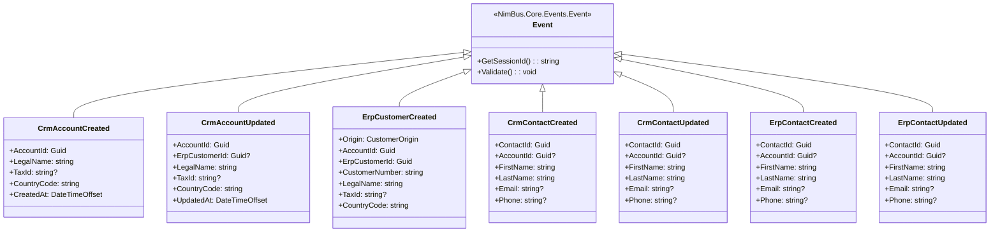

# Events — Crm.Adapter

| | |
|---|---|
| **Companion to** | [`TDD.md`](./TDD.md) |
| **Adapter** | Crm.Adapter |
| **Endpoint contract** | `CrmErpDemo.Contracts/Endpoints/CrmEndpoint.cs` |
| **Event base class** | `NimBus.Core.Events.Event` |
| **Status** | Draft |
| **Version** | 0.2 |
| **Last reviewed** | 2026-04-28 |

> **Scope.** Field-level schemas and mapping tables for every event the `Crm.Adapter` consumes (or that flows through the `CrmEndpoint` topic on its outbound path). Outbound mapping (DB entity → event) lives in `Crm.Api/Mapping/`; inbound mapping (event → CRM API call) lives in this adapter's handlers. This document changes in the same pull request as the event class or mapping code.

> **Naming convention.** Every event carries an origin prefix: `Crm*` events are produced by CRM, `Erp*` events are produced by ERP. Each event has exactly one producer, so cross-system loops are structurally impossible. The provisioner additionally enforces `user.From IS NULL` on cross-topic forward rules as defense-in-depth.

---

## 1. Event inventory

### 1.0 Endpoint declaration

```csharp
public class CrmEndpoint : Endpoint
{
    public CrmEndpoint()
    {
        Produces<CrmAccountCreated>();
        Produces<CrmAccountUpdated>();
        Produces<CrmContactCreated>();
        Produces<CrmContactUpdated>();

        Consumes<ErpCustomerCreated>();
        Consumes<ErpContactCreated>();
        Consumes<ErpContactUpdated>();
    }

    public override ISystem System => new CrmSystem(); // SystemId = "Crm"
    public override string Description =>
        "CRM adapter endpoint. Publishes Crm-prefixed Account/Contact events; consumes Erp-prefixed acknowledgments and counter-updates.";
}
```

*Source: `CrmErpDemo.Contracts/Endpoints/CrmEndpoint.cs`.*

### 1.1 Published events (CRM → NimBus, via outbox dispatch)

| Event | Base class | Session key | Anchor |
|---|---|---|---|
| `CrmAccountCreated` | `NimBus.Core.Events.Event` | `AccountId` | [↓](#crmaccountcreated) |
| `CrmAccountUpdated` | `NimBus.Core.Events.Event` | `AccountId` | [↓](#crmaccountupdated) |
| `CrmContactCreated` | `NimBus.Core.Events.Event` | `ContactId` | [↓](#crmcontactcreated) |
| `CrmContactUpdated` | `NimBus.Core.Events.Event` | `ContactId` | [↓](#crmcontactupdated) |

### 1.2 Consumed events (NimBus → adapter)

| Event | Handler (`IEventHandler<T>`) | Session key | Anchor |
|---|---|---|---|
| `ErpCustomerCreated` | `Crm.Adapter.Handlers.ErpCustomerCreatedHandler` | `AccountId` | [↓](#erpcustomercreated) |
| `ErpContactCreated` | `Crm.Adapter.Handlers.ErpContactCreatedHandler` | `ContactId` | [↓](#erpcontactcreated) |
| `ErpContactUpdated` | `Crm.Adapter.Handlers.ErpContactUpdatedHandler` | `ContactId` | [↓](#erpcontactupdated) |

### 1.3 Event hierarchy



---

## 2. Event catalog

### `CrmAccountCreated`

**Purpose.** Published by CRM when an Account is created.

**Direction.** Published by adapter (via outbox dispatch).

**Trigger.** `POST /api/accounts` in `Crm.Api`.

**Delivery semantics.** At-least-once. Consumers must be idempotent on `AccountId`.

**Session key.** `[SessionKey(nameof(AccountId))]`.

**Schema (code):** `CrmErpDemo.Contracts.Events.CrmAccountCreated` — `samples/CrmErpDemo/CrmErpDemo.Contracts/Events/CrmAccountCreated.cs`.

#### Fields

| Field | Type | Nullable | PII | Example | Description |
|---|---|:---:|:---:|---|---|
| `AccountId` | Guid | no | no | `4f1a...` | CRM account identifier. Session key for the end-to-end flow. |
| `LegalName` | string | no | yes | `Contoso A/S` | Legal name of the account. |
| `TaxId` | string | yes | yes | `DK12345678` | VAT / EIN / etc. |
| `CountryCode` | string | no | no | `DE` | ISO 3166-1 alpha-2. |
| `CreatedAt` | DateTimeOffset | no | no | `2026-04-28T10:00:00+00:00` | When the account was created in CRM. |

#### Validation rules

- `AccountId`, `LegalName`, `CountryCode` are `[Required]` — `ValidationMiddleware` rejects the message if missing.

---

### `CrmAccountUpdated`

**Purpose.** Published by CRM when an Account is updated.

**Direction.** Published by adapter (via outbox dispatch).

**Trigger.** `PUT /api/accounts/{id}` in `Crm.Api`.

**Delivery semantics.** At-least-once. Consumers must be idempotent on `AccountId`.

**Session key.** `[SessionKey(nameof(AccountId))]`.

**Schema (code):** `CrmErpDemo.Contracts.Events.CrmAccountUpdated` — `samples/CrmErpDemo/CrmErpDemo.Contracts/Events/CrmAccountUpdated.cs`.

#### Fields

| Field | Type | Nullable | PII | Example | Description |
|---|---|:---:|:---:|---|---|
| `AccountId` | Guid | no | no | `4f1a...` | CRM account identifier. |
| `ErpCustomerId` | Guid | yes | no | `7b3e...` | ERP customer id when this CRM account is linked to (or originated from) an ERP customer. Null for CRM-only accounts. |
| `LegalName` | string | no | yes | `Contoso A/S` | Legal name of the account. |
| `TaxId` | string | yes | yes | `DK12345678` | VAT / EIN / etc. |
| `CountryCode` | string | no | no | `DE` | ISO 3166-1 alpha-2. |
| `UpdatedAt` | DateTimeOffset | no | no | `2026-04-28T10:05:00+00:00` | When the update occurred in CRM. |

---

### `ErpCustomerCreated`

**Purpose.** Published by ERP when a customer is created. `Origin` distinguishes the CRM-originated round-trip ack from a customer that originated directly in ERP.

**Direction.** Consumed by adapter (`ErpCustomerCreatedHandler`).

**Trigger (in ERP):** `POST /api/customers` (Origin=Erp) or the ERP-side handler that processes a CRM `CrmAccountCreated` (Origin=Crm).

**Delivery semantics.** At-least-once. Handler is idempotent — `link-erp` is a no-op if `ErpCustomerId` already matches; `external/{id}` is upsert.

**Session key.** `[SessionKey(nameof(AccountId))]` — when `Origin=Crm`, this is the CRM account id; when `Origin=Erp`, it falls back to `ErpCustomerId` so the field is still a stable key (per the class's own description).

**Schema (code):** `CrmErpDemo.Contracts.Events.ErpCustomerCreated` — `samples/CrmErpDemo/CrmErpDemo.Contracts/Events/ErpCustomerCreated.cs`.

```csharp
[SessionKey(nameof(AccountId))]
public class ErpCustomerCreated : Event
{
    [Required] public CustomerOrigin Origin { get; set; }
    [Required] public Guid AccountId { get; set; }
    [Required] public Guid ErpCustomerId { get; set; }
    [Required] public string CustomerNumber { get; set; } = string.Empty;
    [Required] public string LegalName { get; set; } = string.Empty;
    public string? TaxId { get; set; }
    [Required] public string CountryCode { get; set; } = string.Empty;
}

public enum CustomerOrigin { Erp = 0, Crm = 1 }
```

#### Fields

| Field | Type | Nullable | PII | Example | Description |
|---|---|:---:|:---:|---|---|
| `Origin` | `CustomerOrigin` (enum) | no | no | `Crm` | Where the customer originated. `Crm` = ack of a CRM-originated `CrmAccountCreated`; `Erp` = customer created directly in ERP. |
| `AccountId` | Guid | no | no | `4f1a...` | Session key. CRM account id when `Origin=Crm`; falls back to `ErpCustomerId` value when `Origin=Erp`. |
| `ErpCustomerId` | Guid | no | no | `9b3e...` | The ERP-side customer identifier. |
| `CustomerNumber` | string | no | no | `C-00042` | Human-readable ERP customer number. |
| `LegalName` | string | no | yes | `Contoso A/S` | Legal name of the customer. |
| `TaxId` | string | yes | yes | `DK12345678` | VAT / EIN / etc. |
| `CountryCode` | string | no | no | `DE` | ISO 3166-1 alpha-2. |

#### Allowed values

| Field | Allowed values | Meaning |
|---|---|---|
| `Origin` | `Erp`, `Crm` | Round-trip-ack discriminator — see TDD §4.2 |

---

### `CrmContactCreated`

**Purpose.** Published by CRM when a Contact is created.

**Direction.** Published by adapter (via outbox).

**Trigger.** `POST /api/contacts` in `Crm.Api`.

**Session key.** `[SessionKey(nameof(ContactId))]`.

**Schema (code):** `CrmErpDemo.Contracts.Events.CrmContactCreated` — `samples/CrmErpDemo/CrmErpDemo.Contracts/Events/CrmContactCreated.cs`.

#### Fields

| Field | Type | Nullable | PII | Example | Description |
|---|---|:---:|:---:|---|---|
| `ContactId` | Guid | no | no | `7c2f...` | Contact identifier. |
| `AccountId` | Guid | yes | no | `4f1a...` | The CRM account this contact belongs to. May be unset for orphan contacts. |
| `FirstName` | string | no | yes | `Anna` | Required. |
| `LastName` | string | no | yes | `Hansen` | Required. |
| `Email` | string | yes | yes | `anna@contoso.de` | `[EmailAddress]` validated. |
| `Phone` | string | yes | yes | `+49 30 1234567` | Free-form. |

---

### `CrmContactUpdated`

**Purpose.** Published by CRM when a Contact is updated.

**Direction.** Published by adapter (via outbox).

**Trigger.** `PUT /api/contacts/{id}` in `Crm.Api`.

**Session key.** `[SessionKey(nameof(ContactId))]`.

**Schema (code):** `CrmErpDemo.Contracts.Events.CrmContactUpdated` — same field shape as `CrmContactCreated`.

---

### `ErpContactCreated`

**Purpose.** Apply an ERP-originated contact creation to the CRM `Contact` table.

**Direction.** Consumed by adapter (`ErpContactCreatedHandler`).

**Handler behaviour.** Calls `PUT /api/contacts/upsert/{ContactId}` with the projected `ContactPayload`.

**Echo-loop note.** Structurally impossible — `ErpContactCreated` is only published by ERP; CRM publishes `CrmContactCreated` (a different type).

#### Fields

| Field | Type | Nullable | PII | Example | Description |
|---|---|:---:|:---:|---|---|
| `ContactId` | Guid | no | no | `7c2f...` | Contact identifier. Idempotency key for the `crm-api` upsert. |
| `AccountId` | Guid | yes | no | `4f1a...` | The customer / account this contact belongs to. |
| `FirstName` | string | no | yes | `Anna` | Required. |
| `LastName` | string | no | yes | `Hansen` | Required. |
| `Email` | string | yes | yes | `anna@contoso.de` | `[EmailAddress]` validated. |
| `Phone` | string | yes | yes | `+49 30 1234567` | Free-form. |

---

### `ErpContactUpdated`

**Purpose.** Apply an ERP-originated contact change to the CRM `Contact` table.

**Direction.** Consumed by adapter (`ErpContactUpdatedHandler`).

**Handler behaviour.** Calls `PUT /api/contacts/upsert/{ContactId}` with the projected `ContactPayload`.

**Echo-loop note.** Structurally impossible — `ErpContactUpdated` is only published by ERP; CRM publishes `CrmContactUpdated` (a different type).

#### Fields

Same shape as `ErpContactCreated` (above).

---

## 3. Mappings

### 3.1 Outbound — `Crm.Api` entity → event

These mappings live in `Crm.Api/Mapping/`, not in `Crm.Adapter`. They are documented here because the adapter is responsible for dispatching the events that result.

#### 3.1.1 `Account` → `CrmAccountCreated` / `CrmAccountUpdated`

`Crm.Api/Mapping/AccountMapper.cs:6` (`AccountMapper.ToCreatedEvent`, `AccountMapper.ToUpdatedEvent`).

| Source field (`Account`) | Source type | → | Event field | Event type | Resolution |
|---|---|---|---|---|---|
| `Id` | Guid | → | `AccountId` | Guid | Direct copy |
| `ErpCustomerId` | Guid? | → | `CrmAccountUpdated.ErpCustomerId` | Guid? | Direct copy (Updated only — not mapped on Created, since a new CRM account has no ERP link yet) |
| `LegalName` | string | → | `LegalName` | string | Direct copy |
| `TaxId` | string? | → | `TaxId` | string? | Direct copy |
| `CountryCode` | string | → | `CountryCode` | string | Direct copy |
| `CreatedAt` | DateTimeOffset | → | `CrmAccountCreated.CreatedAt` | DateTimeOffset | Direct copy |
| `UpdatedAt ?? DateTimeOffset.UtcNow` | DateTimeOffset | → | `CrmAccountUpdated.UpdatedAt` | DateTimeOffset | Coalesce-then-copy |

**Fields not mapped:** `ErpCustomerNumber` — back-fill column kept on the row but not surfaced in events.

#### 3.1.2 `Contact` → `CrmContactCreated` / `CrmContactUpdated`

`Crm.Api/Mapping/ContactMapper.cs:6` (`ContactMapper.ToCreatedEvent`, `ContactMapper.ToUpdatedEvent`).

| Source field (`Contact`) | Source type | → | Event field | Event type | Resolution |
|---|---|---|---|---|---|
| `Id` | Guid | → | `ContactId` | Guid | Direct copy |
| `AccountId` | Guid? | → | `AccountId` | Guid? | Direct copy |
| `FirstName` | string | → | `FirstName` | string | Direct copy |
| `LastName` | string | → | `LastName` | string | Direct copy |
| `Email` | string? | → | `Email` | string? | Direct copy |
| `Phone` | string? | → | `Phone` | string? | Direct copy |

### 3.2 Inbound — event → `crm-api` HTTP call

These mappings live in the adapter's handlers and clients (`Crm.Adapter/Handlers/*` and `Crm.Adapter/Clients/CrmApiClient.cs`).

#### 3.2.1 `ErpCustomerCreated` (Origin=Crm) → `POST /api/accounts/{id}/link-erp`

`Crm.Adapter/Handlers/ErpCustomerCreatedHandler.cs` + `Crm.Adapter/Clients/CrmApiClient.cs:LinkErpAsync`.

| Event field | Event type | → | HTTP target | Target type | Resolution |
|---|---|---|---|---|---|
| `AccountId` | Guid | → | URL path `/api/accounts/{id}` | Guid | Direct copy |
| `ErpCustomerId` | Guid | → | body `ErpCustomerId` | Guid | Direct copy |
| `CustomerNumber` | string | → | body `CustomerNumber` | string | Direct copy |

**Lookups:** none. The CRM account is expected to exist (it was created by the originating CRM action). On 404, the handler throws — see TDD §8.

**Unmapped event fields:** `LegalName`, `TaxId`, `CountryCode` — the link-erp call only updates ERP-id columns.

#### 3.2.2 `ErpCustomerCreated` (Origin=Erp) → `PUT /api/accounts/external/{erpCustomerId}`

`Crm.Adapter/Handlers/ErpCustomerCreatedHandler.cs` + `Crm.Adapter/Clients/CrmApiClient.cs:UpsertFromErpAsync`.

| Event field | Event type | → | HTTP target | Target type | Resolution |
|---|---|---|---|---|---|
| `ErpCustomerId` | Guid | → | URL path `/api/accounts/external/{externalId}` | Guid | Direct copy |
| `LegalName` | string | → | body `LegalName` | string | Direct copy |
| `TaxId` | string? | → | body `TaxId` | string? | Direct copy |
| `CountryCode` | string | → | body `CountryCode` | string | Direct copy |
| `CustomerNumber` | string | → | body `CustomerNumber` | string? | Direct copy |

**Unmapped event fields:** `AccountId`, `Origin` — already used to dispatch.

#### 3.2.3 `ErpContactCreated` / `ErpContactUpdated` → `PUT /api/contacts/upsert/{contactId}`

`Crm.Adapter/Handlers/ErpContactCreatedHandler.cs`, `Crm.Adapter/Handlers/ErpContactUpdatedHandler.cs` + `Crm.Adapter/Clients/CrmApiClient.cs:UpsertContactAsync`. Both handlers use the same idempotent upsert endpoint.

| Event field | Event type | → | HTTP target | Target type | Resolution |
|---|---|---|---|---|---|
| `ContactId` | Guid | → | URL path `{contactId}` + body `Id` | Guid | Direct copy |
| `AccountId` | Guid? | → | body `AccountId` | Guid? | Direct copy |
| `FirstName` | string | → | body `FirstName` | string | Direct copy |
| `LastName` | string | → | body `LastName` | string | Direct copy |
| `Email` | string? | → | body `Email` | string? | Direct copy |
| `Phone` | string? | → | body `Phone` | string? | Direct copy |

---

## 4. Field-level change log

| Version | Date | Event | Field | Change | Reason | PR |
|---|---|---|---|---|---|---|
| 0.1 | 2026-04-27 | (all) | (all) | Initial documentation snapshot | First TDD draft via `adapter-docs` skill | n/a |
| 0.2 | 2026-04-28 | (all) | (rename) | Origin-prefixed event-type rename | Adopted single-producer convention; `Account*`→`CrmAccount*`, `Customer*`→`ErpCustomer*`, symmetric `Contact*` split into `CrmContact*` (CRM-published) and `ErpContact*` (ERP-published). Eliminates structural possibility of cross-topic forwarding loops. | n/a |

---

## 5. Related

- [`TDD.md`](./TDD.md) — the Technical Design Document this file is referenced from.
- [`../../CrmErpDemo.Contracts/Endpoints/CrmEndpoint.cs`](../../CrmErpDemo.Contracts/Endpoints/CrmEndpoint.cs) — authoritative `Consumes<>` / `Produces<>` declarations.
- [`../../CrmErpDemo.Contracts/Events/`](../../CrmErpDemo.Contracts/Events) — event class definitions.
- [`../../Crm.Api/Mapping/`](../../Crm.Api/Mapping) — outbound entity → event mapping (`AccountMapper`, `ContactMapper`).
- [`../../Crm.Adapter/Handlers/`](../Handlers) — inbound event → HTTP-call mapping.
