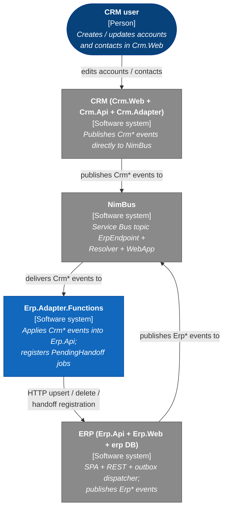
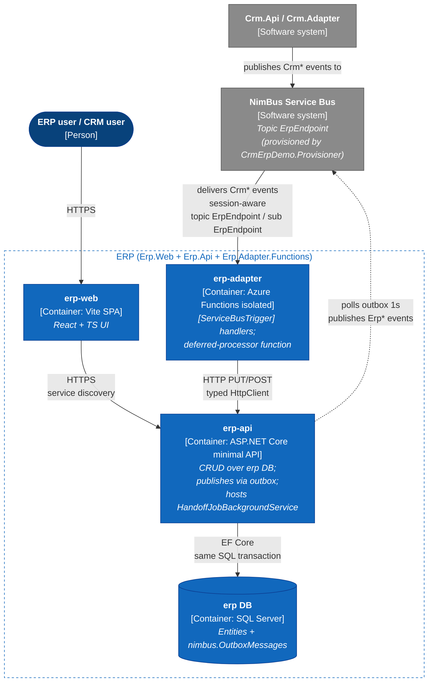
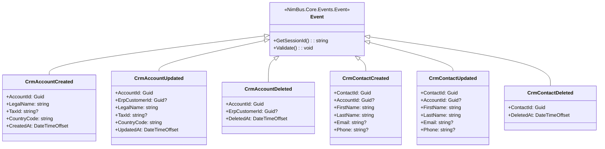
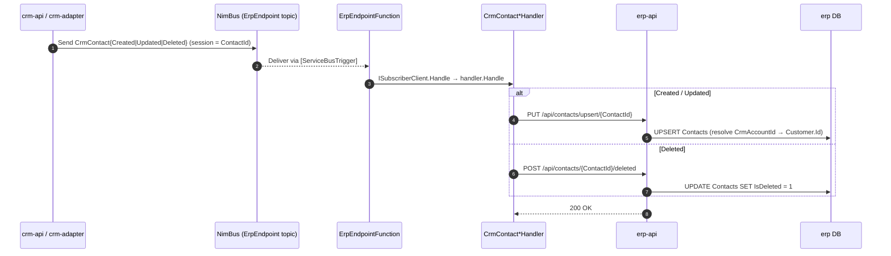
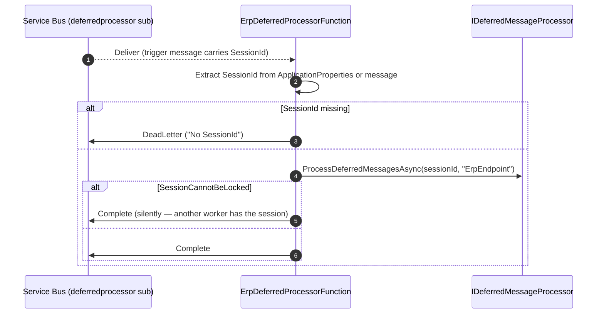

# Technical Design Document — Erp.Adapter.Functions

<!--
  Legend:
    [AUTO]  — derived from source code; safe to regenerate.
    [HUMAN] — owned by business / NFR / security; see Appendix B.
    [MIXED] — AI-drafted, human must review.
-->

| | |
|---|---|
| **Document type** | TDD (Technical Design Document) |
| **Adapter** | Erp.Adapter.Functions (`Erp.Adapter.Functions`, Aspire resource `erp-adapter`) |
| **Status** | Draft |
| **Version** | 0.1 |
| **Owner** | {TBD — see Appendix B} |
| **Source repository** | `samples/CrmErpDemo/Erp.Adapter.Functions` (in the NimBus repo) |
| **Deployment unit(s)** | `erp-adapter` Functions app (via Aspire / Azure Functions isolated worker) |
| **Runtime** | .NET 10 (`net10.0`), Azure Functions isolated worker (`FUNCTIONS_WORKER_RUNTIME=dotnet-isolated`) |
| **NimBus version** | Project references (`NimBus.SDK`, `NimBus.ServiceDefaults`) — no NuGet pin |
| **Last reviewed** | 2026-05-22 |
| **Next review** | {TBD} |

> **Scope of this document.** Technical implementation of `Erp.Adapter.Functions` for developers and operations. Covers the subscriber path that applies CRM-originated events to the ERP API, and the PendingHandoff async-completion path that delegates settlement to `Erp.Api`. The ERP-originated publishes (`ErpCustomerCreated`, `ErpContactCreated`, ...) are produced by `Erp.Api`'s transactional outbox, not by this adapter — they appear in the endpoint contract for completeness but are out of scope here. Contains no business rationale; the demo's storyline lives in [`../../README.md`](../../README.md) and the higher-level NimBus docs.

---

## 1. Adapter purpose, scope, responsibilities

### 1.1 Purpose  <!-- [MIXED] -->

Bridge from NimBus to the ERP API on the `ErpEndpoint` topic: apply CRM-originated events (account/contact create, update, delete) into ERP via idempotent HTTP calls, plus host the async PendingHandoff demo path for `CrmAccountCreated`.

### 1.2 Scope  <!-- [MIXED] -->

| In scope | Out of scope |
|---|---|
| Subscribing to `ErpEndpoint` and applying inbound `Crm*` events via the ERP REST API | Originating outbound `Erp*` events — owned by `Erp.Api` via the transactional outbox |
| Deferred-message replay on the `deferredprocessor` subscription | NimBus topology provisioning (owned by `CrmErpDemo.Provisioner`) |
| PendingHandoff registration: hand off a `CrmAccountCreated` to `Erp.Api`'s `HandoffJobBackgroundService` and return `MarkPendingHandoff` so siblings defer | Authentication / authorization (the demo runs without auth) |
| Demo-only ErrorMode / ServiceMode switches that simulate downstream failures | Realistic tax/currency/shipping math, multi-tenancy, production deployment scripts |
| Idempotent HTTP calls to `Erp.Api` (upsert / delete) | The `IHandoffClient.CompleteAsync` / `FailAsync` settlement itself — that lives in `Erp.Api` |

### 1.3 Responsibilities  <!-- [AUTO] — derived from `Program.cs`, `Functions/*`, `Handlers/*` -->

1. **Subscribe to `ErpEndpoint` via Azure Functions Service Bus trigger.** `ErpEndpointFunction` is decorated with `[ServiceBusTrigger("%TopicName%", "%SubscriptionName%", Connection = "AzureWebJobsServiceBus", IsSessionsEnabled = true)]` and delegates to `ISubscriberClient.Handle(...)` — NimBus then runs the pipeline (`LoggingMiddleware`, `ValidationMiddleware`, `ServiceModeMiddleware`) and dispatches to registered `IEventHandler<T>` implementations. Topic and subscription are bound from `%TopicName%` / `%SubscriptionName%` environment variables (`ErpEndpoint` / `ErpEndpoint` in `local.settings.json`).
2. **Apply inbound CRM events.** `HttpClient`-typed `IErpApiClient` calls back into `Erp.Api`:
   - `CrmAccountCreated` → `CrmAccountCreatedHandler` → `PUT /api/customers/by-crm/{AccountId}` (or PendingHandoff path — see §5).
   - `CrmAccountUpdated` → `CrmAccountUpdatedHandler` → `PUT /api/customers/by-crm/{AccountId}` with the optional `ErpCustomerId` threaded through.
   - `CrmAccountDeleted` → `CrmAccountDeletedHandler` → `POST /api/customers/by-crm/{AccountId}/deleted`.
   - `CrmContactCreated` / `CrmContactUpdated` → `PUT /api/contacts/upsert/{ContactId}`.
   - `CrmContactDeleted` → `POST /api/contacts/{ContactId}/deleted`.
3. **PendingHandoff registration.** When `Erp.Api` reports handoff mode ON, `CrmAccountCreatedHandler` POSTs the job coordinates to `Erp.Api`'s `/api/internal/handoff-jobs` endpoint, then calls `context.MarkPendingHandoff(reason, externalJobId, expectedBy)` and returns. NimBus settles the inbound message as `Pending+Handoff`; siblings on the same session defer. Settlement happens later via `IHandoffClient` from `Erp.Api`'s `HandoffJobBackgroundService` — out of scope for this adapter (see §6.2).
4. **Deferred-message replay.** `ErpDeferredProcessorFunction` is triggered by `[ServiceBusTrigger("%TopicName%", "deferredprocessor", IsSessionsEnabled = false)]` and forwards to `IDeferredMessageProcessor.ProcessDeferredMessagesAsync(sessionId, "ErpEndpoint")` so messages parked behind an unblocked session are drained in FIFO order.
5. **Surface demo switches.** ErrorMode (handler-level, throws `HandlerErrorModeException`) and ServiceMode (pipeline middleware, throws `ServiceModeRejectedException`) let the demo exercise NimBus failure paths from the ERP web UI without touching real downstream code.

### 1.4 Versioning  <!-- [MIXED] -->

The adapter ships with the demo (`samples/CrmErpDemo/`) and follows the NimBus repo version. The public surface is the NimBus event contract (`Produces<>` / `Consumes<>` in `CrmErpDemo.Contracts/Endpoints/ErpEndpoint.cs`); breaking it requires coordinated changes in `Crm.Adapter` and `Erp.Api`. New handlers and additive event fields are MINOR. Schema-breaking changes (renamed property, type change, removed `[SessionKey]`, removed event) are MAJOR.

### 1.5 Architecture at a glance  <!-- [MIXED] -->

`Erp.Adapter.Functions` is an Azure Functions isolated worker that hosts two independent Service Bus triggers: a session-aware subscriber (`ErpEndpointFunction`) and a deferred-message replayer (`ErpDeferredProcessorFunction`). Inbound handlers are stateless and idempotent — they call back into `Erp.Api` over HTTP (typed `HttpClient` with Aspire service discovery). The CrmErpDemo follows an origin-prefixed event-naming convention: each event has exactly one producer (`Crm*` events from CRM, `Erp*` events from ERP), so cross-topic loops are structurally impossible. `Erp.Api` owns the transactional outbox and dispatches `Erp*` events — the adapter does not publish, even though `ErpEndpoint` declares `Produces<>` rows (those declarations describe what the *endpoint* produces; the publisher is `Erp.Api`).

| Direction | Source | Target | Event family | Handler / route | Ordering key | Criticality | Owner |
|---|---|---|---|---|---|---|---|
| NimBus → ERP | NimBus topic `ErpEndpoint` | `Erp.Api` (HTTP) | `CrmAccountCreated`, `CrmAccountUpdated`, `CrmAccountDeleted` | [`CrmAccount*Handler`](#5-worked-integration--crm-account-mirroring) | `AccountId` | {TBD} | {TBD} |
| NimBus → ERP | NimBus topic `ErpEndpoint` | `Erp.Api` (HTTP) | `CrmContactCreated`, `CrmContactUpdated`, `CrmContactDeleted` | [`CrmContact*Handler`](#61-crm-originated-contact-mirroring) | `ContactId` | {TBD} | {TBD} |
| NimBus → ERP (async) | NimBus topic `ErpEndpoint` | `Erp.Api` `HandoffJobBackgroundService` | `CrmAccountCreated` (when handoff mode ON) | [PendingHandoff registration](#62-pendinghandoff-async-completion) | `AccountId` | {TBD} | {TBD} |
| ERP → NimBus | `Erp.Api` (direct publish via outbox) | NimBus topic `ErpEndpoint` | `ErpCustomerCreated`, `ErpCustomerUpdated`, `ErpCustomerDeleted`, `ErpContact*` | `IPublisherClient` in `Erp.Api` (dispatched from `nimbus.OutboxMessages`) | `AccountId` / `ContactId` | {TBD} | {TBD} |

> Criticality + owner are open questions — see Appendix B.

---

## 2. Technical architecture

### 2.1 System context (C4 Level 1)  <!-- [MIXED] -->



### 2.2 Container diagram (C4 Level 2)  <!-- [AUTO] — derived from `CrmErpDemo.AppHost/Program.cs` and `Erp.Adapter.Functions/Program.cs` -->



### 2.3 Azure resources  <!-- [AUTO] — from `CrmErpDemo.AppHost/Program.cs` -->

The demo runs locally via .NET Aspire. The adapter is **not** declared with separate Bicep/Terraform; deployment is through Aspire's manifest publishing.

| Resource | Aspire reference | Purpose |
|---|---|---|
| SQL Server (Aspire-managed container) | `builder.AddSqlServer("sql")` | Hosts the `erp` database (entities + `nimbus.OutboxMessages`) |
| `erp` database | `sql.AddDatabase("erp")` | ERP entities used by `Erp.Api`; not referenced by the adapter |
| Service Bus connection | `builder.AddConnectionString("servicebus")` | Topic `ErpEndpoint` (provisioned by `CrmErpDemo.Provisioner`) |
| Cosmos DB connection (optional) | `builder.AddConnectionString("cosmos")` | Used by `NimBus.Resolver` and `nimbus-ops` when `--StorageProvider cosmos`; not used by the adapter directly |
| `erp-adapter` Functions project | `builder.AddAzureFunctionsProject<Projects.Erp_Adapter_Functions>("erp-adapter")` | This adapter |
| `erp-api` project | `builder.AddProject<Projects.Erp_Api>("erp-api")` | Target of adapter HTTP callbacks + handoff settlement |
| `provisioner` project | `builder.AddProject<Projects.CrmErpDemo_Provisioner>("provisioner")` | Creates topics/subscriptions (`CrmEndpoint`, `ErpEndpoint`) |

Aspire `WithReference` calls on `erp-adapter`: `servicebus` (as `AzureWebJobsServiceBus`), `erpApi` (service-discovery URL).

> **NimBus topology** (Service Bus topic + subscription, Cosmos containers for Resolver state per ADR-008) is provisioned by `CrmErpDemo.Provisioner` from the `Endpoint` declaration. The adapter does not own the topic; the topic name equals the endpoint class name (`ErpEndpoint`).

### 2.4 Endpoints and authorisation  <!-- [AUTO] -->

**Inbound (adapter exposes):**

| Endpoint | Path | Auth | Caller |
|---|---|---|---|
| NimBus subscription | n/a (Service Bus session-aware trigger on `ErpEndpoint` / sub `ErpEndpoint`) | Connection-string-based (demo) | NimBus |
| Deferred-processor subscription | n/a (Service Bus trigger on `ErpEndpoint/deferredprocessor`, no sessions) | Connection-string-based (demo) | NimBus |

**Outbound (adapter calls):**

| Target | URL pattern | Auth |
|---|---|---|
| `erp-api` (customer upsert) | `{erp-api}/api/customers/by-crm/{accountId}` | None (demo); typed `HttpClient` with Aspire service discovery |
| `erp-api` (customer delete) | `{erp-api}/api/customers/by-crm/{accountId}/deleted` | None (demo) |
| `erp-api` (contact upsert) | `{erp-api}/api/contacts/upsert/{contactId}` | None (demo) |
| `erp-api` (contact delete) | `{erp-api}/api/contacts/{contactId}/deleted` | None (demo) |
| `erp-api` (error/service/handoff mode probes) | `{erp-api}/api/admin/error-mode`, `/api/admin/service-mode`, `/api/admin/handoff-mode` | None (demo); 2s timeout |
| `erp-api` (handoff job registration) | `{erp-api}/api/internal/handoff-jobs` | None (demo) |
| Service Bus | `sb://{servicebus-namespace}/ErpEndpoint` | Connection string from Aspire (`AzureWebJobsServiceBus`) |

> **Auth gap (demo only).** No bearer/MI auth on the HTTP calls into `erp-api`, no Managed Identity to Service Bus. This is acceptable for a local Aspire demo but flagged in §8 for any production lift.

### 2.5 Security  <!-- [MIXED] -->

| Control | Implementation |
|---|---|
| Adapter → `erp-api` auth | None (demo) |
| Adapter → Service Bus auth | Connection string from `AzureWebJobsServiceBus` (user secret on the AppHost) |
| Adapter → SQL `erp` | n/a — ERP persistence is owned by `Erp.Api` |
| Inbound webhook auth | n/a — adapter exposes no HTTP surface |
| Secrets | User secrets on the AppHost; not stored in code |
| PII in logs | Handlers log identifiers and `LegalName` on the create path (see `CrmAccountCreatedHandler.cs:51`). `LegalName` is a business name, not a person's name, but it is PII-adjacent; review before any production lift. Other handlers log only identifiers (`AccountId`, `ContactId`). |
| TLS | Inherits Aspire / Functions host defaults |

> **Production lift checklist** (out of scope for the demo, recorded for §8 / Appendix B):
> - Switch Service Bus to Managed Identity (`AzureWebJobsServiceBus` supports `__fullyQualifiedNamespace` Managed Identity form).
> - Add bearer auth on `Erp.Api` and propagate from `Erp.Adapter.Functions`.
> - Drop `LegalName` from happy-path logs or scrub via Application Insights telemetry processor.
> - Emit Key Vault references for any non-Aspire-injected secrets.

### 2.6 Configuration  <!-- [AUTO] -->

| Source | Content |
|---|---|
| `host.json` | Functions Service Bus extension settings: `prefetchCount=0`, `autoCompleteMessages=false`, `maxAutoLockRenewalDuration=00:05:00`, `maxConcurrentSessions=200`, `sessionIdleTimeout=00:00:30`, exponential client retry (3 attempts, 0.8s base, 1m cap) |
| `local.settings.json` | `FUNCTIONS_WORKER_RUNTIME=dotnet-isolated`, `AzureWebJobsStorage=UseDevelopmentStorage=true`, `TopicName=ErpEndpoint`, `SubscriptionName=ErpEndpoint` |
| Connection strings (Aspire-injected) | `AzureWebJobsServiceBus` (used by both `[ServiceBusTrigger]` attributes and the manually-registered `ServiceBusClient`) |
| Service-discovery keys | `services:erp-api:https:0` / `services:erp-api:http:0` — resolved from Aspire `WithReference(erpApi)`; falls back to `Erp:ApiBaseUrl` if missing |
| Hard-coded | `deferredprocessor` subscription name (in `ErpDeferredProcessorFunction`); `LoggingMiddleware` / `ValidationMiddleware` / `ServiceModeMiddleware` registration order |

> TODO(human): consider promoting `TopicName` and `SubscriptionName` out of `local.settings.json` into App Settings / Key Vault references for any non-Aspire deployment.

---

## 3. Events and triggers

**Source of truth:** `samples/CrmErpDemo/CrmErpDemo.Contracts/Endpoints/ErpEndpoint.cs`.

The endpoint class extends `NimBus.Core.Endpoints.Endpoint` and declares the contract via `Produces<TEvent>()` / `Consumes<TEvent>()`. The class name (`ErpEndpoint`) is the topic name. `ISystem.SystemId = "Erp"`.

See [`events.md`](./events.md) for field-level event schemas and full mapping tables. This section is the index.

### 3.1 Consumed events (NimBus → adapter)  <!-- [AUTO] -->

| Event | Handler (`IEventHandler<T>`) | Direction / outcome | Notes |
|---|---|---|---|
| `CrmAccountCreated` | `CrmAccountCreatedHandler` (`Handlers/`) | Branch: handoff mode ON → register job + `MarkPendingHandoff`; else → `PUT /api/customers/by-crm/{AccountId}` | The only handler that exercises the PendingHandoff path |
| `CrmAccountUpdated` | `CrmAccountUpdatedHandler` (`Handlers/`) | `PUT /api/customers/by-crm/{AccountId}` with optional `ErpCustomerId` threaded through | Idempotent on `AccountId` |
| `CrmAccountDeleted` | `CrmAccountDeletedHandler` (`Handlers/`) | `POST /api/customers/by-crm/{AccountId}/deleted` | Soft-delete |
| `CrmContactCreated` | `CrmContactCreatedHandler` (`Handlers/`) | `PUT /api/contacts/upsert/{ContactId}` | ERP API resolves `AccountId` → `Customer.Id` via `Customers.CrmAccountId` |
| `CrmContactUpdated` | `CrmContactUpdatedHandler` (`Handlers/`) | `PUT /api/contacts/upsert/{ContactId}` | Idempotent on `ContactId` |
| `CrmContactDeleted` | `CrmContactDeletedHandler` (`Handlers/`) | `POST /api/contacts/{ContactId}/deleted` | Soft-delete |

### 3.2 Published events (ERP → NimBus, direct from `Erp.Api`)  <!-- [AUTO] -->

The adapter does not publish. `Erp.Api` writes outbox rows in the same SQL transaction as the entity mutation (via `OutboxScope`), and `Erp.Api`'s `AddNimBusOutboxDispatcher` polls and forwards them to Service Bus.

| Event | Trigger (in `Erp.Api`) | Published via |
|---|---|---|
| `ErpCustomerCreated` | `PUT /api/customers/by-crm/{id}` (insert path) or `POST /api/customers/` | `OutboxScope` → outbox row → dispatcher → topic `ErpEndpoint` |
| `ErpCustomerUpdated` | `PUT /api/customers/by-crm/{id}` (update path) or `PUT /api/customers/{id}` | Same |
| `ErpCustomerDeleted` | `POST /api/customers/by-crm/{id}/deleted` | Same |
| `ErpContactCreated` | `PUT /api/contacts/upsert/{id}` (insert path) or `POST /api/contacts/` | Same |
| `ErpContactUpdated` | `PUT /api/contacts/upsert/{id}` (update path) or `PUT /api/contacts/{id}` | Same |
| `ErpContactDeleted` | `POST /api/contacts/{id}/deleted` | Same |

### 3.3 Triggers  <!-- [HUMAN] -->

| Trigger | Type | Frequency / schedule | Notes |
|---|---|---|---|
| `[ServiceBusTrigger("%TopicName%", "%SubscriptionName%", IsSessionsEnabled=true)]` | Continuous | Driven by Service Bus delivery | Session-aware. `maxConcurrentSessions=200`, `prefetchCount=0` (from `host.json`). |
| `[ServiceBusTrigger("%TopicName%", "deferredprocessor", IsSessionsEnabled=false)]` | Continuous | Driven by Service Bus delivery on the `deferredprocessor` sub | Non-session. Forwards to `IDeferredMessageProcessor.ProcessDeferredMessagesAsync`. |

---

## 4. Common implementation patterns

### 4.1 Handler skeleton  <!-- [AUTO] — `Handlers/CrmAccountUpdatedHandler.cs` -->

```csharp
public sealed class CrmAccountUpdatedHandler(
    IErpApiClient erp,
    IServiceModeClient modeClient,
    ILogger<CrmAccountUpdatedHandler> logger)
    : IEventHandler<CrmAccountUpdated>
{
    public async Task Handle(
        CrmAccountUpdated message,
        IEventHandlerContext context,
        CancellationToken cancellationToken = default)
    {
        await ErrorModeGuard.ThrowIfEnabledAsync(modeClient, context, logger, cancellationToken);
        logger.LogInformation("Updating ERP customer from CRM account {AccountId}", message.AccountId);

        await erp.UpsertCustomerAsync(
            message.AccountId,
            new CustomerUpsertPayload(message.ErpCustomerId, message.LegalName, message.TaxId, message.CountryCode),
            cancellationToken);
    }
}
```

Notable points:

- Constructor-injected `HttpClient`-typed client (`IErpApiClient`), demo-mode probe (`IServiceModeClient`), and `ILogger<T>`.
- `ErrorModeGuard.ThrowIfEnabledAsync` is the first call inside every handler — when `Erp.Api` reports error mode ON, the handler throws `HandlerErrorModeException` before doing any work, exercising NimBus's redelivery + dead-letter path.
- The handler signature matches the NimBus `IEventHandler<T>` contract: `(T message, IEventHandlerContext context, CancellationToken)`.

`CrmAccountCreatedHandler` is the only handler with a branch: it checks `IHandoffModeClient.GetAsync()` first and, if handoff mode is on, registers a job with `Erp.Api` and calls `context.MarkPendingHandoff(...)` instead of upserting directly. See §5.

### 4.2 Echo-loop prevention  <!-- [AUTO] -->

**Origin-prefixed event names** are the primary loop-prevention mechanism in CrmErpDemo. Each event type has exactly one producer (`Crm*` from CRM, `Erp*` from ERP), so an ERP-published event can never round-trip back into an ERP handler — the type system forbids it. The provisioner additionally enforces `user.From IS NULL` on cross-topic forward rules as defense-in-depth against any future symmetric event added by mistake.

`Erp.Adapter.Functions` only handles `Crm*` events (six of them); it never receives an `Erp*` event because the `ErpEndpoint` topic's `ErpEndpoint` subscription is filtered to `user.To = 'ErpEndpoint'`, which excludes ERP's own publishes.

### 4.3 Transient-fault retry  <!-- [AUTO] — no explicit retry policy is configured -->

The adapter does **not** call `subscriber.RetryPolicies(...)` in `AddNimBusSubscriber("ErpEndpoint", ...)`. Behaviour falls back to NimBus defaults plus the Functions Service Bus extension's retry settings:

- The `StrictMessageHandler` is constructed without an `IRetryPolicyProvider` (no provider is registered in DI).
- Functions Service Bus extension client retry is configured in `host.json`: exponential, 3 attempts, base 0.8 s, cap 1 m. This applies to Service Bus client operations (lock renewal, completion), **not** to handler invocations.
- Handler exceptions surface to NimBus's pipeline, which abandons the message; Service Bus then redelivers up to namespace `MaxDeliveryCount`, then dead-letters.

For a demo this is acceptable; for production, document explicit retry budgets per event type. See §8.

### 4.4 Missing-reference-data policy  <!-- [AUTO] -->

| Stance | Used by | Behaviour | Rationale |
|---|---|---|---|
| **Throw** | All six `Crm*Handler` classes via `ErpApiClient.EnsureSuccessOrThrowAsync` | Any non-2xx response from `erp-api` throws (the typed client centralises this via the `EnsureSuccessOrThrowAsync` extension). The exception bubbles to NimBus, the message abandons, and Service Bus redelivers until delivery-count is reached. | Simple, but conflates transient (5xx, timeouts) with permanent (4xx, malformed payload) failures. |

> **Recommended hardening (see §8):** branch on `response.StatusCode` — treat 4xx as permanent (classify via `IPermanentFailureClassifier`), retry on 5xx and timeouts only. Today, a permanent 404 from `erp-api` will burn the full retry budget before reaching the Resolver.

### 4.5 Mapping layer  <!-- [AUTO] -->

The adapter does not own outbound mapping (`Erp.Api/Mapping/*` produces `Erp*` events). For inbound mapping, see [`events.md` §3](./events.md). Handler mapping is direct projection from event fields to `erp-api` request payloads (`CustomerUpsertPayload`, `ContactUpsertPayload`) — no resolvers, no lookups.

### 4.6 Repository / client query discipline  <!-- [AUTO] -->

- All `erp-api` calls use typed `HttpClient` registered via `AddHttpClient<IErpApiClient, ErpApiClient>` with the base URL resolved at startup from Aspire service discovery (`services:erp-api:https:0` / `:http:0`) or `Erp:ApiBaseUrl`.
- Calls use `PutAsJsonAsync` / `PostAsync` and `response.EnsureSuccessOrThrowAsync(...)` (a typed-client extension that includes the operation summary and ERP API name in the thrown exception's message).
- Demo-switch probes (`IServiceModeClient`, `IHandoffModeClient`) use a 2-second timeout on their own typed `HttpClient` — they are speculative reads and should not extend handler latency materially when ERP is down. Errors propagate (no fallback), so an unreachable mode endpoint will throw before any real work happens.
- No retry/circuit-breaker policy on the `HttpClient` — relies on NimBus message-redelivery for retries.

### 4.7 Pipeline behaviours  <!-- [AUTO] — from `AddNimBus(n => ...)` -->

Registered (in order) via `services.AddNimBus(n => ...)` in `Program.cs`:

1. `LoggingMiddleware`
2. `ValidationMiddleware`
3. `ServiceModeMiddleware` (demo-only — throws `ServiceModeRejectedException` when `Erp.Api` reports service mode ON)

Consumer span + counters (`nimbus.message.received`, `processed`, `process.duration`) are owned by `ServiceBusAdapter` via `NimBusConsumerInstrumentation` — not a pipeline behavior.

Behaviours run in registration order on inbound dispatch. `ValidationMiddleware` calls `IEvent.Validate()` — events with `[Required]` / `[EmailAddress]` annotations get checked here. Validation failures surface as permanent.

### 4.8 Logging context  <!-- [AUTO] -->

All log records emitted via `Microsoft.Extensions.Logging` (per ADR-006) + OpenTelemetry via `NimBus.ServiceDefaults` and the Functions worker's `UseFunctionsWorkerDefaults()`. `LoggingMiddleware` enriches with `MessageId`, `SessionId`, `EventType`, `HandlerName`, `CorrelationId`. Aspire OTLP exporters route to the dashboard locally; App Insights when wired in deployed environments.

---

## 5. Worked integration — CRM Account mirroring (CRM → ERP, with optional PendingHandoff)

This is the canonical worked example: a `CrmAccountCreated` event from CRM is applied to ERP either synchronously (default) or via the PendingHandoff async path (when handoff mode is ON in `erp-web`).

### 5.1 Functional description  <!-- [HUMAN] -->

A CRM user creates an account in `crm-web`. The `CrmAccountCreated` event lands on the `ErpEndpoint` topic via the cross-topic forwarding subscription. The default outcome is an idempotent upsert into ERP's `Customers` table keyed on `CrmAccountId`, producing the ERP customer id + customer number that ERP later acks back via `ErpCustomerCreated (Origin=Crm)`. When the demo is in handoff mode, the adapter instead registers a `DMF-...` job with `Erp.Api`, returns `Pending+Handoff` to NimBus, and `Erp.Api`'s `HandoffJobBackgroundService` settles the row asynchronously via `IHandoffClient.CompleteAsync` / `FailAsync` after the configured duration.

Success criterion: every `CrmAccountCreated` either reaches `Completed` (synchronous path) or `Pending+Handoff → Completed` (handoff path) without operator intervention. Failures surface in `nimbus-ops` so an operator can resubmit / skip.

### 5.2 Sequence diagram  <!-- [MIXED] — drafted from `Program.cs`, `Functions/ErpEndpointFunction.cs`, `Handlers/CrmAccountCreatedHandler.cs` -->

```mermaid
sequenceDiagram
    autonumber
    actor User as CRM user
    participant CrmApi as crm-api
    participant NB as NimBus (ErpEndpoint topic)
    participant Fn as ErpEndpointFunction
    participant Hnd as CrmAccountCreatedHandler
    participant ErpApi as erp-api
    participant Jobs as HandoffJobBackgroundService

    User->>CrmApi: Create account (Acme GmbH)
    CrmApi->>NB: Publish CrmAccountCreated (session = AccountId)
    NB-->>Fn: Deliver via [ServiceBusTrigger] (session-aware)
    Fn->>Hnd: ISubscriberClient.Handle → handler.Handle

    alt Handoff mode OFF (default)
        Hnd->>ErpApi: GET /api/admin/handoff-mode (off)
        Hnd->>ErpApi: PUT /api/customers/by-crm/{AccountId}
        ErpApi-->>Hnd: 200 OK + ErpCustomerResponse
        Note over ErpApi: outbox row written; dispatcher publishes ErpCustomerCreated later
    else Handoff mode ON
        Hnd->>ErpApi: GET /api/admin/handoff-mode (on, durationSeconds)
        Hnd->>ErpApi: POST /api/internal/handoff-jobs (HandoffJob)
        ErpApi-->>Hnd: 200 OK
        Hnd->>Hnd: context.MarkPendingHandoff(reason, externalJobId, expectedBy)
        Note over Fn,NB: NimBus settles message as Pending+Handoff;<br/>session-mate updates defer
        Note over Jobs: ~DurationSeconds later
        Jobs->>ErpApi: dequeue due job
        alt Failure roll
            Jobs->>NB: IHandoffClient.FailAsync (DMF rejected: ...)
        else Success roll
            Jobs->>ErpApi: PUT /api/customers/by-crm/{AccountId}
            Jobs->>NB: IHandoffClient.CompleteAsync
        end
        Note over NB: Resolver flips audit row to Failed / Completed;<br/>deferred siblings replay
    end
```

*Source: `Erp.Adapter.Functions/Program.cs:57-67`, `Functions/ErpEndpointFunction.cs:9-19`, `Handlers/CrmAccountCreatedHandler.cs`, `HandoffMode/HandoffJobRegistration.cs`, `Erp.Api/HandoffMode/HandoffJobBackgroundService.cs`.*

### 5.3 Non-functional requirements  <!-- [HUMAN] -->

| Property | Requirement |
|---|---|
| Frequency | Real-time on user action (account create) |
| Message format | JSON event on Service Bus (Newtonsoft.Json) |
| Security | None in the demo (out of scope) |
| Error handling | NimBus retry per §4.3; terminal failures surface in `nimbus-ops` Resolver / WebApp |
| Data volume | {TBD — demo} |
| Performance target | {TBD; handoff path: handler returns in <100 ms; settlement depends on the configured duration slider} |
| Data classification | Demo data only — no real PII |
| Logging retention | Local Aspire dashboard (session lifetime); Resolver retention per storage provider |

> TODO(human): set a meaningful end-to-end target (e.g. "p95 user-action → ERP customer row written < 5 s in sync mode") if the adapter ever moves beyond a demo.

### 5.4 Data entities  <!-- [MIXED] -->

**ERP-side entities** (owned by `Erp.Api`):

- `Customer` — id, customer number, legal name, tax id, country, CRM linkage column (`CrmAccountId`), soft-delete flag.
- `Contact` — id, optional `CustomerId`, name, email, phone, soft-delete flag.

**Event class hierarchy** (in `CrmErpDemo.Contracts/Events`):



See [`events.md`](./events.md) for field tables and per-integration mappings.

### 5.5 Error scenarios  <!-- [MIXED] -->

| Scenario | Detection | Behaviour | Operator action |
|---|---|---|---|
| `erp-api` 5xx (transient) | `HttpRequestException` from `EnsureSuccessOrThrowAsync` | Service Bus redelivers up to MaxDeliveryCount | None if eventually succeeds |
| `erp-api` 4xx (permanent) | Same exception type — **conflated with transient (§4.4)** | Burns full retry budget, then dead-letters | Resubmit from `nimbus-ops` after fixing the source data |
| `erp-api` unreachable (Kestrel down) | `HttpRequestException` (connection refused) | Service Bus redelivers; session blocks until restart | Restart `erp-api` → Resubmit blocked session |
| Validation failure (missing `Required` field) | `ValidationMiddleware` throws | Permanent — surfaces in Resolver as `Invalid` | Fix producer; resubmit |
| Error-mode demo switch ON | `ErrorModeGuard.ThrowIfEnabledAsync` throws `HandlerErrorModeException` | Service Bus redelivers; eventually dead-letters | Flip error mode OFF in `erp-web/Admin`; Resubmit |
| Service-mode demo switch ON | `ServiceModeMiddleware` throws `ServiceModeRejectedException` | Same as error-mode but raised before the handler runs | Flip service mode OFF; messages drain |
| Handoff failure | `HandoffJobBackgroundService` calls `IHandoffClient.FailAsync` with canned `DMF rejected: ...` text | Audit row flips to `Failed`; siblings stay deferred until operator action | Skip the failed row in `nimbus-ops`; session unblocks |
| Handoff registration HTTP fails | `HandoffJobRegistration.RegisterAsync` throws | Handler propagates → Service Bus redelivery path | Resubmit after fixing `erp-api` |

---

## 6. Other integrations

### 6.1 CRM-originated contact mirroring

- **Trigger.** `Crm.Api` publishes `CrmContactCreated` / `CrmContactUpdated` / `CrmContactDeleted` after a contact mutation in CRM.
- **Events.** Six `Crm*Contact*` events (created/updated/deleted) — see [`events.md`](./events.md).
- **Direction.** Inbound only (NimBus → ERP).
- **Echo-loop.** Structurally impossible — CRM-originated contact events are typed `Crm*`, ERP-originated are typed `Erp*`. Handler can only be invoked for CRM-originated events.
- **Missing-reference policy.** Throw (§4.4) — `EnsureSuccessOrThrowAsync` blanket policy. The ERP API resolves the inbound `AccountId` (a *CRM* account id) to its local `Customer.Id` via `Customers.CrmAccountId` before persisting the contact — an unmatched account causes a 4xx from the API and the handler throws.
- **Deltas from §5.** No handoff branch; pure synchronous upsert / delete. Session key is `ContactId` rather than `AccountId`.



*Source: `Handlers/CrmContactCreatedHandler.cs`, `Handlers/CrmContactUpdatedHandler.cs`, `Handlers/CrmContactDeletedHandler.cs`, `Clients/ErpApiClient.cs`.*

### 6.2 PendingHandoff — async completion

Documented as the alt branch of §5. When `Erp.Api` reports handoff mode ON, the handler registers a `HandoffJob` (see `HandoffMode/IHandoffJobRegistration.cs`) carrying the six `HandoffSettlement` coordinates plus `ExternalJobId`, `DueAt`, and a serialized `PayloadJson`; then calls `context.MarkPendingHandoff(reason, externalJobId, expectedBy)` and returns. NimBus completes the inbound message and writes the audit row as `Pending+Handoff`. Session-mate updates defer behind the in-flight job.

Settlement is **not** part of this adapter — it lives in `Erp.Api/HandoffMode/HandoffJobBackgroundService` and uses `IHandoffClient.CompleteAsync` / `FailAsync` against the same `ErpEndpoint` topic. See the demo's PendingHandoff section in [`../../README.md`](../../README.md#showcase-pendinghandoff-async-erp-imports) for the operator-visible lifecycle.

### 6.3 Deferred-message replay

- **Trigger.** Service Bus delivery on `ErpEndpoint/deferredprocessor` (non-session).
- **Behaviour.** `ErpDeferredProcessorFunction` extracts the `SessionId` (from `ApplicationProperties` or the message's own `SessionId`) and calls `IDeferredMessageProcessor.ProcessDeferredMessagesAsync(sessionId, "ErpEndpoint")`. On `ServiceBusFailureReason.SessionCannotBeLocked` the message is completed silently (another worker holds the session lock) instead of redelivered.
- **Direction.** Internal to NimBus; no business outcome.



---

## 7. Non-functional requirements (adapter-level)  <!-- [HUMAN] -->

| Dimension | Target | Source / evidence |
|---|---|---|
| Availability | {TBD — demo} | n/a |
| Throughput — steady state | {TBD} | Bounded by `host.json` `maxConcurrentSessions=200` and `erp-api` upstream capacity |
| Throughput — burst | {TBD} | n/a |
| Latency — sync handler (event → ERP row written) | {TBD} | Single HTTP roundtrip to `erp-api` |
| Latency — handoff handler (event → MarkPendingHandoff) | {TBD; expected < 200 ms} | Two HTTP roundtrips (`/api/admin/handoff-mode` + `/api/internal/handoff-jobs`) |
| Latency — handoff settlement | Operator-controlled via `erp-web/Admin` slider (demo) | `HandoffJobBackgroundService` poll interval is ~1 s |
| Retry budget | Service Bus `MaxDeliveryCount` (default 10 unless overridden by provisioner) | §4.3 |
| Cold-start | {TBD; Functions cold-start typically < 10 s locally} | Aspire dashboard |

> **Known bottlenecks.** Upstream `erp-api` capacity (each handler is one HTTP roundtrip); for handoff, the `HandoffJobBackgroundService` 1-second poll cadence bounds settlement latency.

> TODO(human): Appendix B-1 collects every `{TBD}` here.

---

## 8. Architectural risks

Design-level risks that affect how the adapter behaves under load, drift, or operational stress.

- **No retry policy → 4xx burns the full delivery budget.** Handlers throw on any non-2xx from `erp-api` (`EnsureSuccessOrThrowAsync`). Without a `RetryPolicies(...)` block or an `IPermanentFailureClassifier`, a permanent 4xx (e.g. 404 Not Found, 422 Validation Failed) is retried up to Service Bus `MaxDeliveryCount` before reaching the Resolver — operator pages on dead-letter. See §4.3 / §4.4.
- **Demo-mode HTTP probes on every message.** `IServiceModeClient.IsServiceModeEnabledAsync` is called by `ServiceModeMiddleware` and `ErrorModeGuard` on every inbound message, and `IHandoffModeClient.GetAsync` is called by `CrmAccountCreatedHandler`. Each adds an HTTP roundtrip to `erp-api`. Acceptable for the demo (Aspire-local, sub-millisecond), would warrant caching or a flag service for any non-demo deployment.
- **Auth model is demo-only.** No bearer/MI auth on calls to `erp-api`; no Managed Identity to Service Bus. Acceptable for the local Aspire demo, blocker for any non-demo deployment.
- **Handoff registration is not transactional with `MarkPendingHandoff`.** If `HandoffJobRegistration.RegisterAsync` succeeds but the handler then crashes before NimBus completes the message, the job will be re-registered on redelivery, producing two `HandoffJob` rows for the same `EventId`. `Erp.Api`'s job table needs idempotency on `EventId` (or `ExternalJobId`) for safety. Out of scope here, flagged for the `Erp.Api` TDD (once that exists).

**Resolved findings** (carried in earlier drafts of this TDD):

- ~~The adapter publishes `Erp*` events.~~ Resolved by the outbox refactor (commit `5574683`): `Erp.Api` owns all `Erp*` publishing via outbox; this adapter is a pure subscriber.

---

## 9. Logging and monitoring

### 9.1 Logging

- **Framework.** `Microsoft.Extensions.Logging` (ADR-006) + OpenTelemetry via `NimBus.ServiceDefaults` + `UseFunctionsWorkerDefaults()`.
- **Enrichment.** `MessageId`, `SessionId`, `EventType`, `HandlerName`, `CorrelationId` (via `LoggingMiddleware`).
- **Levels.** Information for successful handles; Warning for ErrorMode / ServiceMode rejection; Error for thrown exceptions; Debug not currently used.
- **Sinks.** Aspire OTLP → Aspire dashboard locally; App Insights when wired in deployed environments.

### 9.2 Metrics  <!-- [MIXED] -->

| Metric | Source | Alert threshold |
|---|---|---|
| Handler duration p95 | App Insights / OTel histogram `nimbus.message.process.duration` (via `NimBusConsumerInstrumentation` in `ServiceBusAdapter`) | {TBD} |
| Service Bus dead-letter count | Azure Monitor on `ErpEndpoint` | > 0 |
| Resolver unresolved count | `nimbus-ops` Resolver dashboard | {TBD} |
| Functions invocation failure rate | App Insights / Functions host telemetry | {TBD} |
| Pending+Handoff age | `nimbus-ops` Resolver — count of `Pending+Handoff` rows older than `ExpectedBy` | > 0 sustained > N min |

### 9.3 Dashboards

- **Aspire dashboard** — available locally during `dotnet run --project samples/CrmErpDemo/CrmErpDemo.AppHost`.
- **`nimbus-ops`** — operator UI from the demo's AppHost; routes to the same Resolver / WebApp the main NimBus repo ships.

> TODO(human): if the adapter ever leaves the demo, replace dashboards with concrete App Insights workbook URLs.

---

## 10. Test basis  <!-- [MIXED] -->

| Level | Framework | Scope | Location |
|---|---|---|---|
| Unit | none today | — | — |
| Integration | none today | — | — |
| End-to-end | Playwright suite | Real Service Bus + SQL Server (or Cosmos) via Aspire; happy path, error-mode recovery, blocked-session recovery, handoff success/failure/resubmit | `samples/CrmErpDemo/e2e/tests/01-happy-path.spec.ts` through `06-pending-handoff-resubmit.spec.ts` |
| Contract | implicit | `ErpEndpoint.Produces<>` / `Consumes<>` ↔ `Erp.Api` publish calls and `AddNimBusSubscriber` wiring | n/a |

> **Gap.** No automated handler-level tests live in `tests/` for `Erp.Adapter.Functions`. The Playwright e2e suite (`samples/CrmErpDemo/e2e/`) is the only verification today. Adding handler-level tests against `NimBus.Testing` (in-memory transport) is a low-cost win — see §8.

---

## 11. Document governance

| Concern | Rule |
|---|---|
| **Authoring** | NimBus team (sample is part of the NimBus repo) |
| **Review cadence** | On every change to `Erp.Adapter.Functions`, `CrmErpDemo.Contracts/Endpoints/ErpEndpoint.cs`, or `CrmErpDemo.Contracts/Events/*` |
| **Change approval** | NimBus tech lead |
| **Source of truth** | This document lives next to the code (`samples/CrmErpDemo/Erp.Adapter.Functions/docs/TDD.md`) |
| **AI-assisted updates** | Generated / updated with the `adapter-docs` skill |

---

## 12. Related documents

**Demo context.**

| Document | Relationship |
|---|---|
| [`../../README.md`](../../README.md) | Demo overview, runbook, repo layout |
| [`../../CrmErpDemo.Contracts/Endpoints/ErpEndpoint.cs`](../../CrmErpDemo.Contracts/Endpoints/ErpEndpoint.cs) | Authoritative event contract |
| [`../../CrmErpDemo.Contracts/Events/`](../../CrmErpDemo.Contracts/Events) | Event class definitions |
| [`../../CrmErpDemo.AppHost/Program.cs`](../../CrmErpDemo.AppHost/Program.cs) | Aspire orchestration (resources, references, wait-fors) |
| [`../../Erp.Api/Program.cs`](../../Erp.Api/Program.cs) | Outbox + dispatcher + `HandoffJobBackgroundService` wiring |
| [`../../Erp.Api/HandoffMode/HandoffJobBackgroundService.cs`](../../Erp.Api/HandoffMode/HandoffJobBackgroundService.cs) | Settlement side of the PendingHandoff flow |
| [`../../Crm.Adapter/docs/TDD.md`](../../Crm.Adapter/docs/TDD.md) | Mirror-image TDD for the CRM side |

**Adapter docs.**

| Document | Relationship |
|---|---|
| [`events.md`](./events.md) | Event schemas and full field-mapping tables referenced by §3 and §5.4 |

**NimBus platform docs (referenced, not maintained here).**

| Document | Relationship |
|---|---|
| [`docs/architecture.md`](../../../../docs/architecture.md) | NimBus platform architecture |
| [`docs/azure-functions-hosting.md`](../../../../docs/azure-functions-hosting.md) | Azure Functions hosting model for NimBus subscribers |
| [`docs/sdk-api-reference.md`](../../../../docs/sdk-api-reference.md) | `AddNimBus*` extension methods, `IEventHandler<T>`, `ISubscriberClient` |
| [`docs/pipeline-middleware.md`](../../../../docs/pipeline-middleware.md) | `IMessagePipelineBehavior` pattern |
| [`docs/deferred-messages.md`](../../../../docs/deferred-messages.md) | Deferred-message processor design |
| [`docs/pending-handoff.md`](../../../../docs/pending-handoff.md) | PendingHandoff feature overview |
| [`docs/adr/001-session-based-ordering.md`](../../../../docs/adr/001-session-based-ordering.md) | Session ordering rationale |
| [`docs/adr/005-transactional-outbox-sql-server.md`](../../../../docs/adr/005-transactional-outbox-sql-server.md) | ERP-side outbox rationale |
| [`docs/adr/008-per-endpoint-cosmos-containers.md`](../../../../docs/adr/008-per-endpoint-cosmos-containers.md) | Resolver storage layout |
| [`docs/adr/012-pending-handoff.md`](../../../../docs/adr/012-pending-handoff.md) | PendingHandoff ADR |

---

## Appendix A — Document history

| Version | Date | Change | Author |
|---|---|---|---|
| 0.1 | 2026-05-22 | Initial draft via `adapter-docs` skill (generate-from-code mode) | Claude / Alvin Kaule |

---

## Appendix B — Open questions for business / operations  <!-- [HUMAN] -->

| # | Section | Question | Owner |
|---|---|---|---|
| B-1 | §1.5, §5.3, §7 | Criticality + operational owner; adapter-level NFR targets (availability, throughput, latency, downtime impact). The demo answers are "n/a"; if the adapter is ever lifted out of the demo, fill these in. | NimBus tech lead |
| B-2 | §3.3 | Expected daily volume of inbound CRM mutations and confirmation that the per-message demo-mode HTTP probes are acceptable. | NimBus tech lead |
| B-3 | §8 (finding 1) | Decision: add per-event retry policy + `IPermanentFailureClassifier` to differentiate 4xx from 5xx? | NimBus tech lead |
| B-4 | §8 (finding 4) | Idempotency strategy for `Erp.Api`'s `HandoffJob` table on duplicate registration. | NimBus tech lead |
| B-5 | §9.3 | Dashboard URLs once the adapter leaves the local Aspire context. | Operations |
