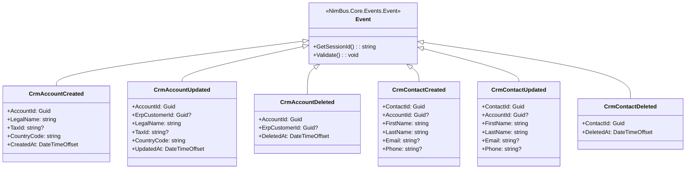

# Events — Erp.Adapter.Functions

| | |
|---|---|
| **Companion to** | [`TDD.md`](./TDD.md) |
| **Adapter** | Erp.Adapter.Functions |
| **Endpoint contract** | `CrmErpDemo.Contracts/Endpoints/ErpEndpoint.cs` |
| **Event base class** | `NimBus.Core.Events.Event` |
| **Status** | Draft |
| **Version** | 0.1 |
| **Last reviewed** | 2026-05-22 |

> **Scope.** Field-level schemas and mapping tables for every event the `Erp.Adapter.Functions` consumes (or that flows through the `ErpEndpoint` topic on its outbound path). The adapter does not own outbound publishing — `Erp.Api` writes outbox rows in its entity transactions and dispatches them; the `Erp*` events are documented here for completeness because the endpoint contract declares them. This document changes in the same pull request as the event class or mapping code.

> **Naming convention.** Every event carries an origin prefix: `Crm*` events are produced by CRM, `Erp*` events are produced by ERP. Each event has exactly one producer, so cross-system loops are structurally impossible. The provisioner additionally enforces `user.From IS NULL` on cross-topic forward rules as defense-in-depth.

---

## 1. Event inventory

### 1.0 Endpoint declaration

```csharp
public class ErpEndpoint : Endpoint
{
    public ErpEndpoint()
    {
        Produces<ErpCustomerCreated>();
        Produces<ErpCustomerUpdated>();
        Produces<ErpCustomerDeleted>();
        Produces<ErpContactCreated>();
        Produces<ErpContactUpdated>();
        Produces<ErpContactDeleted>();

        Consumes<CrmAccountCreated>();
        Consumes<CrmAccountUpdated>();
        Consumes<CrmAccountDeleted>();
        Consumes<CrmContactCreated>();
        Consumes<CrmContactUpdated>();
        Consumes<CrmContactDeleted>();
    }

    public override ISystem System => new ErpSystem(); // SystemId = "Erp"
    public override string Description =>
        "ERP adapter endpoint. Consumes Crm-prefixed Account/Contact events and acknowledges with ErpCustomerCreated.";
}
```

*Source: `CrmErpDemo.Contracts/Endpoints/ErpEndpoint.cs`.*

### 1.1 Published events (ERP → NimBus, direct from `Erp.Api` outbox)

| Event | Base class | Session key | Anchor |
|---|---|---|---|
| `ErpCustomerCreated` | `NimBus.Core.Events.Event` | `AccountId` | [↓](#erpcustomercreated) |
| `ErpCustomerUpdated` | `NimBus.Core.Events.Event` | `AccountId` | [↓](#erpcustomerupdated) |
| `ErpCustomerDeleted` | `NimBus.Core.Events.Event` | `AccountId` | [↓](#erpcustomerdeleted) |
| `ErpContactCreated` | `NimBus.Core.Events.Event` | `ContactId` | [↓](#erpcontactcreated) |
| `ErpContactUpdated` | `NimBus.Core.Events.Event` | `ContactId` | [↓](#erpcontactupdated) |
| `ErpContactDeleted` | `NimBus.Core.Events.Event` | `ContactId` | [↓](#erpcontactdeleted) |

> Listed for contract completeness. Publication happens from `Erp.Api` via `OutboxScope` + `AddNimBusOutboxDispatcher`; the adapter does not call `IPublisherClient`. See the mirror tables in `Crm.Adapter/docs/events.md` for the consumer side.

### 1.2 Consumed events (NimBus → adapter)

| Event | Handler (`IEventHandler<T>`) | Session key | Anchor |
|---|---|---|---|
| `CrmAccountCreated` | `Erp.Adapter.Functions.Handlers.CrmAccountCreatedHandler` | `AccountId` | [↓](#crmaccountcreated) |
| `CrmAccountUpdated` | `Erp.Adapter.Functions.Handlers.CrmAccountUpdatedHandler` | `AccountId` | [↓](#crmaccountupdated) |
| `CrmAccountDeleted` | `Erp.Adapter.Functions.Handlers.CrmAccountDeletedHandler` | `AccountId` | [↓](#crmaccountdeleted) |
| `CrmContactCreated` | `Erp.Adapter.Functions.Handlers.CrmContactCreatedHandler` | `ContactId` | [↓](#crmcontactcreated) |
| `CrmContactUpdated` | `Erp.Adapter.Functions.Handlers.CrmContactUpdatedHandler` | `ContactId` | [↓](#crmcontactupdated) |
| `CrmContactDeleted` | `Erp.Adapter.Functions.Handlers.CrmContactDeletedHandler` | `ContactId` | [↓](#crmcontactdeleted) |

### 1.3 Event hierarchy



---

## 2. Event catalog

### `CrmAccountCreated`

**Purpose.** Published by CRM when an Account is created. The adapter applies it to ERP as a `Customer` upsert keyed on `CrmAccountId`, or — when handoff mode is on — registers a `HandoffJob` with `Erp.Api` and marks the message Pending+Handoff so settlement happens asynchronously (see TDD §5).

**Direction.** Consumed by adapter (`CrmAccountCreatedHandler`).

**Trigger (in CRM).** `POST /api/accounts` in `Crm.Api` (publishes directly via `IPublisherClient`).

**Delivery semantics.** At-least-once. Handler is idempotent — the ERP upsert endpoint matches on `Customers.CrmAccountId` and updates the existing row if present.

**Session key.** `[SessionKey(nameof(AccountId))]`.

**Schema (code):** `CrmErpDemo.Contracts.Events.CrmAccountCreated` — `samples/CrmErpDemo/CrmErpDemo.Contracts/Events/CrmAccountCreated.cs`.

#### Fields

| Field | Type | Nullable | PII | Example | Description |
|---|---|:---:|:---:|---|---|
| `AccountId` | Guid | no | no | `4f1a...` | CRM account identifier. Session key for the end-to-end flow. |
| `LegalName` | string | no | yes | `Contoso A/S` | Legal name of the account. |
| `TaxId` | string | yes | yes | `DK12345678` | VAT / EIN / etc. |
| `CountryCode` | string | no | no | `DE` | ISO 3166-1 alpha-2. |
| `CreatedAt` | DateTimeOffset | no | no | `2026-04-28T10:00:00+00:00` | When the account was created in CRM. |

#### Validation rules

- `AccountId`, `LegalName`, `CountryCode` are `[Required]` — `ValidationMiddleware` rejects the message if missing.

---

### `CrmAccountUpdated`

**Purpose.** Published by CRM when an Account is updated. The adapter applies it to ERP as a `Customer` upsert, threading any previously-linked `ErpCustomerId` through so the ERP API can match by either back-fill column.

**Direction.** Consumed by adapter (`CrmAccountUpdatedHandler`).

**Trigger (in CRM).** `PUT /api/accounts/{id}` in `Crm.Api`.

**Delivery semantics.** At-least-once. Handler is idempotent.

**Session key.** `[SessionKey(nameof(AccountId))]`.

**Schema (code):** `CrmErpDemo.Contracts.Events.CrmAccountUpdated` — `samples/CrmErpDemo/CrmErpDemo.Contracts/Events/CrmAccountUpdated.cs`.

#### Fields

| Field | Type | Nullable | PII | Example | Description |
|---|---|:---:|:---:|---|---|
| `AccountId` | Guid | no | no | `4f1a...` | CRM account identifier. |
| `ErpCustomerId` | Guid | yes | no | `7b3e...` | ERP customer id when this CRM account is linked. Null for CRM-only accounts. |
| `LegalName` | string | no | yes | `Contoso A/S` | Legal name of the account. |
| `TaxId` | string | yes | yes | `DK12345678` | VAT / EIN / etc. |
| `CountryCode` | string | no | no | `DE` | ISO 3166-1 alpha-2. |
| `UpdatedAt` | DateTimeOffset | no | no | `2026-04-28T10:05:00+00:00` | When the update occurred in CRM. |

---

### `CrmAccountDeleted`

**Purpose.** Published by CRM when an Account is soft-deleted. The adapter forwards the soft-delete to ERP keyed on `CrmAccountId`.

**Direction.** Consumed by adapter (`CrmAccountDeletedHandler`).

**Trigger (in CRM).** `DELETE /api/accounts/{id}` (soft-delete) in `Crm.Api`.

**Delivery semantics.** At-least-once. Handler is idempotent on `CrmAccountId`.

**Session key.** `[SessionKey(nameof(AccountId))]`.

**Schema (code):** `CrmErpDemo.Contracts.Events.CrmAccountDeleted` — `samples/CrmErpDemo/CrmErpDemo.Contracts/Events/CrmAccountDeleted.cs`.

#### Fields

| Field | Type | Nullable | PII | Example | Description |
|---|---|:---:|:---:|---|---|
| `AccountId` | Guid | no | no | `4f1a...` | CRM account identifier. |
| `ErpCustomerId` | Guid | yes | no | `7b3e...` | ERP customer id if the account was previously linked; null otherwise. Not used by the handler today — match is by `AccountId`. |
| `DeletedAt` | DateTimeOffset | no | no | `2026-04-29T08:00:00+00:00` | When the deletion occurred in CRM. |

---

### `CrmContactCreated`

**Purpose.** Published by CRM when a Contact is created. The adapter upserts it into ERP's `Contacts` table; the ERP API resolves `AccountId` (a CRM account id) to its local `Customer.Id` via `Customers.CrmAccountId` before storing the contact.

**Direction.** Consumed by adapter (`CrmContactCreatedHandler`).

**Trigger (in CRM).** `POST /api/contacts` in `Crm.Api`.

**Delivery semantics.** At-least-once. Handler is idempotent on `ContactId`.

**Session key.** `[SessionKey(nameof(ContactId))]`.

**Schema (code):** `CrmErpDemo.Contracts.Events.CrmContactCreated` — `samples/CrmErpDemo/CrmErpDemo.Contracts/Events/CrmContactCreated.cs`.

#### Fields

| Field | Type | Nullable | PII | Example | Description |
|---|---|:---:|:---:|---|---|
| `ContactId` | Guid | no | no | `7c2f...` | Contact identifier. |
| `AccountId` | Guid | yes | no | `4f1a...` | The CRM account this contact belongs to. May be unset for orphan contacts. |
| `FirstName` | string | no | yes | `Anna` | Required. |
| `LastName` | string | no | yes | `Hansen` | Required. |
| `Email` | string | yes | yes | `anna@contoso.de` | `[EmailAddress]` validated. |
| `Phone` | string | yes | yes | `+49 30 1234567` | Free-form. |

---

### `CrmContactUpdated`

**Purpose.** Published by CRM when a Contact is updated.

**Direction.** Consumed by adapter (`CrmContactUpdatedHandler`).

**Trigger (in CRM).** `PUT /api/contacts/{id}` in `Crm.Api`.

**Session key.** `[SessionKey(nameof(ContactId))]`.

**Schema (code):** `CrmErpDemo.Contracts.Events.CrmContactUpdated` — same field shape as `CrmContactCreated`.

---

### `CrmContactDeleted`

**Purpose.** Published by CRM when a Contact is soft-deleted.

**Direction.** Consumed by adapter (`CrmContactDeletedHandler`).

**Trigger (in CRM).** `DELETE /api/contacts/{id}` (soft-delete) in `Crm.Api`.

**Session key.** `[SessionKey(nameof(ContactId))]`.

**Schema (code):** `CrmErpDemo.Contracts.Events.CrmContactDeleted` — `samples/CrmErpDemo/CrmErpDemo.Contracts/Events/CrmContactDeleted.cs`.

#### Fields

| Field | Type | Nullable | PII | Example | Description |
|---|---|:---:|:---:|---|---|
| `ContactId` | Guid | no | no | `7c2f...` | Contact identifier. |
| `DeletedAt` | DateTimeOffset | no | no | `2026-04-29T08:05:00+00:00` | When the deletion occurred in CRM. |

---

### `ErpCustomerCreated`

**Purpose.** Published by ERP when a customer is created. `Origin` distinguishes the CRM-originated round-trip ack from a customer that originated directly in ERP.

**Direction.** **Published** by `Erp.Api` via outbox + dispatcher. Listed here for endpoint-contract completeness; consumer-side documentation lives in [`Crm.Adapter/docs/events.md`](../../Crm.Adapter/docs/events.md#erpcustomercreated).

**Trigger (in ERP):** `PUT /api/customers/by-crm/{crmAccountId}` (insert path, `Origin=Crm` — round-trip ack) or `POST /api/customers/` (`Origin=Erp`).

**Delivery semantics.** At-least-once via the SQL outbox.

**Session key.** `[SessionKey(nameof(AccountId))]`.

**Schema (code):** `CrmErpDemo.Contracts.Events.ErpCustomerCreated` — `samples/CrmErpDemo/CrmErpDemo.Contracts/Events/ErpCustomerCreated.cs`.

#### Fields

| Field | Type | Nullable | PII | Example | Description |
|---|---|:---:|:---:|---|---|
| `Origin` | `CustomerOrigin` (enum) | no | no | `Crm` | Where the customer originated. `Crm` = ack of a CRM-originated `CrmAccountCreated`; `Erp` = customer created directly in ERP. |
| `AccountId` | Guid | no | no | `4f1a...` | Session key. CRM account id when `Origin=Crm`; falls back to `ErpCustomerId` when `Origin=Erp`. |
| `ErpCustomerId` | Guid | no | no | `9b3e...` | The ERP-side customer identifier. |
| `CustomerNumber` | string | no | no | `C-00042` | Human-readable ERP customer number. |
| `LegalName` | string | no | yes | `Contoso A/S` | Legal name of the customer. |
| `TaxId` | string | yes | yes | `DK12345678` | VAT / EIN / etc. |
| `CountryCode` | string | no | no | `DE` | ISO 3166-1 alpha-2. |

#### Allowed values

| Field | Allowed values | Meaning |
|---|---|---|
| `Origin` | `Erp`, `Crm` | Round-trip-ack discriminator — see `Crm.Adapter` TDD §4.2 |

---

### `ErpCustomerUpdated`

**Purpose.** Published by ERP when an existing customer is updated. Carries both linkage ids so the CRM side can locate the matching account whether or not the back-fill link has been written yet.

**Direction.** **Published** by `Erp.Api` via outbox. See [`Crm.Adapter/docs/events.md#erpcustomerupdated`](../../Crm.Adapter/docs/events.md#erpcustomerupdated) for consumer mappings.

**Trigger (in ERP).** `PUT /api/customers/by-crm/{crmAccountId}` (update path) or `PUT /api/customers/{id}`, dispatched via outbox.

**Session key.** `[SessionKey(nameof(AccountId))]`.

**Schema (code):** `CrmErpDemo.Contracts.Events.ErpCustomerUpdated`.

---

### `ErpCustomerDeleted`

**Purpose.** Published by ERP when a customer is soft-deleted.

**Direction.** **Published** by `Erp.Api` via outbox.

**Trigger (in ERP).** `POST /api/customers/by-crm/{crmAccountId}/deleted` (CRM-originated soft-delete) or the ERP-direct soft-delete path.

**Session key.** `[SessionKey(nameof(AccountId))]`.

**Schema (code):** `CrmErpDemo.Contracts.Events.ErpCustomerDeleted`.

---

### `ErpContactCreated`

**Purpose.** Published by ERP when a contact is created.

**Direction.** **Published** by `Erp.Api` via outbox.

**Trigger (in ERP).** `POST /api/contacts/` or `PUT /api/contacts/upsert/{id}` (insert path), dispatched via outbox.

**Session key.** `[SessionKey(nameof(ContactId))]`.

**Schema (code):** `CrmErpDemo.Contracts.Events.ErpContactCreated`.

---

### `ErpContactUpdated`

**Purpose.** Published by ERP when a contact is updated.

**Direction.** **Published** by `Erp.Api` via outbox.

**Trigger (in ERP).** `PUT /api/contacts/upsert/{id}` (update path) or `PUT /api/contacts/{id}`, dispatched via outbox.

**Session key.** `[SessionKey(nameof(ContactId))]`.

**Schema (code):** `CrmErpDemo.Contracts.Events.ErpContactUpdated`.

---

### `ErpContactDeleted`

**Purpose.** Published by ERP when a contact is soft-deleted.

**Direction.** **Published** by `Erp.Api` via outbox.

**Trigger (in ERP).** `POST /api/contacts/{id}/deleted`, dispatched via outbox.

**Session key.** `[SessionKey(nameof(ContactId))]`.

**Schema (code):** `CrmErpDemo.Contracts.Events.ErpContactDeleted`.

---

## 3. Mappings

### 3.1 Inbound — `Crm*` event → `erp-api` HTTP call

These mappings live in the adapter's handlers and clients (`Handlers/*` and `Clients/ErpApiClient.cs`).

#### 3.1.1 `CrmAccountCreated` → `PUT /api/customers/by-crm/{AccountId}` (sync path)

`Handlers/CrmAccountCreatedHandler.cs:53-56` + `Clients/ErpApiClient.cs:10-20`.

| Event field | Event type | → | HTTP target | Target type | Resolution |
|---|---|---|---|---|---|
| `AccountId` | Guid | → | URL path `/api/customers/by-crm/{crmAccountId}` | Guid | Direct copy |
| (always `null`) | — | → | body `CustomerUpsertPayload.ErpCustomerId` | Guid? | Create-path; ERP hasn't assigned the customer id yet |
| `LegalName` | string | → | body `LegalName` | string | Direct copy |
| `TaxId` | string? | → | body `TaxId` | string? | Direct copy |
| `CountryCode` | string | → | body `CountryCode` | string | Direct copy |

**Unmapped event fields:** `CreatedAt` — not threaded to the upsert (the ERP API stamps its own `CreatedAt` on insert).

#### 3.1.2 `CrmAccountCreated` → `POST /api/internal/handoff-jobs` (handoff path)

`Handlers/CrmAccountCreatedHandler.cs:20-47` + `HandoffMode/HandoffJobRegistration.cs:7-11`.

| Source | Source type | → | HandoffJob field | Target type | Resolution |
|---|---|---|---|---|---|
| `context.EventId` | string | → | `EventId` | string | Direct copy (NimBus context) |
| `message.AccountId.ToString()` | string | → | `SessionId` | string | Stringified Guid |
| `context.MessageId` | string | → | `MessageId` | string | Direct copy |
| `context.MessageId` | string | → | `OriginatingMessageId` | string? | Originator = inbound message |
| `context.EventType` | string | → | `EventTypeId` | string | Direct copy |
| `context.CorrelationId` | string | → | `CorrelationId` | string? | Direct copy |
| `"DMF-{Guid.NewGuid():N}".Substring(0, 16)` | string | → | `ExternalJobId` | string | Generated; mirrors a fictional Dynamics DMF job id |
| `DateTime.UtcNow + mode.DurationSeconds` | DateTime | → | `DueAt` | DateTime | Computed from `IHandoffModeClient.GetAsync().DurationSeconds` |
| `JsonConvert.SerializeObject(message)` | string | → | `PayloadJson` | string | Whole inbound event re-serialised — `HandoffJobBackgroundService` deserialises and applies the upsert on settlement success |

After registration, the handler calls `context.MarkPendingHandoff(reason: "Awaiting ERP DMF import job (demo)", externalJobId: jobId, expectedBy: TimeSpan.FromSeconds(mode.DurationSeconds))`.

#### 3.1.3 `CrmAccountUpdated` → `PUT /api/customers/by-crm/{AccountId}`

`Handlers/CrmAccountUpdatedHandler.cs:14-23` + `Clients/ErpApiClient.cs:10-20`.

| Event field | Event type | → | HTTP target | Target type | Resolution |
|---|---|---|---|---|---|
| `AccountId` | Guid | → | URL path `/api/customers/by-crm/{crmAccountId}` | Guid | Direct copy |
| `ErpCustomerId` | Guid? | → | body `CustomerUpsertPayload.ErpCustomerId` | Guid? | Direct copy — threaded through for ERP's two-step lookup (see TDD §4.9 of the mirror Crm.Adapter TDD) |
| `LegalName` | string | → | body `LegalName` | string | Direct copy |
| `TaxId` | string? | → | body `TaxId` | string? | Direct copy |
| `CountryCode` | string | → | body `CountryCode` | string | Direct copy |

**Unmapped event fields:** `UpdatedAt` — not threaded.

#### 3.1.4 `CrmAccountDeleted` → `POST /api/customers/by-crm/{AccountId}/deleted`

`Handlers/CrmAccountDeletedHandler.cs:14-22` + `Clients/ErpApiClient.cs:42-49`.

| Event field | Event type | → | HTTP target | Target type | Resolution |
|---|---|---|---|---|---|
| `AccountId` | Guid | → | URL path `/api/customers/by-crm/{crmAccountId}/deleted` | Guid | Direct copy |

**Unmapped event fields:** `ErpCustomerId` (not used — ERP matches by `AccountId`), `DeletedAt` (ERP stamps its own).

#### 3.1.5 `CrmContactCreated` / `CrmContactUpdated` → `PUT /api/contacts/upsert/{ContactId}`

`Handlers/CrmContactCreatedHandler.cs:14-25`, `Handlers/CrmContactUpdatedHandler.cs:14-23` + `Clients/ErpApiClient.cs:22-40`. Both handlers use the same idempotent upsert endpoint.

| Event field | Event type | → | HTTP target | Target type | Resolution |
|---|---|---|---|---|---|
| `ContactId` | Guid | → | URL path `{contactId}` + body `Id` | Guid | Direct copy |
| `AccountId` | Guid? | → | body `ContactUpsertPayload.CrmAccountId` → body field `CrmAccountId` | Guid? | Direct copy. **Caveat:** the field is named `CrmAccountId` (the ERP API resolves it to the local `Customer.Id` via `Customers.CrmAccountId`). |
| `FirstName` | string | → | body `FirstName` | string | Direct copy |
| `LastName` | string | → | body `LastName` | string | Direct copy |
| `Email` | string? | → | body `Email` | string? | Direct copy |
| `Phone` | string? | → | body `Phone` | string? | Direct copy |

#### 3.1.6 `CrmContactDeleted` → `POST /api/contacts/{ContactId}/deleted`

`Handlers/CrmContactDeletedHandler.cs:14-19` + `Clients/ErpApiClient.cs:51-58`.

| Event field | Event type | → | HTTP target | Target type | Resolution |
|---|---|---|---|---|---|
| `ContactId` | Guid | → | URL path `/api/contacts/{contactId}/deleted` | Guid | Direct copy |

**Unmapped event fields:** `DeletedAt` (ERP stamps its own).

---

## 4. Field-level change log

| Version | Date | Event | Field | Change | Reason | PR |
|---|---|---|---|---|---|---|
| 0.1 | 2026-05-22 | (all) | (all) | Initial documentation snapshot | First TDD draft via `adapter-docs` skill (generate-from-code mode) | n/a |

---

## 5. Related

- [`TDD.md`](./TDD.md) — the Technical Design Document this file is referenced from.
- [`../../CrmErpDemo.Contracts/Endpoints/ErpEndpoint.cs`](../../CrmErpDemo.Contracts/Endpoints/ErpEndpoint.cs) — authoritative `Consumes<>` / `Produces<>` declarations.
- [`../../CrmErpDemo.Contracts/Events/`](../../CrmErpDemo.Contracts/Events) — event class definitions.
- [`../../Crm.Adapter/docs/events.md`](../../Crm.Adapter/docs/events.md) — mirror events doc on the CRM side (consumes the `Erp*` events documented above for completeness).
- [`../Handlers/`](../Handlers) — inbound event → HTTP-call mapping.
- [`../HandoffMode/`](../HandoffMode) — handoff registration client.
