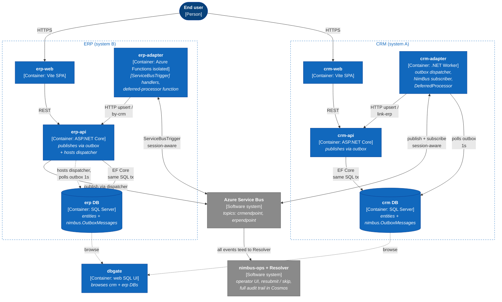
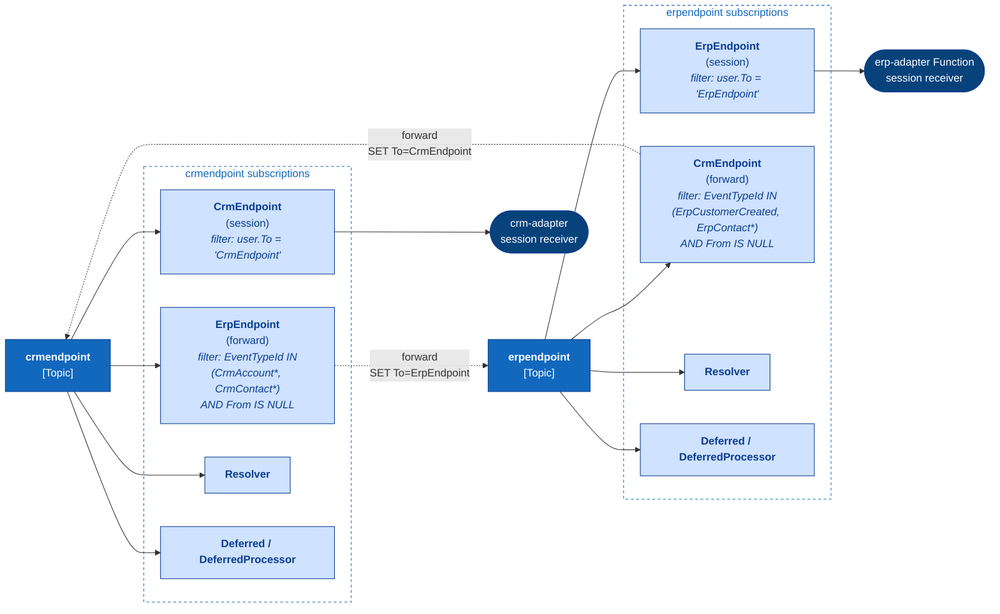
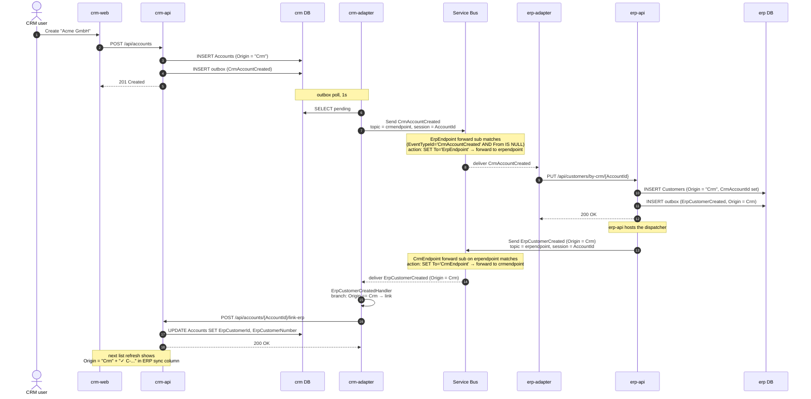
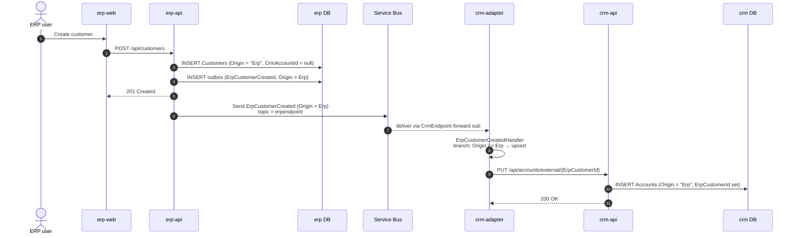
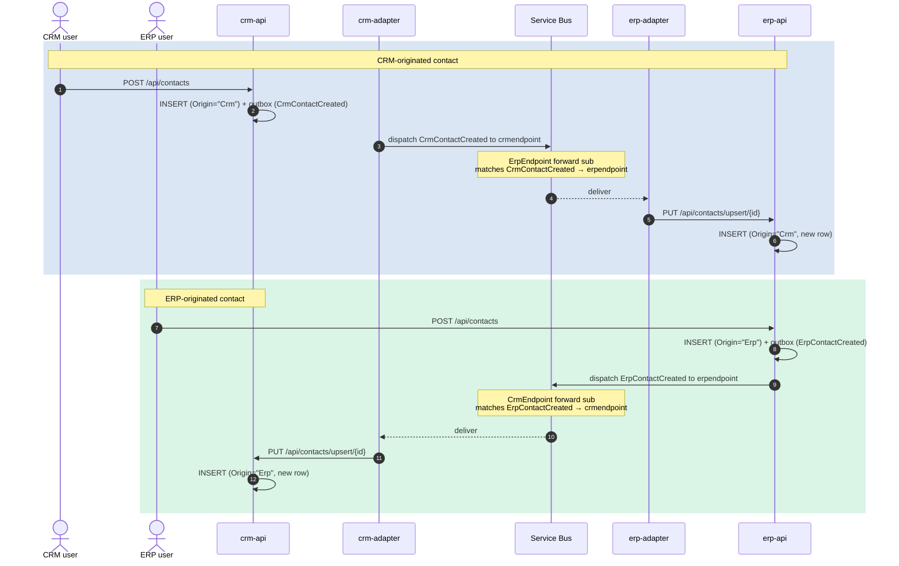
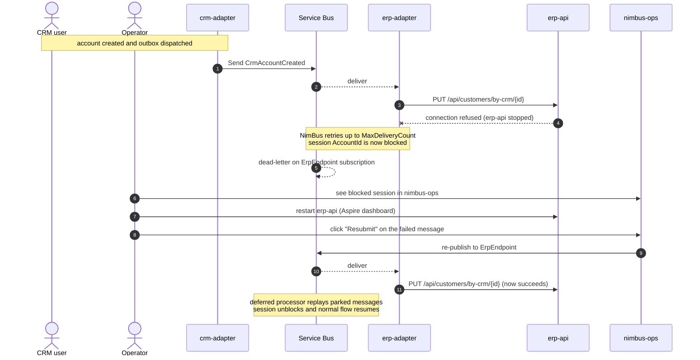

# CRM + ERP Integration Demo

A two-system NimBus demo showing how a CRM and an ERP exchange domain events over Azure Service Bus, each with its own web UI, REST API, database, and adapter — and each adapter using a **different hosting model** (Container/BackgroundService vs. Azure Functions).

## Architecture



## What this demo showcases

- **Outbox-based business event detection** — CRM/ERP API writes the entity, then `IPublisherClient.Publish(...)` stages a domain event row in the same DB; the adapter's outbox dispatcher forwards it to Service Bus. (At-least-once delivery survives API crashes after the DB commit.)
- **Single-connection atomic commit** — entity insert and outbox row insert run on the *same* `SqlConnection` and `SqlTransaction` (via `OutboxScope.RunAsync`). One physical connection means no MSDTC promotion — important because Aspire's containerized SQL Server can't service distributed transactions anyway.
- **Domain event mapping** — the adapter maps DB entities to clean contract events (`CrmAccountCreated`, `ErpCustomerCreated`, ...) — published applications don't see DB schemas.
- **Origin-prefixed event names** — every event has exactly one producer (`CrmAccountCreated` is only published by CRM, `ErpCustomerCreated` only by ERP). The single-producer convention matches the platform's main catalog and structurally prevents cross-topic forwarding loops.
- **Receiving adapter calls the target REST API** — typed `HttpClient` per system; handlers are idempotent (upsert keyed on the originator's id).
- **Two hosting models, identical handlers** — same `IEventHandler<T>` works in a worker container (CRM) and in Azure Functions (ERP). Demonstrates that hosting is a deployment concern, not a code concern.
- **Session-based ordering** — `[SessionKey(nameof(AccountId))]` keeps the round-trip `CrmAccountCreated → ErpCustomerCreated → link-erp` ordered for each account.
- **Operator surface** — reuses the existing `NimBus.WebApp` + Resolver from the main repo for full audit trail and resubmit/skip.

## Domains in v1

| Direction       | Event                  | Receiving action                        |
|-----------------|------------------------|-----------------------------------------|
| CRM → ERP       | `CrmAccountCreated`    | `PUT /api/customers/by-crm/{id}`        |
| CRM → ERP       | `CrmAccountUpdated`    | `PUT /api/customers/by-crm/{id}`        |
| ERP → CRM (ack) | `ErpCustomerCreated`   | `POST /api/accounts/{id}/link-erp` (Origin=Crm) or `PUT /api/accounts/external/{erpId}` (Origin=Erp) |
| CRM → ERP       | `CrmContactCreated`    | `PUT /api/contacts/upsert/{id}`         |
| CRM → ERP       | `CrmContactUpdated`    | `PUT /api/contacts/upsert/{id}`         |
| ERP → CRM       | `ErpContactCreated`    | `PUT /api/contacts/upsert/{id}`         |
| ERP → CRM       | `ErpContactUpdated`    | `PUT /api/contacts/upsert/{id}`         |

## Message flows

### Service Bus topology — how events cross between topics

The provisioner (`CrmErpDemo.Provisioner`) creates one topic per endpoint and one **forwarding subscription** per cross-system consumer. Each forwarding rule is filtered on `EventTypeId AND user.From IS NULL` so the rule fires only on **original publishes**, never on already-forwarded copies — this is what prevents loops.



### Flow 1 — CRM → ERP → CRM round-trip (account creation)

The headline scenario. Demonstrates the transactional outbox, cross-topic forwarding, the `Origin` discriminator on `ErpCustomerCreated`, and the back-fill of the ERP customer id onto the CRM account row.



### Flow 2 — ERP-originated customer (one-way)

User creates a customer directly in `erp-web`. ERP publishes once; CRM receives it and upserts a fresh account. No round-trip ack is needed because there's no pre-existing CRM record to link.



### Flow 3 — Bidirectional contacts (no loop)

Either system can originate a contact. Origin-prefixed event types (`CrmContactCreated` vs `ErpContactCreated`) make it structurally impossible for an event to round-trip back to its own publisher — each event has exactly one producer.



### Flow 4 — Failure + resubmit (operator path)

When a downstream call fails, NimBus retries up to MaxDeliveryCount, then dead-letters the message and **blocks the session** so subsequent events for the same entity wait. The operator resubmits via `nimbus-ops`, which re-publishes the failed message; the deferred-processor subscription then drains any messages parked behind it.



## Suggested v2 domains

Ranked by demo value:

1. **Sales Orders (CRM → ERP)** — multi-step saga (`OrderPlaced → ReservationMade → InvoiceCreated`) on a shared `OrderId` session. Best showcase of session-ordered multi-hop flow.
2. **Products (ERP → CRM catalog sync)** — fan-out to multiple subscribers (CRM + Analytics).
3. **Inventory levels (ERP → CRM)** — high-frequency updates per SKU; demonstrates per-key ordering without head-of-line blocking.

Quotes, Price Lists, Invoices, Payments, Purchase Orders are subsets of the above or distract with payment-gateway plumbing.

## Repo layout

```
samples/CrmErpDemo/
  CrmErpDemo.AppHost/        Aspire host (SQL Server + DbGate + everything below)
  CrmErpDemo.Contracts/      Shared events + endpoints + CrmErpPlatformConfiguration
  CrmErpDemo.Provisioner/    Code-first SB topology (CrmEndpoint, ErpEndpoint)
  Crm.Api/                   ASP.NET Core minimal API + EF Core SQL Server
  Crm.Adapter/               Worker (BackgroundService) + outbox dispatcher
  Crm.Web/                   React + Vite + TS + Tailwind SPA
  Erp.Api/                   ASP.NET Core minimal API + EF Core; hosts ERP outbox dispatcher
  Erp.Adapter.Functions/     Azure Functions isolated worker
  Erp.Web/                   React + Vite + TS + Tailwind SPA
```

## Prerequisites

- .NET 10 SDK (preview)
- Node.js 22+ (for the SPAs)
- Docker (for the Aspire-managed SQL Server container)
- Azure Service Bus + Cosmos DB connection strings (real Azure or emulators)

## Running locally

```bash
# 1. Configure connection strings (one-time)
dotnet user-secrets --project samples/CrmErpDemo/CrmErpDemo.AppHost set ConnectionStrings:servicebus "Endpoint=sb://..."
dotnet user-secrets --project samples/CrmErpDemo/CrmErpDemo.AppHost set ConnectionStrings:cosmos "AccountEndpoint=https://...;AccountKey=..."

# 2. Install SPA dependencies (first run only)
(cd samples/CrmErpDemo/Crm.Web && npm install)
(cd samples/CrmErpDemo/Erp.Web && npm install)

# 3. Run the demo
dotnet run --project samples/CrmErpDemo/CrmErpDemo.AppHost
```

The Aspire dashboard opens automatically. Wait for `provisioner` to complete, then everything else turns green.

## End-to-end happy path

1. Open **crm-web** from the Aspire dashboard.
2. Create an account "Acme GmbH" (DE).
3. In the Aspire logs you should see, in order:
   - `crm-api` writes the account + outbox row
   - `crm-adapter` dispatches `CrmAccountCreated` to Service Bus
   - `erp-adapter` Function fires on `ErpEndpoint`
   - `erp-api` receives `PUT /api/customers/by-crm/{id}` and writes the customer + outbox row
   - `erp-api`'s outbox dispatcher publishes `ErpCustomerCreated`
   - `crm-adapter` handler `POST`s `/api/accounts/{id}/link-erp` to populate `ErpCustomerId`
4. Open **erp-web** → the new customer is visible.
5. Refresh **crm-web** → the account row now shows the ERP customer number (`✓ C-...`).
6. Open **nimbus-ops** → the audit trail (Resolver) shows both events on the same `AccountId` session.
7. Open **dbgate** (web SQL UI) → connect "Aspire SQL Server" auto-loads → inspect `crm.[nimbus].[OutboxMessages]` and `erp.[nimbus].[OutboxMessages]` to see outbox rows being written and dispatched.

## Failure path (to demonstrate resubmit)

1. In the Aspire dashboard, **stop `erp-api`**.
2. Create another account in **crm-web**.
3. The `erp-adapter` Function fires, the HTTP call to `erp-api` fails, NimBus retries, then dead-letters the message and **blocks the session**.
4. **nimbus-ops** shows the blocked session.
5. Restart `erp-api` from the Aspire dashboard.
6. From **nimbus-ops**, resubmit the failed message → flow completes; the link-erp callback updates the account.

## Why this layout (vs. a separate repo)

Same logic the existing `samples/AspirePubSub/` follows: the demo lives next to the SDK so refactors can't silently break it (CI catches sample drift), project references avoid NuGet lag, and discoverability is high. `node_modules/` is git-ignored.

## Out of scope (v1)

No authn/authz, no multi-tenant, no production deployment scripts, no non-Azure transports, no realistic tax/currency/shipping math, no automated browser tests, no UI i18n, no Sales Orders/Products/Inventory.

## Files to look at

| Concern                                 | File                                                                                       |
|-----------------------------------------|--------------------------------------------------------------------------------------------|
| Domain event contracts                  | `CrmErpDemo.Contracts/Events/*.cs`                                                         |
| Topology (endpoints, consumes/produces) | `CrmErpDemo.Contracts/Endpoints/*.cs` + `CrmErpPlatformConfiguration.cs`                   |
| CRM business event detection            | `Crm.Api/Endpoints/AccountEndpoints.cs` (publish after `SaveChangesAsync`)                 |
| Atomic entity + outbox commit           | `Crm.Api/OutboxScope.cs`, `Erp.Api/OutboxScope.cs` (shares EF's `SqlConnection`/`SqlTransaction` with `SqlServerOutbox` via `SqlServerOutboxAmbientTransaction`) |
| Outbox dispatcher (CRM)                 | `Crm.Adapter/Program.cs` (`AddNimBusOutboxDispatcher` + `OutboxDispatcherSender` registration) |
| CRM subscriber handlers                 | `Crm.Adapter/Handlers/*.cs`                                                                |
| ERP Function adapter                    | `Erp.Adapter.Functions/Functions/ErpEndpointFunction.cs` + deferred function                |
| ERP subscriber handlers                 | `Erp.Adapter.Functions/Handlers/*.cs`                                                       |
| Aspire wiring                           | `CrmErpDemo.AppHost/Program.cs`                                                            |
