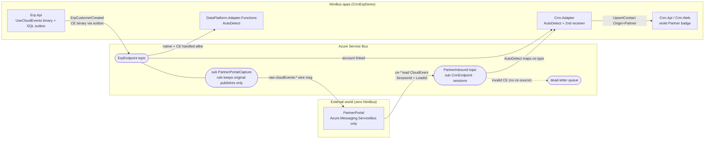
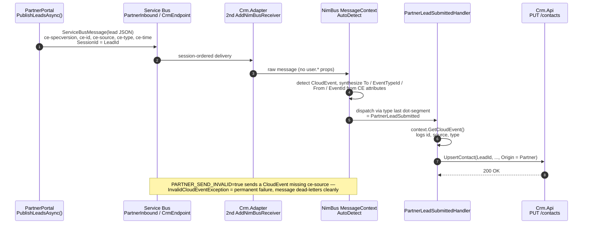
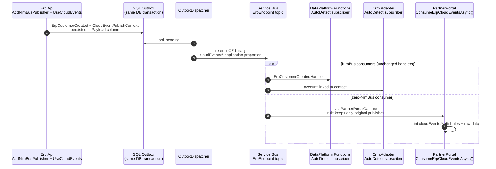

# CloudEvents partner interop — visual guide

Bidirectional [CloudEvents 1.0](../../../docs/cloudevents.md) interop with **PartnerPortal**, a
simulated external system that references **only** `Azure.Messaging.ServiceBus` — zero NimBus
packages. This page carries the diagrams; the prose walkthrough and log-watching guide live in
the [CrmErpDemo README](../README.md#showcase-cloudevents-partner-interop-external-system-zero-nimbus).

- **Inbound** — PartnerPortal publishes a raw `ce-*` CloudEvent lead, NimBus AutoDetect routes it
  to a typed handler, and a Partner-origin contact appears in the CRM.
- **Outbound** — Erp.Api publishes CloudEvents-binary through the SQL outbox, so a NimBus-free
  consumer can read ERP events off a plain subscription.

## Big picture

The partner never learns NimBus's envelope, and NimBus subscribers keep handling native messages
on the same subscriptions (`CompatibilityMode.AutoDetect`).



## Inbound — partner lead becomes a CRM contact

The partner speaks plain CloudEvents with the standard `ce-` property prefix (not NimBus's own
`cloudEvents:`) — proving the reader's `AcceptedPrefixes` handle non-Microsoft producers.
AutoDetect maps the CloudEvents `type` attribute's last dot-segment
(`com.partnerportal.crm.PartnerLeadSubmitted`) to the `PartnerLeadSubmitted` EventTypeId.



## Outbound — ERP event survives the outbox and reaches a NimBus-free reader

`Erp.Api` publishes with `UseCloudEvents` (binary mode, `source = urn:crmerpdemo:erp`). The
CloudEvent envelope is serialized into the SQL outbox `Payload` column and re-emitted intact by
the dispatcher, so the wire shape is identical to a direct publish.



## On the wire

Both directions use **binary content mode**: CloudEvents context attributes ride as application
properties, the body stays raw domain JSON.

**Inbound** — PartnerPortal → `PartnerInbound` (standard `ce-` prefix):

```text
// ApplicationProperties
ce-specversion = "1.0"
ce-id          = "9f2c…"
ce-source      = "urn:partnerportal"
ce-type        = "com.partnerportal.crm.PartnerLeadSubmitted"
ce-time        = "2026-07-11T00:50:00Z"
SessionId      = <LeadId>            // plain SB property — sessions without NimBus
ContentType    = "application/json"

// Body — raw domain JSON
{ "LeadId": "…", "FirstName": "Ada", "LastName": "Lovelace",
  "Email": "lead0@partnerportal.example", "CompanyName": "Contoso Ltd" }
```

**Outbound** — Erp.Api → `ErpEndpoint` (AMQP binding `cloudEvents:` prefix):

```text
// ApplicationProperties
cloudEvents:specversion = "1.0"
cloudEvents:id          = "41ab…"
cloudEvents:source      = "urn:crmerpdemo:erp"
cloudEvents:type        = "…ErpCustomerCreated"
ContentType             = "application/json"   // datacontenttype

// Body — raw domain JSON, envelope survived the SQL outbox
{ "CustomerId": "…", "Name": "Contoso Ltd", … }
```

**Dead-letter demo** — `PARTNER_SEND_INVALID=true` sends a CloudEvent with `ce-specversion`,
`ce-id`, and `ce-type` but **no `ce-source`**: NimBus's validating handler throws
`InvalidCloudEventException` (permanent failure) and the message lands in the
`PartnerInbound/CrmEndpoint` dead-letter queue with a clear reason.

## Topology

`PartnerInbound` (+ session-required sub `CrmEndpoint`) and `ErpEndpoint/PartnerPortalCapture`
(+ `cloudevents-capture` rule) are declared in **both provisioning paths**:
[`EmulatorTopologyConfigBuilder`](../CrmErpDemo.Contracts/EmulatorTopologyConfigBuilder.cs) for
the local emulator and [`CrmErpDemo.Provisioner`](../CrmErpDemo.Provisioner/Program.cs) for real
Azure. `ErpEndpoint` also implements `ICloudEventsAware`, so the AsyncAPI export carries
`x-cloudevents`.

## Key files

| Role | File |
| --- | --- |
| External partner (zero NimBus) | [`PartnerPortal/Program.cs`](../PartnerPortal/Program.cs) |
| Inbound contract (`[SessionKey(LeadId)]`, no NimBus producer) | [`CrmErpDemo.Contracts/Events/PartnerLeadSubmitted.cs`](../CrmErpDemo.Contracts/Events/PartnerLeadSubmitted.cs) |
| Inbound handler → CRM upsert, `Origin=Partner` | [`Crm.Adapter/Handlers/PartnerLeadSubmittedHandler.cs`](../Crm.Adapter/Handlers/PartnerLeadSubmittedHandler.cs) |
| AutoDetect subscriber + second receiver | [`Crm.Adapter/Program.cs`](../Crm.Adapter/Program.cs) |
| CE-binary publisher through the SQL outbox | [`Erp.Api/Program.cs`](../Erp.Api/Program.cs) |
| AutoDetect on the analytics endpoint | [`DataPlatform.Adapter.Functions/Program.cs`](../DataPlatform.Adapter.Functions/Program.cs) |
| Violet Partner badge | [`Crm.Web/src/pages/ContactsList.tsx`](../Crm.Web/src/pages/ContactsList.tsx) |
