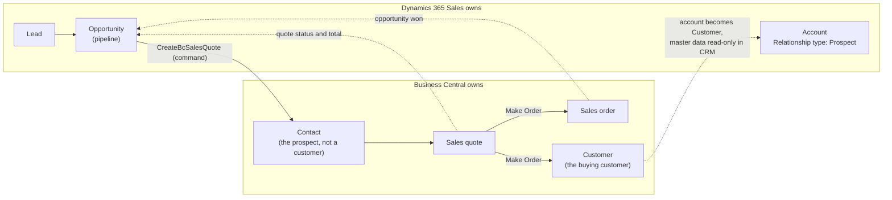
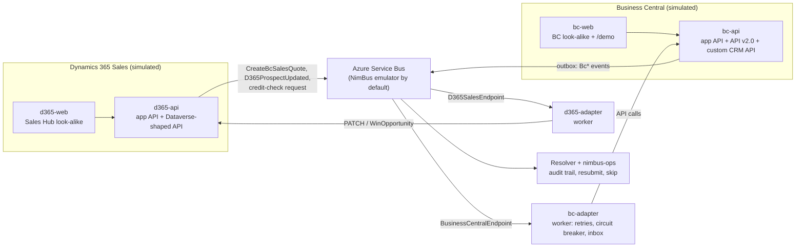
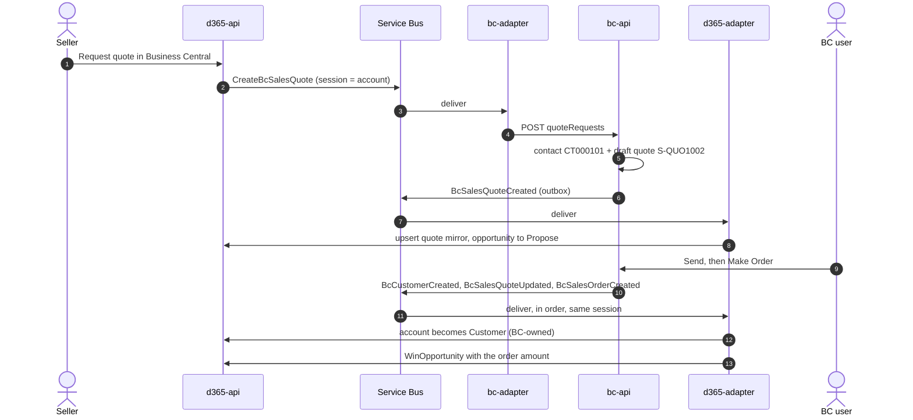

# Dynamics 365 Sales ↔ Business Central on NimBus

A client-ready demo of NimBus integrating a CRM and an ERP that each own part of the customer
lifecycle:

- **Dynamics 365 Sales owns** leads, opportunities and the pipeline — everything until the
  prospect buys.
- **Business Central owns** the buying customer, and **quotes are made in Business Central**.

Both systems are **simulated**, so the demo runs on a laptop with no tenants or credentials. The
simulators' integration APIs follow the shapes of the real ones: the Dataverse Web API for Dynamics
365 and BC API v2.0 plus one custom API for Business Central. The company, its customers, people and
products are fictional ("Contoso Subsea", a maker of subsea equipment). The look-alike web clients
use Fluent UI and carry no Microsoft branding. They are not affiliated with or endorsed by
Microsoft.

> **Presenting it?** Start with the [talk track](docs/talk-track.md): scene by scene, with prep,
> click paths, talking points and objection handling.

## The ownership model



The handover is the quote. CRM **asks** Business Central for a quote; BC quotes the prospect as a
*contact*, without creating a customer. When the customer accepts, BC's **Make Order** converts the
contact into a customer. That is the moment BC takes ownership, and CRM flips the account to
Customer and locks its master data. From then on, customer changes flow one way: from BC to CRM.

## Architecture



- **Seller actions publish directly.** `d365-api` publishes seller actions. In production they would
  leave Dataverse through a Service Endpoint and the NimBus Dataverse adapter.
- **BC changes go through a transactional outbox.** `bc-api` publishes every change that way, so the
  data and its events commit together. In production that is BC webhooks → an ingress → a fetch
  through the API.
- **Integration writes never publish.** Writes the adapter makes through the Dataverse-shaped API
  are never published back, which is what prevents echo loops. In real Dataverse that is the plug-in
  step filtering out the integration user.
- **The BC adapter runs as a worker.** Only a worker host can pause its receivers when the circuit
  breaker opens, and that is what a BC update window calls for.

## What the demo shows

| Scene | What happens | NimBus capability |
|---|---|---|
| 1 | A lead is qualified into a prospect account and opportunity; nothing reaches BC | The ownership boundary |
| 2 | The seller requests a quote; BC creates a prospect contact and a draft quote | **Command** with exactly one consumer, validated at provisioning; audit trail |
| 3 | BC revises and sends the quote; the opportunity's revenue follows it | Events; transactional outbox |
| 4 | BC Make Order: customer and order created; the CRM account becomes a BC-owned Customer; the opportunity is won | **Session ordering** per customer: customer → quote accepted → order |
| 5 | "Check credit in Business Central", live; BC blocks shipping and CRM mirrors it | **Request/reply** next to events |
| 6a | A new seller is missing in BC; the request fails, only that customer waits, the office keeps flowing; fix in BC and **Resubmit** | Failure isolation, operator recovery, alert |
| 6b | BC update window (503) while the whole office requests quotes | **Circuit breaker** + retry policy; recovers with no operator action |
| 6c | BC throttling (429) | **Retry policy** with exponential backoff |
| 6d | A double-clicked request | **Inbox deduplication** (deterministic MessageId) + idempotent BC API |
| 7 | nimbus-ops tour: endpoints, flow, catalog, failures | The operator surface |

## Message catalog

| Message | Kind | From → to | Notes |
|---|---|---|---|
| `CreateBcSalesQuote` | Command | Dynamics 365 → BC | Deterministic MessageId `quote:{opportunity}:{revision}` |
| `D365ProspectUpdated` | Event | Dynamics 365 → BC | Only for prospects BC already knows; BC refuses it once it owns the customer |
| `D365CreditCheckRequested` | Request | Dynamics 365 → BC | Reply `BcCreditStatus`; no session key, so a check never blocks a customer |
| `BcSalesQuoteCreated` / `BcSalesQuoteUpdated` | Event | BC → Dynamics 365 | Status `Draft`, `Sent`, `Accepted`, `Expired` |
| `BcCustomerCreated` / `BcCustomerUpdated` | Event | BC → Dynamics 365 | BC-owned master data, credit limit, balance, blocked |
| `BcSalesOrderCreated` | Event | BC → Dynamics 365 | Wins the opportunity |

Every event and the command are session-keyed on the CRM account, so everything about one
customer is processed in order. A failure blocks only that customer. The contracts live in
[`DynamicsBcDemo.Contracts`](DynamicsBcDemo.Contracts), and nimbus-ops shows them, with
descriptions and examples, under **Event types**.

## Flow: from quote request to won order



## Run it

Prerequisites:

- .NET 10 SDK;
- Node.js 22+;
- Docker (for the SQL Server container);
- Azure Functions Core Tools v4 (`func`), because the NimBus Resolver is a Functions app.

No Azure account is needed: the NimBus Service Bus emulator is the default.

```bash
# from the repository root
aspire run --apphost samples/DynamicsBcDemo/DynamicsBcDemo.AppHost/DynamicsBcDemo.AppHost.csproj
```

Or run `aspire run` from `samples/DynamicsBcDemo`: its `aspire.config.json` selects this AppHost.
The first run installs the two web clients' npm packages. Wait until `provisioner` has finished
and every resource is healthy.

| Resource | URL |
|---|---|
| Sales Hub (Dynamics 365 look-alike) | http://localhost:5283 |
| Business Central look-alike | http://localhost:5293 |
| Demo cockpit (presenter) | http://localhost:5293/demo |
| #integration-alerts (audience) | http://localhost:5293/demo/alerts |
| nimbus-ops | https://localhost:18543 |
| d365-api / bc-api | http://localhost:5280 / http://localhost:5290 |
| Aspire dashboard | https://localhost:17180 |

The ports differ from CrmErpDemo's, so both demos can run side by side.

**Reset = restart.** SQL Server runs without a persistent volume, and the emulator keeps broker
state in memory. Every run starts from the seed data with an empty audit trail, and no blocked
sessions or scheduled retries are left over from a rehearsal.

### Using a real Service Bus namespace

For client-facing runs, a real namespace (Standard tier) is the more robust choice:

```bash
dotnet user-secrets --project samples/DynamicsBcDemo/DynamicsBcDemo.AppHost set ConnectionStrings:servicebus "Endpoint=sb://<namespace>.servicebus.windows.net/;SharedAccessKeyName=...;SharedAccessKey=..."
NIMBUS_SB_EMULATOR=false aspire run --apphost samples/DynamicsBcDemo/DynamicsBcDemo.AppHost/DynamicsBcDemo.AppHost.csproj
```

A real namespace keeps broker state between runs. Use a namespace of its own, or purge the demo's
subscriptions in nimbus-ops (Admin → Subscriptions) before presenting, because the seed ids are
fixed.

## Demo controls

The look-alike apps contain no demo gadgets. The presenter uses two hidden pages of the BC client:

- **`/demo`**, the presenter cockpit:
  - Start or end a Business Central update window (503) or API throttling (429). Both are time-boxed
    (20 s by default), so a scene ends on its own.
  - Watch the Business Central adapter's circuit: Closed, Open or HalfOpen.
  - Fire a **pilot-office burst**: N sellers request quotes at once.
  - Links to nimbus-ops.
- **`/demo/alerts`**, a Teams-style channel for the audience. It shows the notifications the BC
  adapter sends through NimBus's webhook notification channel: failures, the circuit opening, and
  the circuit recovering. In production this would be `channels.AddTeams(...)`.

Stage timings are in seconds; production would use minutes. The timings are tuned so that retries
after an outage land once BC is back:

| Setting | Stage value |
|---|---|
| Update window | 20 s |
| Break duration | 10 s |
| First outage retry | 30 s |
| Throttling retries | exponential from 5 s |

They live in `BusinessCentral.Adapter/appsettings.json` under `BusinessCentral:Resilience`.

## From demo to production

| Demo | Production |
|---|---|
| `d365-api` publishes seller actions directly | Dataverse Service Endpoint + async plug-in step → Service Bus queue → the NimBus Dataverse adapter (preview) → the same contract messages |
| `d365-adapter` PATCHes the Dataverse-shaped API | The same calls against the org's Dataverse Web API, authenticated as an application user (client credentials); custom columns (`cs_…`) in a solution |
| `bc-api` publishes through its outbox | BC webhooks (thin notifications about 30 s after a change; subscriptions renewed every 3 days) → an ingress that fetches the record through API v2.0 → publish |
| `bc-adapter` calls API v2.0 + `api/contoso/crm/v1.0` | The same calls against the BC environment. A small **AL extension** adds the CRM reference fields and the custom API for quoting a prospect contact, which the standard API v2.0 `salesQuote` (customer-based) can't do |
| Everything on a laptop | NimBus in your Azure tenant: Service Bus, adapters on Container Apps or Functions, the Resolver, nimbus-ops, a SQL or Cosmos message store; deployed with the `nb` CLI |

## Project layout

```
samples/DynamicsBcDemo/
  DynamicsBcDemo.AppHost/      Aspire host: emulator, SQL, Resolver, nimbus-ops, simulators, adapters, web clients
  DynamicsBcDemo.Contracts/    endpoints, messages, BcCreditStatus reply, shared fictional seed data
  DynamicsBcDemo.Provisioner/  applies the Service Bus topology (validates the command's single consumer)
  D365Sales.Api/               Dynamics 365 simulator: app API, Dataverse-shaped API, quote requests, burst
  D365Sales.Adapter/           worker: mirrors BC quotes, customers and orders into Dataverse
  D365Sales.Web/               Sales Hub look-alike (React, Fluent UI)
  BusinessCentral.Api/         BC simulator: quotes, Make Order, customers, outbox, fault toggles
  BusinessCentral.Adapter/     worker: quote requests, prospect updates, credit checks, resilience
  BusinessCentral.Web/         BC look-alike + /demo cockpit + /demo/alerts (React, Fluent UI)
  docs/talk-track.md           the presenter's script
tests/DynamicsBcDemo.Tests/    catalog, BC rules, adapter resilience, CRM ownership and dedup
```

| Concern | File |
|---|---|
| Ownership rules in BC (contact quote, Make Order, refusing CRM edits) | `BusinessCentral.Api/Domain/SalesService.cs` |
| Failure classification and retry/breaker policy | `BusinessCentral.Adapter/Clients/BusinessCentralClient.cs`, `BusinessCentral.Adapter/Resilience/BcResilience.cs` |
| Adapter wiring (inbox, retries, breaker, notifications) | `BusinessCentral.Adapter/Program.cs` |
| Deterministic MessageId for quote requests | `D365Sales.Api/Integration/QuoteRequestPublisher.cs` |
| Dataverse-shaped writes, never published back | `D365Sales.Api/Endpoints/DataverseApiEndpoints.cs` |
| Mirroring BC into CRM | `D365Sales.Adapter/Handlers/*.cs` |

## Tests

```bash
dotnet test tests/DynamicsBcDemo.Tests
npm --prefix samples/DynamicsBcDemo/D365Sales.Web run build
npm --prefix samples/DynamicsBcDemo/BusinessCentral.Web run build
```
