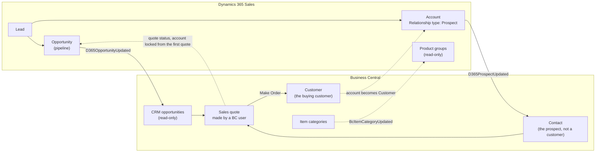
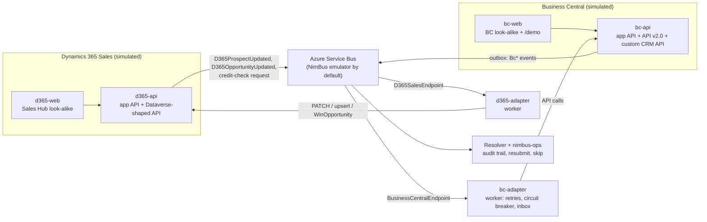
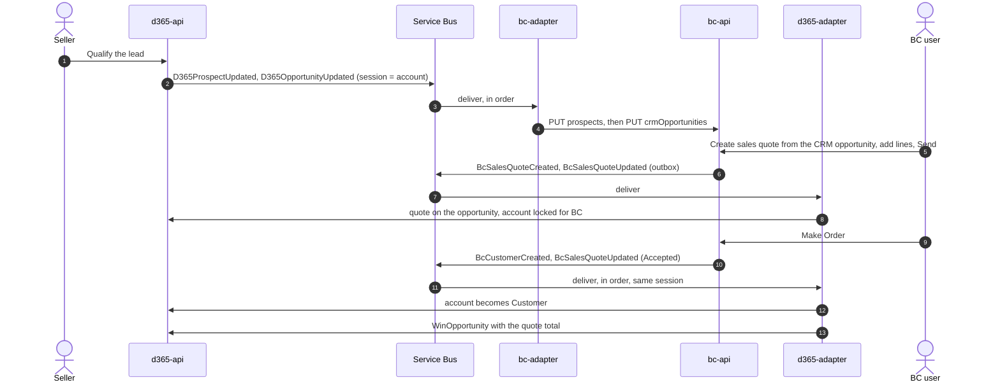

# Dynamics 365 Sales ↔ Business Central on NimBus

A client-ready demo of NimBus integrating a CRM and an ERP that each own part of the customer
lifecycle:

- **Dynamics 365 Sales owns** leads, prospects, opportunities and the pipeline.
- **Business Central owns** the buying customer, contacts, products and quotes. **Quotes are made in
  Business Central**, by a Business Central user, and linked to the CRM opportunity.

It shows a typical first version of such an integration:

| Flow | Direction |
|---|---|
| Initial sync of customers and their contacts at go-live | Business Central → Dynamics 365 |
| Prospect → buying customer | both ways |
| Product groups (Business Central item categories) | Business Central → Dynamics 365 |
| Opportunities available in Business Central for quote linkage | Dynamics 365 → Business Central |
| Quote status back on the opportunity; an accepted quote wins it | Business Central → Dynamics 365 |

Order and invoice history stays in Business Central.

Both systems are **simulated**, so the demo runs on a laptop with no tenants or credentials. The
simulators' integration APIs follow the shapes of the real ones: the Dataverse Web API for Dynamics
365, and BC API v2.0 plus a custom API for Business Central. The company, its customers, people and
products are fictional ("Contoso Subsea", a maker of subsea equipment). The look-alike web clients
use Fluent UI and carry no Microsoft branding. They are not affiliated with or endorsed by Microsoft.

> **Presenting it?** Start with the [talk track](docs/talk-track.md): scene by scene, with prep,
> click paths, talking points and objection handling.

## The ownership model



CRM sends every prospect and every opportunity to Business Central as soon as it exists. A Business
Central user makes the quote from the CRM opportunity; BC quotes the prospect as a *contact*, without
creating a customer. From the account's **first quote**, Business Central manages its master data and
CRM locks it. When the customer accepts, BC's **Make Order** converts the contact into a customer;
CRM flips the account to Customer and closes the opportunity as won from the accepted quote. The
order itself stays in Business Central.

## Architecture



- **Seller changes publish directly.** `d365-api` publishes seller actions. In production they would
  leave Dataverse through a Service Endpoint and the NimBus Dataverse adapter.
- **BC changes go through a transactional outbox.** `bc-api` publishes every change that way, so the
  data and its events commit together. In production that is BC webhooks → an ingress → a fetch
  through the API.
- **Integration writes never publish.** Writes the adapters make through the Dataverse-shaped API
  are never published back, which is what prevents echo loops. In real Dataverse that is the plug-in
  step filtering out the integration user.
- **The BC adapter runs as a worker.** Only a worker host can pause its receivers when the circuit
  breaker opens, and that is what a BC update window calls for.

## What the demo shows

| Scene | What happens | NimBus capability |
|---|---|---|
| 1 | Go-live: the initial sync loads BC's customers, their contacts and the product groups into CRM | Bulk load through the same pipeline, with an audit trail; sessions per customer |
| 2 | A lead is qualified; the prospect and the opportunity appear in BC within seconds | Events in order per account (prospect before opportunity) |
| 3 | A BC user makes the quote from the CRM opportunity and sends it; CRM shows it and locks the account | Events; transactional outbox; the ownership handover |
| 4 | BC Make Order: the prospect becomes a customer; CRM wins the opportunity from the accepted quote | **Session ordering** per customer: customer → quote accepted |
| 5 | Optional: "Check credit in Business Central", live | **Request/reply** next to events |
| 6a | A new seller is missing in BC; the opportunity fails, only that customer waits, the office keeps flowing; fix in BC and **Resubmit** | Failure isolation, operator recovery, alert |
| 6b | BC update window (503) while the whole office creates opportunities | **Circuit breaker** + retry policy; recovers with no operator action |
| 6c | BC throttling (429) | **Retry policy** with exponential backoff |
| 6d | CRM delivers the same change twice | **Inbox deduplication** (deterministic MessageId) + idempotent BC API |
| 7 | nimbus-ops tour: endpoints, flow, catalog, failures, personal data masking | The operator surface |

## Message catalog

| Message | Kind | From → to | Notes |
|---|---|---|---|
| `D365ProspectUpdated` | Event | Dynamics 365 → BC | Every change to a prospect CRM still owns; BC keeps it as a contact. Deterministic MessageId `prospect:{account}:{modified}` |
| `D365OpportunityUpdated` | Event | Dynamics 365 → BC | Every opportunity change; BC keeps it for quoting. Deterministic MessageId `opportunity:{opportunity}:{modified}` |
| `D365CreditCheckRequested` | Request | Dynamics 365 → BC | Reply `BcCreditStatus`; no session key, so a check never blocks a customer |
| `BcItemCategoryUpdated` | Event | BC → Dynamics 365 | A product group; keyed on its code |
| `BcCustomerCreated` / `BcCustomerUpdated` | Event | BC → Dynamics 365 | BC-owned master data, credit limit, balance, blocked; the initial sync sends every customer |
| `BcContactUpdated` | Event | BC → Dynamics 365 | A person at a customer; follows its customer in the same session |
| `BcSalesQuoteCreated` / `BcSalesQuoteUpdated` | Event | BC → Dynamics 365 | Only quotes linked to a CRM opportunity. `Accepted` wins the opportunity |

Every message about an account is session-keyed on that account, so everything about one customer
is processed in order and a failure blocks only that customer. The contracts live in
[`DynamicsBcDemo.Contracts`](DynamicsBcDemo.Contracts), and nimbus-ops shows them, with descriptions
and examples, under **Event types**.

## Flow: from lead to won quote



## Run it

Prerequisites:

- .NET 10 SDK;
- Node.js 22+;
- Docker (for the SQL Server container);
- Azure Functions Core Tools v4 (`func`), because the NimBus Resolver is a Functions app.

No Azure account is needed: the NimBus Service Bus emulator is the default.

```bash
# from the repository root
aspire run --apphost samples/DynamicsBcDemo/DynamicsBcDemo.AppHost/DynamicsBcDemo.AppHost.csproj
```

Or run `aspire run` from `samples/DynamicsBcDemo`: its `aspire.config.json` selects this AppHost.
The first run installs the two web clients' npm packages. Wait until `provisioner` has finished
and every resource is healthy.

| Resource | URL |
|---|---|
| Sales Hub (Dynamics 365 look-alike) | http://localhost:5283 |
| Business Central look-alike | http://localhost:5293 |
| Demo cockpit (presenter) | http://localhost:5293/demo |
| #integration-alerts (audience) | http://localhost:5293/demo/alerts |
| nimbus-ops | https://localhost:18543 |
| d365-api / bc-api | http://localhost:5280 / http://localhost:5290 |
| Aspire dashboard | https://localhost:17180 |

The ports differ from CrmErpDemo's, so both demos can run side by side.

**Reset = restart.** SQL Server runs without a persistent volume, and the emulator keeps broker
state in memory. Every run starts on go-live morning: CRM holds leads, one prospect and the warm-up
account, but none of BC's customers yet. No blocked sessions or scheduled retries are left over from
a rehearsal.

To reset and get ready to present in one go (about two minutes), run:

```powershell
# from the repository root (PowerShell 7)
./samples/DynamicsBcDemo/Reset-Demo.ps1
```

It restarts the AppHost and then does the talk track's prep:

- runs the warm-up on the throwaway *Wingtip Marine (warm-up)* records;
- switches on the nimbus-ops heartbeat schedule.

Its switches:

- `-NoBuild` skips the build when nothing changed.
- `-Open` opens the presenter's pages in your browser.
- `-RestartOnly` skips the prep.

### Using a real Service Bus namespace

For client-facing runs, a real namespace (Standard tier) is the more robust choice:

```bash
dotnet user-secrets --project samples/DynamicsBcDemo/DynamicsBcDemo.AppHost set ConnectionStrings:servicebus "Endpoint=sb://<namespace>.servicebus.windows.net/;SharedAccessKeyName=...;SharedAccessKey=..."
NIMBUS_SB_EMULATOR=false aspire run --apphost samples/DynamicsBcDemo/DynamicsBcDemo.AppHost/DynamicsBcDemo.AppHost.csproj
```

A real namespace keeps broker state between runs. Use a namespace of its own, or purge the demo's
subscriptions in nimbus-ops (Admin → Subscriptions) before presenting, because the seed ids are
fixed. `Reset-Demo.ps1` refuses to run against a real namespace until you confirm that with
`-NamespacePurged`.

## Demo controls

The look-alike apps contain no demo gadgets. The presenter uses two hidden pages of the BC client:

- **`/demo`**, the presenter cockpit:
  - Run the **initial sync** of customers, contacts and product groups into CRM (go-live).
  - Start or end a Business Central update window (503) or API throttling (429). Both are time-boxed
    (20 s by default), so a scene ends on its own.
  - Fire a **pilot-office burst**: N sellers each create a prospect and an opportunity at once.
  - **Deliver the last opportunity change again**, with the same MessageId, as a source system's
    retry can.
  - Watch the Business Central adapter's circuit: Closed, Open or HalfOpen.
  - Links to nimbus-ops.
- **`/demo/alerts`**, a Teams-style channel for the audience. It shows the notifications the BC
  adapter sends through NimBus's webhook notification channel: failures, the circuit opening, and
  the circuit recovering. In production this would be `channels.AddTeams(...)`.

Stage timings are in seconds; production would use minutes. The first outage retry comes after the
update window, so it succeeds and the scene ends on its own. The circuit breaker only looks at the
last 10 seconds, so the successful calls of the previous scene don't dilute an outage:

| Setting | Stage value |
|---|---|
| Update window | 20 s |
| Circuit sampling window | 10 s |
| Break duration | 10 s |
| First outage retry | 30 s |
| Throttling retries | exponential from 5 s |

They live in `BusinessCentral.Adapter/appsettings.json` under `BusinessCentral:Resilience`.

## From demo to production

| Demo | Production |
|---|---|
| `d365-api` publishes seller changes directly | Dataverse Service Endpoint + async plug-in step → Service Bus queue → the NimBus Dataverse adapter (preview) → the same contract messages |
| `d365-adapter` writes to the Dataverse-shaped API | The same calls against the org's Dataverse Web API, authenticated as an application user (client credentials); custom columns and tables (`cs_…`) in a solution |
| `bc-api` publishes through its outbox | BC webhooks (thin notifications about 30 s after a change; subscriptions renewed every 3 days) → an ingress that fetches the record through API v2.0 → publish |
| `bc-adapter` calls API v2.0 + `api/contoso/crm/v1.0` | The same calls against each BC environment. A small **AL extension** adds the CRM reference fields, the CRM opportunities table the quote links to, and the custom API for prospects and opportunities |
| The initial sync is a cockpit button | A one-off job at go-live that publishes the same events, per country or environment |
| Everything on a laptop | NimBus in your Azure tenant: Service Bus, adapters on Container Apps or Functions, the Resolver, nimbus-ops, a SQL or Cosmos message store; deployed with the `nb` CLI |

## Project layout

```
samples/DynamicsBcDemo/
  DynamicsBcDemo.AppHost/      Aspire host: emulator, SQL, Resolver, nimbus-ops, simulators, adapters, web clients
  DynamicsBcDemo.Contracts/    endpoints, messages, BcCreditStatus reply, shared fictional seed data
  DynamicsBcDemo.Provisioner/  applies the Service Bus topology
  D365Sales.Api/               Dynamics 365 simulator: app API, Dataverse-shaped API, change publisher, burst
  D365Sales.Adapter/           worker: mirrors BC customers, contacts, product groups and quotes into Dataverse
  D365Sales.Web/               Sales Hub look-alike (React, Fluent UI)
  BusinessCentral.Api/         BC simulator: CRM opportunities, quotes, Make Order, customers, outbox, initial sync, fault toggles
  BusinessCentral.Adapter/     worker: prospects, opportunities, credit checks, resilience
  BusinessCentral.Web/         BC look-alike + /demo cockpit + /demo/alerts (React, Fluent UI)
  docs/talk-track.md           the presenter's script
  Reset-Demo.ps1               restarts the demo on go-live morning and does the presenter's prep
tests/DynamicsBcDemo.Tests/    catalog, BC rules, adapter resilience, CRM ownership, change publishing, mirroring
```

| Concern | File |
|---|---|
| Ownership rules in BC (prospect contact, quote from a CRM opportunity, Make Order, refusing CRM edits, initial sync) | `BusinessCentral.Api/Domain/SalesService.cs` |
| Failure classification and retry/breaker policy | `BusinessCentral.Adapter/Clients/BusinessCentralClient.cs`, `BusinessCentral.Adapter/Resilience/BcResilience.cs` |
| Adapter wiring (inbox, retries, breaker, notifications) | `BusinessCentral.Adapter/Program.cs` |
| Deterministic MessageIds for CRM changes | `D365Sales.Api/Integration/CrmChangePublisher.cs` |
| Dataverse-shaped writes, never published back | `D365Sales.Api/Endpoints/DataverseApiEndpoints.cs` |
| Mirroring BC into CRM (lock at the first quote, win on acceptance) | `D365Sales.Adapter/Handlers/*.cs` |

## Tests

```bash
dotnet test tests/DynamicsBcDemo.Tests
npm --prefix samples/DynamicsBcDemo/D365Sales.Web run build
npm --prefix samples/DynamicsBcDemo/BusinessCentral.Web run build
```
